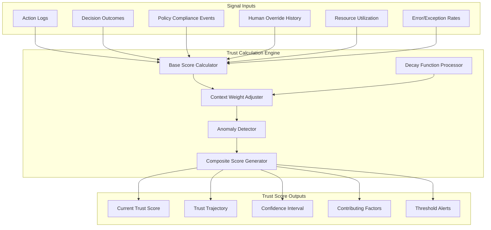
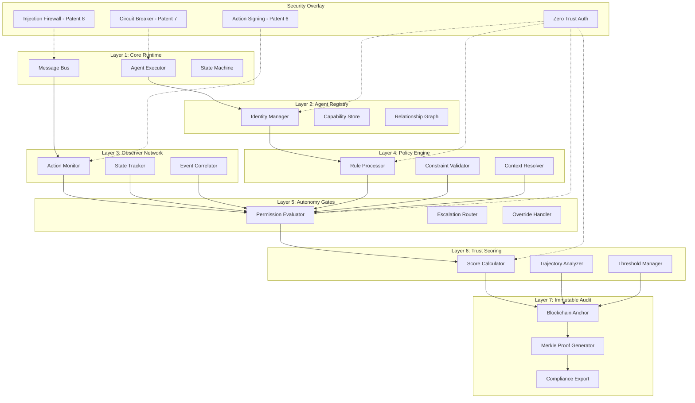

# AgentAnchor - Intellectual Property Strategy v2.0

**Document Type:** Confidential Strategic Planning
**Date:** 2025-12-07
**Version:** 2.0 (Expanded Security + Compliance Portfolio)
**Authors:** Victor (Strategy), Mary (Analysis), Dr. Quinn (Innovation), Winston (Technical)

---

## Executive Summary

AgentAnchor has identified **8 patent families** forming a comprehensive defensive moat around AI agent governance. This expanded portfolio addresses three pillars:

1. **Governance Innovation** (Patents 1-4) — Core architectural patents
2. **Trust & Accountability** (Patents 5-6) — Transitive trust and cryptographic provenance
3. **Security & Safety** (Patents 7-8) — Adaptive safety controls and attack prevention

**Strategic Positioning:**
*"The only AI governance platform built security-first with compliance-native architecture."*

| Metric | Value |
|--------|-------|
| **Total Patent Families** | 8 |
| **Estimated Filing Cost** | $120-180K (over 24 months) |
| **Strategic Value** | Category-defining defensibility |
| **Regulatory Alignment** | EU AI Act, SEC AI Rules, NIST AI RMF |

---

## Patent Portfolio Overview

### Tier 1: Core Governance (Immediate Filing)

| # | Patent Family | Innovation | Moat Type |
|---|---------------|------------|-----------|
| 1 | **Separation of Powers Architecture** | Constitutional governance for AI | Legal |
| 2 | **Dynamic Trust Score System** | Earned trust with decay + capability gating | Data |

### Tier 2: Advanced Governance (6-Month Filing)

| # | Patent Family | Innovation | Moat Type |
|---|---------------|------------|-----------|
| 3 | **Multi-Validator Tribunal Protocol** | 9-validator parallel evaluation | Legal |
| 4 | **Precedent-Learning Governance** | Decision indexing + validator fine-tuning | Data |

### Tier 3: Trust & Accountability (12-Month Filing)

| # | Patent Family | Innovation | Moat Type |
|---|---------------|------------|-----------|
| 5 | **Transitive Trust Model** | Creator-Agent trust binding | Network |
| 6 | **Cryptographic Agent Action Chain** | Signed action log with Merkle chain | Legal |

### Tier 4: Security & Safety (18-Month Filing)

| # | Patent Family | Innovation | Moat Type |
|---|---------------|------------|-----------|
| 7 | **Adaptive Circuit Breaker** | ML-driven kill switch | Legal |
| 8 | **Prompt Injection Firewall** | Instruction hierarchy + sanitization pipeline | Legal |

---

## Patent Family #1: Separation of Powers Architecture

### Innovation Summary
Application of constitutional governance theory (executive/legislative/judicial separation) to autonomous AI agent systems. No single layer can override another.

### Key Claims (Draft)

**Independent Claim 1:**
A system for governing autonomous AI agents comprising:
- a Worker layer configured to execute tasks within defined capability boundaries;
- a Council layer comprising a plurality of specialized validator agents configured to evaluate action requests;
- an Observer layer providing isolated, append-only audit logging of all actions and decisions;
- a communication protocol between layers wherein the Worker layer cannot execute high-risk actions without Council approval;
- wherein each layer operates independently and no single layer can override decisions of another layer.

**Dependent Claims:**
- 2: wherein the Council layer comprises nine specialized validators with distinct evaluation domains
- 3: wherein an Orchestrator agent synthesizes validator votes into final decisions
- 4: wherein risk levels determine required approval thresholds
- 5: wherein the Observer layer is cryptographically isolated from operational layers
- 6: further comprising an Elder Wisdom advisory layer providing non-binding guidance

### Security Hardening (v2.0 Addition)

**Layer-to-Layer Zero Trust:**
- Each governance layer authenticates requests from adjacent layers
- No implicit trust between layers
- Cryptographic verification of layer identity on every request
- Lateral movement prevention through explicit boundary enforcement

**Security Claims (Additional):**
- 7: wherein each layer maintains cryptographic identity and mutual authentication is required for inter-layer communication
- 8: wherein layer boundaries are enforced through hardware or software isolation mechanisms
- 9: further comprising rate limiting between layers to prevent denial-of-service attacks on governance

### Prior Art Differentiation
- Constitutional theory applied to government, not AI systems
- Multi-agent systems exist but lack governance separation
- FICO's blockchain tracks model governance, not runtime separation of powers
- **New:** Zero-trust between layers not found in prior art

### Filing Priority: **#1 - IMMEDIATE**
### Estimated Cost: $15-25K (utility patent)

---

## Patent Family #2: Dynamic Trust Score System

### Innovation Summary
Trust score that is earned through behavior, decays over time, and dynamically gates agent capabilities at runtime.

### System Architecture



### Key Claims (Draft)

**Independent Claim 1:**
A method for dynamically determining AI agent operational capabilities comprising:
- calculating a trust score for an AI agent based on historical behavioral outcomes including task completions, governance approvals, and consumer feedback;
- applying a time-based decay function to said trust score during periods of agent inactivity;
- classifying the agent into a trust tier based on configurable score thresholds;
- dynamically gating permissible actions based on current trust tier classification;
- storing trust score changes in an immutable audit record.

**Dependent Claims:**
- 2: wherein trust score increases in response to successful task completion
- 3: wherein trust score decreases in response to governance denial or policy violation
- 4: wherein decay rate is configurable and varies by trust tier
- 5: further comprising a probationary recovery mechanism for degraded agents
- 6: wherein trust tier determines maximum risk level of actions the agent can request

### Security Hardening (v2.0 Addition)

**Signal Integrity Verification:**
- Cryptographic signing of all input signals
- Tamper-evident input pipeline
- Anomaly detection on signal sources, not just values

**Adversarial Resistance:**
- Rate limiting on score-affecting events to prevent gaming
- Outlier detection to identify manipulation attempts
- Multi-source corroboration for high-value score changes

**Security Claims (Additional):**
- 7: wherein input signals are cryptographically signed and verified before trust calculation
- 8: further comprising adversarial detection to identify trust score manipulation attempts
- 9: wherein trust score changes require multi-source corroboration above configurable thresholds

### Prior Art Differentiation
- Existing reputation systems are static or manually adjusted
- No systems combine earned trust + decay + capability gating
- IBM Fairness 360 addresses bias, not behavioral trust earning
- **New:** Adversarial-resistant trust calculation not found in prior art

### Filing Priority: **#1 - IMMEDIATE**
### Estimated Cost: $15-25K (utility patent)

---

## Patent Family #3: Multi-Validator Tribunal Protocol

### Innovation Summary
Parallel evaluation of AI agent actions by specialized validators with configurable voting thresholds and Orchestrator synthesis.

### Key Claims (Draft)

**Independent Claim 1:**
A system for evaluating AI agent action requests comprising:
- receiving an action request including action type, justification, and risk assessment;
- routing the request to a plurality of specialized validator agents based on risk level;
- executing validator evaluations in parallel, each producing a vote and rationale;
- aggregating votes according to configurable threshold rules based on risk level;
- synthesizing a final decision through an orchestrator agent;
- recording the decision with all validator rationales to an immutable ledger.

**Dependent Claims:**
- 2: wherein low-risk actions require approval from a subset of validators (3-bot review)
- 3: wherein medium-risk actions require majority approval (5 of 9)
- 4: wherein high-risk actions require supermajority approval plus human confirmation
- 5: wherein deadlocked decisions escalate to human oversight
- 6: wherein validators include specialized roles: Guardian, Arbiter, Scholar, Advocate, Economist, Sentinel, Adversary, Oracle, and Orchestrator

### Security Hardening (v2.0 Addition)

**Validator Integrity:**
- Each validator maintains cryptographic identity
- Validator voting is signed and non-repudiable
- Consensus requires verification of validator authenticity

**Byzantine Fault Tolerance:**
- System tolerates minority of compromised validators
- Anomalous validator behavior triggers automatic quarantine
- Validator rotation and periodic re-attestation

**Security Claims (Additional):**
- 7: wherein validator votes are cryptographically signed and bound to validator identity
- 8: further comprising Byzantine fault tolerance for minority validator compromise
- 9: wherein anomalous validator behavior triggers automatic quarantine and human review

### Prior Art Differentiation
- Consensus protocols exist but for data, not AI governance
- Multi-agent voting exists but lacks specialized validator roles
- No prior art on Orchestrator synthesis pattern

### Filing Priority: **#2 - WITHIN 6 MONTHS**
### Estimated Cost: $15-25K (utility patent)

---

## Patent Family #4: Precedent-Learning Governance

### Innovation Summary
Governance system that indexes decisions, retrieves relevant precedents for new requests, and improves validator accuracy over time through fine-tuning on precedent corpus.

### Key Claims (Draft)

**Independent Claim 1:**
A machine learning system for AI governance comprising:
- indexing governance decisions with structured metadata including action type, risk level, validator votes, and outcome;
- performing semantic similarity search to identify relevant precedent decisions for incoming requests;
- providing precedent context to validator agents during evaluation;
- tracking decision consistency metrics across similar cases;
- periodically fine-tuning validator models based on accumulated precedent corpus;
- wherein governance accuracy improves measurably over time.

**Dependent Claims:**
- 2: wherein an Arbiter validator is specifically trained on precedent matching
- 3: wherein precedent corpus is cryptographically linked to immutable ledger
- 4: wherein fine-tuning occurs on configurable schedule without disrupting operations
- 5: wherein consistency score tracks percentage of similar cases receiving similar outcomes
- 6: wherein precedent retrieval uses vector embedding similarity

### Security Hardening (v2.0 Addition)

**Precedent Integrity:**
- Cryptographic binding of precedents to source decisions
- Tamper-evident precedent corpus
- Audit trail for all precedent modifications

**Training Pipeline Security:**
- Signed model artifacts
- Isolated training environment
- Rollback capability for model corruption

**Security Claims (Additional):**
- 7: wherein precedent corpus entries are cryptographically bound to source governance decisions
- 8: wherein model fine-tuning occurs in isolated environment with signed artifact verification
- 9: further comprising rollback mechanism for detecting and recovering from model corruption

### Prior Art Differentiation
- FICO blockchain tracks model training, not runtime decision learning
- Case law systems exist for human law, not AI governance
- No prior art on validator fine-tuning from precedent

### Filing Priority: **#2 - WITHIN 6 MONTHS**
### Estimated Cost: $15-25K (utility patent)
### Moat Value: **EXTREMELY HIGH** - creates data moat

---

## Patent Family #5: Transitive Trust Model (NEW)

### Innovation Summary
Hierarchical trust system binding AI agent reputation to creator/developer reputation, enabling transitive trust assessment and supply chain accountability.

### System Architecture

```
┌─────────────────────────────────────────┐
│  Agent: invoice-processor-v2            │
│  Trust Score: 78 ▲                      │
│  ────────────────────────────────────── │
│  Creator: Acme AI Labs                  │
│  Trust at Creation: 82                  │
│  Current Trust: 71 ▼                    │
│  Fleet Size: 12 agents                  │
│  Avg Fleet Trust: 71                    │
└─────────────────────────────────────────┘
```

### Key Claims (Draft)

**Independent Claim 1:**
A system for hierarchical trust assessment of AI agents comprising:
- calculating a creator trust score based on aggregate performance of creator's agent fleet;
- storing a snapshot of creator trust score at time of agent deployment;
- displaying both snapshot and current creator trust scores alongside agent trust score;
- calculating creator trust based on factors including: aggregate agent performance, security incident history, mean time to patch, documentation quality, and support responsiveness;
- wherein agent trust grows independently of creator trust after deployment;
- wherein creator scores serve as provenance metadata without constraining agent capability.

**Dependent Claims:**
- 2: wherein creator trust score calculation differs from agent trust score calculation in input signals
- 3: wherein the delta between snapshot and current creator scores provides risk signal
- 4: further comprising fleet-wide statistics including agent count and average fleet trust
- 5: wherein enterprises can filter agents by creator trust thresholds
- 6: wherein abandoned agent fleets contribute to creator trust decay

### Creator vs Agent Trust Signals

| Agent Signals | Creator Signals |
|---------------|-----------------|
| Action outcomes | Aggregate fleet performance |
| Policy compliance | Security incident history |
| Override frequency | Mean time to patch/fix |
| Resource efficiency | Documentation quality scores |
| Error rates | Support responsiveness |
| | Ecosystem tenure |

### Security Considerations

**Sybil Resistance:**
- Creator identity bound to verified legal entity or individual
- Identity verification required for creator account creation
- Rate limiting on new creator registrations
- Trust penalty for identity fraud detection

**Supply Chain Security:**
- Creator trust provides early warning for supply chain attacks
- Sudden creator trust decline triggers audit of all fleet agents
- Enterprise can configure auto-quarantine for agents from declining creators

### Prior Art Differentiation
- Trust systems exist for individuals and organizations, not AI agent creators
- No prior art on binding creator reputation to deployed agents
- No prior art on snapshot vs current creator trust display

### Filing Priority: **#3 - WITHIN 12 MONTHS**
### Estimated Cost: $15-25K (utility patent)
### Moat Value: **HIGH** - creates accountability moat

---

## Patent Family #6: Cryptographic Agent Action Chain (NEW)

### Innovation Summary
Tamper-evident, legally admissible action logging system using cryptographic signatures and Merkle chains for complete non-repudiation of agent activities.

### Key Claims (Draft)

**Independent Claim 1:**
A system for non-repudiable AI agent action logging comprising:
- assigning each AI agent a cryptographic key pair bound to agent identity;
- signing each agent action with agent's private key prior to execution;
- constructing a Merkle tree of signed actions with periodic root anchoring;
- storing signed actions in append-only log with forward-linking hash chain;
- providing verification service for action authenticity and chain integrity;
- wherein logged actions are legally admissible as evidence of agent behavior.

**Dependent Claims:**
- 2: wherein Merkle roots are anchored to external blockchain for timestamping
- 3: wherein action signatures include context hash preventing replay attacks
- 4: further comprising key rotation mechanism with chain continuity preservation
- 5: wherein verification service produces court-admissible attestation documents
- 6: wherein chain breaks trigger automatic incident response and human notification

### Security Architecture

**Key Management:**
- Hardware Security Module (HSM) storage for agent keys
- Key rotation on configurable schedule
- Key compromise detection and automatic rotation
- Recovery mechanism for key loss

**Chain Integrity:**
- Forward-linking hash prevents historical tampering
- Merkle tree enables efficient integrity verification
- External anchoring provides independent timestamp proof
- Gap detection for missing or deleted actions

### Regulatory Alignment

| Regulation | Alignment |
|------------|-----------|
| EU AI Act Article 12 | Traceability requirement |
| SOX | Financial audit requirements |
| HIPAA | Healthcare action logging |
| SEC AI Rules | Financial services AI disclosure |

### Prior Art Differentiation
- Blockchain logging exists but not for AI agent actions
- Digital signatures exist but not integrated with agent identity binding
- No prior art on AI-specific legally admissible action chains

### Filing Priority: **#3 - WITHIN 12 MONTHS**
### Estimated Cost: $15-25K (utility patent)

---

## Patent Family #7: Adaptive Circuit Breaker (NEW)

### Innovation Summary
ML-driven emergency stop system that learns normal agent behavior patterns and automatically triggers containment when anomalies detected.

### Key Claims (Draft)

**Independent Claim 1:**
A system for automatic AI agent containment comprising:
- monitoring agent behavior signals in real-time including action frequency, resource utilization, data access patterns, and error rates;
- training a baseline model of normal agent behavior during initial operational period;
- calculating anomaly score for current behavior relative to baseline;
- automatically triggering containment when anomaly score exceeds configurable threshold;
- said containment comprising: immediate action suspension, state freeze, human notification, and evidence preservation;
- wherein containment executes without requiring human intervention.

**Dependent Claims:**
- 2: wherein baseline model updates adaptively based on confirmed normal operations
- 3: wherein containment levels are graduated based on anomaly severity
- 4: further comprising rollback capability to last known good state
- 5: wherein containment triggers regulatory hold mode for evidence preservation
- 6: wherein human override can release containment with audit trail

### Containment Levels

| Level | Trigger | Action |
|-------|---------|--------|
| **Warning** | Anomaly score 0.7-0.8 | Increased monitoring, human notification |
| **Throttle** | Anomaly score 0.8-0.9 | Rate limiting, reduced capabilities |
| **Pause** | Anomaly score 0.9-0.95 | New actions blocked, in-flight complete |
| **Freeze** | Anomaly score > 0.95 | Immediate halt, state snapshot, full isolation |

### Regulatory Alignment

| Regulation | Alignment |
|------------|-----------|
| EU AI Act Article 14 | Human can "interrupt" requirement |
| Banking Regulations | Operational resilience |
| NIST AI RMF | Monitoring and incident response |

### Prior Art Differentiation
- Circuit breakers exist in distributed systems but not for AI agents
- Anomaly detection exists but not integrated with containment
- No prior art on graduated ML-driven AI containment

### Filing Priority: **#4 - WITHIN 18 MONTHS**
### Estimated Cost: $15-25K (utility patent)

---

## Patent Family #8: Prompt Injection Firewall (NEW)

### Innovation Summary
Multi-layer defense system preventing prompt injection attacks through instruction hierarchy enforcement, input sanitization, and output validation.

### Key Claims (Draft)

**Independent Claim 1:**
A system for preventing prompt injection attacks on AI agents comprising:
- establishing instruction hierarchy with system instructions at highest priority;
- sanitizing user inputs to remove or neutralize injection patterns;
- validating agent outputs against expected format and content constraints;
- detecting and blocking attempts to override system instructions via user input;
- logging all detected injection attempts with full context for forensics;
- wherein the system prevents user inputs from modifying agent core behavior.

**Dependent Claims:**
- 2: wherein instruction hierarchy is cryptographically enforced
- 3: wherein input sanitization uses pattern matching and semantic analysis
- 4: wherein output validation includes format verification and content policy checking
- 5: further comprising canary tokens to detect successful injection
- 6: wherein repeated injection attempts from same source trigger automatic blocking

### Defense Layers

| Layer | Function | Technique |
|-------|----------|-----------|
| **Instruction Hierarchy** | Priority enforcement | Cryptographic binding of system prompts |
| **Input Sanitization** | Neutralize injection | Regex patterns, semantic analysis, encoding normalization |
| **Context Isolation** | Prevent leakage | Separate processing contexts for system vs user content |
| **Output Validation** | Detect compromise | Format checking, content policy, unexpected behavior detection |
| **Canary Tokens** | Detect bypass | Hidden markers that trigger alert if leaked |

### Prior Art Differentiation
- Input validation exists for traditional applications, not LLM agents
- No prior art on instruction hierarchy for AI agents
- No prior art on integrated injection prevention for autonomous agents

### Filing Priority: **#4 - WITHIN 18 MONTHS**
### Estimated Cost: $15-25K (utility patent)

---

## Unified Security Architecture

### 7-Layer Governance Stack with Security Integration



### Security Threat Model Coverage

| Threat | Patent Coverage |
|--------|-----------------|
| Agent Compromise | #7 (Circuit Breaker) |
| Prompt Injection | #8 (Firewall) |
| Privilege Escalation | #1 (Separation of Powers) |
| Supply Chain Attack | #5 (Creator Trust) |
| Score Manipulation | #2 (Adversarial Resistance) |
| Insider Threat | #6 (Action Signing) |
| Data Exfiltration | #7 (Anomaly Detection) |
| Lateral Movement | #1 (Zero Trust Layers) |
| Replay Attacks | #6 (Context Hash) |
| Denial of Service | #1 (Rate Limiting) |

---

## Filing Strategy & Timeline

### Phase 1: Core Governance (Immediate - 30 Days)

| Action | Patent Families | Cost | Deliverable |
|--------|-----------------|------|-------------|
| File Provisional #1 | Separation of Powers | $1,500 | Priority date established |
| File Provisional #2 | Trust Score System | $1,500 | Priority date established |
| Document all innovations | All | $0 | Timestamped evidence |

**Total Phase 1 Cost:** ~$3,000

### Phase 2: Advanced Governance (6 Months)

| Action | Patent Families | Cost | Deliverable |
|--------|-----------------|------|-------------|
| Convert Provisional #1 to Utility | Separation of Powers | $15-20K | Full patent application |
| Convert Provisional #2 to Utility | Trust Score System | $15-20K | Full patent application |
| File Provisional #3 | Multi-Validator Tribunal | $1,500 | Priority date |
| File Provisional #4 | Precedent Flywheel | $1,500 | Priority date |
| Trademark | "AgentAnchor Certified" | $2,000 | Brand protection |

**Total Phase 2 Cost:** ~$35-45K

### Phase 3: Trust & Accountability (12 Months)

| Action | Patent Families | Cost | Deliverable |
|--------|-----------------|------|-------------|
| Convert Provisional #3 to Utility | Tribunal Protocol | $15-20K | Full patent |
| Convert Provisional #4 to Utility | Precedent Flywheel | $15-20K | Full patent |
| File Provisional #5 | Transitive Trust | $1,500 | Priority date |
| File Provisional #6 | Cryptographic Action Chain | $1,500 | Priority date |

**Total Phase 3 Cost:** ~$35-45K

### Phase 4: Security & Safety (18-24 Months)

| Action | Patent Families | Cost | Deliverable |
|--------|-----------------|------|-------------|
| Convert Provisional #5 to Utility | Transitive Trust | $15-20K | Full patent |
| Convert Provisional #6 to Utility | Action Chain | $15-20K | Full patent |
| File Provisional #7 | Circuit Breaker | $1,500 | Priority date |
| File Provisional #8 | Injection Firewall | $1,500 | Priority date |
| File Continuations | #1 and #2 | $10-15K | Extended claims |
| File PCT (International) | Top 3-4 patents | $20-30K | Global protection |

**Total Phase 4 Cost:** ~$65-90K

### Total IP Investment: $138-183K over 24 months

---

## Regulatory Alignment Matrix

### Tier 1: Directly Addresses Regulatory Language

| Feature | Patent | Regulation | Requirement |
|---------|--------|------------|-------------|
| Action Signing | #6 | EU AI Act Art. 12 | Traceability |
| Human Oversight Metrics | #1, #7 | EU AI Act Art. 14 | Effective oversight |
| Audit Export | #4, #6 | SOC 2, ISO 27001 | Evidence packages |
| Regulatory Hold | #7 | SOX, HIPAA | Evidence preservation |
| Geographic Policy | #1 | GDPR, CCPA, PIPL | Jurisdiction awareness |

### Tier 2: Ahead of Regulation But Clearly Coming

| Feature | Patent | Direction |
|---------|--------|-----------|
| Policy Inheritance | #1 | Governance hierarchy proof |
| Creator Trust | #5 | Supply chain accountability |
| Cross-Org Trust | #5 | B2B AI sharing verification |
| Time-Boxed Permissions | #1 | Least privilege temporal |

### Tier 3: Differentiators That Show Maturity

| Feature | Patent | Value |
|---------|--------|-------|
| Trust Velocity Alerts | #2 | Proactive monitoring |
| Domain-Specific Trust | #2 | Granular risk assessment |
| Chaos Injection | #4 | Stress testing resilience |

---

## Budget Summary

| Phase | Timeline | Cost Range |
|-------|----------|------------|
| Phase 1 | 30 days | $3,000 |
| Phase 2 | 6 months | $35-45K |
| Phase 3 | 12 months | $35-45K |
| Phase 4 | 18-24 months | $65-90K |
| **Total** | 24 months | **$138-183K** |

### ROI Justification
- Patent portfolio valued at $10-75M for acquisition (expanded from 5 to 8 families)
- Licensing revenue potential: $200K-2M/year (security patents command premium)
- Competitive protection: priceless for category leadership
- Regulatory advantage: reduces compliance cost for customers

---

## Appendix A: Prior Art Landscape

### Existing Patents (Potential Conflicts)

| Holder | Patent/Area | Overlap Risk | Mitigation |
|--------|-------------|--------------|------------|
| **FICO** | Blockchain for ML Model Governance | MEDIUM | Differentiate: runtime decisions vs model training |
| **Google** | Agentic AI (880+ patents) | LOW-MEDIUM | Focus on governance layer, not agent execution |
| **IBM** | Trustworthy AI, Fairness 360 | LOW | Different approach: earned trust vs configured fairness |

### White Space (No Patents Found)

| Concept | Search Result | Novelty | Patent |
|---------|---------------|---------|--------|
| Separation of Powers for AI | Academic only | HIGH | #1 |
| Earned Trust with Decay | None found | HIGH | #2 |
| Multi-Validator Tribunal | None found | HIGH | #3 |
| Precedent-Learning Governance | None found | HIGH | #4 |
| Creator-Agent Trust Binding | None found | HIGH | #5 |
| AI Action Chain Signing | None found | HIGH | #6 |
| ML-Driven Circuit Breaker | None found | HIGH | #7 |
| Prompt Injection Defense | Emerging | MEDIUM-HIGH | #8 |

---

## Appendix B: Technical Glossary

| Term | Definition |
|------|------------|
| **Trust Score** | 0-1000 numeric value representing agent trustworthiness |
| **Trust Decay** | Time-based reduction of trust score during inactivity |
| **Capability Gating** | Restricting agent actions based on trust tier |
| **Validator** | Specialized AI agent that evaluates action requests |
| **Orchestrator** | Meta-agent that synthesizes validator votes |
| **Precedent Flywheel** | System that improves governance through decision learning |
| **Creator Trust** | Trust score assigned to agent developers/creators |
| **Action Chain** | Cryptographically linked sequence of agent actions |
| **Circuit Breaker** | Automatic containment system for anomalous agents |
| **Prompt Injection** | Attack that manipulates AI behavior through input |

---

## Appendix C: Key Sources

- [USPTO AI Initiatives](https://www.uspto.gov/initiatives/artificial-intelligence)
- [USPTO Inventorship Guidance for AI](https://www.uspto.gov/about-us/news-updates/uspto-issues-guidance-concerning-use-ai-tools-parties-and-practitioners)
- [FICO Blockchain Governance Patent](https://www.fico.com/blogs/more-audit-trail-blockchain-model-governance-auditable-ai)
- [Google AI Patent Leadership](https://www.axios.com/2025/05/15/ai-patents-google-agents)
- [IBM Trustworthy AI](https://research.ibm.com/topics/trustworthy-ai)
- [EU AI Act Full Text](https://artificialintelligenceact.eu/)
- [NIST AI Risk Management Framework](https://www.nist.gov/itl/ai-risk-management-framework)
- [OWASP AI Security](https://owasp.org/www-project-machine-learning-security-top-10/)

---

*"The best moat is one your competitors don't even realize they need to cross."*

**CONFIDENTIAL - ATTORNEY-CLIENT PRIVILEGE WHEN SHARED WITH COUNSEL**
