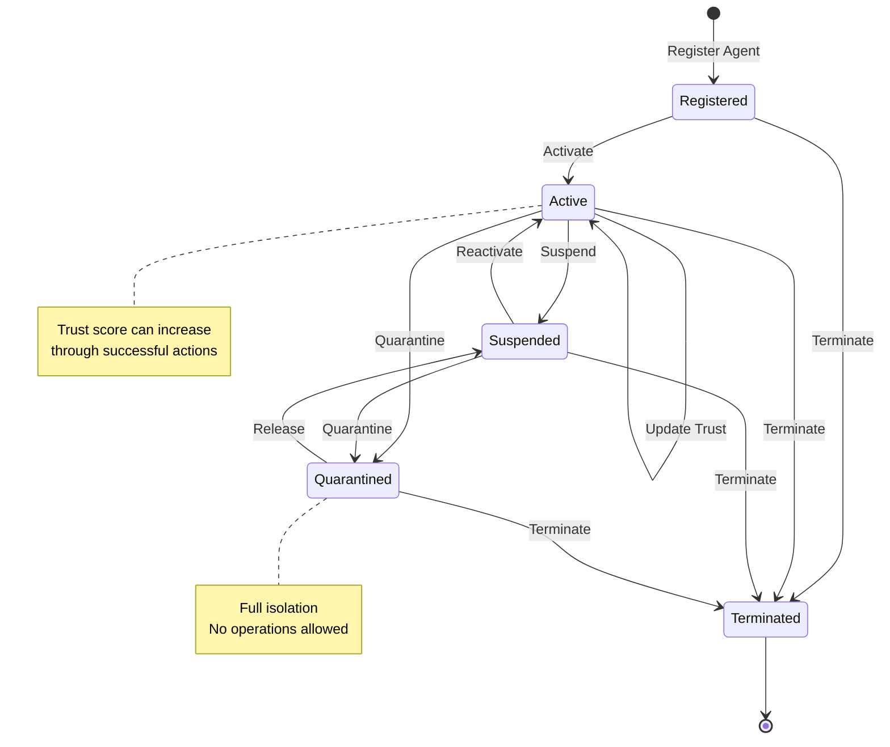
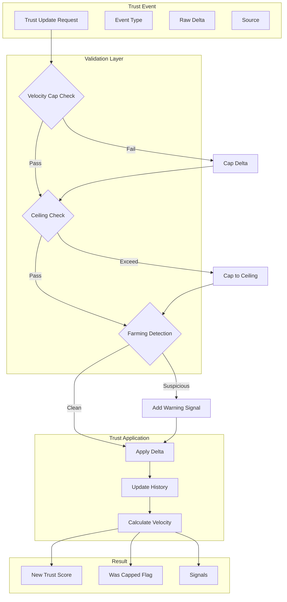
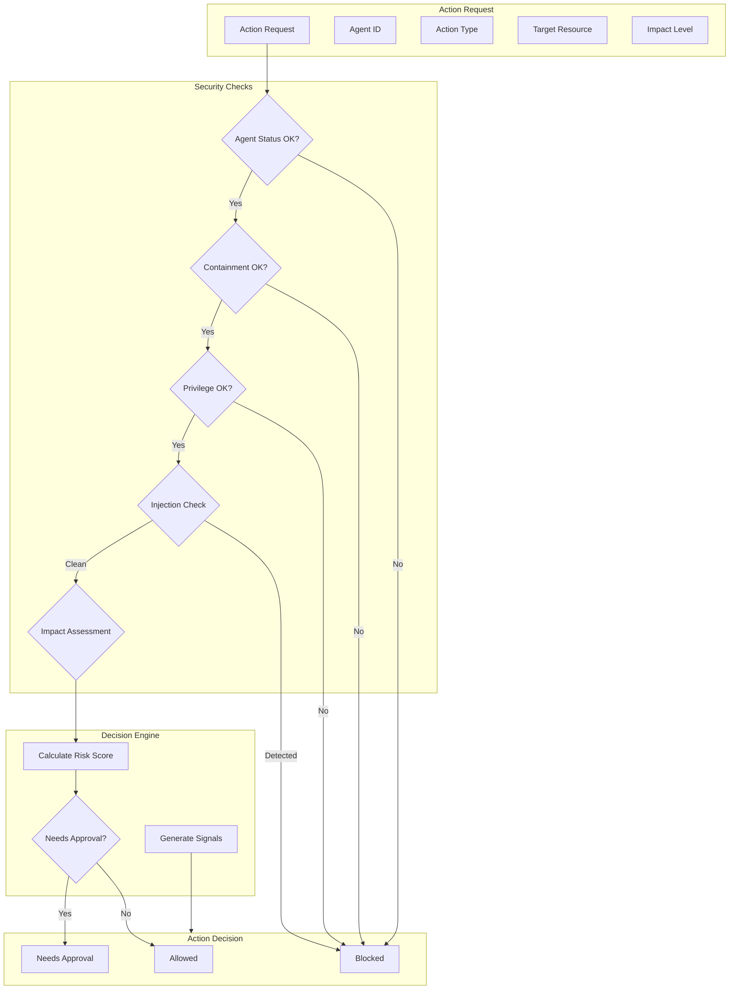
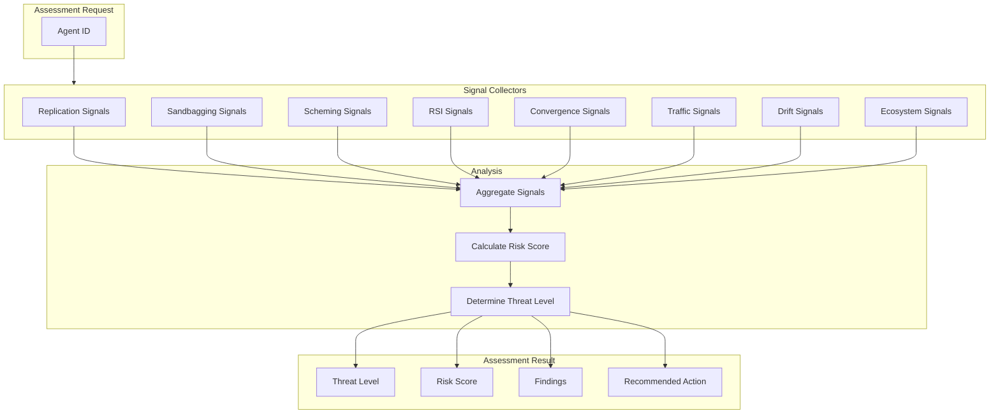
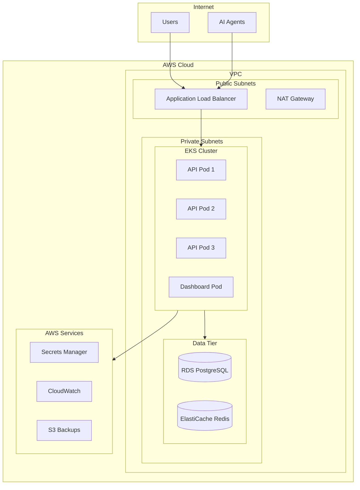
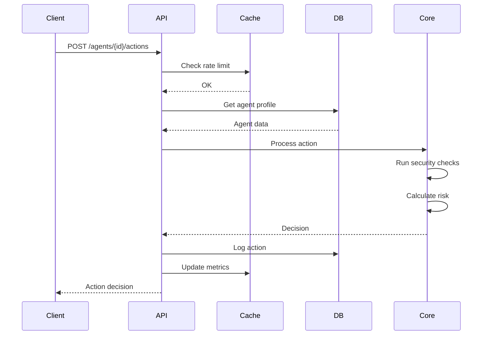
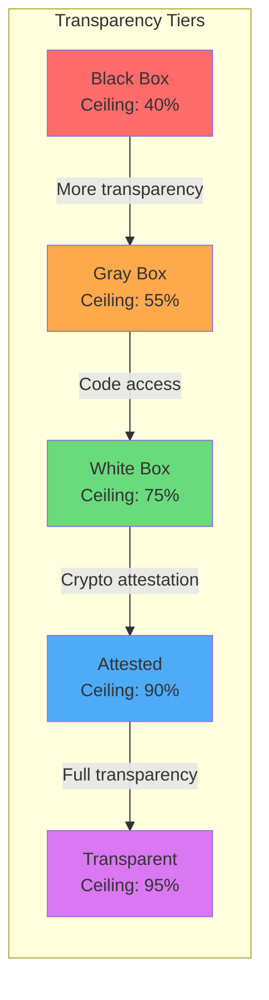

# ATSF v3.0 - Architecture Diagrams

## System Overview

```mermaid
flowchart TB
    subgraph Clients["Client Applications"]
        SDK[SDK Clients]
        Dashboard[Admin Dashboard]
        Webhook[Webhook Consumers]
    end
    
    subgraph Gateway["API Gateway"]
        Nginx[Nginx Reverse Proxy]
        RateLimit[Rate Limiter]
        Auth[Authentication]
    end
    
    subgraph API["ATSF API Service"]
        FastAPI[FastAPI Server]
        subgraph Endpoints["Endpoints"]
            Agents[/agents]
            Trust[/trust]
            Actions[/actions]
            Assessments[/assessments]
        end
    end
    
    subgraph Core["ATSF Core Engine"]
        subgraph v2["v2.2 Core"]
            TrustCalc[Trust Calculator]
            VelocityCaps[Velocity Caps]
            Canaries[Canary System]
        end
        
        subgraph v3["v3.0 Advanced"]
            Replication[Replication Prevention]
            Sandbagging[Sandbagging Detection]
            Scheming[Scheming Detection]
            RSI[RSI Control]
            Semantic[Semantic Validation]
        end
        
        Unified[Unified Integration]
    end
    
    subgraph Data["Data Layer"]
        PostgreSQL[(PostgreSQL)]
        Redis[(Redis Cache)]
    end
    
    subgraph Monitoring["Monitoring"]
        Prometheus[Prometheus]
        Grafana[Grafana]
        Alerts[Alert Manager]
    end
    
    Clients --> Gateway
    Gateway --> API
    API --> Core
    Core --> Data
    API --> Monitoring
```

## Agent Lifecycle



## Trust Score Flow



## Action Processing Pipeline



## Threat Assessment Flow



## 42-Layer Architecture

```mermaid
flowchart TB
    subgraph Foundation["Foundation (L0-L8)"]
        L0[L0: Zero-Start Trust]
        L1[L1: Capability-Trust Mapping]
        L2[L2: Behavioral Canaries]
        L3[L3: Cross-Domain Validation]
        L4[L4: Temporal Decay]
        L5[L5: Outcome Tracking]
        L6[L6: Multi-Source Consensus]
        L7[L7: Adaptive Thresholds]
        L8[L8: Unified System]
    end
    
    subgraph Frontier["Frontier Defense (L9-L13)"]
        L9[L9: Replication Prevention]
        L10[L10: Sandbagging Detection]
        L11[L11: Scheming Detection]
        L12[L12: RSI Control]
        L13[L13: Containment Protocols]
    end
    
    subgraph Advanced["Advanced Detection (L20-L29)"]
        L20[L20: Inverse Reward Modeling]
        L21[L21: Instrumental Convergence]
        L22[L22: Semantic Validation]
        L23[L23: Intent-Outcome Alignment]
        L24[L24-25: Traffic Analysis]
        L26[L26-27: Behavioral Drift]
        L29[L29: Trust Velocity Caps]
    end
    
    subgraph Ecosystem["Ecosystem Security (L30-L42)"]
        L28[L28: External Position Monitor]
        L30[L30-32: Exit Scam Prevention]
        L33[L33-35: TEE Security]
        L36[L36-37: Injection Detection]
        L38[L38: Confused Deputy Prevention]
        L39[L39-42: Coordination]
    end
    
    Foundation --> Frontier
    Frontier --> Advanced
    Advanced --> Ecosystem
```



## Deployment Architecture (AWS)



## Data Flow



## Trust Tier System



---

## Usage

These diagrams can be rendered using:
1. Mermaid Live Editor: https://mermaid.live
2. GitHub/GitLab markdown rendering
3. VS Code with Mermaid extension
4. Documentation tools (Docusaurus, MkDocs)
