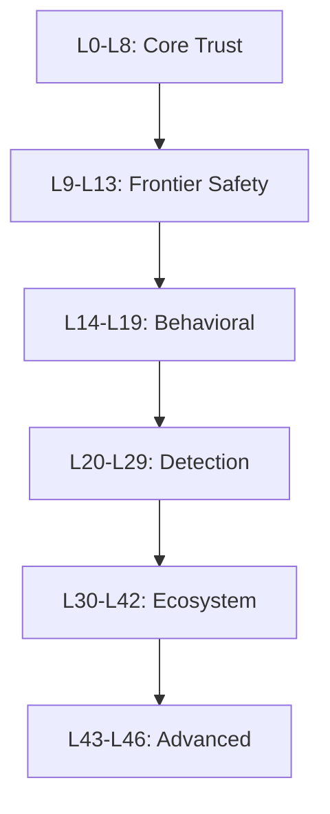

# ATSF - Agentic Trust Scoring Framework

**Production-grade AI agent safety, governance, and cognitive architecture.**

[](https://github.com/agentanchor/atsf)
[](https://github.com/agentanchor/atsf/blob/main/LICENSE)
[](https://python.org)

---

## What is ATSF?

ATSF (Agentic Trust Scoring Framework) is a comprehensive framework for building trustworthy AI agents. It provides:

- **46 Security Layers** - Defense-in-depth from L0 trust scoring to L46 CI/CD gates
- **Cognitive Cube** - Temporal Knowledge Graph, ART clustering, Granger causality
- **OLAP Analytics** - Multi-dimensional data cubes for agent memory
- **AI TRiSM** - Gartner-aligned Explainability, ModelOps, Security, Privacy
- **Real-time Events** - WebSocket streaming and pub/sub

## Quick Start

=== "Python"

    ```python
    from atsf import ATSF
    
    # Initialize
    atsf = ATSF()
    
    # Create agent
    agent = atsf.create_agent("my_agent", "my_creator", tier="gray_box")
    
    # Execute with trust scoring
    result = agent.execute("read", {"target": "data.txt"})
    print(f"Decision: {result.decision}")
    print(f"Trust: {result.trust_score:.3f}")
    ```

=== "TypeScript"

    ```typescript
    import { ATSF } from '@agentanchor/atsf';
    
    const atsf = new ATSF({ baseUrl: 'http://localhost:8000' });
    
    const agent = await atsf.createAgent('my_agent', 'my_creator');
    const result = await agent.execute('read', { target: 'data.txt' });
    
    console.log(`Decision: ${result.decision}`);
    console.log(`Trust: ${result.trustScore.toFixed(3)}`);
    ```

=== "REST API"

    ```bash
    # Create agent
    curl -X POST http://localhost:8000/agents \
      -H "Content-Type: application/json" \
      -d '{"agent_id": "my_agent", "creator_id": "my_creator"}'
    
    # Execute action
    curl -X POST http://localhost:8000/actions \
      -H "Content-Type: application/json" \
      -d '{"agent_id": "my_agent", "action_type": "read", "payload": {"target": "data.txt"}}'
    ```

## Key Features

### Trust Tiers

| Tier | Ceiling | Description |
|------|---------|-------------|
| `black_box` | 0.40 | No transparency, lowest trust |
| `gray_box` | 0.60 | Partial transparency |
| `white_box` | 0.80 | Full transparency |
| `verified_box` | 0.95 | Audited and verified |

### Security Layers



### Framework Integrations

- ✅ **LangChain** - Callback handler and tool wrapper
- ✅ **CrewAI** - Multi-agent crew governance
- ✅ **AutoGPT** - Command trust gating
- 🔜 **LlamaIndex** - Coming soon

## Installation

```bash
pip install atsf
```

Or with optional dependencies:

```bash
pip install atsf[redis,opentelemetry]
```

## Statistics

| Metric | Value |
|--------|-------|
| Lines of Code | 32,000+ |
| Python Modules | 33 |
| Tests | 380+ |
| Security Layers | 46 |
| API Endpoints | 45+ |

## Documentation Sections

<div class="grid cards" markdown>

-   :material-rocket-launch:{ .lg .middle } **Getting Started**

    ---

    Install ATSF and run your first trust-scored agent in minutes.

    [:octicons-arrow-right-24: Quick Start](getting-started/quickstart.md)

-   :material-security:{ .lg .middle } **Security Layers**

    ---

    Deep dive into the 46 security layers protecting your agents.

    [:octicons-arrow-right-24: Security Reference](security/layer-reference.md)

-   :material-brain:{ .lg .middle } **Cognitive Cube**

    ---

    Learn about TKG, ART clustering, and causal reasoning.

    [:octicons-arrow-right-24: Cognitive Architecture](concepts/cognitive-cube.md)

-   :material-api:{ .lg .middle } **API Reference**

    ---

    Complete SDK and REST API documentation.

    [:octicons-arrow-right-24: API Docs](api/python-api.md)

</div>

## Community

- **GitHub**: [github.com/agentanchor/atsf](https://github.com/agentanchor/atsf)
- **Discord**: [Join our community](https://discord.gg/atsf)
- **Twitter**: [@AgentAnchor](https://twitter.com/AgentAnchor)

---

*The constitution is no longer a suggestion. It is architecture.*
