# System Governance & Authority Model

**Vorion / BASIS / Cognigate — Expanded Governance Specification**

**Version:** 1.1 (Expanded)
**Date:** 2026-01-08
**Classification:** Vorion Confidential

---

## 1. Executive Summary

This document defines the formal governance model for the Vorion ecosystem. It establishes authority boundaries, non-authority guarantees, separation of powers, and human override mechanisms. Vorion governs **execution conditions**, not outcomes or decisions. Authority is deliberately constrained to prevent overreach while maintaining operational effectiveness.

---

## 2. Governance Architecture Overview

### 2.1 Core Governance Principles

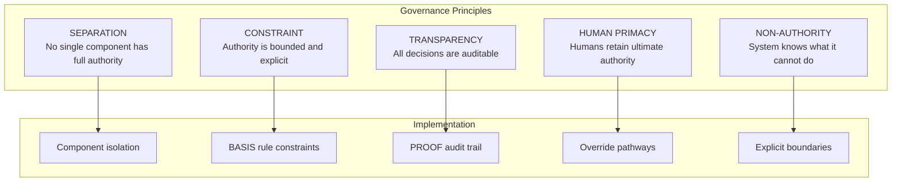

### 2.2 Governance Scope

| In Scope | Out of Scope |
|----------|--------------|
| Execution conditions | Business decisions |
| Policy enforcement | Legal interpretations |
| Access control | Moral judgments |
| Audit trail | Outcome optimization |
| Constraint validation | Autonomous goal-setting |
| Evidence generation | Authority beyond delegation |

---

## 3. Separation of Powers

### 3.1 Component Authority Model

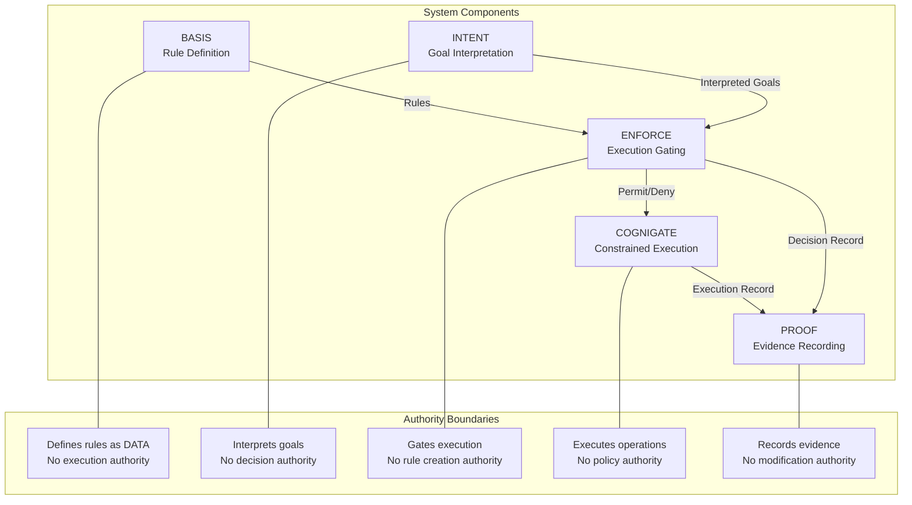

### 3.2 Component Responsibility Matrix

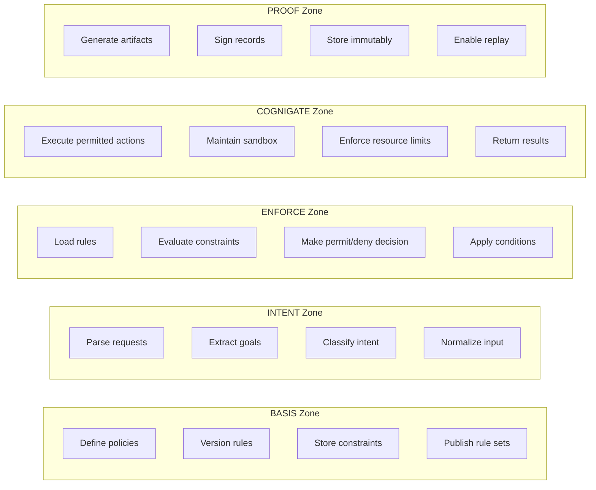

### 3.3 Authority Isolation Guarantees

| Component | CAN | CANNOT |
|-----------|-----|--------|
| **BASIS** | Define rules, version policies, store constraints | Execute actions, make decisions, modify other components |
| **INTENT** | Parse requests, interpret goals, classify intent | Make authorization decisions, execute operations |
| **ENFORCE** | Evaluate rules, permit/deny execution, apply constraints | Create rules, execute operations, modify evidence |
| **COGNIGATE** | Execute permitted operations within sandbox | Bypass ENFORCE, modify rules, access outside scope |
| **PROOF** | Record evidence, sign artifacts, store immutably | Modify records, delete evidence, alter history |

---

## 4. Authority Boundaries

### 4.1 Authority Hierarchy

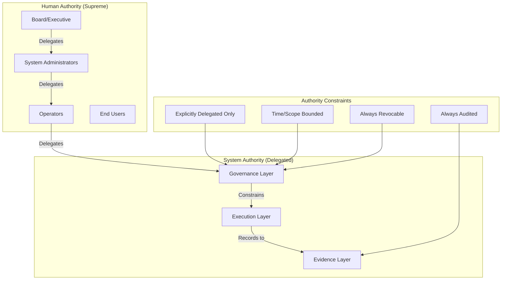

### 4.2 Delegation Chain

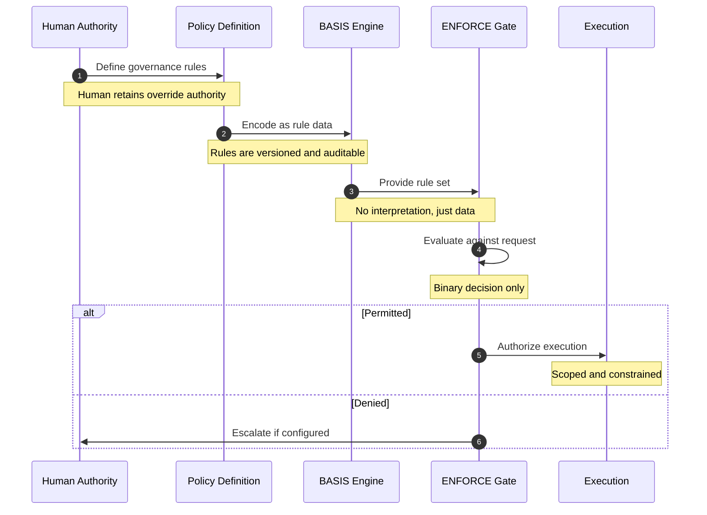

### 4.3 Authority Boundary Enforcement

```yaml
authority_boundaries:
  basis:
    allowed_operations:
      - create_rule
      - update_rule
      - version_rule
      - archive_rule
      - query_rule
    denied_operations:
      - execute_action
      - make_decision
      - override_enforcement
    enforcement: "Compile-time + Runtime validation"

  intent:
    allowed_operations:
      - parse_request
      - extract_goal
      - classify_intent
      - enrich_context
    denied_operations:
      - authorize_action
      - execute_operation
      - modify_rules
    enforcement: "API boundary + No execution capability"

  enforce:
    allowed_operations:
      - load_rules
      - evaluate_constraints
      - permit_execution
      - deny_execution
      - escalate_decision
    denied_operations:
      - create_rules
      - execute_actions
      - modify_evidence
    enforcement: "Functional isolation + Audit logging"

  cognigate:
    allowed_operations:
      - execute_permitted_action
      - access_scoped_resources
      - return_results
    denied_operations:
      - bypass_enforce
      - exceed_resource_limits
      - access_out_of_scope
    enforcement: "Sandbox + Resource quotas + Scope validation"

  proof:
    allowed_operations:
      - create_artifact
      - sign_record
      - store_immutably
      - query_evidence
    denied_operations:
      - modify_artifact
      - delete_record
      - alter_signature
    enforcement: "Append-only storage + Cryptographic integrity"
```

---

## 5. Human Authority & Overrides

### 5.1 Override Categories

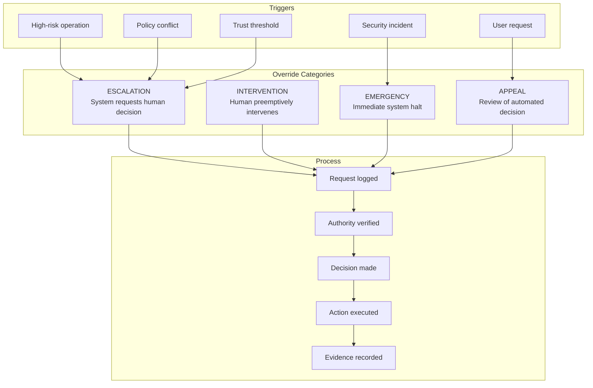

### 5.2 Override Authority Levels

| Level | Title | Override Scope | Approval Required | Time Limit |
|-------|-------|----------------|-------------------|------------|
| **L1** | Operator | Single operation | Self | 1 hour |
| **L2** | Team Lead | Operation category | Self + Log | 8 hours |
| **L3** | Manager | Policy exception | Peer review | 24 hours |
| **L4** | Director | System-wide | Executive approval | 7 days |
| **L5** | Executive | Emergency suspension | Board notification | Until revoked |

### 5.3 Override Workflow

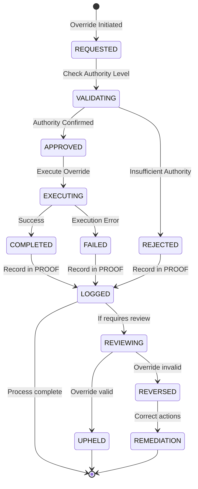

### 5.4 Emergency Procedures

```yaml
emergency_procedures:
  system_halt:
    trigger: "Critical security incident or safety concern"
    authority: "L4+ or designated emergency responder"
    actions:
      - halt_all_execution: immediate
      - preserve_evidence: automatic
      - notify_stakeholders: immediate
      - activate_incident_response: automatic
    duration: "Until explicit release by L5"
    audit: "Full recording required"

  partial_suspension:
    trigger: "Localized incident or policy violation"
    authority: "L3+"
    actions:
      - suspend_affected_scope: immediate
      - continue_unaffected: normal
      - investigate: parallel
    duration: "Maximum 24 hours without escalation"
    audit: "Full recording required"

  policy_bypass:
    trigger: "Operational necessity with policy conflict"
    authority: "L3+ with justification"
    actions:
      - document_justification: required
      - execute_with_logging: enhanced
      - schedule_review: within 48 hours
    duration: "Single operation or 4 hours maximum"
    audit: "Enhanced recording + mandatory review"
```

---

## 6. Non-Authority Guarantees

### 6.1 Explicit Non-Authority Declarations

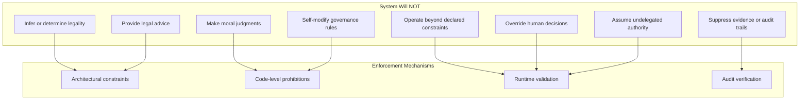

### 6.2 Non-Authority Boundary Definitions

| Category | Prohibited Action | Enforcement | Violation Response |
|----------|------------------|-------------|-------------------|
| **Legal** | Infer legality of actions | No legal reasoning capability | Block + Alert |
| **Advisory** | Provide legal/financial advice | Response filtering | Block + Log |
| **Moral** | Make ethical judgments | No moral reasoning pathways | Escalate to human |
| **Autonomous** | Act beyond delegated scope | Scope validation at runtime | Deny + Audit |
| **Self-Modification** | Alter own governance rules | Immutable governance core | Block + Alert + Halt |
| **Override** | Override human decisions | Human authority supremacy | Deny + Escalate |
| **Evidence** | Modify or suppress audit trail | Append-only architecture | Cryptographic prevention |

### 6.3 Constraint Validation Flow

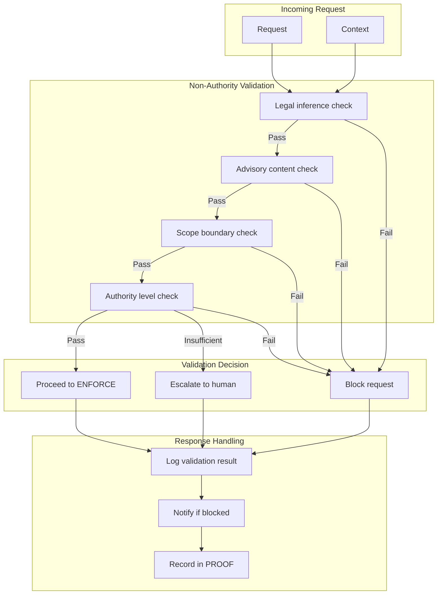

---

## 7. Governance Decision Framework

### 7.1 Decision Authority Matrix

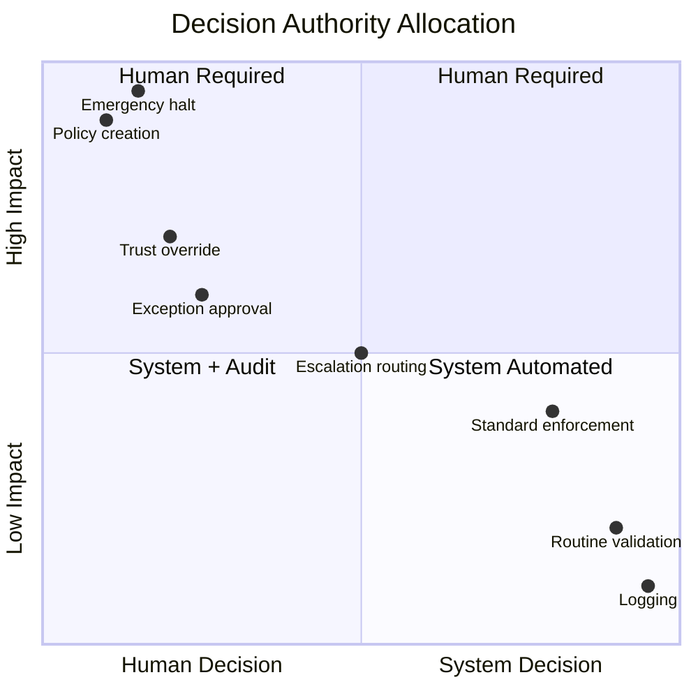

### 7.2 Decision Flow

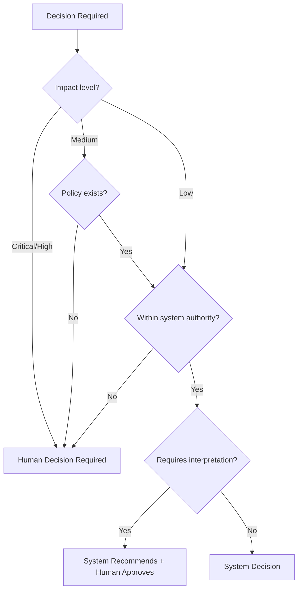

---

## 8. Governance Audit & Accountability

### 8.1 Audit Requirements

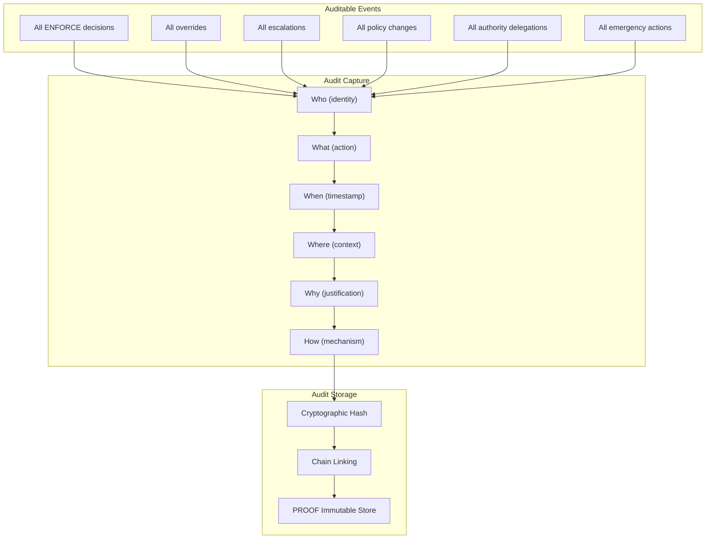

### 8.2 Accountability Chain

| Action | Accountable Party | Evidence Required | Review Frequency |
|--------|------------------|-------------------|------------------|
| **Policy Creation** | Policy author + Approver | Full policy text + Justification | On change |
| **Rule Deployment** | Deployer + Reviewer | Deployment record + Test results | On deployment |
| **Override Execution** | Override initiator | Justification + Approval chain | Within 48 hours |
| **Emergency Action** | Emergency responder | Incident record + Actions taken | Immediate |
| **Escalation** | Escalation handler | Decision + Rationale | Weekly |
| **System Decision** | System (via PROOF) | Complete audit trail | Continuous |

---

## 9. Governance Lifecycle

### 9.1 Policy Lifecycle

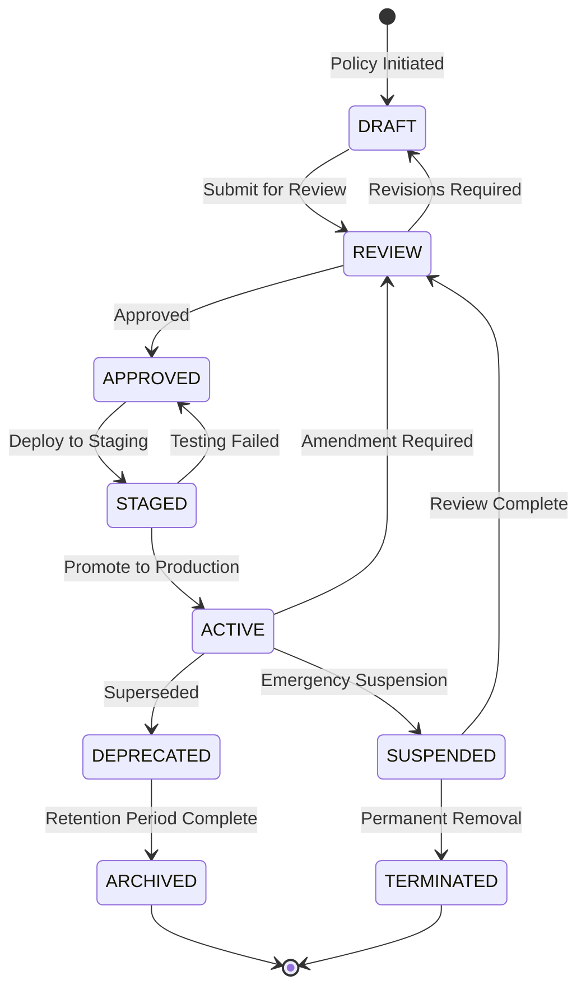

### 9.2 Governance Review Cycle

```yaml
governance_review:
  continuous:
    - audit_log_monitoring: real_time
    - anomaly_detection: real_time
    - compliance_checking: hourly

  periodic:
    - policy_effectiveness: monthly
    - override_analysis: weekly
    - escalation_patterns: weekly
    - authority_usage: monthly

  scheduled:
    - full_governance_audit: quarterly
    - policy_refresh: annually
    - authority_recertification: annually
    - compliance_assessment: annually

  triggered:
    - incident_review: per_incident
    - policy_violation: per_event
    - regulatory_change: as_needed
```

---

## 10. Inter-Component Governance

### 10.1 Component Communication Rules

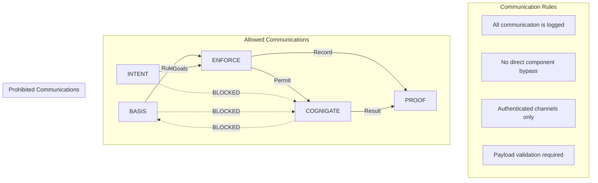

### 10.2 Cross-Component Authorization

```yaml
component_authorization:
  basis:
    can_call:
      - proof: [write_rule_change]
    cannot_call:
      - enforce: [any]
      - cognigate: [any]
      - intent: [any]

  intent:
    can_call:
      - enforce: [submit_request]
      - proof: [write_request_record]
    cannot_call:
      - basis: [any]
      - cognigate: [any]

  enforce:
    can_call:
      - basis: [read_rules]
      - cognigate: [execute_permitted]
      - proof: [write_decision]
    cannot_call:
      - basis: [write_rules]
      - intent: [any]

  cognigate:
    can_call:
      - proof: [write_execution_record]
    cannot_call:
      - basis: [any]
      - intent: [any]
      - enforce: [any]

  proof:
    can_call: []  # PROOF only receives, never initiates
    cannot_call:
      - basis: [any]
      - intent: [any]
      - enforce: [any]
      - cognigate: [any]
```

---

## 11. Governance Metrics & Monitoring

### 11.1 Key Governance Indicators

```yaml
governance_metrics:
  authority_usage:
    - metric: "Override frequency"
      target: "< 1% of decisions"
      alert_threshold: "> 2%"

    - metric: "Escalation rate"
      target: "< 5% of requests"
      alert_threshold: "> 10%"

    - metric: "Emergency actions"
      target: "< 1 per month"
      alert_threshold: "> 2 per week"

  compliance:
    - metric: "Policy violations"
      target: "0 critical"
      alert_threshold: "Any critical"

    - metric: "Audit completeness"
      target: "100%"
      alert_threshold: "< 99.9%"

  separation:
    - metric: "Cross-boundary attempts"
      target: "0"
      alert_threshold: "Any"

    - metric: "Component isolation score"
      target: "100%"
      alert_threshold: "< 100%"
```

### 11.2 Governance Dashboard

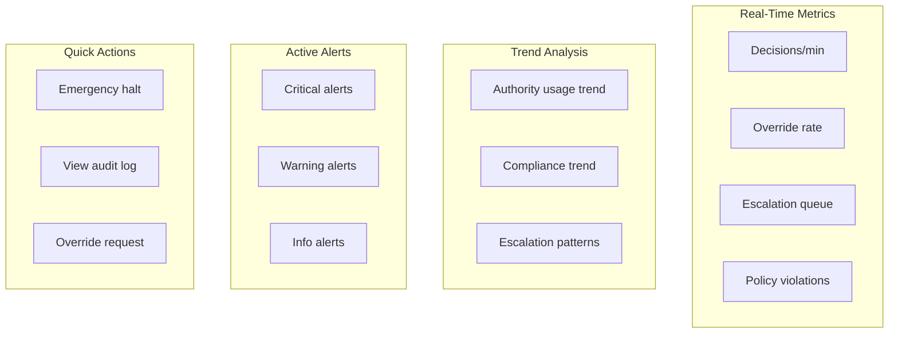

---

## 12. Appendix

### 12.1 Glossary

| Term | Definition |
|------|------------|
| **Authority** | Explicit permission to perform specific actions |
| **Delegation** | Transfer of authority from human to system |
| **Non-Authority** | Explicit declaration of actions system cannot perform |
| **Override** | Human intervention to supersede system decision |
| **Escalation** | System request for human decision |
| **Separation of Powers** | Architectural isolation of component authorities |

### 12.2 Related Documents

- 02_Security_Architecture_and_Threat_Model.pdf
- 03_Compliance_and_Regulatory_Mapping.pdf
- 06_Risk_Trust_and_Autonomy_Model.pdf
- 08_Technical_Architecture_and_Flow.pdf

---

*Vorion Confidential — 2026-01-08 — Expanded Governance Specification*
