# Security Architecture & Threat Model

**Vorion — Zero Trust, Evidence-First Security Specification**

**Version:** 1.1 (Expanded)
**Date:** 2026-01-08
**Classification:** Vorion Confidential

---

## 1. Executive Summary

Vorion operates under Zero Trust security assumptions where every action requires explicit authorization regardless of source. Security controls prioritize prevention, detection, and proof generation. This document enumerates threats, maps controls, and defines the security architecture that protects the Vorion ecosystem.

---

## 2. Security Philosophy

### 2.1 Zero Trust Principles

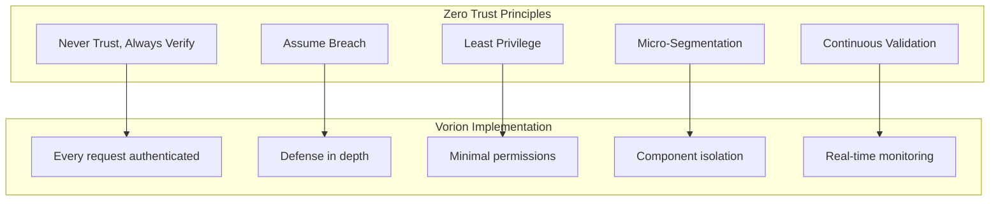

### 2.2 Security Control Priorities

| Priority | Category | Description | Examples |
|----------|----------|-------------|----------|
| **1** | Prevention | Stop attacks before impact | Authentication, Authorization, Input validation |
| **2** | Detection | Identify attacks in progress | Monitoring, Anomaly detection, Alerting |
| **3** | Proof | Evidence for investigation | Audit logs, PROOF artifacts, Forensic data |
| **4** | Response | Contain and remediate | Isolation, Revocation, Recovery |
| **5** | Recovery | Return to secure state | Replay, Restore, Rebuild |

---

## 3. Security Architecture

### 3.1 Defense in Depth Model

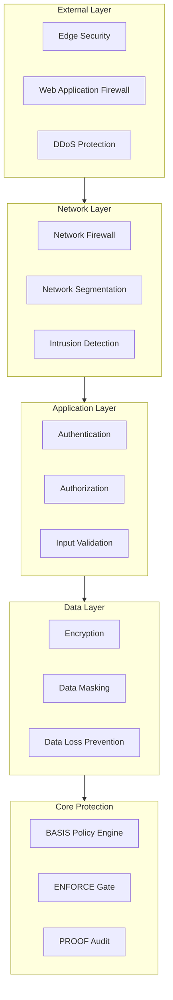

### 3.2 Security Zones

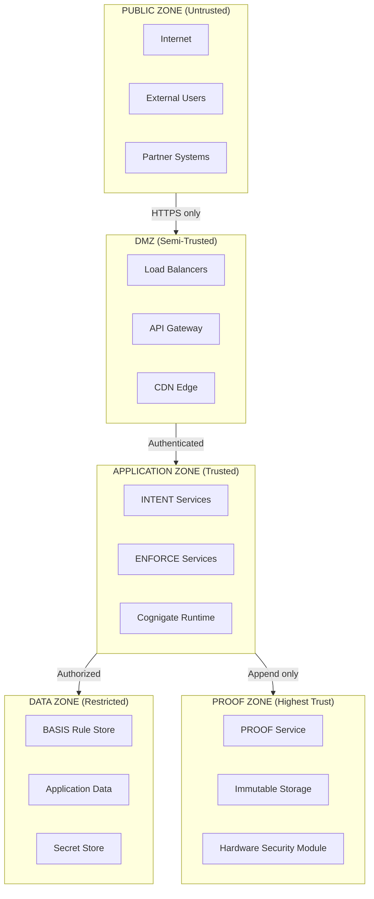

### 3.3 Security Control Matrix

```yaml
security_controls:
  network:
    - control: "TLS 1.3 Everywhere"
      layer: transport
      enforcement: mandatory
      exceptions: none

    - control: "Network Segmentation"
      layer: network
      enforcement: infrastructure
      monitoring: continuous

    - control: "Firewall Rules"
      layer: network
      enforcement: deny_by_default
      review: quarterly

  authentication:
    - control: "Multi-Factor Authentication"
      scope: all_human_users
      enforcement: mandatory
      methods: [totp, hardware_key, push]

    - control: "Service Authentication"
      scope: all_services
      enforcement: mutual_tls
      rotation: 90_days

    - control: "API Key Management"
      scope: external_integrations
      enforcement: scoped_keys
      rotation: annual

  authorization:
    - control: "Role-Based Access Control"
      scope: all_resources
      enforcement: enforce_layer
      model: deny_by_default

    - control: "Attribute-Based Access Control"
      scope: sensitive_resources
      enforcement: enforce_layer
      attributes: [user, resource, context, time]

  data_protection:
    - control: "Encryption at Rest"
      scope: all_data
      algorithm: AES-256-GCM
      key_management: hsm

    - control: "Encryption in Transit"
      scope: all_communication
      algorithm: TLS_1.3
      certificate: pki_managed

    - control: "Key Rotation"
      scope: all_keys
      frequency: per_policy
      automation: full
```

---

## 4. Threat Model

### 4.1 Threat Categories

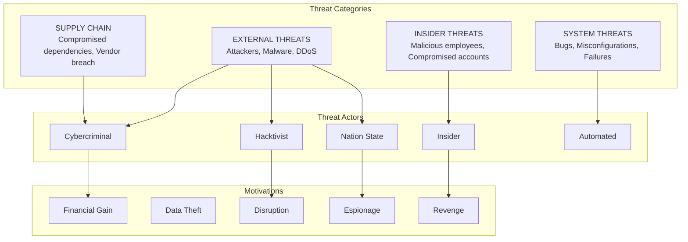

### 4.2 Threat Enumeration

| ID | Threat | Category | Likelihood | Impact | Risk Score |
|----|--------|----------|------------|--------|------------|
| **T001** | Credential Stuffing | External | High | High | Critical |
| **T002** | SQL Injection | External | Medium | Critical | High |
| **T003** | Insider Data Theft | Insider | Medium | Critical | High |
| **T004** | Policy Bypass | System | Low | Critical | High |
| **T005** | Replay Attack | External | Medium | High | High |
| **T006** | Evidence Tampering | Insider | Low | Critical | High |
| **T007** | Privilege Escalation | External/Insider | Medium | Critical | High |
| **T008** | DDoS Attack | External | High | Medium | Medium |
| **T009** | Supply Chain Compromise | Supply Chain | Low | Critical | Medium |
| **T010** | Session Hijacking | External | Medium | High | Medium |

### 4.3 Attack Trees

#### T001: Credential Stuffing Attack

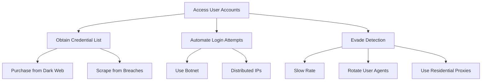

#### T006: Evidence Tampering Attack

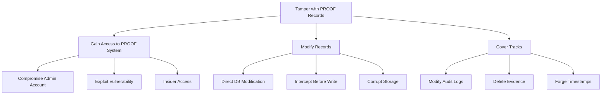

---

## 5. Control Mapping

### 5.1 Threat-Control Matrix

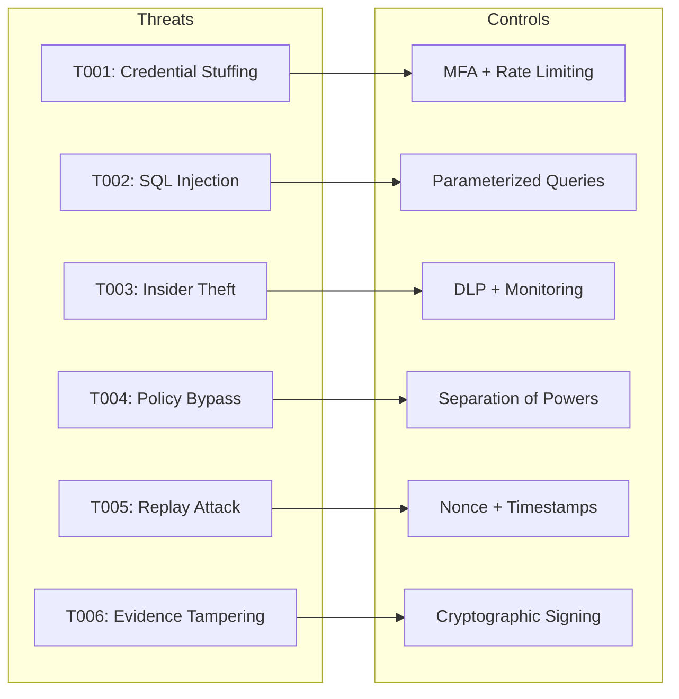

### 5.2 Detailed Control Specifications

```yaml
control_specifications:
  T001_credential_stuffing:
    prevention:
      - control: "Multi-Factor Authentication"
        effectiveness: high
        implementation: mandatory_for_all_users

      - control: "Rate Limiting"
        effectiveness: medium
        implementation: |
          - 5 failed attempts per account per hour
          - 100 attempts per IP per hour
          - Progressive delays after failures

      - control: "Credential Breach Detection"
        effectiveness: medium
        implementation: "Check against known breach databases"

    detection:
      - control: "Anomaly Detection"
        triggers: [unusual_location, impossible_travel, velocity]

      - control: "Failed Login Monitoring"
        threshold: "5 failures in 5 minutes"

    response:
      - action: "Account Lockout"
        trigger: "10 consecutive failures"
        duration: "30 minutes or admin unlock"

  T004_policy_bypass:
    prevention:
      - control: "Separation of Powers"
        effectiveness: high
        implementation: "No single component can modify and enforce"

      - control: "Immutable Policy Storage"
        effectiveness: high
        implementation: "Version-controlled with cryptographic signatures"

      - control: "Enforcement Validation"
        effectiveness: high
        implementation: "All enforcement decisions verified against rules"

    detection:
      - control: "Policy Deviation Monitoring"
        triggers: [unexpected_permit, rule_mismatch, enforcement_gap]

      - control: "Cross-Component Audit"
        frequency: "Real-time"

    response:
      - action: "Halt Execution"
        trigger: "Any policy bypass detected"
        escalation: "Immediate to security team"

  T006_evidence_tampering:
    prevention:
      - control: "Cryptographic Signing"
        effectiveness: high
        implementation: |
          - Ed25519 signatures on all artifacts
          - HSM-protected signing keys
          - Chain linking (hash of previous record)

      - control: "Append-Only Storage"
        effectiveness: high
        implementation: |
          - No update or delete operations
          - Write-once media where possible
          - Distributed copies

      - control: "Access Restriction"
        effectiveness: high
        implementation: |
          - No direct database access
          - API-only interaction
          - Separation of duties

    detection:
      - control: "Integrity Verification"
        frequency: "Continuous"
        method: "Hash chain validation"

      - control: "Cross-Site Comparison"
        frequency: "Hourly"
        method: "Compare replicas"

    response:
      - action: "Alert + Isolate"
        trigger: "Any integrity failure"
        escalation: "Critical incident"
```

---

## 6. Authentication Architecture

### 6.1 Authentication Flow

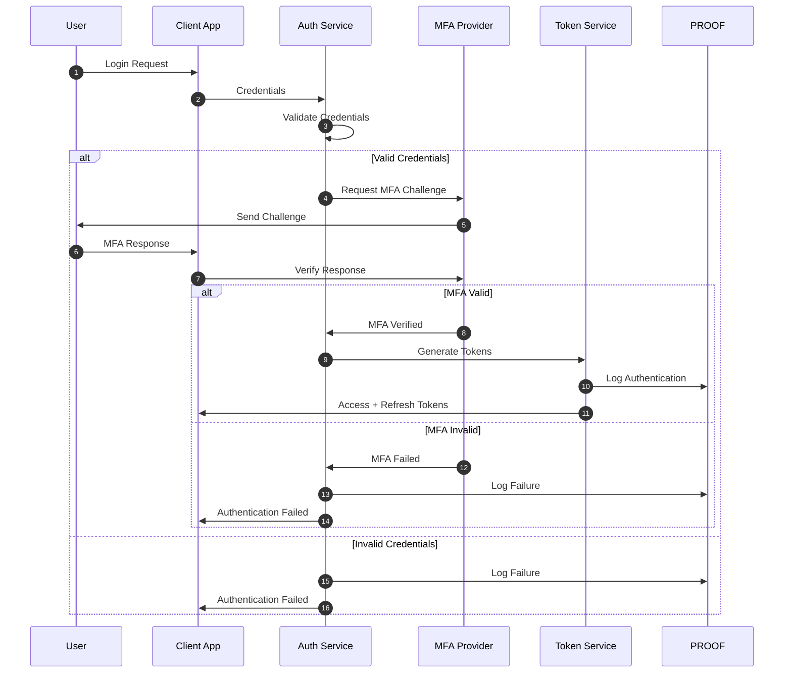

### 6.2 Token Architecture

```yaml
token_architecture:
  access_token:
    type: JWT
    lifetime: 15_minutes
    signing: RS256
    claims:
      - sub: user_id
      - iss: vorion_auth
      - aud: vorion_api
      - exp: expiration
      - iat: issued_at
      - scope: permissions
      - tenant: tenant_id
    refresh: not_allowed

  refresh_token:
    type: opaque
    lifetime: 7_days
    storage: encrypted_database
    rotation: on_use
    revocation: immediate
    family_tracking: enabled

  service_token:
    type: JWT
    lifetime: 1_hour
    signing: RS256
    rotation: automated
    mutual_tls: required
```

---

## 7. Authorization Architecture

### 7.1 Authorization Decision Flow

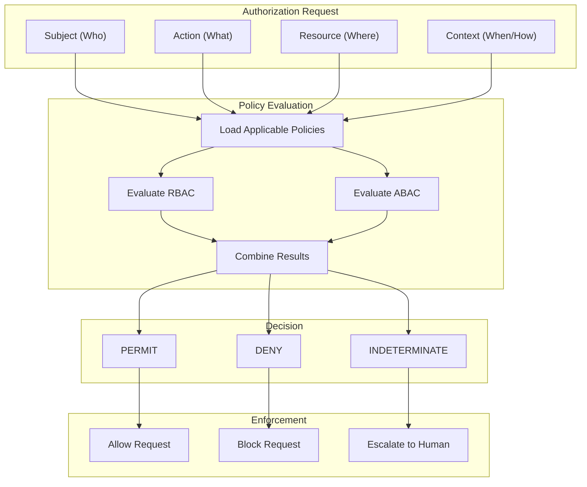

### 7.2 Permission Model

```yaml
permission_model:
  roles:
    admin:
      permissions:
        - resource: "*"
          actions: ["*"]
          constraints: ["mfa_required", "audit_enhanced"]

    operator:
      permissions:
        - resource: "config/*"
          actions: ["read", "update"]
          constraints: ["business_hours"]
        - resource: "users/*"
          actions: ["read"]

    user:
      permissions:
        - resource: "self/*"
          actions: ["read", "update"]
        - resource: "public/*"
          actions: ["read"]

  attributes:
    user_attributes:
      - department
      - clearance_level
      - location
      - trust_score

    resource_attributes:
      - classification
      - owner
      - sensitivity
      - jurisdiction

    context_attributes:
      - time_of_day
      - ip_address
      - device_trust
      - session_risk

  policies:
    - name: "Sensitive Data Access"
      condition: |
        resource.classification == "RESTRICTED" AND
        user.clearance_level >= resource.sensitivity AND
        context.device_trust >= 0.8 AND
        user.trust_score >= 600
      effect: permit

    - name: "Off-Hours Admin"
      condition: |
        user.role == "admin" AND
        NOT context.business_hours
      effect: permit_with_logging
      constraints: ["enhanced_audit", "alert_security"]
```

---

## 8. Cryptographic Controls

### 8.1 Cryptographic Standards

| Use Case | Algorithm | Key Size | Mode | Notes |
|----------|-----------|----------|------|-------|
| **Data at Rest** | AES | 256-bit | GCM | Authenticated encryption |
| **Data in Transit** | TLS | 1.3 | - | Perfect forward secrecy |
| **Signing (Artifacts)** | Ed25519 | 256-bit | - | Fast, small signatures |
| **Signing (Certificates)** | ECDSA | P-384 | - | Industry standard |
| **Key Exchange** | X25519 | 256-bit | - | Ephemeral keys |
| **Hashing** | SHA-3 | 256-bit | - | Collision resistant |
| **Password** | Argon2id | - | - | Memory-hard |

### 8.2 Key Management Architecture

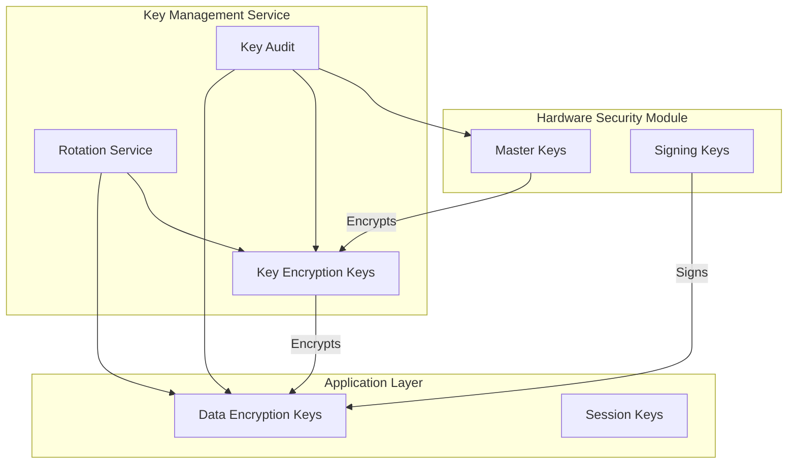

### 8.3 Key Lifecycle

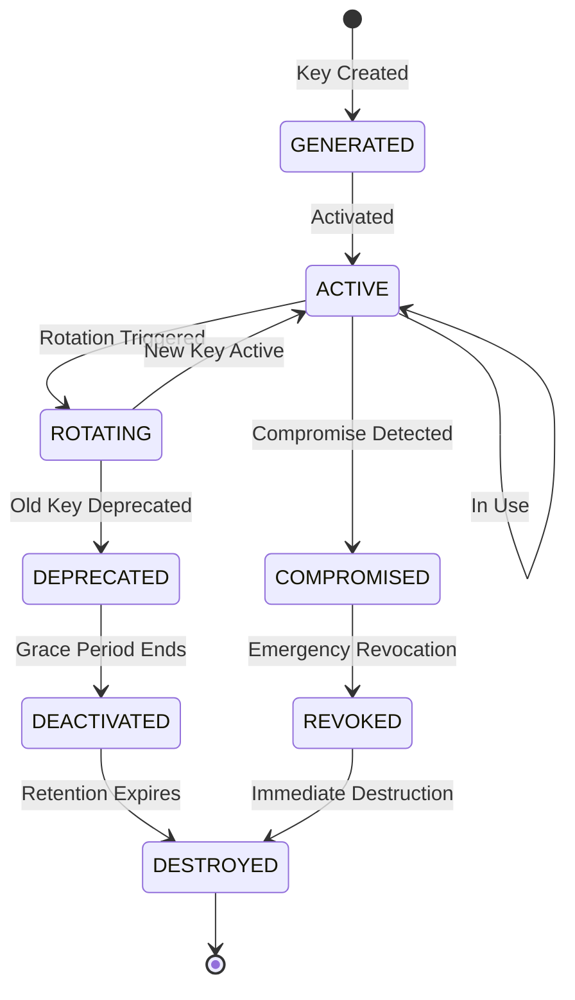

---

## 9. Monitoring & Detection

### 9.1 Security Monitoring Architecture

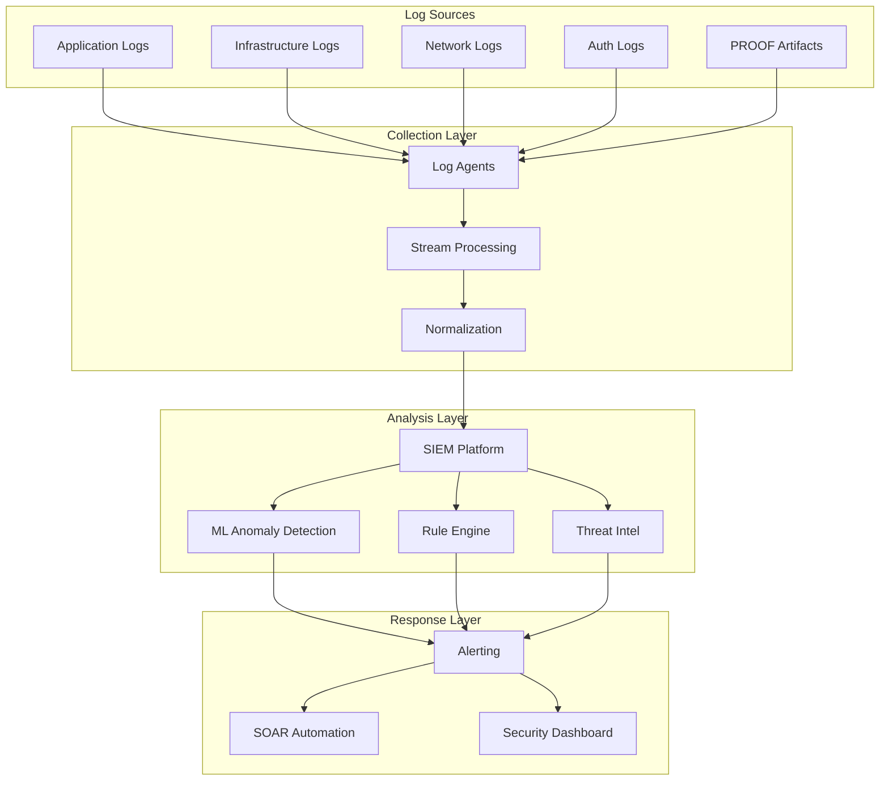

### 9.2 Detection Rules

```yaml
detection_rules:
  authentication:
    - rule_id: "AUTH-001"
      name: "Brute Force Detection"
      condition: "failed_logins > 10 in 5m from same IP"
      severity: high
      action: block_ip

    - rule_id: "AUTH-002"
      name: "Impossible Travel"
      condition: "login_distance / time_delta > 500mph"
      severity: high
      action: require_reverification

    - rule_id: "AUTH-003"
      name: "Credential Stuffing Pattern"
      condition: "unique_users > 100 AND success_rate < 1% from same IP"
      severity: critical
      action: block_ip_range

  authorization:
    - rule_id: "AUTHZ-001"
      name: "Privilege Escalation Attempt"
      condition: "denied_admin_action > 3 in 1h"
      severity: high
      action: alert_security

    - rule_id: "AUTHZ-002"
      name: "Unusual Data Access"
      condition: "data_volume > 10x baseline"
      severity: medium
      action: alert_and_throttle

  system:
    - rule_id: "SYS-001"
      name: "Policy Bypass Attempt"
      condition: "enforce_decision != expected_from_rules"
      severity: critical
      action: halt_and_alert

    - rule_id: "SYS-002"
      name: "Evidence Integrity Failure"
      condition: "proof_hash_mismatch OR chain_break"
      severity: critical
      action: incident_response
```

---

## 10. Vulnerability Management

### 10.1 Vulnerability Lifecycle

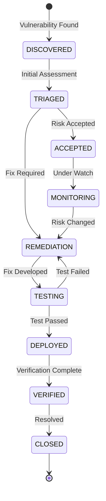

### 10.2 Vulnerability SLAs

| Severity | Discovery to Triage | Triage to Remediation | Remediation to Deployment |
|----------|--------------------|-----------------------|---------------------------|
| **Critical** | 4 hours | 24 hours | 48 hours |
| **High** | 24 hours | 7 days | 14 days |
| **Medium** | 72 hours | 30 days | 45 days |
| **Low** | 7 days | 90 days | 90 days |

---

## 11. Security Testing

### 11.1 Testing Program

```yaml
security_testing:
  continuous:
    - type: "SAST"
      frequency: "Every commit"
      tools: ["Semgrep", "CodeQL"]
      blocking: true

    - type: "SCA"
      frequency: "Daily"
      tools: ["Snyk", "Dependabot"]
      blocking: "Critical/High"

    - type: "DAST"
      frequency: "Weekly"
      tools: ["OWASP ZAP"]
      scope: "Staging environment"

  periodic:
    - type: "Penetration Test"
      frequency: "Quarterly"
      scope: "Full application + infrastructure"
      provider: "Third-party certified"

    - type: "Red Team Exercise"
      frequency: "Annually"
      scope: "Full organization"
      objectives: ["Data exfiltration", "Privilege escalation"]

    - type: "Tabletop Exercise"
      frequency: "Bi-annually"
      scope: "Incident response readiness"

  ad_hoc:
    - type: "Bug Bounty"
      status: "Active"
      scope: "Production systems"
      rewards: "$500 - $50,000"
```

---

## 12. Appendix

### 12.1 Security Checklist

- [ ] All communication uses TLS 1.3
- [ ] MFA enabled for all human users
- [ ] Service accounts use mTLS
- [ ] All data encrypted at rest
- [ ] Key rotation automated
- [ ] SIEM collecting all security logs
- [ ] Detection rules active and tuned
- [ ] Incident response plan tested
- [ ] Penetration test completed (quarterly)
- [ ] Vulnerability SLAs met

### 12.2 Related Documents

- 01_System_Governance_and_Authority_Model.pdf
- 04_Audit_Evidence_and_Forensics.pdf
- 06_Risk_Trust_and_Autonomy_Model.pdf
- 07_Incident_Response_and_Resilience.pdf

---

*Vorion Confidential — 2026-01-08 — Expanded Security Architecture Specification*
