# Compliance & Regulatory Mapping

**Vorion — Framework Alignment Without Hardcoding Law**

**Version:** 1.1 (Expanded)
**Date:** 2026-01-08
**Classification:** Vorion Confidential

---

## 1. Executive Summary

Vorion treats law and regulation as versioned policy bundles rather than embedded logic, enabling adaptation to regulatory changes without code modifications. This document maps Vorion controls to major compliance frameworks and demonstrates how evidence generation proves compliance through artifacts rather than assertions.

---

## 2. Compliance Philosophy

### 2.1 Core Compliance Principles

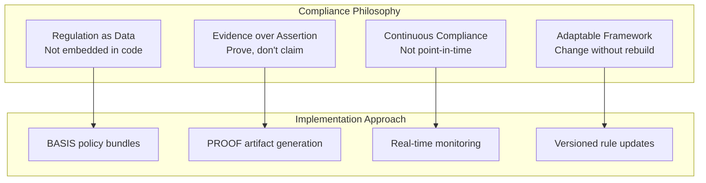

### 2.2 Compliance Architecture

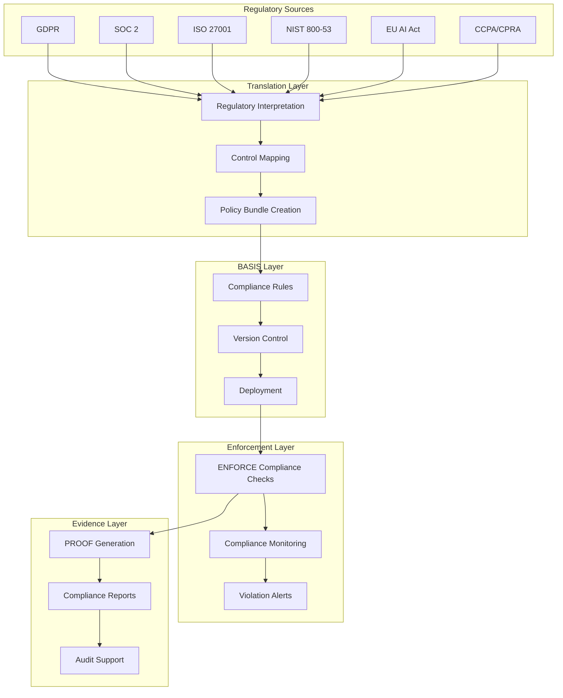

---

## 3. Framework Coverage

### 3.1 Supported Frameworks

| Framework | Version | Coverage | Status |
|-----------|---------|----------|--------|
| **SOC 2 Type II** | 2017 | Full | Active |
| **ISO 27001** | 2022 | Full | Active |
| **NIST 800-53** | Rev 5 | High baseline | Active |
| **GDPR** | 2016/679 | Full | Active |
| **EU AI Act** | 2024 | High-risk AI | Active |
| **CCPA/CPRA** | 2023 | Full | Active |
| **HIPAA** | Current | Technical safeguards | Planned |
| **PCI DSS** | 4.0 | Applicable controls | Planned |

### 3.2 Framework Relationship Map

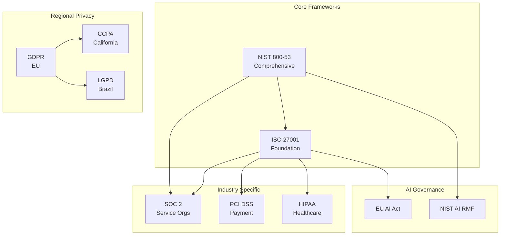

---

## 4. SOC 2 Control Mapping

### 4.1 Trust Service Criteria Coverage

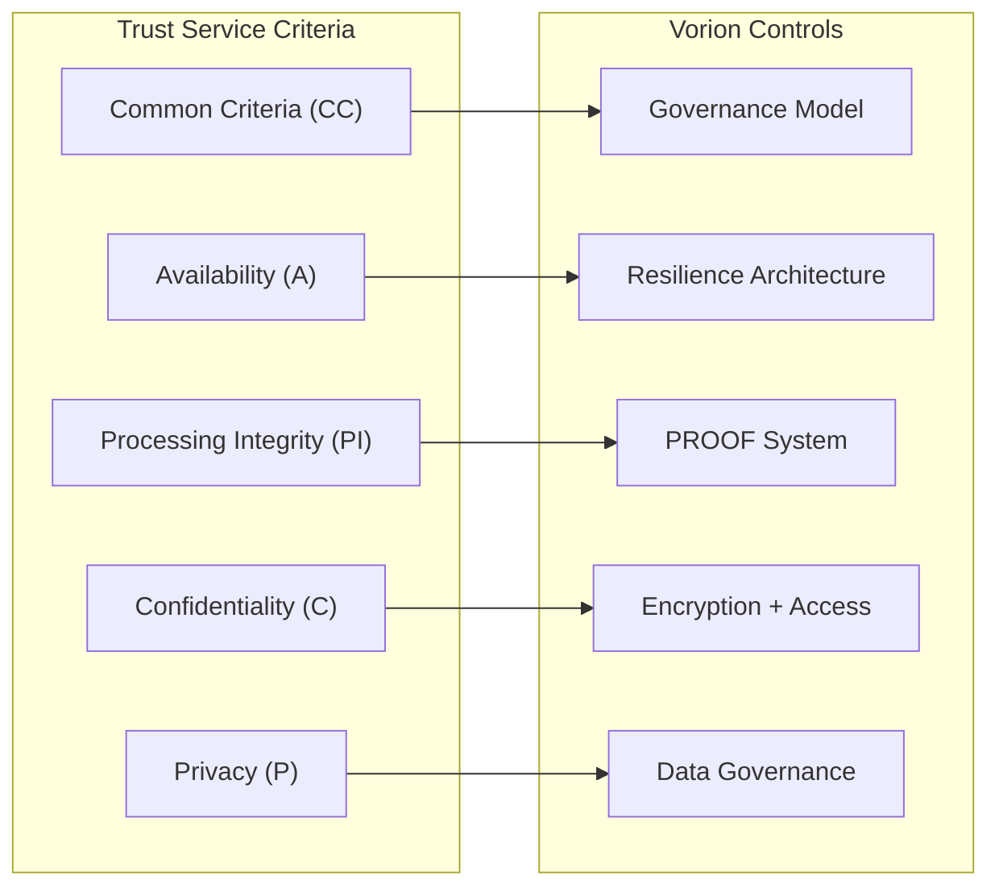

### 4.2 SOC 2 Control Matrix

| SOC 2 Control | Vorion Implementation | Evidence Source |
|---------------|----------------------|-----------------|
| **CC1.1** - COSO Principles | Governance model, separation of powers | Governance docs, PROOF records |
| **CC2.1** - Information Quality | INTENT validation, data classification | Validation logs, classification tags |
| **CC3.1** - Risk Assessment | Risk-Trust model, threat modeling | Risk assessments, trust scores |
| **CC4.1** - Monitoring Activities | Continuous monitoring, anomaly detection | SIEM logs, alerts |
| **CC5.1** - Control Activities | BASIS rules, ENFORCE gates | Rule definitions, enforcement logs |
| **CC6.1** - Logical Access | RBAC/ABAC, MFA, authentication | Access logs, auth records |
| **CC6.6** - System Boundaries | Network segmentation, zone architecture | Infrastructure configs |
| **CC7.1** - System Changes | Change management, versioned policies | Change records, version history |
| **CC7.2** - Change Detection | Integrity monitoring, drift detection | Monitoring logs, alerts |
| **CC8.1** - Incident Response | IR procedures, PROOF forensics | Incident records, PIRs |
| **CC9.1** - Risk Mitigation | Control mapping, residual risk acceptance | Risk registers, control evidence |
| **A1.1** - Availability Commitments | SLAs, resilience architecture | Uptime reports, failover tests |
| **A1.2** - Availability Recovery | Recovery procedures, replay capability | DR tests, recovery logs |
| **PI1.1** - Processing Integrity | ENFORCE validation, PROOF verification | Validation logs, proof artifacts |
| **C1.1** - Confidentiality | Encryption, access control, DLP | Encryption configs, access logs |
| **P1.1** - Privacy Notice | Privacy policies, consent management | Policy versions, consent records |

---

## 5. ISO 27001 Control Mapping

### 5.1 Annex A Control Coverage

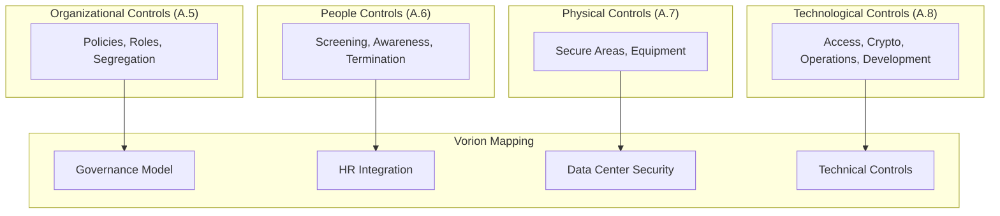

### 5.2 Key ISO 27001 Controls

| ISO Control | Description | Vorion Implementation |
|-------------|-------------|----------------------|
| **A.5.1** | Policies for information security | BASIS policy framework |
| **A.5.2** | Information security roles | Separation of powers model |
| **A.5.3** | Segregation of duties | Component authority isolation |
| **A.5.15** | Access control | ENFORCE + RBAC/ABAC |
| **A.5.23** | Information security for cloud | Multi-region architecture |
| **A.5.28** | Collection of evidence | PROOF artifact system |
| **A.8.2** | Privileged access rights | Trust-based autonomy |
| **A.8.3** | Information access restriction | Data classification + DLP |
| **A.8.5** | Secure authentication | MFA + token architecture |
| **A.8.9** | Configuration management | Versioned BASIS policies |
| **A.8.15** | Logging | Comprehensive audit logging |
| **A.8.16** | Monitoring activities | SIEM + anomaly detection |
| **A.8.24** | Use of cryptography | Encryption standards |
| **A.8.28** | Secure coding | SAST/DAST/SCA pipeline |

---

## 6. NIST 800-53 Control Mapping

### 6.1 Control Family Coverage

```mermaid
flowchart TB
    subgraph Families["NIST Control Families"]
        AC["AC - Access Control"]
        AU["AU - Audit"]
        CA["CA - Assessment"]
        CM["CM - Configuration"]
        CP["CP - Contingency"]
        IA["IA - Identification"]
        IR["IR - Incident Response"]
        MA["MA - Maintenance"]
        MP["MP - Media Protection"]
        PE["PE - Physical"]
        PL["PL - Planning"]
        PM["PM - Program Mgmt"]
        PS["PS - Personnel"]
        RA["RA - Risk Assessment"]
        SA["SA - Acquisition"]
        SC["SC - System/Comms"]
        SI["SI - System Integrity"]
        SR["SR - Supply Chain"]
    end

    subgraph Coverage["Coverage Level"]
        FULL["Full Coverage"]
        PARTIAL["Partial Coverage"]
        NA["N/A (Physical/HR)"]
    end

    AC --> FULL
    AU --> FULL
    CA --> FULL
    CM --> FULL
    CP --> FULL
    IA --> FULL
    IR --> FULL
    SC --> FULL
    SI --> FULL

    MA --> PARTIAL
    PL --> PARTIAL
    PM --> PARTIAL
    RA --> PARTIAL
    SA --> PARTIAL
    SR --> PARTIAL

    PE --> NA
    PS --> NA
    MP --> NA
```

### 6.2 High-Impact Control Matrix

| NIST Control | Control Name | Vorion Implementation | Evidence |
|--------------|--------------|----------------------|----------|
| **AC-2** | Account Management | Identity management + lifecycle | Account logs |
| **AC-3** | Access Enforcement | ENFORCE gate + BASIS rules | Enforcement logs |
| **AC-6** | Least Privilege | Trust-based autonomy levels | Trust scores |
| **AU-2** | Audit Events | Comprehensive event logging | PROOF artifacts |
| **AU-6** | Audit Review | SIEM analysis + alerting | Analysis reports |
| **AU-9** | Protection of Audit Info | Immutable PROOF storage | Integrity proofs |
| **AU-10** | Non-repudiation | Cryptographic signing | Signatures |
| **CA-7** | Continuous Monitoring | Real-time monitoring | Dashboards |
| **CM-2** | Baseline Configuration | Versioned BASIS policies | Version history |
| **CM-3** | Configuration Change Control | Change management | Change records |
| **CP-9** | System Backup | Multi-region replication | Backup logs |
| **CP-10** | System Recovery | Deterministic replay | Recovery tests |
| **IA-2** | Identification and Auth | MFA + token architecture | Auth logs |
| **IA-5** | Authenticator Management | Key rotation + lifecycle | Key logs |
| **IR-4** | Incident Handling | IR procedures | Incident records |
| **IR-5** | Incident Monitoring | SIEM + anomaly detection | Alerts |
| **SC-8** | Transmission Confidentiality | TLS 1.3 everywhere | TLS configs |
| **SC-13** | Cryptographic Protection | Encryption standards | Crypto inventory |
| **SC-28** | Protection at Rest | AES-256-GCM | Encryption configs |
| **SI-4** | System Monitoring | Continuous monitoring | Monitoring data |
| **SI-7** | Software Integrity | Code signing + verification | Integrity logs |

---

## 7. GDPR Compliance Mapping

### 7.1 GDPR Article Implementation

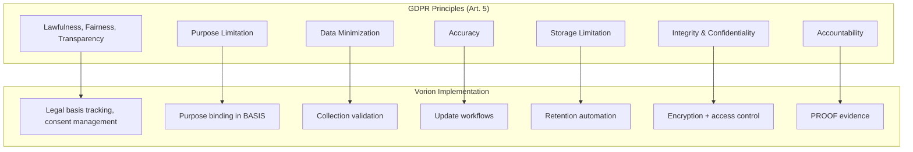

### 7.2 Data Subject Rights Implementation

| GDPR Right | Article | Implementation | Response SLA |
|------------|---------|----------------|--------------|
| **Right to Access** | Art. 15 | Automated data export | 30 days |
| **Right to Rectification** | Art. 16 | Self-service + workflow | 30 days |
| **Right to Erasure** | Art. 17 | Automated purge workflow | 30 days |
| **Right to Restriction** | Art. 18 | Processing flags | Immediate |
| **Right to Portability** | Art. 20 | Machine-readable export | 30 days |
| **Right to Object** | Art. 21 | Opt-out processing | Immediate |
| **Automated Decision Rights** | Art. 22 | Human review escalation | Per request |

### 7.3 GDPR Compliance Flow

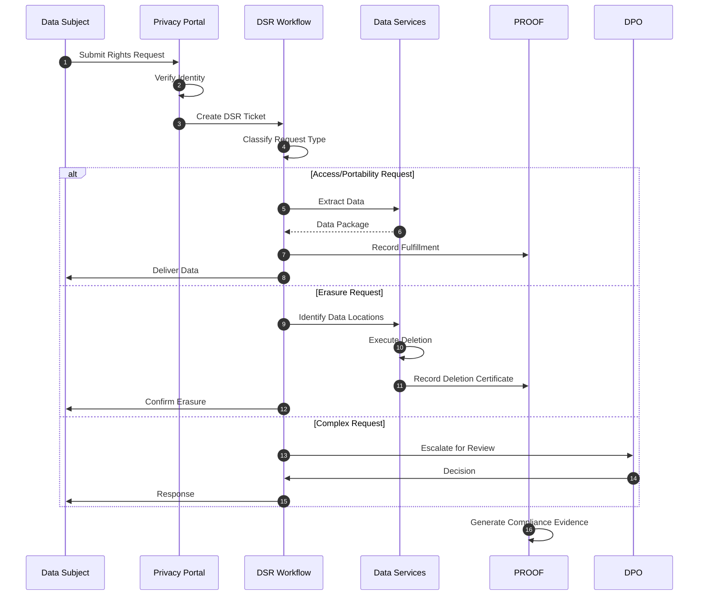

---

## 8. EU AI Act Compliance

### 8.1 AI System Classification

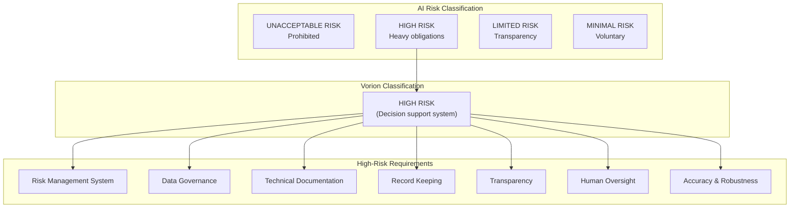

### 8.2 EU AI Act Control Matrix

| Requirement | Article | Vorion Implementation | Evidence |
|-------------|---------|----------------------|----------|
| **Risk Management** | Art. 9 | Risk-Trust model, threat modeling | Risk assessments |
| **Data Governance** | Art. 10 | Data classification, quality controls | Data governance docs |
| **Documentation** | Art. 11 | Architecture docs, this specification | Documentation set |
| **Record Keeping** | Art. 12 | PROOF artifact system | Audit trail |
| **Transparency** | Art. 13 | Clear documentation, explanations | User documentation |
| **Human Oversight** | Art. 14 | Human override mechanisms | Override logs |
| **Accuracy** | Art. 15 | Validation, testing, monitoring | Test results |
| **Robustness** | Art. 15 | Resilience architecture | Resilience tests |
| **Cybersecurity** | Art. 15 | Security architecture | Security assessments |

---

## 9. Evidence Generation

### 9.1 Evidence Architecture

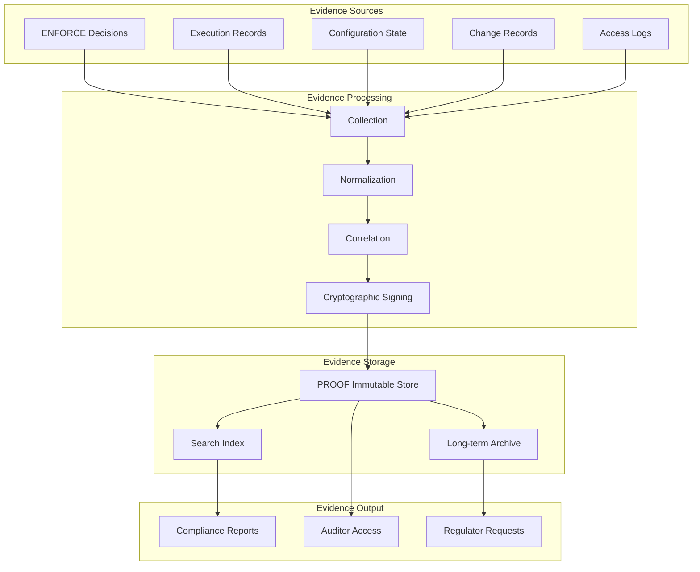

### 9.2 Evidence Types

| Evidence Type | Description | Retention | Format |
|---------------|-------------|-----------|--------|
| **Decision Records** | Every ENFORCE permit/deny | 7 years | PROOF artifact |
| **Execution Records** | Cognigate operation details | 7 years | PROOF artifact |
| **Access Logs** | All authentication/authorization | 2 years | Structured log |
| **Change Records** | Policy and config changes | Permanent | PROOF artifact |
| **Consent Records** | User consent actions | Duration + 5 years | PROOF artifact |
| **DSR Records** | Data subject request handling | 5 years | PROOF artifact |
| **Incident Records** | Security incident details | 7 years | PROOF artifact |
| **Test Results** | Security and compliance tests | 3 years | Test report |

### 9.3 Evidence Generation Flow

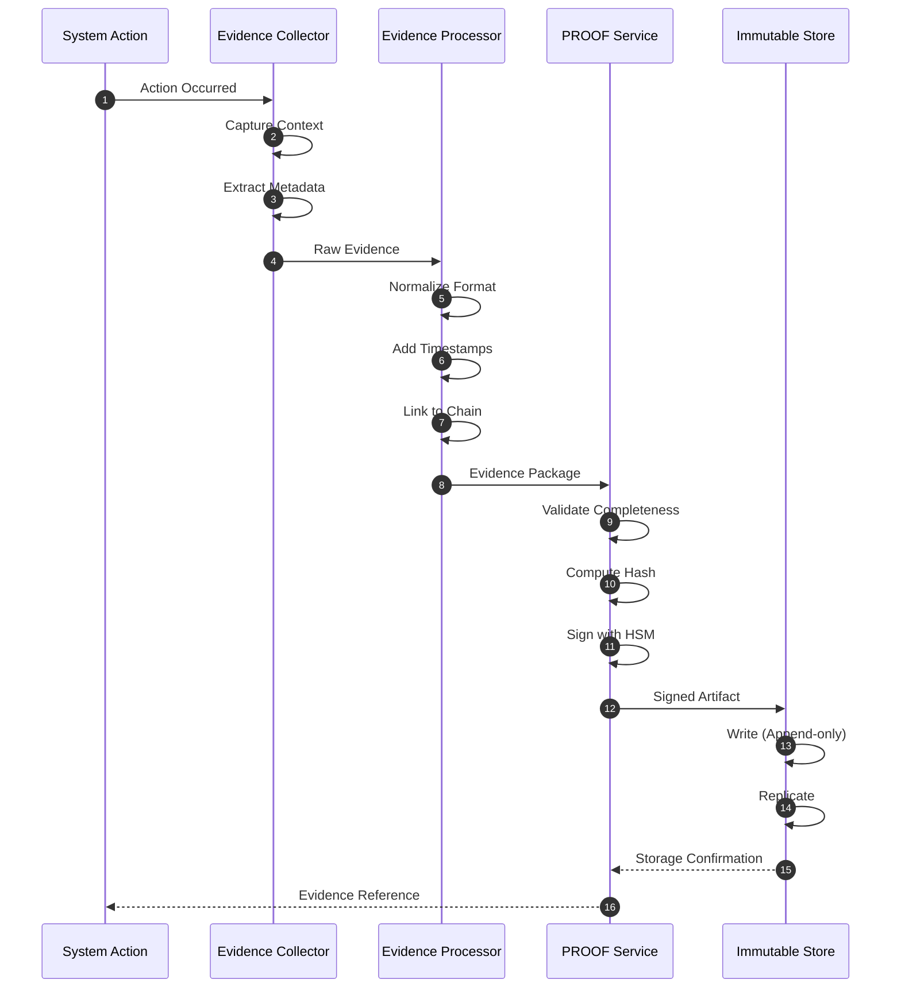

---

## 10. Compliance Reporting

### 10.1 Report Types

```yaml
compliance_reports:
  continuous:
    - name: "Compliance Dashboard"
      frequency: real_time
      audience: internal
      content: [control_status, violations, metrics]

    - name: "Control Effectiveness"
      frequency: daily
      audience: security_team
      content: [control_performance, gaps, trends]

  periodic:
    - name: "SOC 2 Evidence Package"
      frequency: quarterly
      audience: auditors
      content: [control_evidence, test_results, exceptions]

    - name: "ISO 27001 ISMS Report"
      frequency: quarterly
      audience: management
      content: [isms_status, risk_treatment, improvements]

    - name: "GDPR Compliance Report"
      frequency: monthly
      audience: dpo
      content: [dsr_stats, breach_records, consent_status]

  on_demand:
    - name: "Auditor Evidence Request"
      trigger: auditor_request
      content: [specific_evidence, supporting_docs]

    - name: "Regulator Response"
      trigger: regulatory_inquiry
      content: [requested_information, proof_artifacts]
```

### 10.2 Compliance Metrics Dashboard

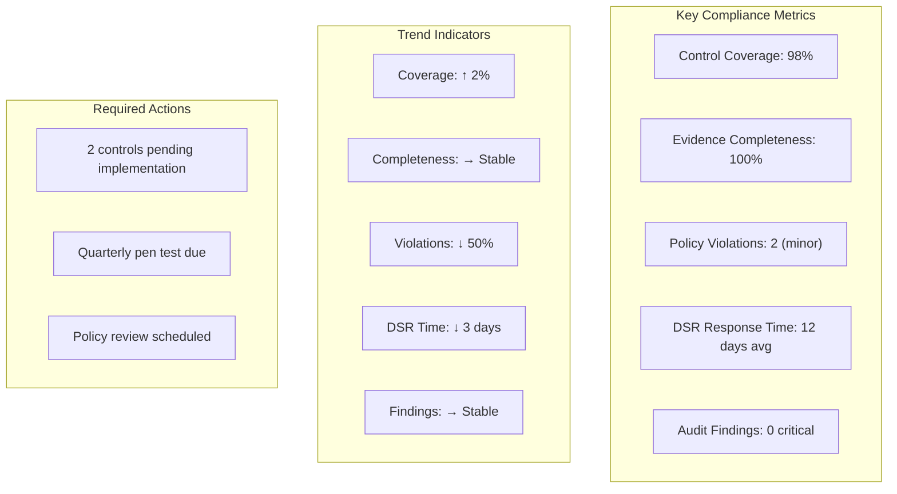

---

## 11. Regulatory Change Management

### 11.1 Change Management Process

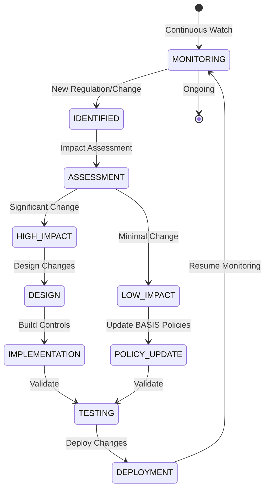

### 11.2 Regulatory Watch List

| Regulation | Status | Expected Impact | Target Date |
|------------|--------|-----------------|-------------|
| **EU AI Act** | Enacted | High | Aug 2025 |
| **DORA (EU)** | Enacted | Medium | Jan 2025 |
| **NIS2 (EU)** | Enacted | Medium | Oct 2024 |
| **US Privacy Laws** | Various | Medium | Ongoing |
| **UK GDPR Changes** | Proposed | Low | TBD |

---

## 12. Appendix

### 12.1 Compliance Glossary

| Term | Definition |
|------|------------|
| **Control** | Safeguard or countermeasure to manage risk |
| **Evidence** | Proof that a control is operating effectively |
| **Framework** | Structured set of compliance requirements |
| **Policy Bundle** | VERSION controlled set of compliance rules |
| **DSR** | Data Subject Request |
| **DPO** | Data Protection Officer |

### 12.2 Related Documents

- 01_System_Governance_and_Authority_Model.pdf
- 04_Audit_Evidence_and_Forensics.pdf
- 05_Data_Governance_and_Privacy.pdf

---

*Vorion Confidential — 2026-01-08 — Expanded Compliance Mapping Specification*
