# Audit, Evidence & Forensics Specification

**Vorion — Immutable Proof and Deterministic Replay**

**Version:** 1.1 (Expanded)
**Date:** 2026-01-08
**Classification:** Vorion Confidential

---

## 1. Executive Summary

The PROOF system generates canonical, immutable evidence artifacts for every significant action in Vorion. All artifacts include lineage, timestamps, and cryptographic signatures. Deterministic replay enables auditors to reconstruct system behavior exactly. Chain of custody mechanisms preserve evidence integrity for regulatory and legal proceedings.

---

## 2. PROOF System Architecture

### 2.1 High-Level Architecture

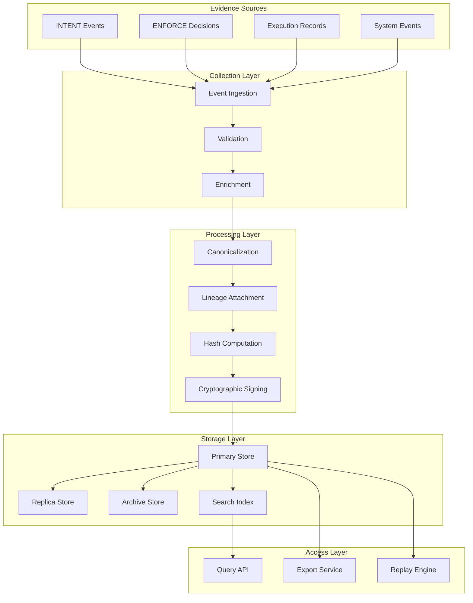

### 2.2 PROOF Service Components

| Component | Responsibility | Characteristics |
|-----------|---------------|-----------------|
| **Ingestion Service** | Receive events from all sources | High availability, buffered |
| **Validation Service** | Verify event completeness and format | Schema validation, rejection handling |
| **Canonicalization Service** | Create standard artifact format | Deterministic transformation |
| **Signing Service** | Cryptographic signatures | HSM-backed, Ed25519 |
| **Storage Service** | Immutable persistence | Append-only, replicated |
| **Query Service** | Evidence retrieval | Indexed, access-controlled |
| **Replay Service** | Deterministic reconstruction | Isolated execution |

---

## 3. Proof Artifact Model

### 3.1 Artifact Structure

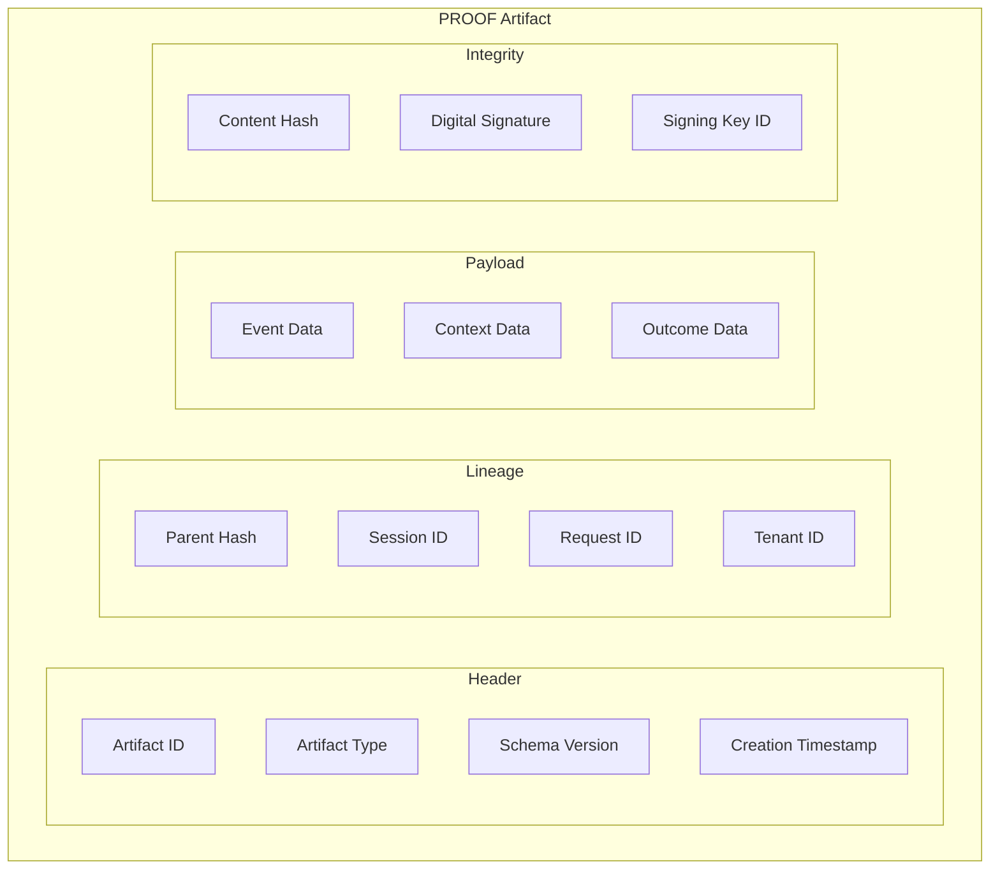

### 3.2 Artifact Schema

```yaml
artifact_schema:
  version: "1.0"

  header:
    artifact_id:
      type: string
      format: "proof-{date}-{uuid}"
      example: "proof-2026-01-08-a1b2c3d4-e5f6-7890"

    artifact_type:
      type: enum
      values:
        - enforcement_decision
        - execution_record
        - authentication_event
        - authorization_event
        - configuration_change
        - data_access
        - system_event
        - incident_record

    schema_version:
      type: string
      format: semver

    timestamp:
      type: datetime
      format: ISO8601
      precision: microseconds
      timezone: UTC

  lineage:
    parent_hash:
      type: string
      format: "sha256:{hash}"
      description: "Hash of previous artifact in chain"
      nullable: true  # First artifact has no parent

    chain_id:
      type: string
      description: "Identifier for artifact chain"

    session_id:
      type: string
      description: "Originating session"

    request_id:
      type: string
      description: "Originating request"

    tenant_id:
      type: string
      description: "Tenant context"

    actor_id:
      type: string
      description: "Acting entity (user or service)"

  payload:
    event_type:
      type: string
      description: "Specific event classification"

    event_data:
      type: object
      description: "Event-specific data"

    context:
      type: object
      properties:
        source_ip: string
        user_agent: string
        geographic_location: string
        device_fingerprint: string
        trust_score: number

    outcome:
      type: object
      properties:
        status: enum [success, failure, partial]
        result_summary: string
        error_details: object

  integrity:
    content_hash:
      type: string
      format: "sha256:{hash}"
      description: "Hash of header + lineage + payload"

    signature:
      type: string
      format: base64
      algorithm: Ed25519

    signing_key_id:
      type: string
      description: "Identifier of signing key"

    signed_at:
      type: datetime
```

### 3.3 Artifact Types

| Type | Description | Retention | Legal Hold |
|------|-------------|-----------|------------|
| **enforcement_decision** | ENFORCE permit/deny records | 7 years | Supported |
| **execution_record** | Cognigate execution details | 7 years | Supported |
| **authentication_event** | Login, logout, MFA events | 2 years | Supported |
| **authorization_event** | Access grant/deny records | 2 years | Supported |
| **configuration_change** | Policy and config modifications | Permanent | Supported |
| **data_access** | Sensitive data access records | 7 years | Supported |
| **system_event** | Infrastructure and operational events | 1 year | Supported |
| **incident_record** | Security incident documentation | Permanent | Supported |

---

## 4. Evidence Generation

### 4.1 Generation Flow

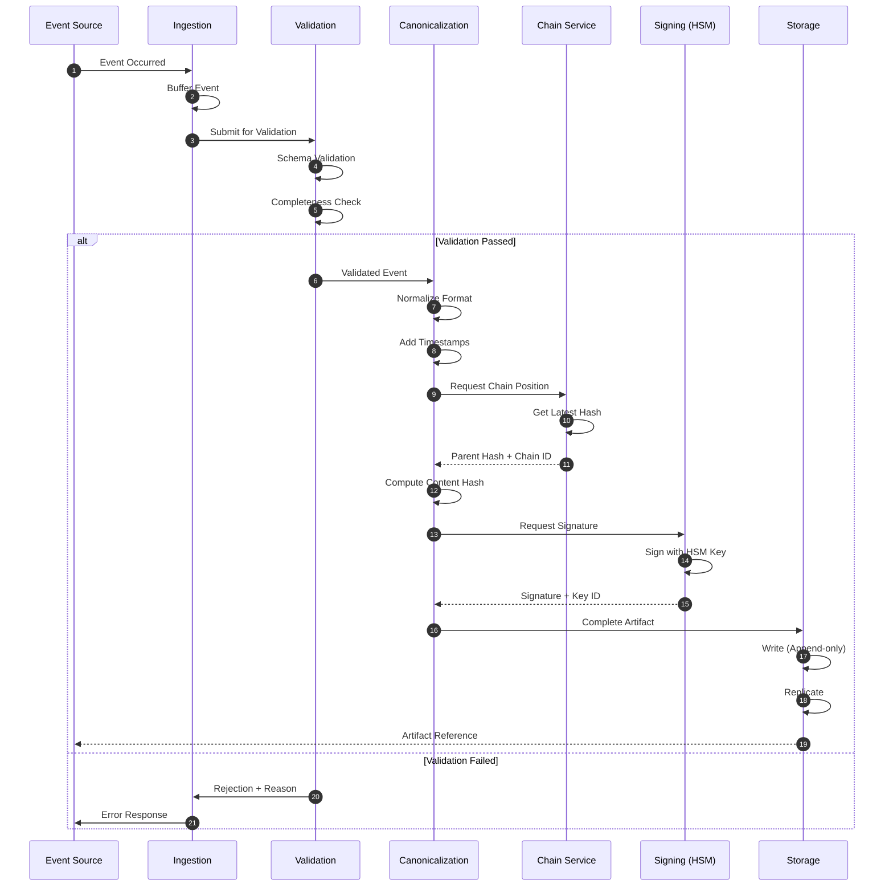

### 4.2 Canonicalization Rules

```yaml
canonicalization_rules:
  ordering:
    - rule: "Object keys sorted alphabetically"
      example: "{a:1, c:3, b:2} → {a:1, b:2, c:3}"

    - rule: "Array elements in original order"
      example: "[3,1,2] → [3,1,2]"

  formatting:
    - rule: "No whitespace in JSON"
      example: '{"key":"value"}'

    - rule: "UTC timestamps in ISO8601"
      example: "2026-01-08T14:30:00.000000Z"

    - rule: "Lowercase hex for hashes"
      example: "sha256:a1b2c3..."

  normalization:
    - rule: "Trim string whitespace"
    - rule: "Null for missing optional fields"
    - rule: "Empty array for missing lists"
    - rule: "Consistent number formatting (no trailing zeros)"

  exclusions:
    - rule: "Exclude signature from content hash"
    - rule: "Exclude signing metadata from content hash"
```

---

## 5. Chain Integrity

### 5.1 Hash Chain Model

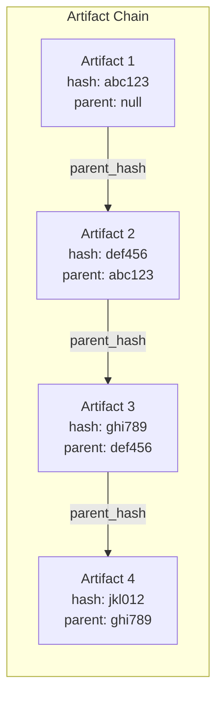

### 5.2 Chain Verification

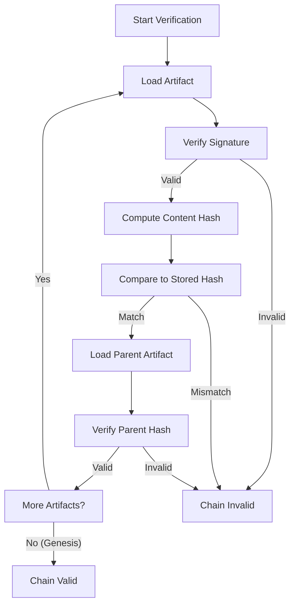

### 5.3 Integrity Monitoring

```yaml
integrity_monitoring:
  continuous:
    - check: "Chain continuity"
      frequency: "Every artifact"
      action: "Verify parent hash exists and matches"

    - check: "Signature validity"
      frequency: "Sampling (1%)"
      action: "Verify signature with public key"

  periodic:
    - check: "Full chain verification"
      frequency: "Daily"
      scope: "Last 24 hours of artifacts"
      action: "Complete hash chain walk"

    - check: "Cross-replica comparison"
      frequency: "Hourly"
      action: "Compare artifact counts and sample hashes"

    - check: "Archive verification"
      frequency: "Weekly"
      action: "Verify archived artifacts match source"

  alerts:
    - condition: "Hash mismatch detected"
      severity: critical
      action: "Halt writes, alert security, preserve evidence"

    - condition: "Signature verification failure"
      severity: critical
      action: "Isolate artifact, investigate key compromise"

    - condition: "Chain break detected"
      severity: critical
      action: "Incident response activation"
```

---

## 6. Deterministic Replay

### 6.1 Replay Architecture

```mermaid
flowchart TB
    subgraph Input["Replay Input"]
        ARTIFACTS["PROOF Artifacts"]
        TIME_RANGE["Time Range"]
        FILTERS["Filters"]
    end

    subgraph Preparation["Preparation Phase"]
        LOAD["Load Artifacts"]
        SEQUENCE["Sequence by Timestamp"]
        DEPS["Resolve Dependencies"]
        STATE["Initialize State"]
    end

    subgraph Execution["Replay Execution"]
        SANDBOX["Isolated Sandbox"]
        REPLAY_ENG["Replay Engine"]
        CAPTURE["State Capture"]
    end

    subgraph Verification["Verification Phase"]
        COMPARE["Compare States"]
        DIVERGENCE["Detect Divergence"]
        REPORT["Generate Report"]
    end

    ARTIFACTS --> LOAD
    TIME_RANGE --> LOAD
    FILTERS --> LOAD

    LOAD --> SEQUENCE
    SEQUENCE --> DEPS
    DEPS --> STATE

    STATE --> SANDBOX
    SANDBOX --> REPLAY_ENG

    loop For Each Artifact
        REPLAY_ENG --> CAPTURE
        CAPTURE --> COMPARE
    end

    COMPARE --> DIVERGENCE
    DIVERGENCE --> REPORT
```

### 6.2 Replay Modes

| Mode | Purpose | Fidelity | Performance |
|------|---------|----------|-------------|
| **Full Replay** | Complete reconstruction | Exact | Slow |
| **Sampled Replay** | Spot verification | Statistical | Fast |
| **Targeted Replay** | Specific incident | Exact (subset) | Medium |
| **Comparison Replay** | A/B testing | Exact | Slow |

### 6.3 Replay Execution Flow

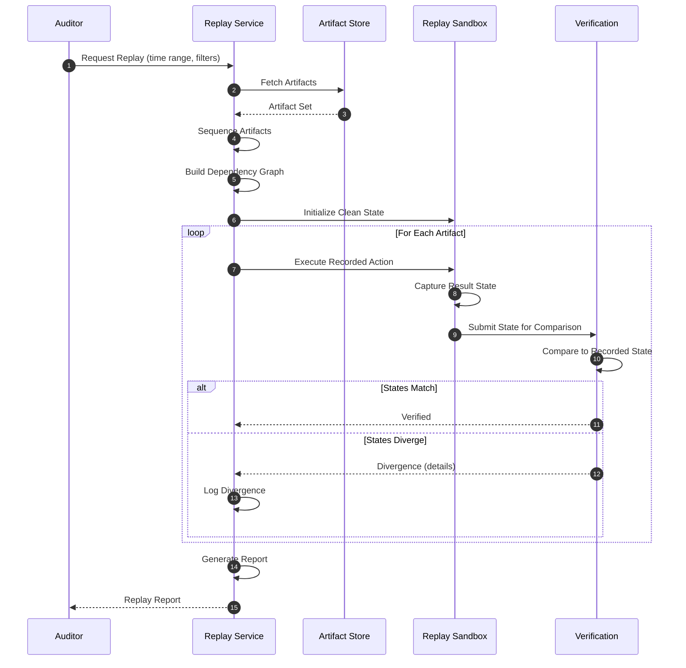

### 6.4 Replay Guarantees

```yaml
replay_guarantees:
  determinism:
    guarantee: "Same inputs produce same outputs"
    mechanism: "Captured random seeds, frozen timestamps"
    exceptions: "External API calls (mocked)"

  isolation:
    guarantee: "Replay cannot affect production"
    mechanism: "Completely isolated sandbox environment"
    verification: "Network isolation, separate storage"

  completeness:
    guarantee: "All recorded events can be replayed"
    mechanism: "Self-contained artifacts with full context"
    exceptions: "Artifacts with external dependencies note limitations"

  verification:
    guarantee: "Replay results can be compared to original"
    mechanism: "State hashes at each step"
    tolerance: "Configurable for floating-point operations"
```

---

## 7. Chain of Custody

### 7.1 Custody Model

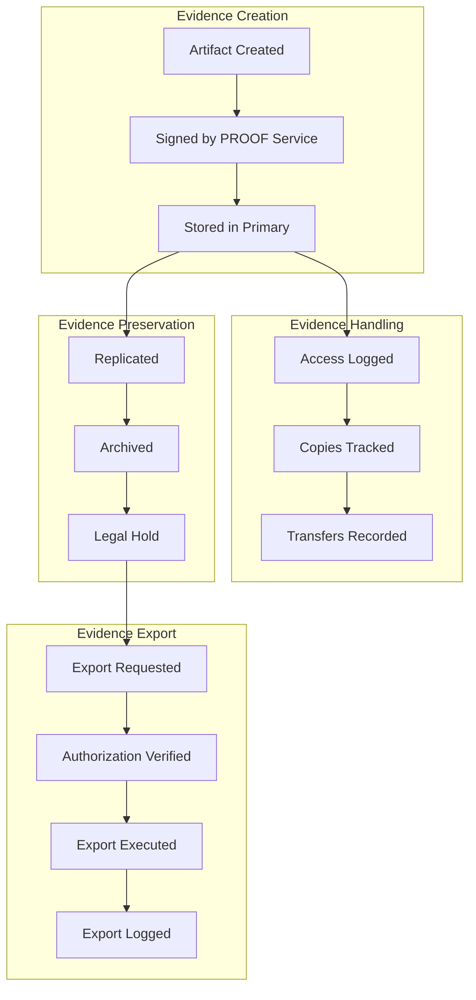

### 7.2 Custody Record Schema

```yaml
custody_record:
  artifact_reference:
    artifact_id: string
    artifact_hash: string

  custody_events:
    - event_type: "created"
      timestamp: datetime
      actor: "proof_service"
      location: "primary_store"
      signature: string

    - event_type: "replicated"
      timestamp: datetime
      actor: "replication_service"
      source: "primary_store"
      destination: "replica_store"
      verification_hash: string

    - event_type: "accessed"
      timestamp: datetime
      actor: "user_id or service_id"
      access_type: "read | export | replay"
      purpose: string
      authorization: string

    - event_type: "exported"
      timestamp: datetime
      actor: "user_id"
      destination: "description of recipient"
      format: "native | pdf | csv"
      authorization: "approval_reference"
      hash_at_export: string

    - event_type: "legal_hold_applied"
      timestamp: datetime
      actor: "legal_admin"
      hold_id: string
      reason: string
      expiration: datetime | null

  integrity_verification:
    last_verified: datetime
    verification_result: "valid | invalid"
    verifier: "service_id"
```

### 7.3 Legal Hold Process

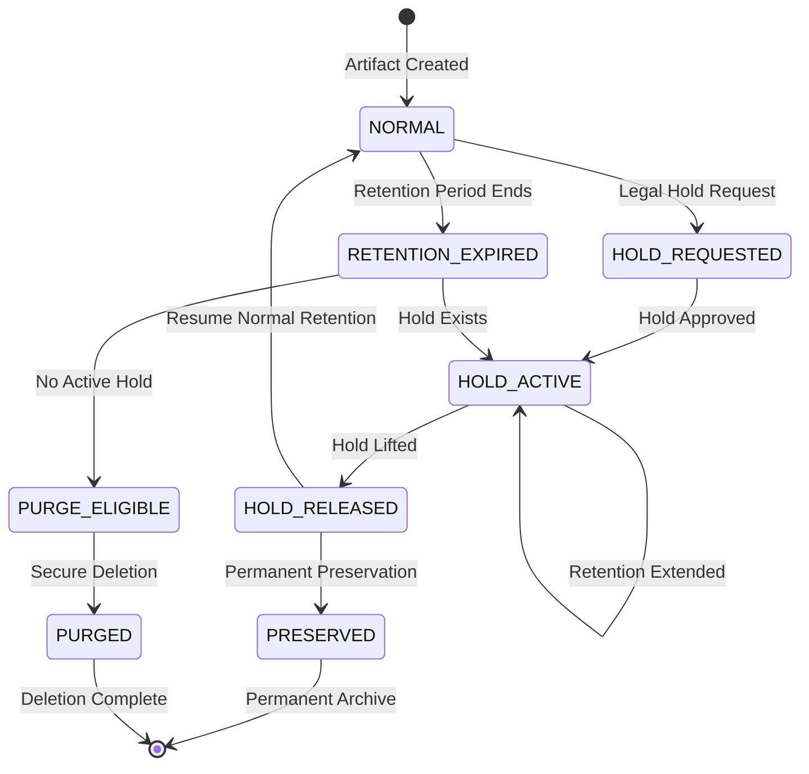

---

## 8. Forensic Analysis

### 8.1 Forensic Capabilities

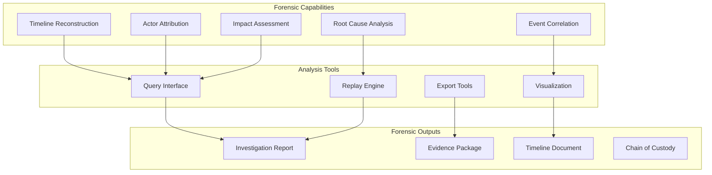

### 8.2 Forensic Query Examples

```yaml
forensic_queries:
  timeline_reconstruction:
    description: "Reconstruct all actions by a user in time range"
    query: |
      SELECT * FROM artifacts
      WHERE actor_id = '{user_id}'
        AND timestamp BETWEEN '{start}' AND '{end}'
      ORDER BY timestamp ASC

  lateral_movement:
    description: "Track access patterns across resources"
    query: |
      SELECT actor_id, resource, action, timestamp
      FROM artifacts
      WHERE artifact_type = 'authorization_event'
        AND timestamp BETWEEN '{start}' AND '{end}'
      ORDER BY actor_id, timestamp

  data_exfiltration:
    description: "Identify large data access patterns"
    query: |
      SELECT actor_id, SUM(data_volume) as total_volume,
             COUNT(*) as access_count
      FROM artifacts
      WHERE artifact_type = 'data_access'
        AND timestamp BETWEEN '{start}' AND '{end}'
      GROUP BY actor_id
      HAVING total_volume > {threshold}

  privilege_escalation:
    description: "Track permission changes and subsequent actions"
    query: |
      SELECT a1.*, a2.*
      FROM artifacts a1
      JOIN artifacts a2 ON a1.actor_id = a2.actor_id
      WHERE a1.artifact_type = 'authorization_event'
        AND a1.event_data.permission_change = true
        AND a2.timestamp > a1.timestamp
        AND a2.timestamp < a1.timestamp + INTERVAL '1 hour'
```

### 8.3 Investigation Workflow

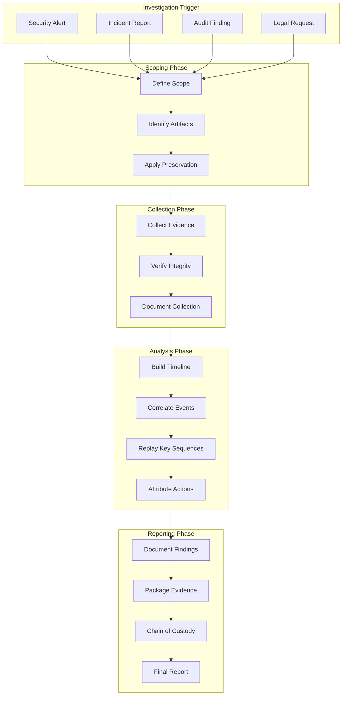

---

## 9. Audit Support

### 9.1 Auditor Access Model

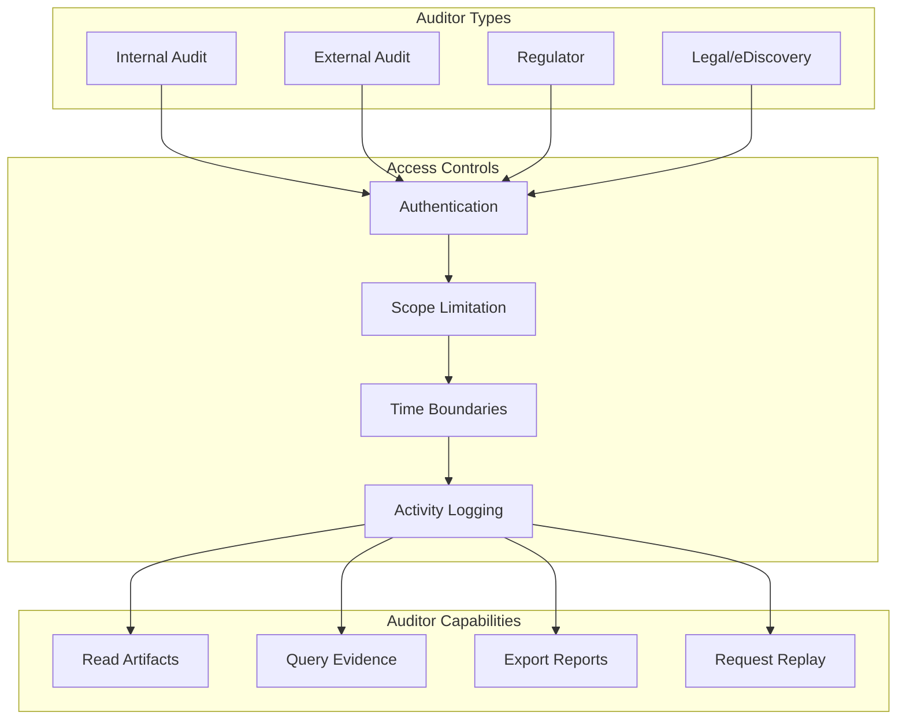

### 9.2 Audit Report Generation

```yaml
audit_reports:
  standard_reports:
    - name: "Access Control Report"
      content:
        - authentication_events_summary
        - authorization_decisions
        - privilege_changes
        - access_anomalies
      format: [pdf, csv, json]

    - name: "Change Management Report"
      content:
        - configuration_changes
        - policy_modifications
        - approval_chain
        - change_impact
      format: [pdf, csv, json]

    - name: "Data Access Report"
      content:
        - data_access_events
        - sensitive_data_access
        - data_exports
        - access_by_classification
      format: [pdf, csv, json]

    - name: "Incident Report"
      content:
        - incident_timeline
        - affected_resources
        - response_actions
        - remediation_steps
      format: [pdf]

  custom_reports:
    - capability: "Ad-hoc query"
      access: "Authorized auditors"
      output: [csv, json]

    - capability: "Evidence package"
      access: "Legal/compliance"
      output: [encrypted_archive]
```

---

## 10. Storage Architecture

### 10.1 Storage Tiers

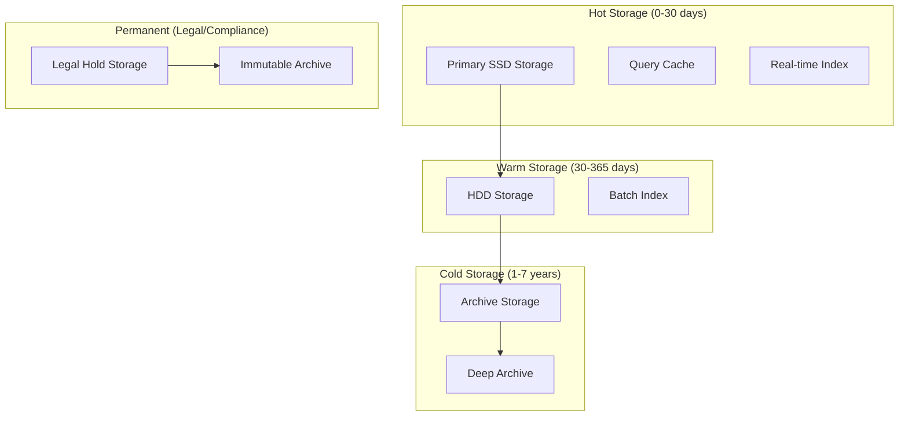

### 10.2 Storage Specifications

| Tier | Retention | Access Time | Redundancy | Encryption |
|------|-----------|-------------|------------|------------|
| **Hot** | 0-30 days | < 10ms | 3 replicas | AES-256-GCM |
| **Warm** | 30-365 days | < 1s | 2 replicas | AES-256-GCM |
| **Cold** | 1-7 years | < 1 min | 2 regions | AES-256-GCM |
| **Permanent** | Indefinite | < 4 hours | 3 regions | AES-256-GCM + HSM |

---

## 11. Compliance Integration

### 11.1 Regulatory Evidence Mapping

| Regulation | Evidence Requirement | PROOF Artifact Type |
|------------|---------------------|---------------------|
| **SOC 2** | Access control evidence | authentication_event, authorization_event |
| **SOC 2** | Change management evidence | configuration_change |
| **ISO 27001** | A.5.28 Collection of evidence | All artifact types |
| **GDPR** | Processing records (Art. 30) | data_access, execution_record |
| **GDPR** | Breach notification evidence | incident_record |
| **NIST** | AU-2 Audit events | All artifact types |
| **NIST** | AU-10 Non-repudiation | Signed artifacts |
| **EU AI Act** | Art. 12 Record keeping | execution_record |

---

## 12. Appendix

### 12.1 Glossary

| Term | Definition |
|------|------------|
| **Artifact** | Immutable evidence record with cryptographic integrity |
| **Chain** | Linked sequence of artifacts via parent hashes |
| **Lineage** | Ancestry and context of an artifact |
| **Replay** | Deterministic re-execution of recorded events |
| **Chain of Custody** | Record of evidence handling and transfers |
| **Legal Hold** | Preservation order preventing deletion |

### 12.2 Related Documents

- 01_System_Governance_and_Authority_Model.pdf
- 03_Compliance_and_Regulatory_Mapping.pdf
- 07_Incident_Response_and_Resilience.pdf
- 08_Technical_Architecture_and_Flow.pdf

---

*Vorion Confidential — 2026-01-08 — Expanded Audit & Forensics Specification*
