# Data Governance & Privacy Impact

**Vorion / BASIS / Cognigate — Expanded Data Governance Specification**

**Version:** 1.1 (Expanded)
**Date:** 2026-01-08
**Classification:** Vorion Confidential

---

## 1. Executive Summary

Vorion implements jurisdiction-aware data governance through policy-driven controls enforced by BASIS. Data handling follows privacy-by-design principles: minimization, purpose limitation, and automated retention management. All data operations generate immutable PROOF artifacts for regulatory compliance demonstration.

---

## 2. Data Governance Architecture

### 2.1 High-Level Data Flow

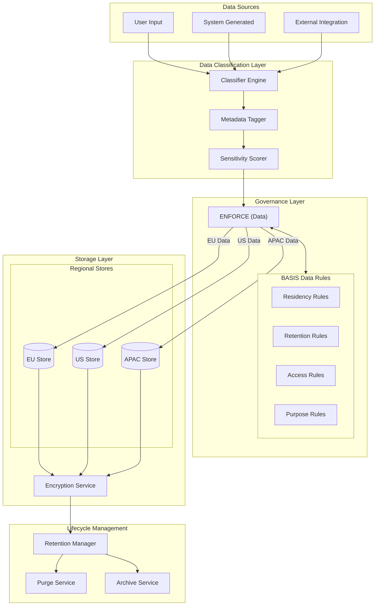

### 2.2 Data Classification Taxonomy

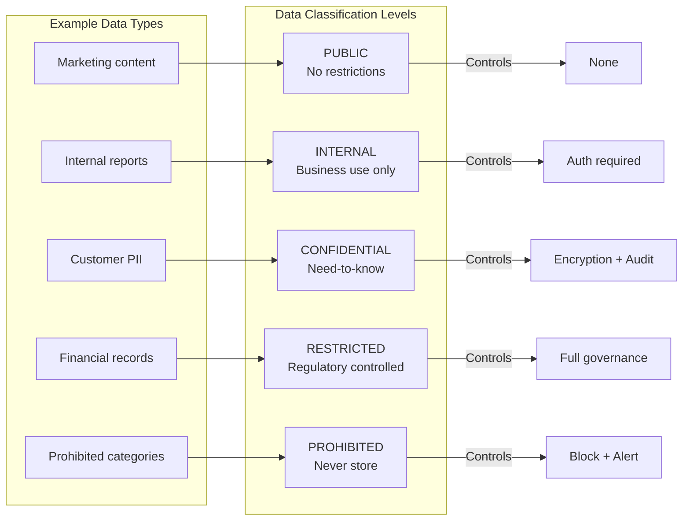

---

## 3. Privacy Principles Implementation

### 3.1 Core Privacy Principles

| Principle | Implementation | Enforcement Point |
|-----------|----------------|-------------------|
| **Data Minimization** | Collect only what's necessary | INTENT layer validation |
| **Purpose Limitation** | Use only for declared purpose | BASIS purpose binding |
| **Storage Limitation** | Retain only as long as needed | Automated retention policies |
| **Accuracy** | Keep data current and correct | Update/correction workflows |
| **Integrity & Confidentiality** | Protect against unauthorized access | Encryption + Access control |
| **Accountability** | Demonstrate compliance | PROOF artifacts |

### 3.2 Purpose Binding Flow

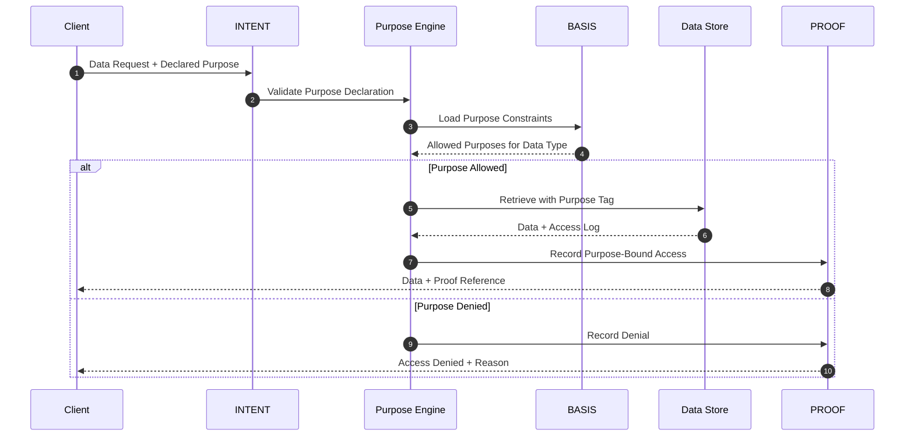

### 3.3 Purpose Categories

```yaml
purpose_categories:
  primary_purposes:
    - service_delivery:
        description: "Fulfill the requested service"
        retention: "duration_of_service"
        legal_basis: "contract"

    - account_management:
        description: "Manage user account"
        retention: "account_lifetime + 30_days"
        legal_basis: "contract"

  secondary_purposes:
    - analytics:
        description: "Aggregate usage analysis"
        retention: "24_months"
        legal_basis: "legitimate_interest"
        requires_opt_in: false
        anonymization_required: true

    - marketing:
        description: "Promotional communications"
        retention: "until_opt_out"
        legal_basis: "consent"
        requires_opt_in: true

  prohibited_purposes:
    - sale_to_third_party:
        description: "Selling personal data"
        allowed: false

    - unauthorized_profiling:
        description: "Profiling without consent"
        allowed: false
```

---

## 4. Jurisdiction-Aware Data Controls

### 4.1 Jurisdictional Routing

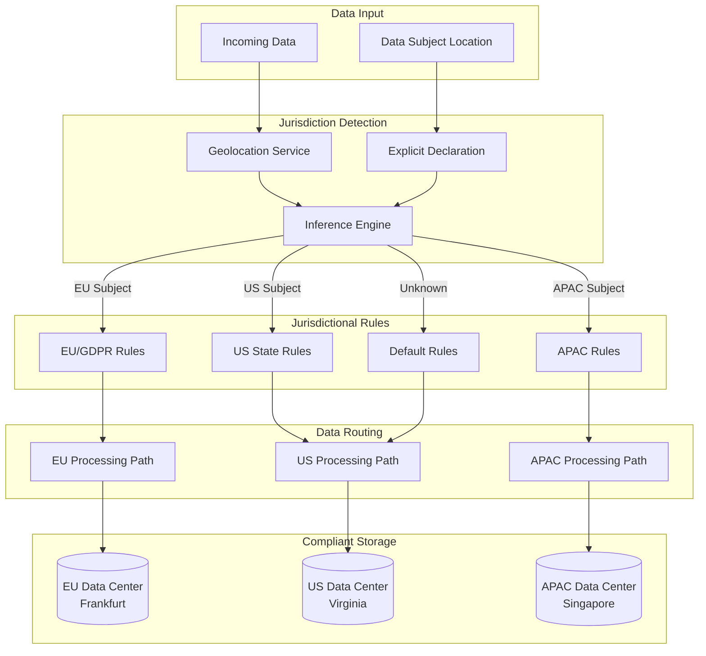

### 4.2 Jurisdictional Rule Matrix

| Jurisdiction | Residency Required | Cross-Border Transfer | Consent Model | Retention Limit | Right to Delete |
|--------------|-------------------|----------------------|---------------|-----------------|-----------------|
| **EU (GDPR)** | Yes (EU) | SCCs/Adequacy | Opt-in | Purpose-based | Yes (30 days) |
| **California (CCPA/CPRA)** | No | Disclosure required | Opt-out | 12 months notice | Yes (45 days) |
| **Brazil (LGPD)** | Preferred | Adequacy/Consent | Opt-in | Purpose-based | Yes (15 days) |
| **China (PIPL)** | Yes (China) | Security assessment | Explicit | Minimum necessary | Yes |
| **Default** | No | Allowed | Opt-out | 7 years | Yes (90 days) |

### 4.3 Cross-Border Transfer Decision

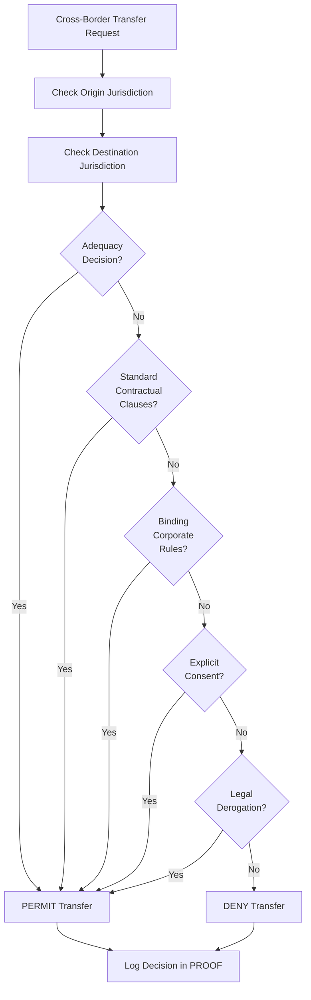

---

## 5. Data Minimization Controls

### 5.1 Collection Minimization

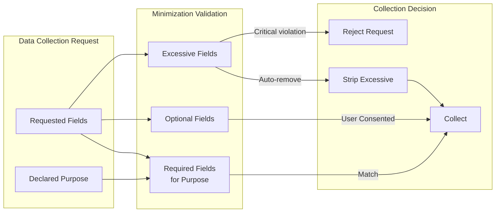

### 5.2 Field-Level Minimization Rules

```yaml
minimization_rules:
  user_registration:
    required:
      - email: "Account identification"
      - password_hash: "Authentication"
    optional:
      - display_name: "Personalization"
      - timezone: "UX improvement"
    prohibited:
      - ssn: "Not needed for service"
      - political_affiliation: "Sensitive category"
      - biometric_data: "Requires explicit consent flow"

  payment_processing:
    required:
      - billing_address: "Tax compliance"
      - payment_token: "Transaction processing"
    optional:
      - save_for_future: "Convenience"
    prohibited:
      - full_card_number: "Use tokenization"
      - cvv_storage: "PCI prohibited"
```

---

## 6. Retention Management

### 6.1 Retention Lifecycle

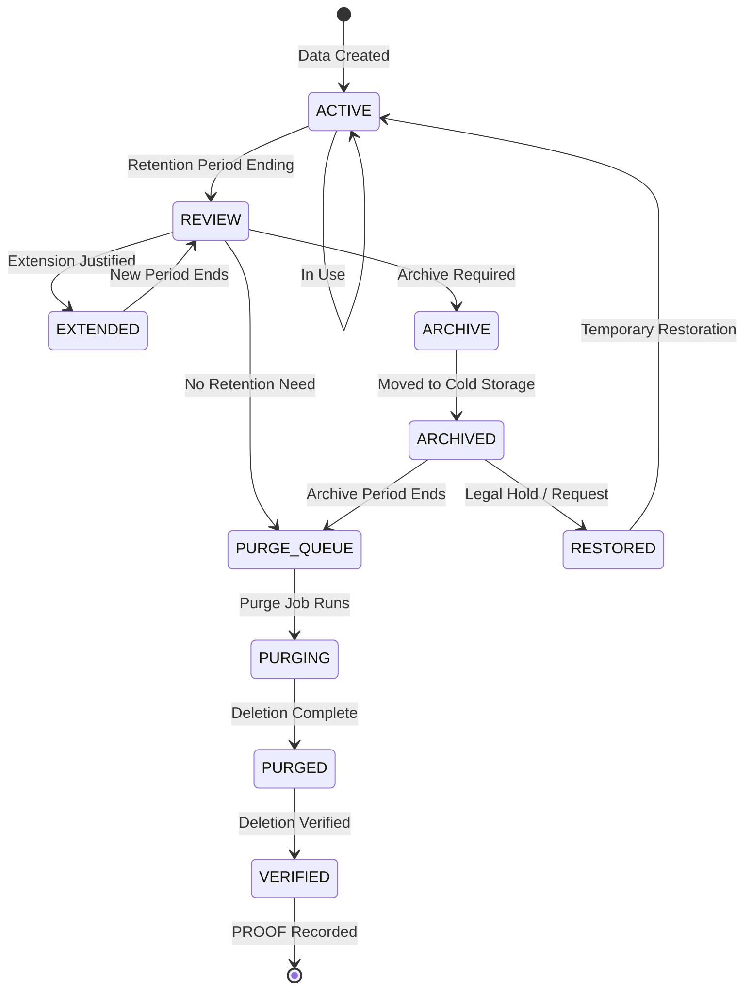

### 6.2 Retention Schedule

| Data Category | Active Retention | Archive Period | Total Retention | Legal Basis |
|---------------|------------------|----------------|-----------------|-------------|
| **Transaction Records** | 3 years | 4 years | 7 years | Tax/Financial regulations |
| **User Account Data** | Account lifetime | 30 days | Until deletion | Contract |
| **Access Logs** | 90 days | 2 years | 2 years 90 days | Security/Compliance |
| **Consent Records** | Duration of consent | 5 years | 5+ years | GDPR Art. 7 |
| **Support Tickets** | 2 years | 1 year | 3 years | Service quality |
| **Marketing Preferences** | Until withdrawal | 30 days | N/A | Consent |
| **PROOF Artifacts** | Permanent | N/A | Permanent | Audit requirement |

### 6.3 Automated Purge Flow

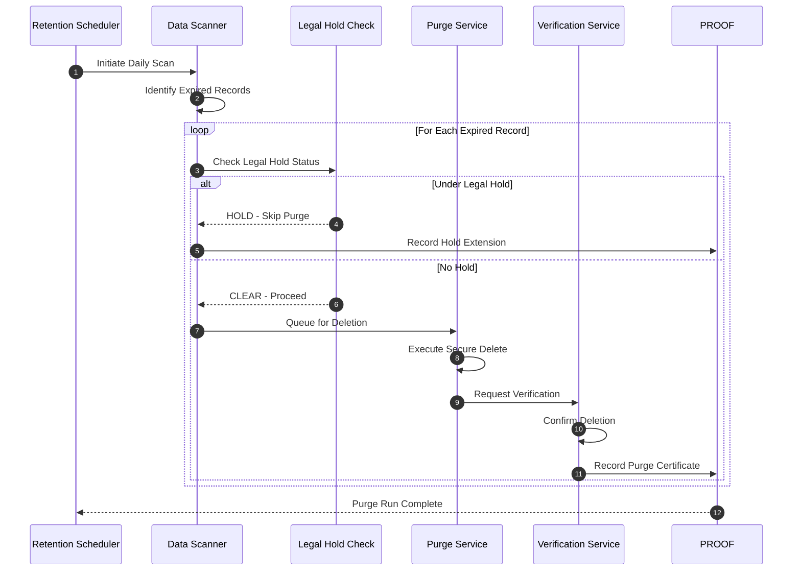

---

## 7. Data Subject Rights

### 7.1 Rights Implementation Matrix

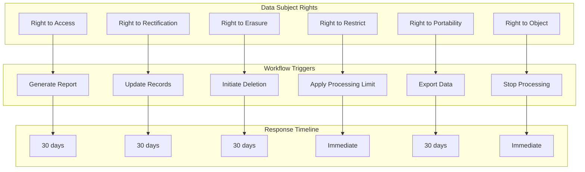

### 7.2 Data Subject Request Flow

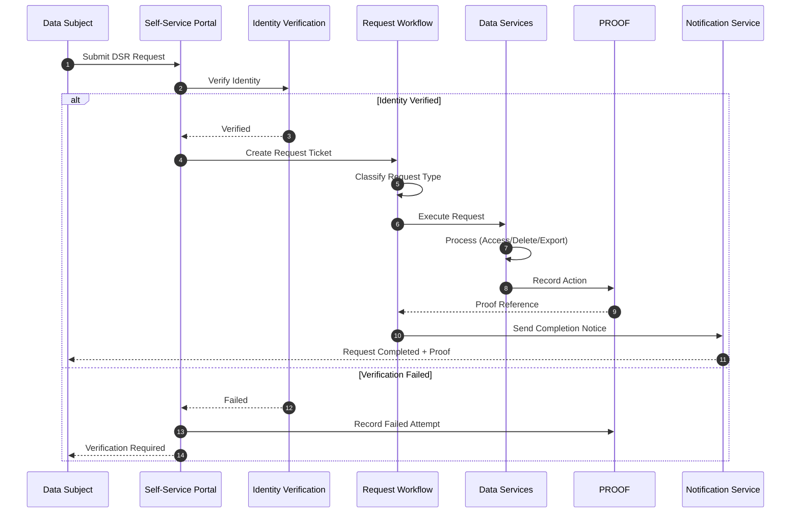

---

## 8. Encryption & Protection

### 8.1 Encryption Architecture

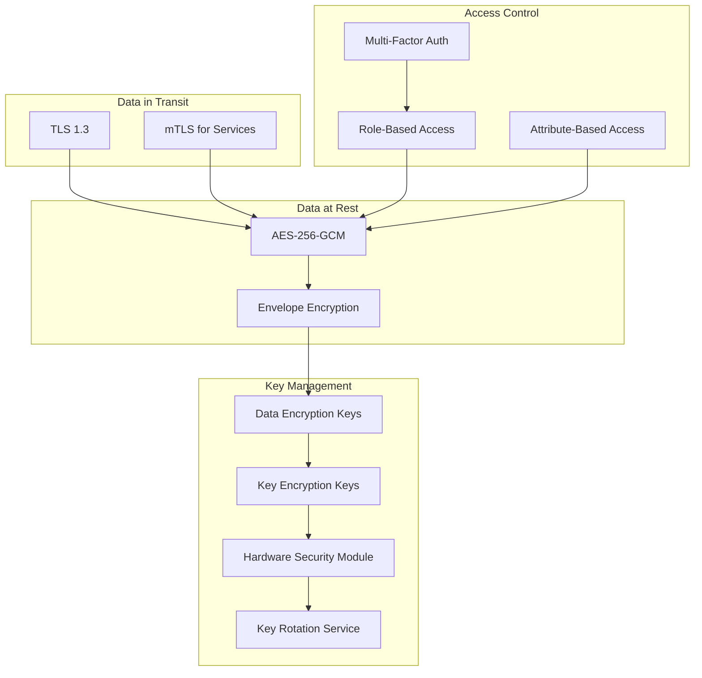

### 8.2 Encryption Standards

| Layer | Algorithm | Key Size | Rotation |
|-------|-----------|----------|----------|
| **Transport** | TLS 1.3 | 256-bit | Per session |
| **Application** | AES-256-GCM | 256-bit | 90 days |
| **Database** | AES-256-CBC | 256-bit | Annual |
| **Backup** | AES-256-GCM | 256-bit | Per backup |
| **Key Encryption** | RSA-4096 / ECDH P-384 | 4096/384-bit | Annual |

---

## 9. Privacy Impact Assessment Integration

### 9.1 PIA Trigger Flow

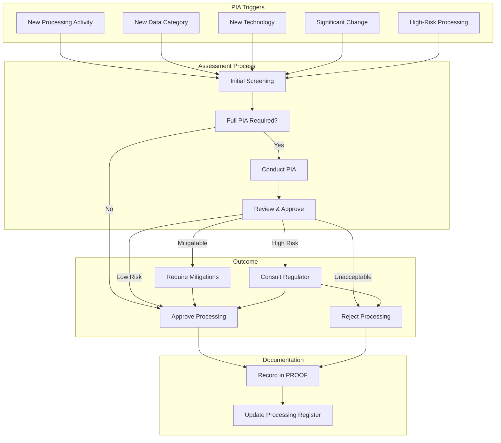

---

## 10. Compliance Evidence Generation

### 10.1 Evidence Types

| Evidence Type | Generated By | Frequency | Retention |
|---------------|--------------|-----------|-----------|
| **Access Logs** | All services | Real-time | 2 years |
| **Consent Records** | Consent service | On change | Duration + 5 years |
| **DSR Completion** | Workflow engine | Per request | 5 years |
| **Purge Certificates** | Purge service | Per purge | Permanent |
| **PIA Records** | Assessment tool | Per assessment | Permanent |
| **Transfer Records** | Transfer service | Per transfer | 5 years |
| **Breach Records** | Incident response | Per incident | Permanent |

### 10.2 Compliance Dashboard Metrics

```yaml
compliance_metrics:
  data_subject_requests:
    - metric: "DSR Response Time"
      target: "< 30 days"
      current: "avg 12 days"

    - metric: "DSR Completion Rate"
      target: "100%"
      current: "99.7%"

  consent_management:
    - metric: "Valid Consent Coverage"
      target: "100%"
      current: "100%"

    - metric: "Consent Refresh Rate"
      target: "Annual"
      current: "On schedule"

  data_retention:
    - metric: "Retention Policy Compliance"
      target: "100%"
      current: "99.9%"

    - metric: "Overdue Purge Items"
      target: "0"
      current: "3 (legal hold)"

  cross_border:
    - metric: "Transfers with Valid Mechanism"
      target: "100%"
      current: "100%"
```

---

## 11. Appendix

### 11.1 Glossary

| Term | Definition |
|------|------------|
| **Data Subject** | Individual whose personal data is processed |
| **DSR** | Data Subject Request |
| **PIA** | Privacy Impact Assessment |
| **SCCs** | Standard Contractual Clauses |
| **BCR** | Binding Corporate Rules |
| **Adequacy Decision** | EU determination that a country provides adequate protection |

### 11.2 Regulatory References

- GDPR (EU) 2016/679
- CCPA/CPRA (California)
- LGPD (Brazil)
- PIPL (China)
- POPIA (South Africa)

### 11.3 Related Documents

- 01_System_Governance_and_Authority_Model.pdf
- 03_Compliance_and_Regulatory_Mapping.pdf
- 04_Audit_Evidence_and_Forensics.pdf

---

*Vorion Confidential — 2026-01-08 — Expanded Data Governance Specification*
