# Risk, Trust & Autonomy Model

**Vorion / BASIS / Cognigate — Expanded Trust & Autonomy Specification**

**Version:** 1.1 (Expanded)
**Date:** 2026-01-08
**Classification:** Vorion Confidential

---

## 1. Executive Summary

Vorion implements an adaptive trust model where autonomy dynamically expands or contracts based on behavioral signals, policy conformance, and risk assessment. The system includes anti-gaming protections to prevent trust manipulation. All trust decisions are recorded in PROOF for audit and replay.

---

## 2. Trust Architecture Overview

### 2.1 Trust System Components

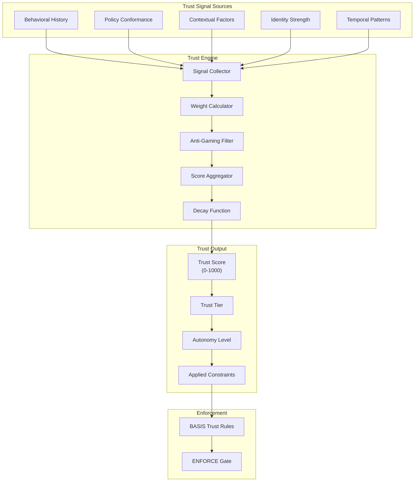

### 2.2 Trust Tier Definitions

| Tier | Score Range | Autonomy Level | Approval Required | Rate Limits |
|------|-------------|----------------|-------------------|-------------|
| **UNTRUSTED** | 0-199 | None | All actions | 10/hour |
| **PROBATION** | 200-399 | Minimal | Most actions | 50/hour |
| **STANDARD** | 400-599 | Normal | Elevated actions | 200/hour |
| **TRUSTED** | 600-799 | Extended | Critical only | 500/hour |
| **PRIVILEGED** | 800-1000 | Maximum | Emergency only | 1000/hour |

---

## 3. Trust Signal Collection

### 3.1 Signal Categories

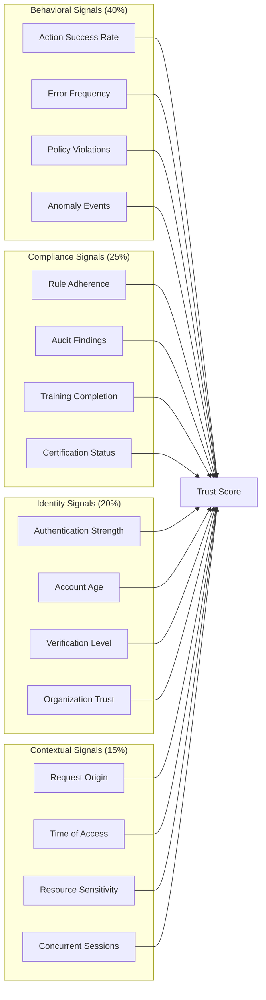

### 3.2 Signal Weight Configuration

```yaml
trust_signals:
  behavioral:
    weight: 0.40
    signals:
      action_success_rate:
        weight: 0.30
        lookback_days: 30
        minimum_actions: 10

      error_frequency:
        weight: 0.25
        lookback_days: 7
        threshold_per_day: 5

      policy_violations:
        weight: 0.30
        lookback_days: 90
        severity_multiplier:
          critical: 10
          high: 5
          medium: 2
          low: 1

      anomaly_events:
        weight: 0.15
        lookback_days: 14
        types: [unusual_location, unusual_time, unusual_volume]

  compliance:
    weight: 0.25
    signals:
      rule_adherence:
        weight: 0.40
        measurement: percentage_compliant_actions

      audit_findings:
        weight: 0.30
        lookback_months: 12
        finding_impact:
          critical: -100
          major: -50
          minor: -10

      training_completion:
        weight: 0.15
        required_courses: [security_basics, data_handling, policy_overview]

      certification_status:
        weight: 0.15
        valid_certs: [soc2_trained, gdpr_certified]

  identity:
    weight: 0.20
    signals:
      authentication_strength:
        weight: 0.35
        factors:
          password_only: 0.3
          mfa_sms: 0.6
          mfa_totp: 0.8
          mfa_hardware: 1.0

      account_age:
        weight: 0.25
        curve: logarithmic
        max_days: 365

      verification_level:
        weight: 0.25
        levels:
          email_only: 0.3
          phone_verified: 0.6
          id_verified: 0.9
          in_person: 1.0

      organization_trust:
        weight: 0.15
        inherit_percentage: 0.5

  contextual:
    weight: 0.15
    signals:
      request_origin:
        weight: 0.30
        known_ip_bonus: 0.2
        vpn_penalty: -0.1
        tor_penalty: -0.3

      time_of_access:
        weight: 0.25
        business_hours_bonus: 0.1
        off_hours_penalty: -0.05

      resource_sensitivity:
        weight: 0.25
        adjustment: inverse_to_sensitivity

      concurrent_sessions:
        weight: 0.20
        max_normal: 3
        penalty_per_excess: -0.1
```

---

## 4. Trust Score Calculation

### 4.1 Calculation Flow

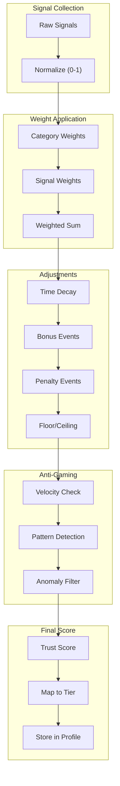

### 4.2 Score Calculation Formula

```
Base Score = Σ(Category_Weight × Σ(Signal_Weight × Normalized_Signal_Value))

Decay Factor = e^(-λ × days_since_last_positive_action)
  where λ = 0.01 (slow decay)

Adjusted Score = (Base Score × Decay Factor) + Bonuses - Penalties

Final Score = max(0, min(1000, Adjusted Score))
```

### 4.3 Trust Score Lifecycle

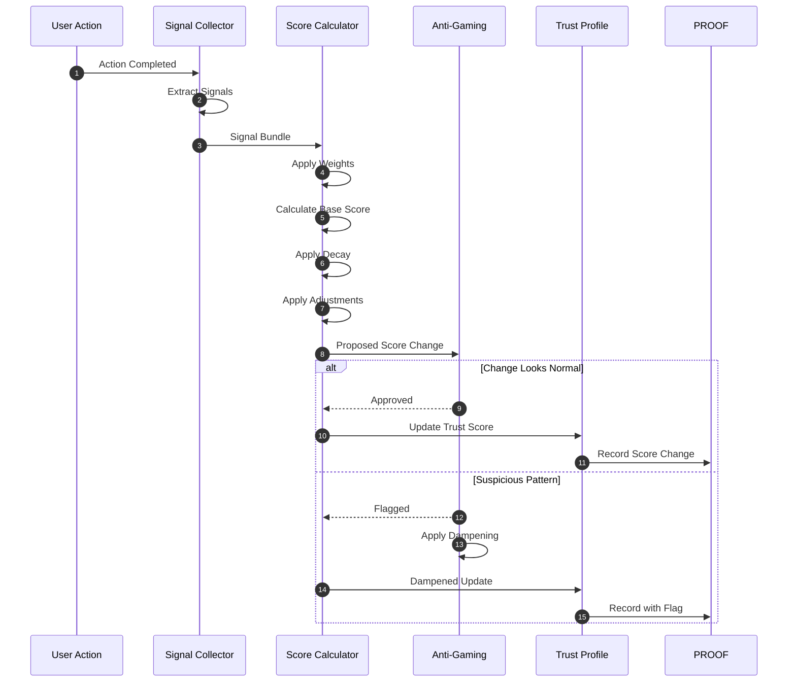

---

## 5. Autonomy Control

### 5.1 Autonomy Levels

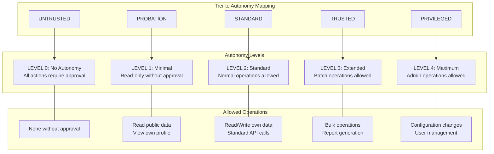

### 5.2 Dynamic Autonomy Adjustment

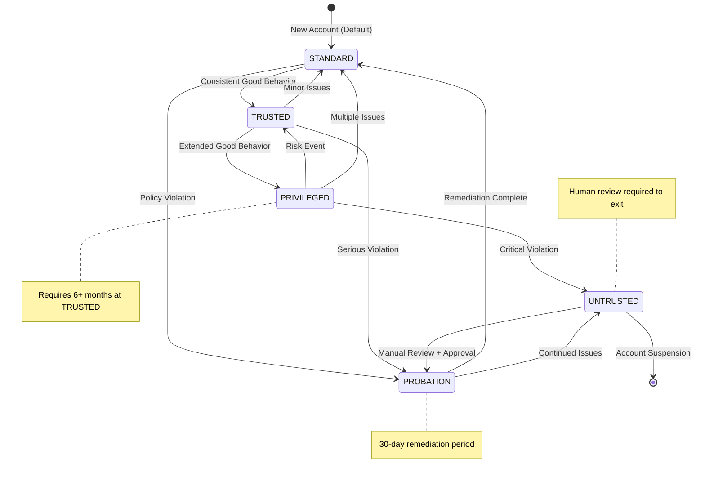

### 5.3 Autonomy Decision Matrix

| Operation Type | UNTRUSTED | PROBATION | STANDARD | TRUSTED | PRIVILEGED |
|----------------|-----------|-----------|----------|---------|------------|
| **Read Public** | Approve | Auto | Auto | Auto | Auto |
| **Read Own Data** | Approve | Auto | Auto | Auto | Auto |
| **Write Own Data** | Deny | Approve | Auto | Auto | Auto |
| **Read Others' Data** | Deny | Deny | Approve | Auto | Auto |
| **Bulk Read** | Deny | Deny | Approve | Auto | Auto |
| **Bulk Write** | Deny | Deny | Deny | Approve | Auto |
| **Config Change** | Deny | Deny | Deny | Approve | Auto |
| **User Management** | Deny | Deny | Deny | Deny | Approve |
| **System Admin** | Deny | Deny | Deny | Deny | Approve |

---

## 6. Anti-Gaming Protections

### 6.1 Gaming Attack Vectors

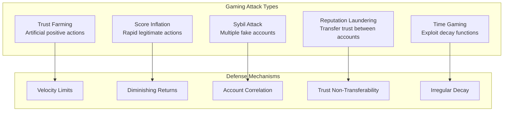

### 6.2 Anti-Gaming Rules

```yaml
anti_gaming_rules:
  velocity_limits:
    description: "Limit how fast trust can increase"
    max_daily_increase: 20
    max_weekly_increase: 50
    max_monthly_increase: 100
    cooldown_after_max: 24_hours

  diminishing_returns:
    description: "Reduce value of repeated similar actions"
    same_action_decay: 0.9  # Each repeat worth 90% of previous
    same_category_decay: 0.95
    reset_period_hours: 24

  anomaly_detection:
    description: "Detect unusual trust-building patterns"
    patterns:
      - sudden_activity_spike:
          threshold: 5x_normal
          action: flag_and_dampen

      - perfect_compliance:
          threshold: 100%_over_extended_period
          action: flag_for_review

      - coordinated_accounts:
          similarity_threshold: 0.8
          action: link_and_investigate

  score_dampening:
    description: "Apply friction to suspicious increases"
    flagged_account_multiplier: 0.5
    investigation_freeze: true
    appeal_process: manual_review

  non_transferability:
    description: "Prevent trust transfer between entities"
    account_merge_policy: lowest_score
    organization_change_policy: reset_to_standard
    delegation_inherits_trust: false
```

### 6.3 Gaming Detection Flow

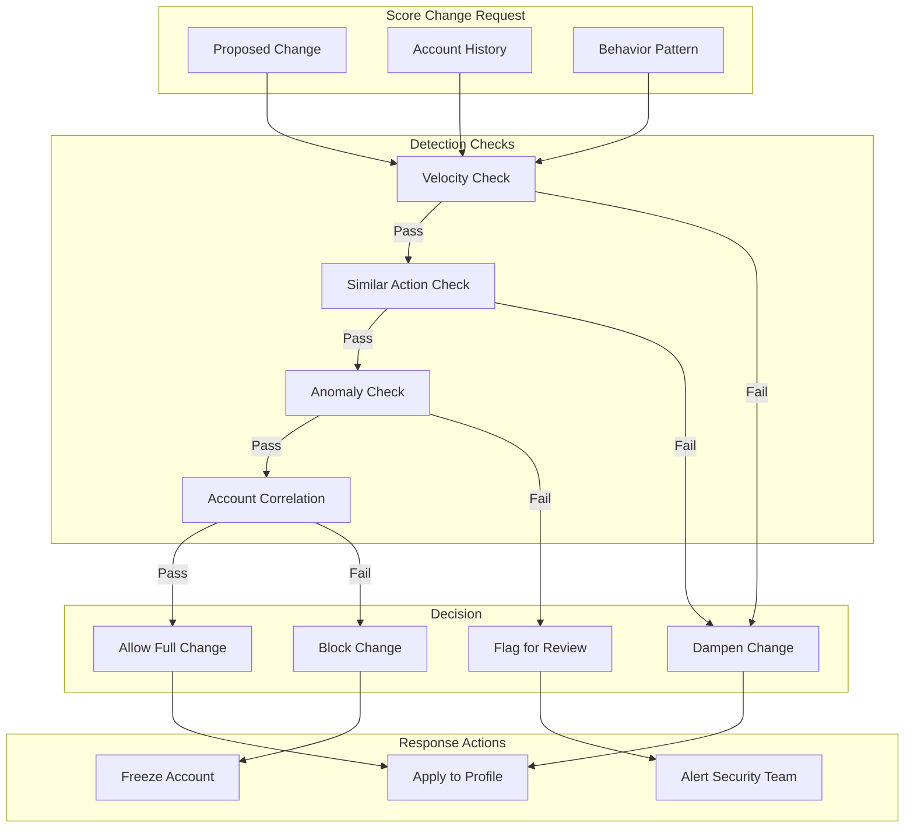

---

## 7. Risk Assessment Integration

### 7.1 Risk-Trust Matrix

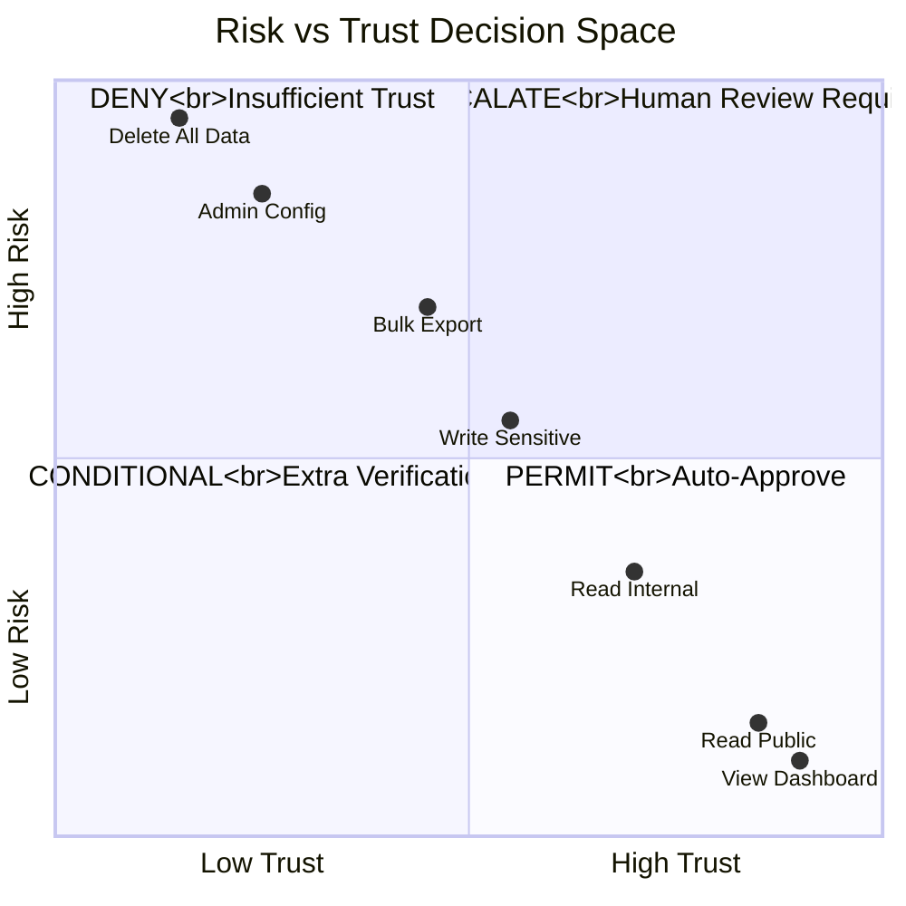

### 7.2 Risk Scoring Factors

| Factor | Weight | Low (0.0-0.3) | Medium (0.3-0.7) | High (0.7-1.0) |
|--------|--------|---------------|------------------|----------------|
| **Data Sensitivity** | 30% | Public data | Internal data | PII/Financial |
| **Operation Impact** | 25% | Read-only | Reversible write | Irreversible |
| **Blast Radius** | 20% | Single record | Multiple records | System-wide |
| **Regulatory Exposure** | 15% | None | Audit required | Compliance critical |
| **Historical Incidents** | 10% | None | Minor | Major |

### 7.3 Combined Risk-Trust Decision

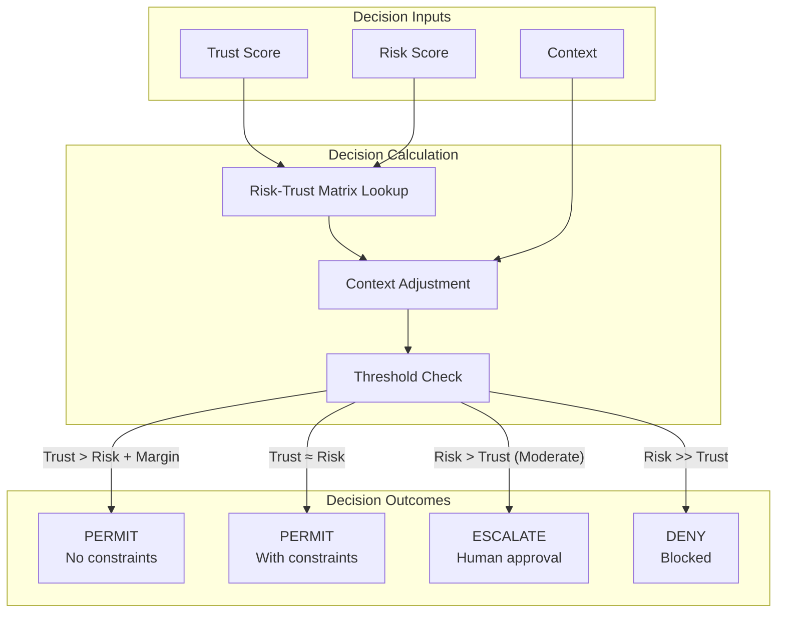

---

## 8. Trust Events & Triggers

### 8.1 Positive Trust Events

| Event | Score Impact | Cooldown | Max Daily |
|-------|--------------|----------|-----------|
| **Successful Operation** | +1 | None | 50 |
| **Security Training Completed** | +25 | 90 days | 1 |
| **MFA Enabled** | +50 | Once | 1 |
| **Clean Audit Period (30 days)** | +10 | 30 days | 1 |
| **Verified Identity Upgrade** | +30 | Once per level | 1 |
| **Reported Security Issue** | +20 | 7 days | 3 |

### 8.2 Negative Trust Events

| Event | Score Impact | Recovery | Escalation |
|-------|--------------|----------|------------|
| **Failed Authentication** | -5 | 24 hours | After 5x |
| **Policy Violation (Minor)** | -20 | 7 days | After 3x |
| **Policy Violation (Major)** | -100 | 30 days | Immediate |
| **Anomaly Detected** | -30 | Investigation | Review |
| **Rate Limit Exceeded** | -10 | 1 hour | After 10x |
| **Unauthorized Access Attempt** | -50 | 14 days | Immediate |
| **Data Breach Involvement** | -200 | Manual review | Immediate |

### 8.3 Trust Event Flow

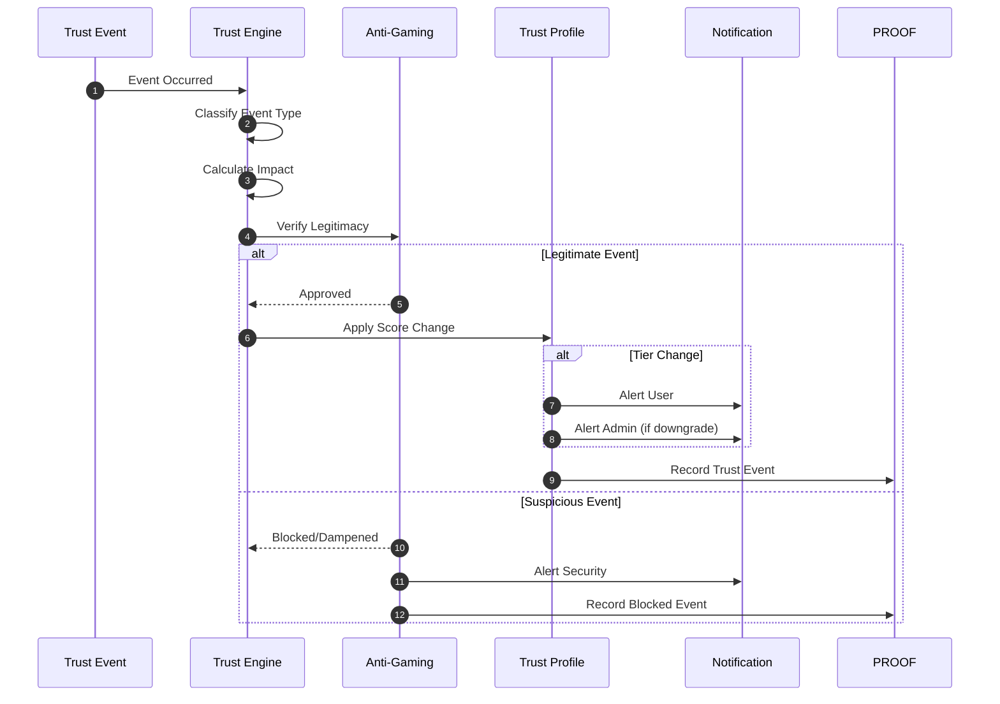

---

## 9. Human Override & Appeals

### 9.1 Override Authority Levels

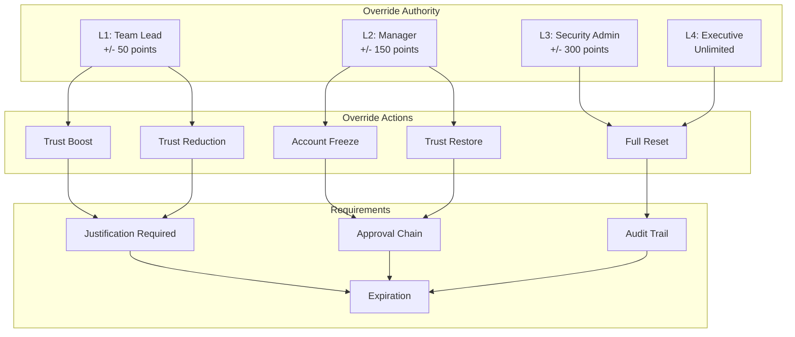

### 9.2 Appeal Process

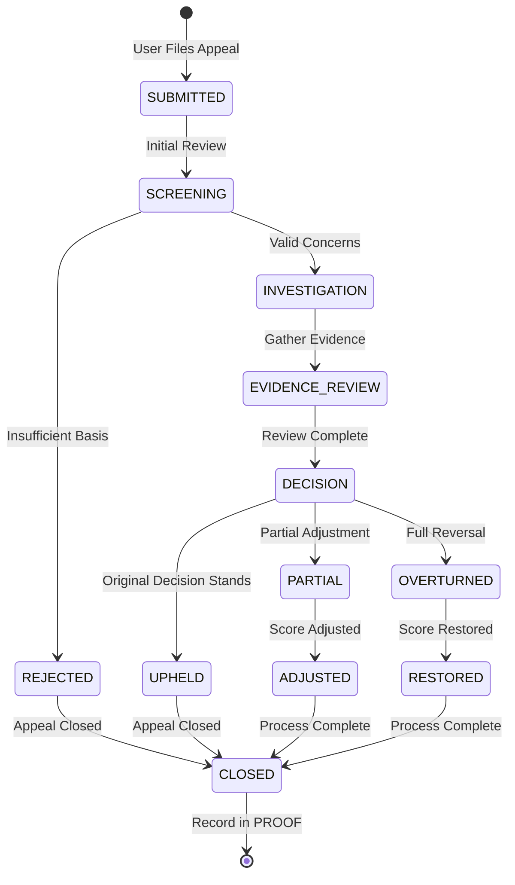

---

## 10. Monitoring & Reporting

### 10.1 Trust Metrics Dashboard

```yaml
trust_metrics:
  population_health:
    - metric: "Trust Distribution"
      breakdown: by_tier
      alert_if: untrusted > 5%

    - metric: "Average Trust Score"
      target: "> 500"
      trend: weekly

    - metric: "Trust Volatility"
      measurement: std_deviation
      alert_if: "> 100"

  movement_metrics:
    - metric: "Daily Upgrades"
      count: tier_increases
      benchmark: historical_average

    - metric: "Daily Downgrades"
      count: tier_decreases
      alert_if: "> 2x normal"

    - metric: "Autonomy Utilization"
      measurement: auto_approved_percentage

  security_metrics:
    - metric: "Gaming Attempts Blocked"
      count: anti_gaming_triggers
      trend: daily

    - metric: "Appeals Filed"
      count: active_appeals
      sla: "< 5 days resolution"

    - metric: "Override Usage"
      count: manual_overrides
      audit: monthly_review
```

---

## 11. Appendix

### 11.1 Trust Score Examples

| Scenario | Starting Score | Event | Ending Score | Tier |
|----------|---------------|-------|--------------|------|
| New user | 400 | Account created | 400 | STANDARD |
| MFA enabled | 400 | +50 bonus | 450 | STANDARD |
| 30 days clean | 450 | +10 bonus | 460 | STANDARD |
| Minor violation | 460 | -20 penalty | 440 | STANDARD |
| Major violation | 440 | -100 penalty | 340 | PROBATION |
| Remediation | 340 | +60 over 30 days | 400 | STANDARD |

### 11.2 Related Documents

- 01_System_Governance_and_Authority_Model.pdf
- 02_Security_Architecture_and_Threat_Model.pdf
- 07_Incident_Response_and_Resilience.pdf
- 08_Technical_Architecture_and_Flow.pdf

---

*Vorion Confidential — 2026-01-08 — Expanded Trust & Autonomy Specification*
