# Incident Response & Operational Resilience

**Vorion / BASIS / Cognigate — Expanded Incident Response Specification**

**Version:** 1.1 (Expanded)
**Date:** 2026-01-08
**Classification:** Vorion Confidential

---

## 1. Executive Summary

Vorion implements a structured incident response framework with detection, escalation, containment, and recovery procedures. Operational resilience is achieved through redundancy, deterministic replay-based recovery, and continuous monitoring. All incident actions are recorded in PROOF for forensic reconstruction.

---

## 2. Incident Response Architecture

### 2.1 Incident Response System Overview

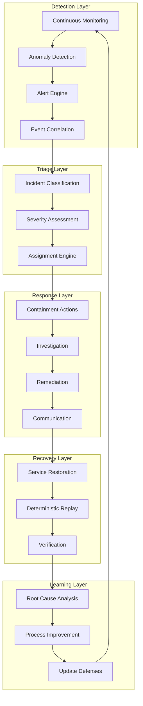

### 2.2 Incident Response Team Structure

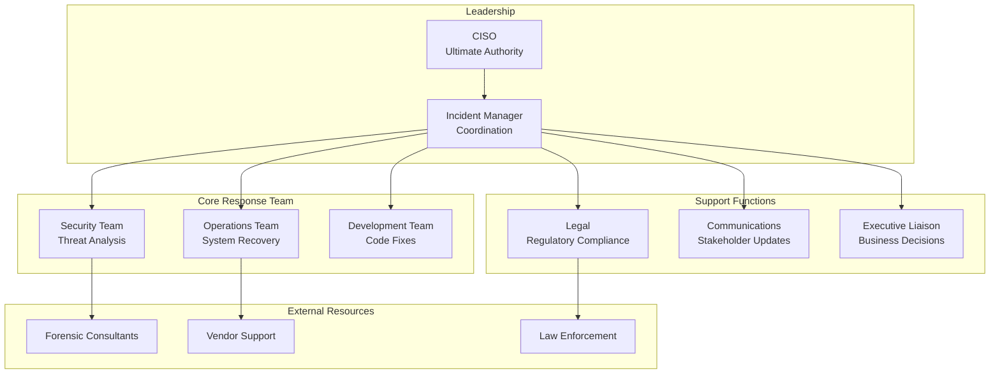

---

## 3. Detection & Alerting

### 3.1 Detection Sources

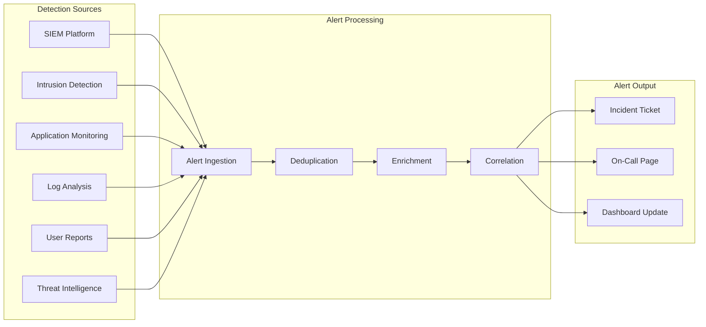

### 3.2 Alert Severity Matrix

| Severity | Response Time | Escalation | Examples |
|----------|--------------|------------|----------|
| **P1 - Critical** | 15 minutes | Immediate to CISO | Active breach, data exfiltration, system compromise |
| **P2 - High** | 1 hour | 2 hours to management | Attempted breach, privilege escalation, policy bypass |
| **P3 - Medium** | 4 hours | 24 hours if unresolved | Anomaly detection, failed auth spike, unusual access |
| **P4 - Low** | 24 hours | Weekly review | Policy violation (minor), configuration drift |
| **P5 - Info** | Best effort | None | Security event logging, audit findings |

### 3.3 Detection Rules Configuration

```yaml
detection_rules:
  authentication:
    - rule: failed_auth_spike
      description: "Multiple failed authentication attempts"
      condition: "failed_auth > 10 in 5 minutes from same source"
      severity: P3
      action: alert_and_block_source

    - rule: impossible_travel
      description: "Login from geographically impossible location"
      condition: "login_distance / time_delta > 500 mph"
      severity: P2
      action: alert_and_require_verification

  data_access:
    - rule: bulk_data_export
      description: "Unusual volume of data export"
      condition: "export_volume > 10x baseline in 1 hour"
      severity: P2
      action: alert_and_pause_export

    - rule: sensitive_data_access
      description: "Access to restricted data category"
      condition: "data_classification == RESTRICTED && !approved_access"
      severity: P1
      action: alert_and_block_immediate

  system:
    - rule: config_change_unauthorized
      description: "Configuration change outside change window"
      condition: "config_change && !change_ticket && !emergency_flag"
      severity: P3
      action: alert_and_rollback

    - rule: service_degradation
      description: "Service performance degradation"
      condition: "error_rate > 5% || latency_p99 > 2x baseline"
      severity: P3
      action: alert_ops_team
```

---

## 4. Incident Classification

### 4.1 Incident Categories

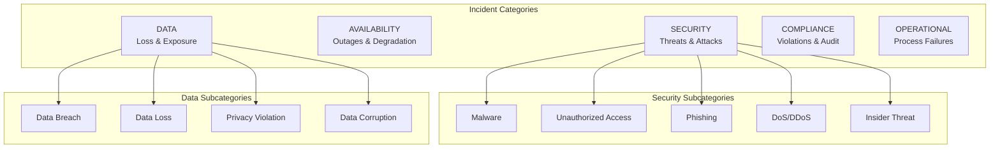

### 4.2 Classification Decision Tree

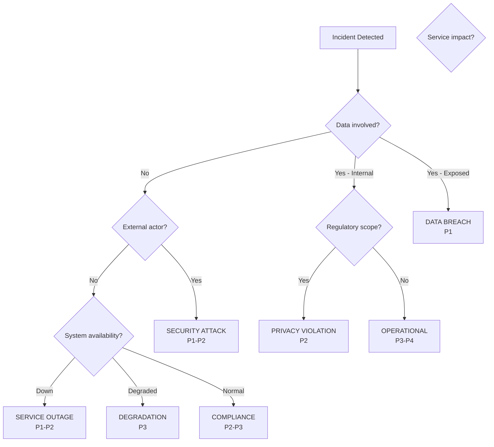

---

## 5. Escalation Procedures

### 5.1 Escalation Matrix

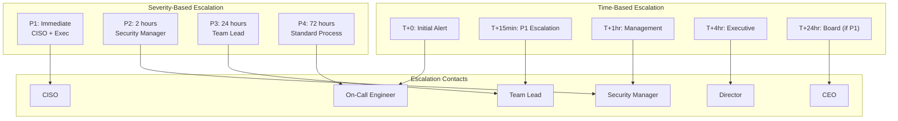

### 5.2 Escalation Flow

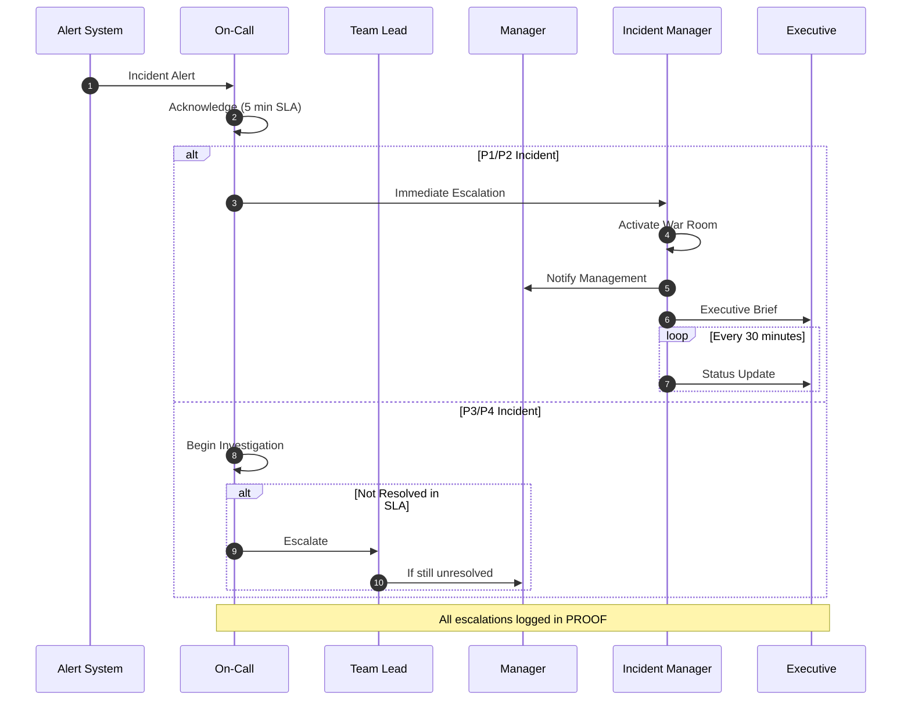

---

## 6. Containment Strategies

### 6.1 Containment Actions by Incident Type

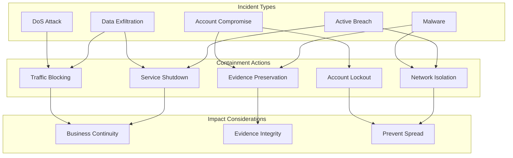

### 6.2 Automated Containment Rules

```yaml
automated_containment:
  account_compromise:
    triggers:
      - impossible_travel_detected
      - credential_stuffing_pattern
      - privilege_escalation_attempt
    actions:
      - action: disable_account
        immediate: true
        reversible: true
      - action: revoke_sessions
        immediate: true
      - action: require_password_reset
        on_reactivation: true
    notification:
      - security_team
      - account_owner
      - account_manager

  data_exfiltration:
    triggers:
      - bulk_export_threshold_exceeded
      - sensitive_data_egress_detected
      - unusual_api_data_volume
    actions:
      - action: block_egress
        immediate: true
        scope: source_account
      - action: pause_integration
        if: integration_involved
      - action: preserve_logs
        retention: 90_days
    notification:
      - security_team
      - data_protection_officer
      - legal_team

  service_attack:
    triggers:
      - ddos_traffic_pattern
      - application_layer_attack
      - resource_exhaustion
    actions:
      - action: enable_rate_limiting
        level: aggressive
      - action: activate_ddos_protection
        provider: cloudflare
      - action: scale_infrastructure
        if: legitimate_traffic_impacted
    notification:
      - ops_team
      - security_team
```

### 6.3 Containment Decision Matrix

| Incident Type | Immediate Action | Business Impact | Approval Required |
|---------------|-----------------|-----------------|-------------------|
| **Active Breach** | Isolate affected systems | High | No - Act immediately |
| **Account Compromise** | Lock account, revoke sessions | Medium | No - Standard procedure |
| **Malware Detected** | Quarantine endpoint | Medium | No - Standard procedure |
| **Data Exfiltration** | Block egress, preserve evidence | High | P1: No, P2+: Manager |
| **DoS Attack** | Enable protection, rate limit | Variable | No - Automated |
| **Insider Threat** | Suspend access, preserve evidence | High | Legal + HR approval |

---

## 7. Investigation Process

### 7.1 Investigation Workflow

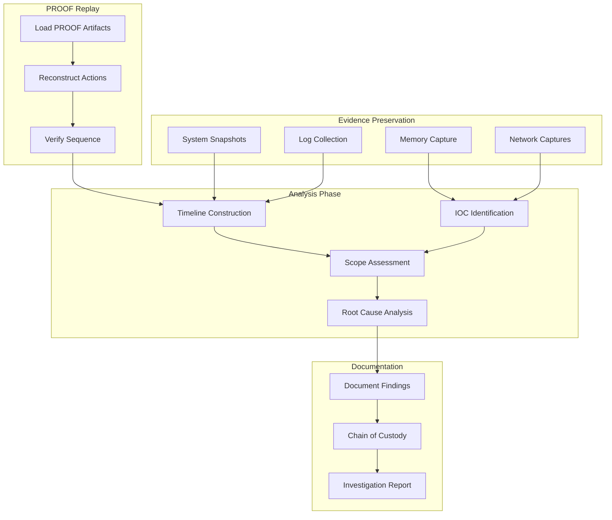

### 7.2 Evidence Collection Checklist

```yaml
evidence_collection:
  immediate_priority:
    - item: "Volatile memory dump"
      method: "Memory forensics tool"
      retention: "Until investigation complete"

    - item: "Active network connections"
      method: "netstat capture"
      retention: "90 days"

    - item: "Running processes"
      method: "Process listing with hashes"
      retention: "90 days"

  standard_collection:
    - item: "System logs"
      sources: ["auth.log", "syslog", "application logs"]
      timeframe: "72 hours before incident"

    - item: "PROOF artifacts"
      sources: ["All related execution records"]
      timeframe: "7 days before incident"

    - item: "Network flow data"
      sources: ["Firewall logs", "DNS logs", "Proxy logs"]
      timeframe: "48 hours before incident"

    - item: "User activity"
      sources: ["Access logs", "Action logs"]
      timeframe: "30 days before incident"

  chain_of_custody:
    requirements:
      - hash_all_evidence: SHA-256
      - document_collection_time: true
      - document_collector_identity: true
      - secure_storage: encrypted_vault
      - access_logging: mandatory
```

### 7.3 Deterministic Replay for Investigation

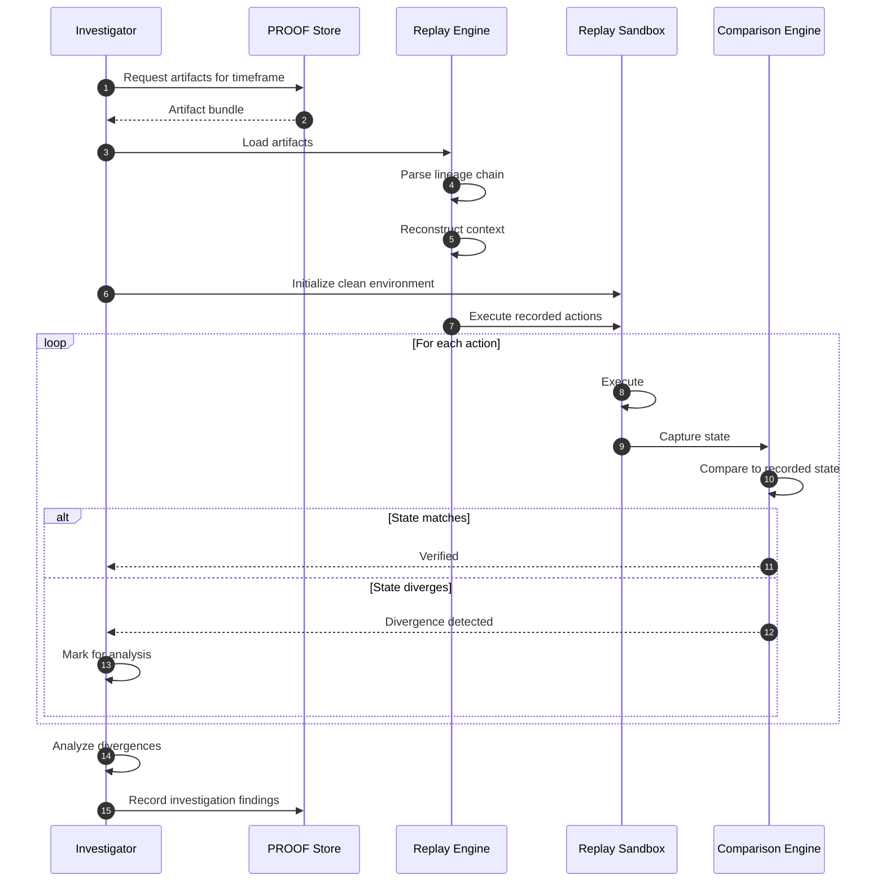

---

## 8. Recovery Procedures

### 8.1 Recovery Strategy Selection

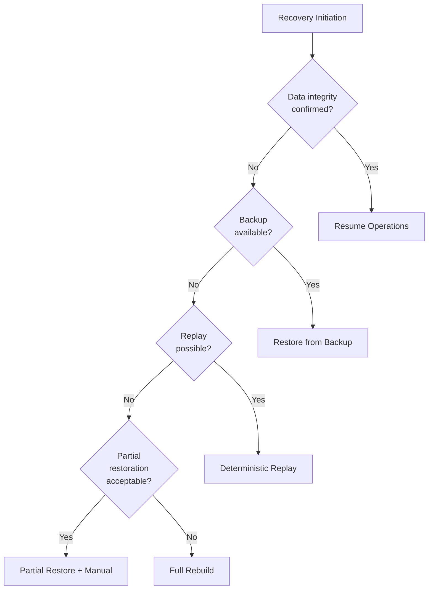

### 8.2 Recovery Procedures by Type

| Recovery Type | Use Case | RTO | RPO | Procedure |
|---------------|----------|-----|-----|-----------|
| **Hot Failover** | Infrastructure failure | < 5 min | 0 | Automatic failover to standby |
| **Backup Restore** | Data corruption | < 4 hours | Last backup | Restore from verified backup |
| **Deterministic Replay** | Targeted recovery | Variable | Transaction-level | Replay PROOF artifacts |
| **Partial Restore** | Limited damage | < 8 hours | Mixed | Selective recovery |
| **Full Rebuild** | Catastrophic | < 24 hours | Last backup | Complete environment rebuild |

### 8.3 Replay-Based Recovery Flow

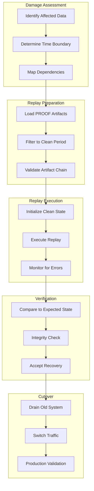

---

## 9. Communication Plan

### 9.1 Stakeholder Communication Matrix

| Stakeholder | P1 Notification | P2 Notification | Update Frequency | Channel |
|-------------|----------------|-----------------|------------------|---------|
| **Executive Team** | Immediate | 2 hours | Every 30 min (P1) | Phone + Email |
| **Board** | 4 hours (if breach) | N/A | Daily summary | Secure portal |
| **Affected Customers** | 24 hours (if required) | N/A | As required | Email + Portal |
| **Regulators** | Per regulation | Per regulation | As required | Official channels |
| **Internal Teams** | 30 minutes | 4 hours | Hourly | Slack + Email |
| **Media** | Via PR only | N/A | As needed | Press release |

### 9.2 Communication Templates

```yaml
communication_templates:
  internal_alert:
    subject: "[{severity}] Security Incident - {incident_id}"
    body: |
      INCIDENT ALERT

      Severity: {severity}
      Type: {incident_type}
      Status: {status}

      Summary: {brief_description}

      Impact: {impact_assessment}

      Actions Required: {required_actions}

      War Room: {war_room_link}

      Next Update: {next_update_time}

  customer_notification:
    subject: "Security Notice - Action May Be Required"
    body: |
      Dear {customer_name},

      We are writing to inform you of a security incident that may affect your account.

      What Happened: {what_happened}

      What Information Was Involved: {data_involved}

      What We Are Doing: {our_actions}

      What You Can Do: {recommended_actions}

      For More Information: {contact_info}

  regulatory_notification:
    subject: "Data Breach Notification - {company_name}"
    body: |
      Pursuant to {regulation}, we are notifying you of a data breach.

      Date of Discovery: {discovery_date}
      Date of Incident: {incident_date}

      Nature of Breach: {breach_description}

      Categories of Data: {data_categories}

      Number of Affected Individuals: {affected_count}

      Measures Taken: {remediation_measures}

      Contact: {dpo_contact}
```

---

## 10. Resilience Architecture

### 10.1 Redundancy Model

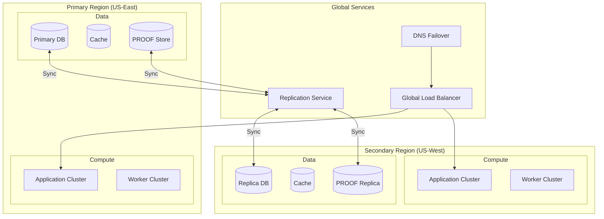

### 10.2 Resilience Metrics

| Metric | Target | Measurement |
|--------|--------|-------------|
| **Availability** | 99.99% | Uptime monitoring |
| **RTO (Recovery Time)** | < 4 hours | Incident to recovery |
| **RPO (Recovery Point)** | < 1 hour | Data loss window |
| **MTTR (Mean Time to Repair)** | < 2 hours | Detection to resolution |
| **Failover Time** | < 5 minutes | Primary to secondary |

### 10.3 Chaos Engineering

```yaml
chaos_engineering:
  scheduled_tests:
    - test: "Region Failover"
      frequency: quarterly
      procedure: "Simulate primary region failure"
      success_criteria: "< 5 minute failover, no data loss"

    - test: "Database Failover"
      frequency: monthly
      procedure: "Force primary DB failure"
      success_criteria: "< 30 second failover"

    - test: "Service Degradation"
      frequency: weekly
      procedure: "Inject latency into critical path"
      success_criteria: "Graceful degradation, alerts fire"

  game_days:
    frequency: bi-annual
    scope: "Full incident simulation"
    includes:
      - detection_validation
      - escalation_procedures
      - communication_effectiveness
      - recovery_procedures
      - post_incident_review
```

---

## 11. Post-Incident Activities

### 11.1 Post-Incident Review Process

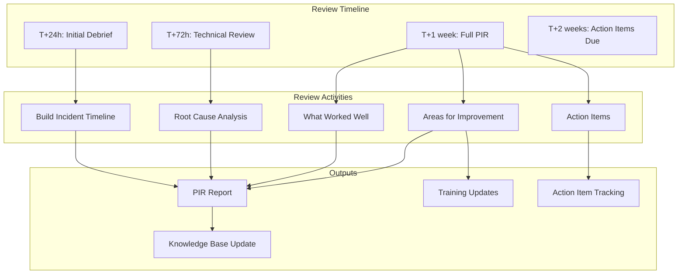

### 11.2 PIR Template

```yaml
post_incident_review:
  incident_summary:
    id: "{incident_id}"
    severity: "{severity}"
    duration: "{start_time} to {end_time}"
    impact: "{impact_description}"

  timeline:
    - time: "{timestamp}"
      event: "{event_description}"
      actor: "{person_or_system}"
    # ... additional timeline entries

  root_cause:
    primary: "{primary_root_cause}"
    contributing_factors:
      - "{factor_1}"
      - "{factor_2}"

  impact_assessment:
    customers_affected: "{count}"
    data_exposed: "{yes_no_description}"
    financial_impact: "{estimate}"
    reputation_impact: "{assessment}"

  response_evaluation:
    detection_time: "{time_to_detect}"
    response_time: "{time_to_respond}"
    resolution_time: "{time_to_resolve}"
    what_worked:
      - "{positive_1}"
    what_didnt:
      - "{negative_1}"

  action_items:
    - id: "{action_id}"
      description: "{action_description}"
      owner: "{owner}"
      due_date: "{date}"
      priority: "{priority}"
```

---

## 12. Appendix

### 12.1 Incident Response Checklist

- [ ] Incident detected and classified
- [ ] Severity assigned
- [ ] Incident Manager assigned
- [ ] War room activated (P1/P2)
- [ ] Containment actions executed
- [ ] Evidence preserved
- [ ] Stakeholders notified
- [ ] Investigation initiated
- [ ] Root cause identified
- [ ] Remediation implemented
- [ ] Recovery completed
- [ ] Service verified
- [ ] Post-incident review scheduled
- [ ] Action items assigned
- [ ] PROOF records complete

### 12.2 Related Documents

- 02_Security_Architecture_and_Threat_Model.pdf
- 04_Audit_Evidence_and_Forensics.pdf
- 06_Risk_Trust_and_Autonomy_Model.pdf
- 08_Technical_Architecture_and_Flow.pdf

---

*Vorion Confidential — 2026-01-08 — Expanded Incident Response Specification*
