# Technical Architecture & Execution Flow

**Vorion / BASIS / Cognigate — Expanded Technical Specification**

**Version:** 1.1 (Expanded)
**Date:** 2026-01-08
**Classification:** Vorion Confidential

---

## 1. Executive Summary

The Vorion execution architecture implements a deterministic, auditable pipeline where every request flows through three mandatory stages: **INTENT** (normalization), **ENFORCE** (validation), and **PROOF** (evidence). No execution occurs without passing all gates. All failures are deterministic and reconstructable.

---

## 2. Core Architecture

### 2.1 High-Level System Flow

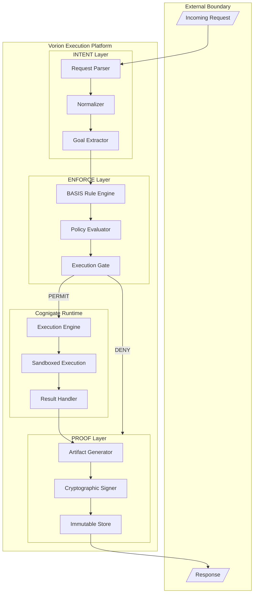

### 2.2 Component Responsibilities

| Component | Layer | Responsibility | Authority |
|-----------|-------|----------------|-----------|
| **Request Parser** | INTENT | Parse and validate request format | None - read only |
| **Normalizer** | INTENT | Canonicalize request to standard form | None - transformation only |
| **Goal Extractor** | INTENT | Identify intent without authority | None - interpretation only |
| **BASIS Rule Engine** | ENFORCE | Load and evaluate policy rules | Rule evaluation only |
| **Policy Evaluator** | ENFORCE | Apply contextual constraints | Constraint checking only |
| **Execution Gate** | ENFORCE | Binary PERMIT/DENY decision | Gate control only |
| **Execution Engine** | Cognigate | Execute permitted operations | Scoped execution |
| **Sandboxed Execution** | Cognigate | Isolated runtime environment | Contained authority |
| **Result Handler** | Cognigate | Process execution outcomes | Result formatting |
| **Artifact Generator** | PROOF | Create canonical proof records | Evidence creation |
| **Cryptographic Signer** | PROOF | Sign artifacts for integrity | Signing authority |
| **Immutable Store** | PROOF | Persist evidence permanently | Write-once storage |

---

## 3. Execution Lifecycle

### 3.1 Request Processing Sequence

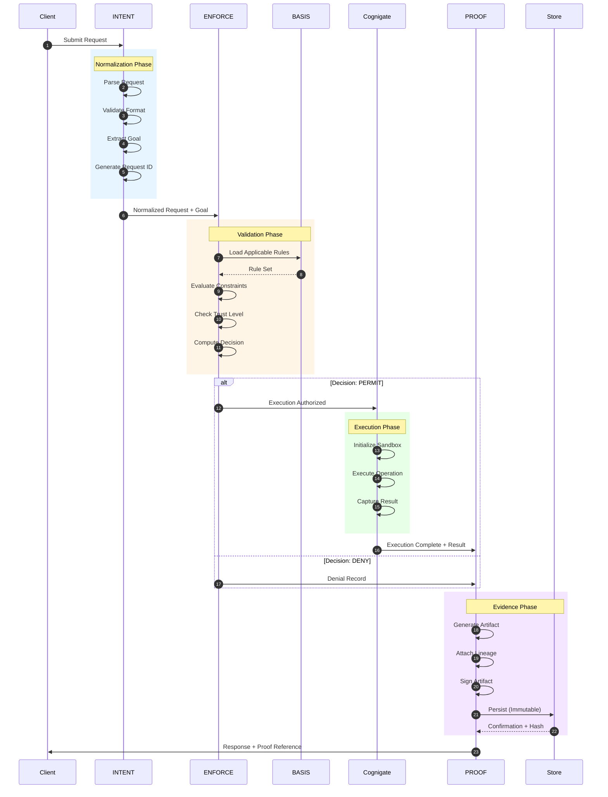

### 3.2 State Transitions

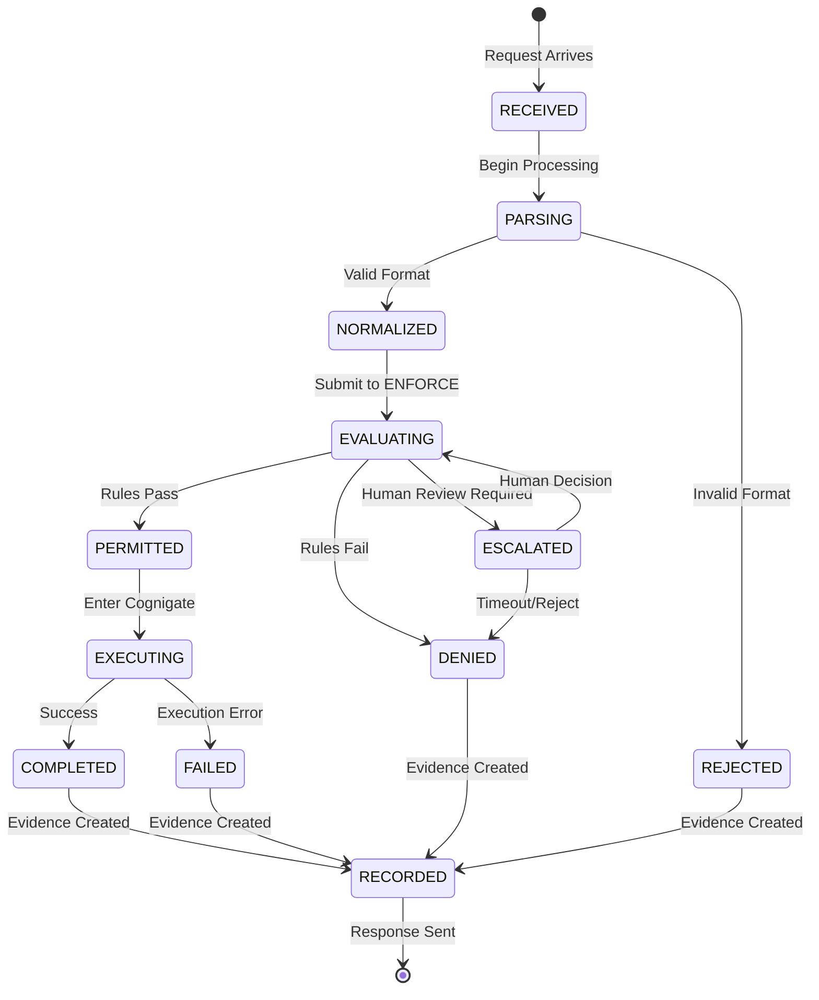

---

## 4. INTENT Layer Detail

### 4.1 Request Normalization Pipeline

```mermaid
flowchart LR
    subgraph Input["Raw Input"]
        RAW["Raw Request"]
    end

    subgraph Parsing["Parsing Stage"]
        SCHEMA["Schema Validation"]
        AUTH["Auth Extraction"]
        META["Metadata Capture"]
    end

    subgraph Normalization["Normalization Stage"]
        CANON["Canonicalization"]
        DEDUP["Deduplication Check"]
        ENRICH["Context Enrichment"]
    end

    subgraph Goal["Goal Extraction"]
        CLASSIFY["Intent Classification"]
        SCOPE["Scope Determination"]
        RISK["Risk Annotation"]
    end

    subgraph Output["Normalized Output"]
        NREQ["Normalized Request"]
    end

    RAW --> SCHEMA
    SCHEMA --> AUTH
    AUTH --> META
    META --> CANON
    CANON --> DEDUP
    DEDUP --> ENRICH
    ENRICH --> CLASSIFY
    CLASSIFY --> SCOPE
    SCOPE --> RISK
    RISK --> NREQ
```

### 4.2 Goal Classification Categories

| Category | Description | Risk Level | Requires |
|----------|-------------|------------|----------|
| **READ** | Data retrieval, no mutation | Low | Basic auth |
| **WRITE** | Data creation/modification | Medium | Elevated auth |
| **DELETE** | Data removal | High | Explicit approval |
| **EXECUTE** | Action execution | Variable | Context-dependent |
| **ADMIN** | System configuration | Critical | Human approval |
| **OVERRIDE** | Policy exception | Critical | Multi-party approval |

---

## 5. ENFORCE Layer Detail

### 5.1 BASIS Rule Evaluation

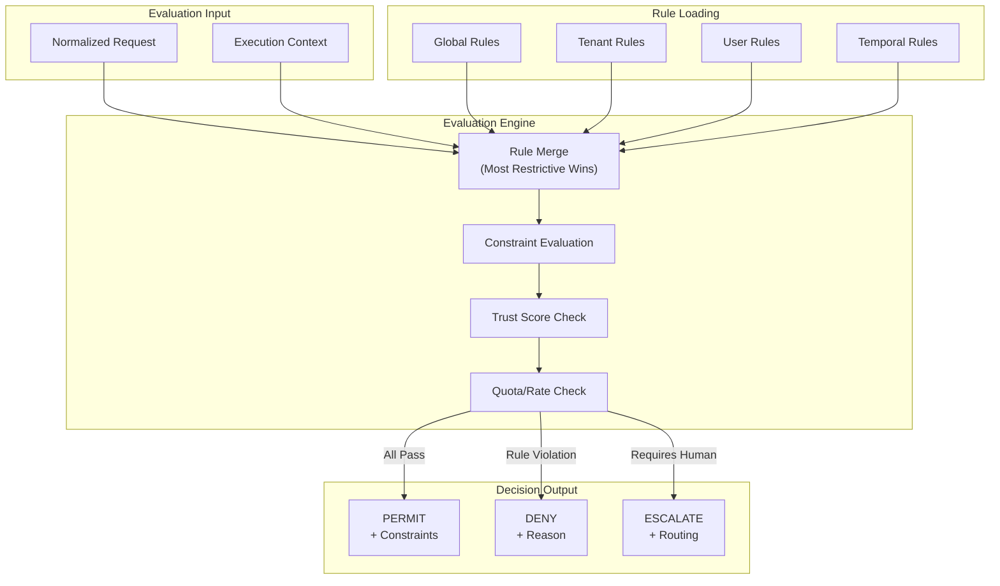

### 5.2 Decision Matrix

```mermaid
quadrantChart
    title Enforcement Decision Matrix
    x-axis Low Trust --> High Trust
    y-axis Low Risk --> High Risk
    quadrant-1 ESCALATE
    quadrant-2 DENY
    quadrant-3 PERMIT (Constrained)
    quadrant-4 PERMIT (Full)

    "Admin Override": [0.2, 0.9]
    "Delete Production": [0.3, 0.85]
    "Write Sensitive": [0.5, 0.6]
    "Read Internal": [0.6, 0.4]
    "Read Public": [0.8, 0.2]
    "System Health": [0.9, 0.1]
```

---

## 6. Cognigate Runtime Detail

### 6.1 Sandboxed Execution Model

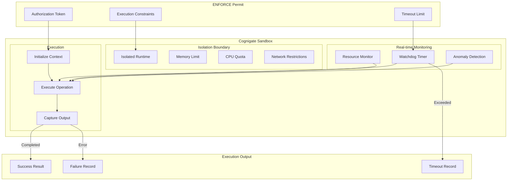

### 6.2 Execution Constraints Schema

```yaml
execution_constraints:
  resource_limits:
    max_memory_mb: 512
    max_cpu_seconds: 30
    max_network_calls: 100
    max_storage_bytes: 10485760

  access_scope:
    allowed_operations: [read, write]
    denied_operations: [delete, admin]
    data_scope: tenant_only

  temporal:
    timeout_seconds: 60
    valid_from: "2026-01-08T00:00:00Z"
    valid_until: "2026-01-08T23:59:59Z"

  audit:
    log_level: detailed
    capture_io: true
    retain_days: 90
```

---

## 7. PROOF Layer Detail

### 7.1 Artifact Generation

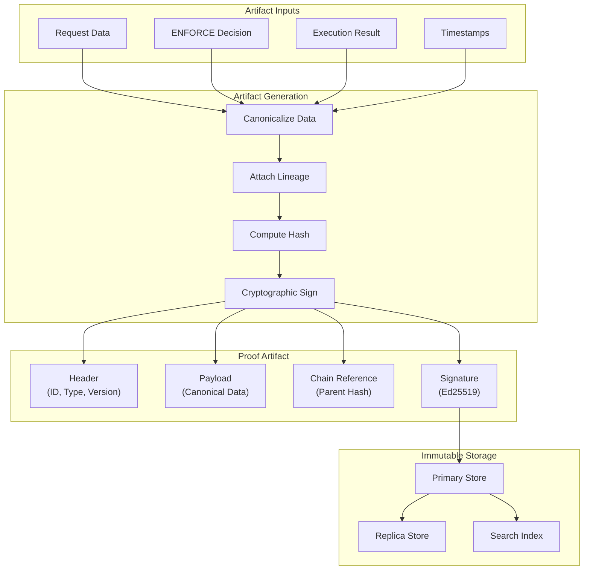

### 7.2 Proof Artifact Schema

```json
{
  "artifact": {
    "id": "proof-2026-01-08-a1b2c3d4",
    "version": "1.0",
    "type": "execution_record",
    "timestamp": "2026-01-08T14:30:00.000Z"
  },
  "lineage": {
    "parent_hash": "sha256:abc123...",
    "request_id": "req-xyz789",
    "session_id": "sess-456def",
    "tenant_id": "tenant-acme"
  },
  "request": {
    "normalized_form": "...",
    "goal_classification": "WRITE",
    "risk_level": "MEDIUM"
  },
  "decision": {
    "result": "PERMIT",
    "rules_evaluated": ["global-001", "tenant-acme-005"],
    "constraints_applied": ["max_records:1000"]
  },
  "execution": {
    "status": "COMPLETED",
    "duration_ms": 234,
    "resources_used": {
      "memory_mb": 128,
      "cpu_ms": 45
    },
    "output_hash": "sha256:def456..."
  },
  "signature": {
    "algorithm": "Ed25519",
    "key_id": "vorion-proof-key-2026",
    "value": "base64:..."
  }
}
```

---

## 8. Failure Paths

### 8.1 Failure Classification

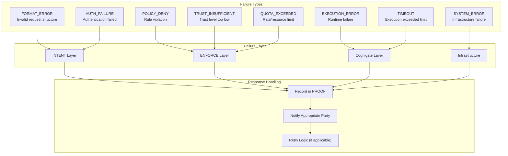

### 8.2 Failure Response Matrix

| Failure Type | HTTP Code | Retry | Escalate | Evidence |
|--------------|-----------|-------|----------|----------|
| FORMAT_ERROR | 400 | No | No | Minimal |
| AUTH_FAILURE | 401 | No | After 3x | Full |
| POLICY_DENY | 403 | No | Optional | Full |
| TRUST_INSUFFICIENT | 403 | No | Yes | Full |
| QUOTA_EXCEEDED | 429 | Yes (backoff) | After limit | Full |
| EXECUTION_ERROR | 500 | Yes (1x) | Yes | Full + Debug |
| TIMEOUT | 504 | Yes (1x) | After 2x | Full |
| SYSTEM_ERROR | 503 | Yes (backoff) | Yes | Full + Alert |

---

## 9. Deterministic Replay

### 9.1 Replay Architecture

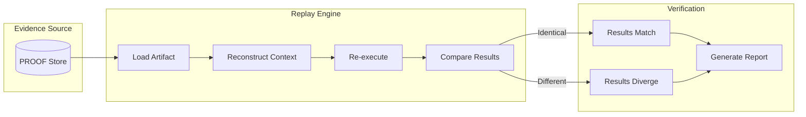

### 9.2 Replay Guarantees

| Aspect | Guarantee | Mechanism |
|--------|-----------|-----------|
| **Input Fidelity** | Exact request reconstruction | Canonical storage in PROOF |
| **Context Fidelity** | Same rules and constraints | Versioned policy snapshots |
| **Temporal Fidelity** | Point-in-time execution | Temporal rule evaluation |
| **Output Verification** | Bit-identical results | Deterministic execution |
| **Divergence Detection** | Identify non-determinism | Hash comparison |

---

## 10. Security Boundaries

### 10.1 Trust Boundary Diagram

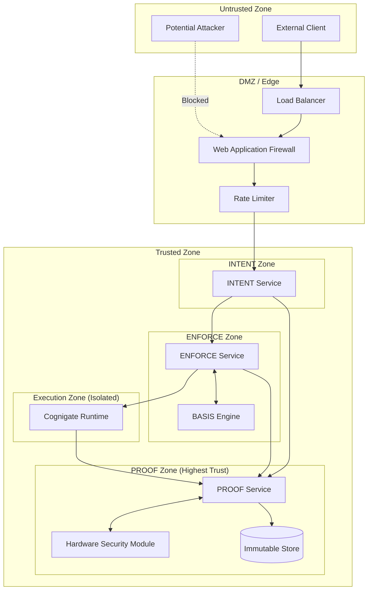

---

## 11. Deployment Topology

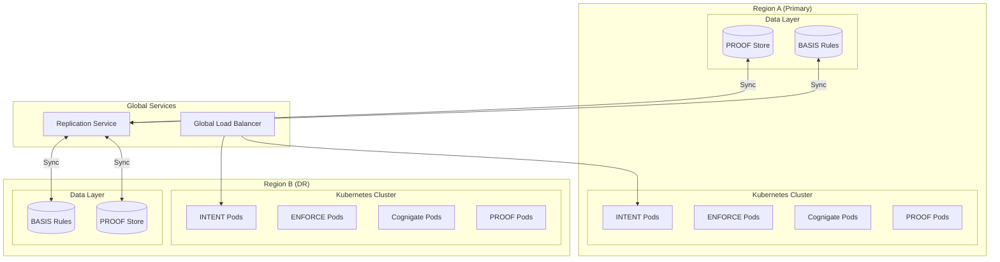

---

## 12. Appendix

### 12.1 Glossary

| Term | Definition |
|------|------------|
| **Artifact** | Immutable proof record with cryptographic signature |
| **BASIS** | Business and Security Information System - rule engine |
| **Cognigate** | Constrained execution runtime |
| **Lineage** | Chain of causality linking artifacts |
| **PROOF** | Provable Record of Operations and Facts |

### 12.2 Related Documents

- 01_System_Governance_and_Authority_Model.pdf
- 02_Security_Architecture_and_Threat_Model.pdf
- 04_Audit_Evidence_and_Forensics.pdf
- 06_Risk_Trust_and_Autonomy_Model.pdf

---

*Vorion Confidential — 2026-01-08 — Expanded Technical Specification*
