# API & SDK Governance — EXPANDED

**Vorion Confidential — 2026-01-08**

> Stable, Enforced Integration

---

## Table of Contents

1. [Executive Summary](#1-executive-summary)
2. [API Governance Architecture](#2-api-governance-architecture)
3. [Versioning Strategy](#3-versioning-strategy)
4. [API Lifecycle Management](#4-api-lifecycle-management)
5. [SDK Architecture](#5-sdk-architecture)
6. [BASIS Constraint Enforcement](#6-basis-constraint-enforcement)
7. [Authentication & Authorization](#7-authentication--authorization)
8. [Rate Limiting & Quotas](#8-rate-limiting--quotas)
9. [API Security Controls](#9-api-security-controls)
10. [Developer Experience](#10-developer-experience)
11. [Monitoring & Analytics](#11-monitoring--analytics)
12. [Governance Metrics & KPIs](#12-governance-metrics--kpis)

---

## 1. Executive Summary

The Vorion API & SDK Governance framework ensures stable, secure, and enforced integration points for all system interactions. Every API call passes through BASIS constraint validation, guaranteeing that external integrations cannot bypass governance rules.

### Core Principles

| Principle | Description |
|-----------|-------------|
| **Stability** | Backward-compatible versioning with clear deprecation timelines |
| **Enforcement** | All calls subject to BASIS constraints — no exceptions |
| **Security** | Zero Trust applied to every API interaction |
| **Transparency** | Full audit trail for all API operations |
| **Developer Experience** | Comprehensive SDKs with built-in governance |

---

## 2. API Governance Architecture

### High-Level API Flow

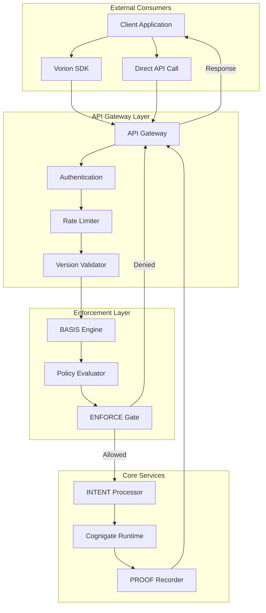

### API Gateway Architecture

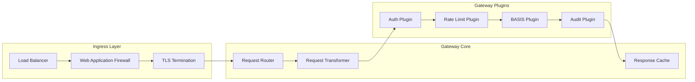

---

## 3. Versioning Strategy

### Semantic Versioning Model

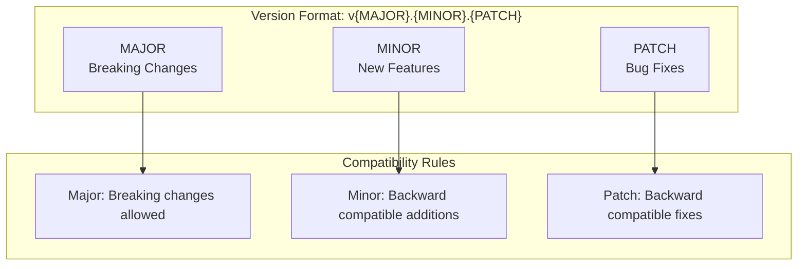

### Version Lifecycle States

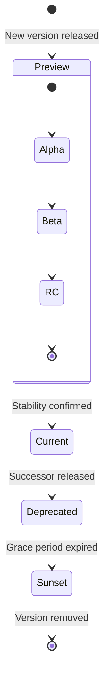

### Version Support Timeline

| Version State | Duration | SLA | Support Level |
|---------------|----------|-----|---------------|
| **Preview** | 1-3 months | None | Best effort |
| **Current** | 18 months minimum | 99.9% | Full support |
| **Deprecated** | 12 months | 99.5% | Security only |
| **Sunset** | 3 months | None | Migration assistance |

### API Version Header Schema

```yaml
# API Version Request Headers
x-vorion-api-version:
  type: string
  pattern: "^v[0-9]+\\.[0-9]+$"
  examples:
    - "v1.0"
    - "v2.1"
  description: "Target API version (MAJOR.MINOR)"

x-vorion-sdk-version:
  type: string
  pattern: "^[0-9]+\\.[0-9]+\\.[0-9]+$"
  examples:
    - "1.2.3"
  description: "SDK version making the request"

x-vorion-client-id:
  type: string
  format: uuid
  description: "Registered client application identifier"
```

### Backward Compatibility Guarantees

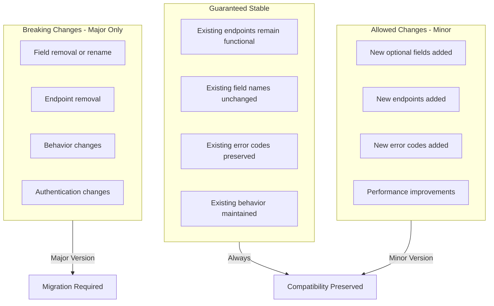

---

## 4. API Lifecycle Management

### API Development Pipeline

```mermaid
flowchart LR
    subgraph Design["Design Phase"]
        Spec[OpenAPI Spec]
        Review[Design Review]
        Mock[Mock Server]
    end

    subgraph Build["Build Phase"]
        Impl[Implementation]
        Test[Testing]
        Doc[Documentation]
    end

    subgraph Release["Release Phase"]
        Stage[Staging]
        Canary[Canary Deploy]
        GA[General Availability]
    end

    subgraph Operate["Operate Phase"]
        Monitor[Monitoring]
        Support[Support]
        Evolve[Evolution]
    end

    Spec --> Review
    Review --> Mock
    Mock --> Impl
    Impl --> Test
    Test --> Doc
    Doc --> Stage
    Stage --> Canary
    Canary --> GA
    GA --> Monitor
    Monitor --> Support
    Support --> Evolve
    Evolve -->|New Version| Spec
```

### Deprecation Process

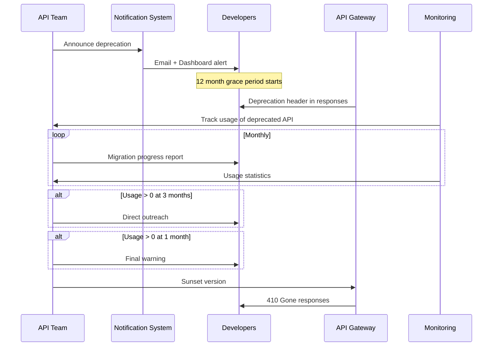

### API Change Request Schema

```yaml
api_change_request:
  id: string  # UUID
  api_name: string
  current_version: string
  proposed_version: string
  change_type:
    enum: [MAJOR, MINOR, PATCH, SECURITY]

  changes:
    - type:
        enum: [ADD_ENDPOINT, MODIFY_ENDPOINT, REMOVE_ENDPOINT,
               ADD_FIELD, MODIFY_FIELD, REMOVE_FIELD,
               ADD_ERROR, MODIFY_ERROR, REMOVE_ERROR]
      path: string
      description: string
      breaking: boolean
      migration_guide: string  # Required if breaking

  review:
    security_review: boolean
    performance_review: boolean
    compatibility_review: boolean
    documentation_review: boolean

  approvals:
    - approver: string
      role: string
      approved_at: datetime
      conditions: string[]

  rollout:
    strategy:
      enum: [IMMEDIATE, CANARY, GRADUAL]
    canary_percentage: integer  # 0-100
    rollout_duration: duration
    rollback_criteria: string[]
```

---

## 5. SDK Architecture

### SDK Component Structure

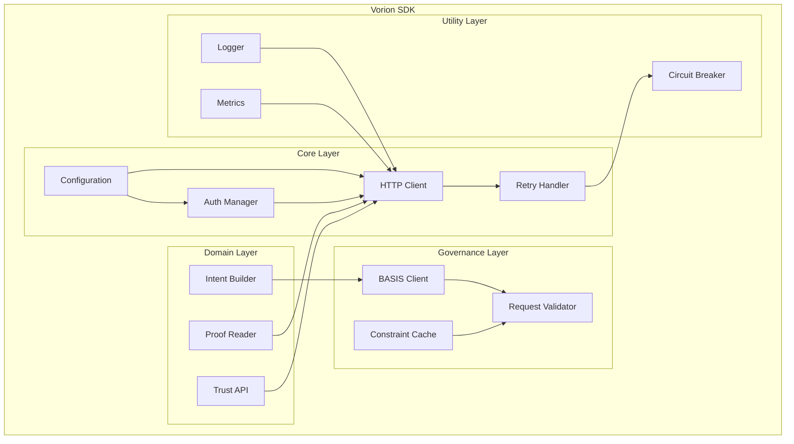

### SDK Language Support Matrix

| Language | Version | Package Manager | Status |
|----------|---------|-----------------|--------|
| **Python** | 3.9+ | pip / conda | GA |
| **JavaScript/TypeScript** | Node 18+ | npm / yarn | GA |
| **Java** | 11+ | Maven / Gradle | GA |
| **Go** | 1.20+ | go modules | GA |
| **C#/.NET** | .NET 6+ | NuGet | GA |
| **Rust** | 1.70+ | Cargo | Beta |
| **Ruby** | 3.0+ | RubyGems | Beta |

### SDK Configuration Schema

```yaml
vorion_sdk_config:
  # Connection Settings
  connection:
    base_url: string  # API endpoint
    timeout_ms: integer  # Default: 30000
    max_retries: integer  # Default: 3
    retry_backoff_ms: integer  # Default: 1000

  # Authentication
  auth:
    type:
      enum: [API_KEY, OAUTH2, MTLS, SERVICE_ACCOUNT]
    credentials:
      api_key: string  # For API_KEY type
      client_id: string  # For OAUTH2
      client_secret: string  # For OAUTH2
      certificate_path: string  # For MTLS
      service_account_file: string  # For SERVICE_ACCOUNT

  # Governance
  governance:
    validate_requests: boolean  # Default: true
    cache_constraints: boolean  # Default: true
    constraint_cache_ttl_s: integer  # Default: 300
    fail_on_constraint_error: boolean  # Default: true

  # Observability
  observability:
    logging:
      level:
        enum: [DEBUG, INFO, WARN, ERROR]
      format:
        enum: [JSON, TEXT]
    metrics:
      enabled: boolean
      exporter:
        enum: [PROMETHEUS, OTLP, CLOUDWATCH, DATADOG]
    tracing:
      enabled: boolean
      sampler:
        type:
          enum: [ALWAYS, NEVER, RATIO]
        ratio: number  # 0.0 - 1.0
```

### SDK Request Flow

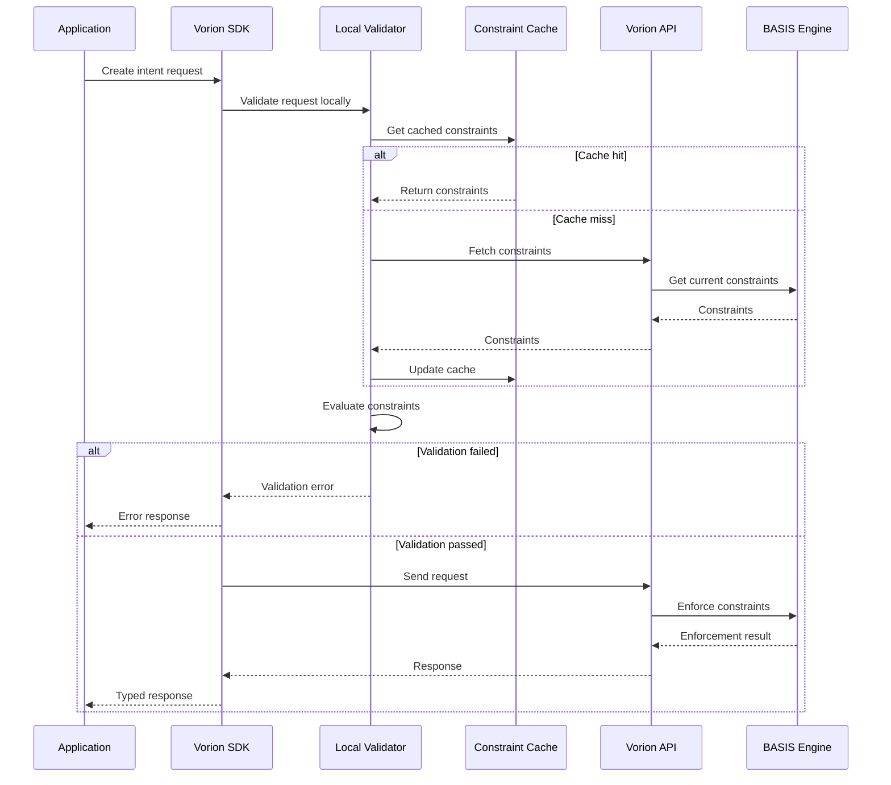

---

## 6. BASIS Constraint Enforcement

### Constraint Application Points

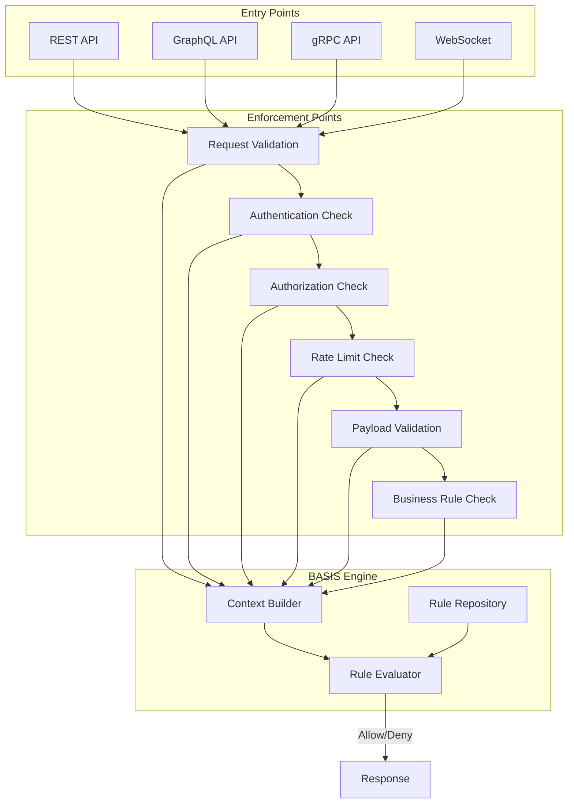

### API Constraint Schema

```yaml
api_constraint:
  id: string  # UUID
  name: string
  description: string
  version: string

  scope:
    apis:
      - pattern: string  # Glob pattern e.g., "/v1/intents/*"
    methods:
      - enum: [GET, POST, PUT, PATCH, DELETE, HEAD, OPTIONS]
    client_types:
      - enum: [INTERNAL, EXTERNAL, PARTNER, PUBLIC]

  conditions:
    - field: string  # JSONPath to request field
      operator:
        enum: [EQ, NEQ, GT, GTE, LT, LTE, IN, NOT_IN,
               CONTAINS, NOT_CONTAINS, MATCHES, EXISTS]
      value: any
      logic:
        enum: [AND, OR]

  actions:
    on_match:
      enum: [ALLOW, DENY, RATE_LIMIT, TRANSFORM, AUDIT_ONLY]
    on_deny:
      error_code: string
      error_message: string
      http_status: integer
    on_rate_limit:
      limit: integer
      window_s: integer
      penalty_s: integer

  metadata:
    priority: integer  # Lower = higher priority
    enabled: boolean
    created_at: datetime
    updated_at: datetime
    created_by: string
```

### Enforcement Decision Flow

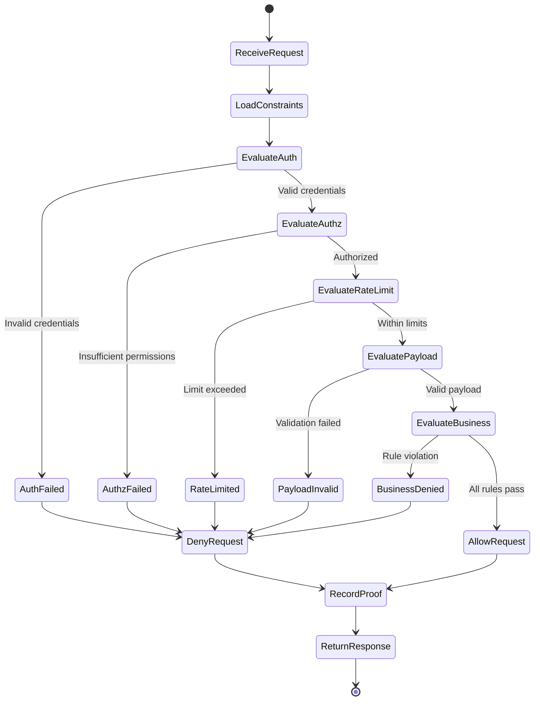

---

## 7. Authentication & Authorization

### Authentication Methods

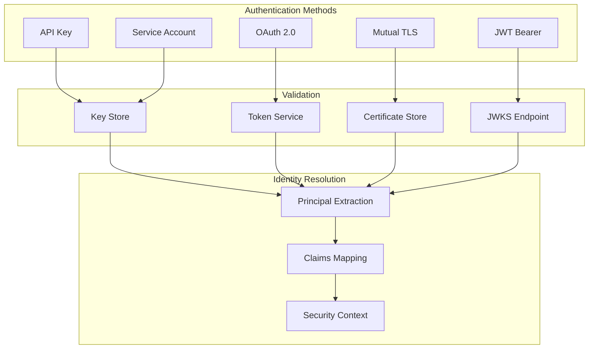

### OAuth 2.0 Scopes

| Scope | Description | Access Level |
|-------|-------------|--------------|
| `vorion:read` | Read-only access to resources | Basic |
| `vorion:write` | Create and update resources | Standard |
| `vorion:delete` | Delete resources | Elevated |
| `vorion:admin` | Administrative operations | Admin |
| `vorion:intents:execute` | Execute intents | Standard |
| `vorion:proof:read` | Read PROOF artifacts | Audit |
| `vorion:trust:read` | Read trust scores | Audit |
| `vorion:trust:write` | Modify trust factors | Admin |
| `vorion:basis:read` | Read BASIS rules | Admin |
| `vorion:basis:write` | Modify BASIS rules | SuperAdmin |

### Authorization Flow

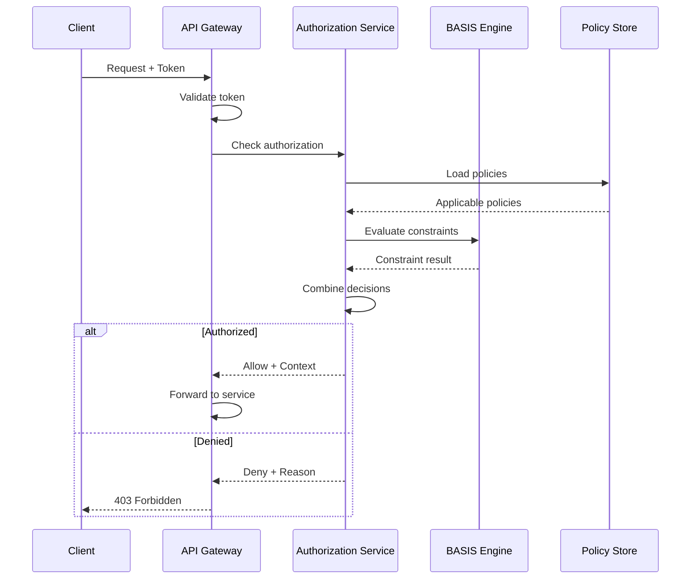

---

## 8. Rate Limiting & Quotas

### Rate Limiting Architecture

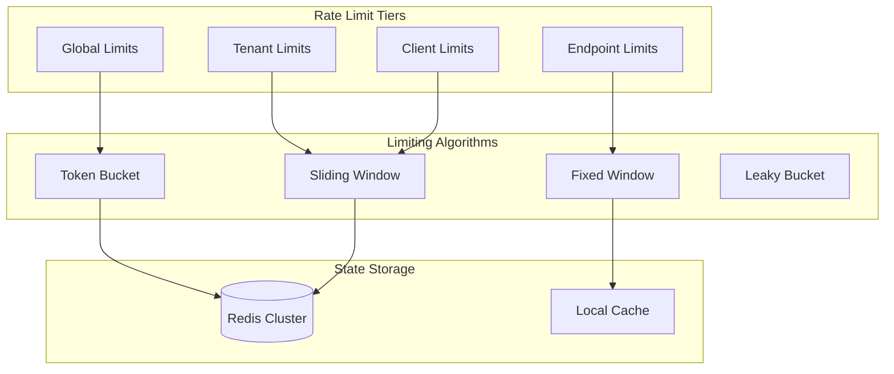

### Rate Limit Configuration

```yaml
rate_limits:
  global:
    requests_per_second: 100000
    burst_size: 150000
    algorithm: TOKEN_BUCKET

  tiers:
    free:
      requests_per_minute: 60
      requests_per_day: 1000
      burst_multiplier: 1.5

    standard:
      requests_per_minute: 600
      requests_per_day: 50000
      burst_multiplier: 2.0

    enterprise:
      requests_per_minute: 6000
      requests_per_day: 500000
      burst_multiplier: 3.0

    unlimited:
      requests_per_minute: -1  # No limit
      requests_per_day: -1
      burst_multiplier: -1

  endpoint_overrides:
    - pattern: "/v1/intents/execute"
      multiplier: 0.5  # Half the tier limit
      reason: "Expensive operation"

    - pattern: "/v1/health"
      multiplier: 10.0  # 10x the tier limit
      reason: "Health checks"

  response_headers:
    - X-RateLimit-Limit
    - X-RateLimit-Remaining
    - X-RateLimit-Reset
    - Retry-After  # On 429 responses
```

### Quota Management

| Quota Type | Scope | Reset Period | Enforcement |
|------------|-------|--------------|-------------|
| **API Calls** | Client | Rolling 24h | Hard limit |
| **Data Transfer** | Tenant | Monthly | Soft limit + overage |
| **Storage** | Tenant | None | Hard limit |
| **Compute Units** | Client | Hourly | Hard limit |
| **Concurrent Connections** | Client | None | Hard limit |

---

## 9. API Security Controls

### Security Control Matrix

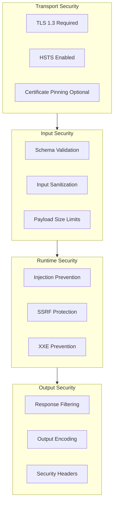

### Security Headers

```yaml
security_headers:
  # Transport Security
  Strict-Transport-Security: "max-age=31536000; includeSubDomains; preload"

  # Content Security
  Content-Type: "application/json; charset=utf-8"
  X-Content-Type-Options: "nosniff"

  # Frame Protection
  X-Frame-Options: "DENY"

  # XSS Protection
  X-XSS-Protection: "1; mode=block"

  # Cache Control
  Cache-Control: "no-store, no-cache, must-revalidate"
  Pragma: "no-cache"

  # Request ID
  X-Request-ID: "{generated-uuid}"

  # Vorion Specific
  X-Vorion-Trace-ID: "{trace-id}"
  X-Vorion-Constraint-Version: "{basis-version}"
```

### Input Validation Rules

```yaml
input_validation:
  # Size Limits
  max_request_body_bytes: 10485760  # 10 MB
  max_url_length: 8192
  max_header_size: 16384
  max_query_params: 50

  # Content Type Validation
  allowed_content_types:
    - application/json
    - application/x-www-form-urlencoded
    - multipart/form-data

  # Character Validation
  blocked_patterns:
    - pattern: "<script"
      reason: "XSS prevention"
    - pattern: "javascript:"
      reason: "XSS prevention"
    - pattern: "data:"
      reason: "Data URI prevention"

  # JSON Validation
  json_validation:
    max_depth: 20
    max_keys: 1000
    max_string_length: 1000000
    allow_comments: false
    allow_trailing_commas: false
```

---

## 10. Developer Experience

### Developer Portal Architecture

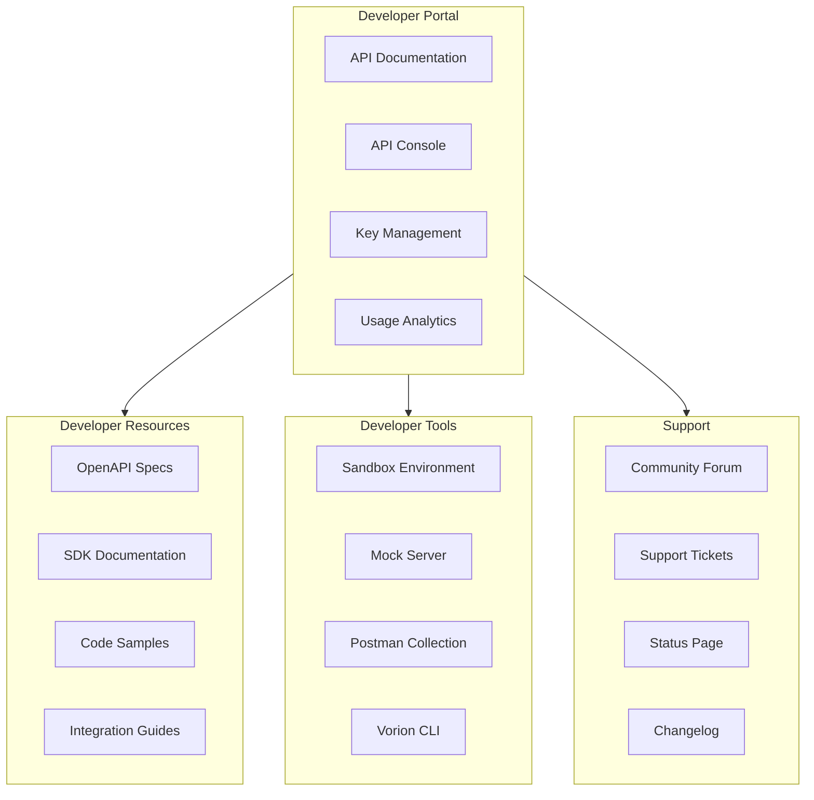

### API Documentation Structure

```yaml
documentation:
  api_reference:
    format: OpenAPI 3.1
    features:
      - Interactive try-it console
      - Code generation
      - Schema explorer
      - Authentication helper

  sdk_docs:
    - language: Python
      sections: [quickstart, authentication, intents, proof, errors]
    - language: JavaScript
      sections: [quickstart, authentication, intents, proof, errors]
    - language: Java
      sections: [quickstart, authentication, intents, proof, errors]

  guides:
    - title: Getting Started
      level: beginner
      time: 15min
    - title: Authentication Deep Dive
      level: intermediate
      time: 30min
    - title: Building Governed Workflows
      level: advanced
      time: 60min

  samples:
    repository: github.com/vorion/api-samples
    categories:
      - authentication
      - intent-execution
      - proof-verification
      - trust-management
      - error-handling
```

### Error Response Format

```json
{
  "error": {
    "code": "CONSTRAINT_VIOLATION",
    "message": "Request violates BASIS constraint: max_amount_exceeded",
    "details": {
      "constraint_id": "c_max_transfer_amount",
      "constraint_name": "Maximum Transfer Amount",
      "violated_field": "amount",
      "provided_value": 100000,
      "max_allowed": 50000,
      "basis_version": "2026.01.15"
    },
    "request_id": "req_abc123xyz",
    "trace_id": "trace_def456uvw",
    "timestamp": "2026-01-08T14:32:00Z",
    "documentation_url": "https://docs.vorion.io/errors/CONSTRAINT_VIOLATION"
  }
}
```

### Error Code Taxonomy

| Code | HTTP Status | Category | Description |
|------|-------------|----------|-------------|
| `AUTHENTICATION_REQUIRED` | 401 | Auth | No credentials provided |
| `AUTHENTICATION_FAILED` | 401 | Auth | Invalid credentials |
| `AUTHORIZATION_DENIED` | 403 | Auth | Insufficient permissions |
| `CONSTRAINT_VIOLATION` | 403 | Governance | BASIS rule violated |
| `RATE_LIMIT_EXCEEDED` | 429 | Quota | Too many requests |
| `QUOTA_EXCEEDED` | 429 | Quota | Usage quota exhausted |
| `VALIDATION_ERROR` | 400 | Input | Invalid request format |
| `RESOURCE_NOT_FOUND` | 404 | Resource | Entity does not exist |
| `CONFLICT` | 409 | State | Resource state conflict |
| `INTERNAL_ERROR` | 500 | System | Unexpected server error |
| `SERVICE_UNAVAILABLE` | 503 | System | Temporary unavailability |

---

## 11. Monitoring & Analytics

### API Observability Stack

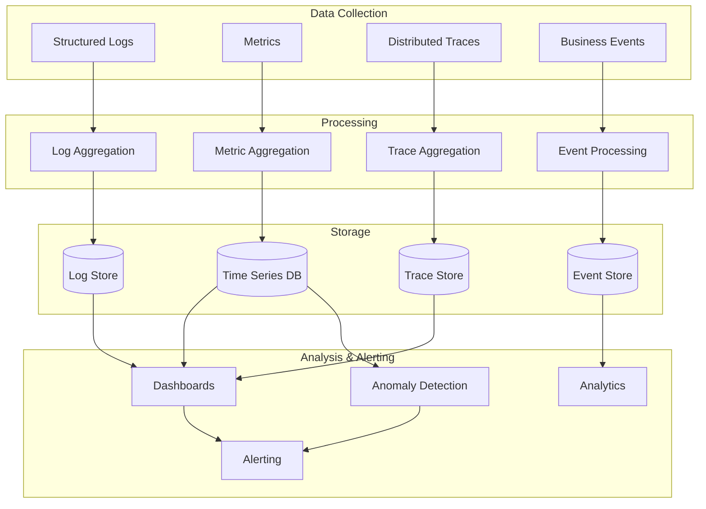

### Key Metrics

```yaml
api_metrics:
  availability:
    - name: api_uptime_percentage
      target: 99.9%
      measurement: (successful_requests / total_requests) * 100

  latency:
    - name: api_latency_p50_ms
      target: 50
    - name: api_latency_p95_ms
      target: 200
    - name: api_latency_p99_ms
      target: 500

  throughput:
    - name: requests_per_second
      aggregation: rate
    - name: bytes_transferred
      aggregation: sum

  errors:
    - name: error_rate_4xx
      target: < 1%
    - name: error_rate_5xx
      target: < 0.1%

  governance:
    - name: constraint_evaluation_time_ms
      target: < 10
    - name: constraint_violation_rate
      measurement: violations / total_requests
    - name: basis_rule_cache_hit_rate
      target: > 95%
```

### Usage Analytics Dashboard

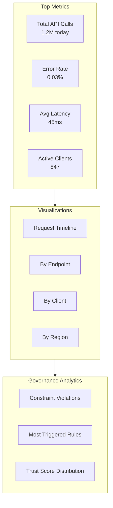

---

## 12. Governance Metrics & KPIs

### API Governance Scorecard

| Metric | Target | Current | Status |
|--------|--------|---------|--------|
| API Availability | 99.9% | 99.95% | ✅ |
| P95 Latency | < 200ms | 145ms | ✅ |
| Constraint Evaluation Time | < 10ms | 8ms | ✅ |
| SDK Adoption Rate | > 80% | 76% | ⚠️ |
| Documentation Coverage | 100% | 100% | ✅ |
| Breaking Change Incidents | 0 | 0 | ✅ |
| Version Deprecation Compliance | 100% | 100% | ✅ |
| Security Vulnerability SLA | < 24h | 4h avg | ✅ |

### Governance Health Indicators

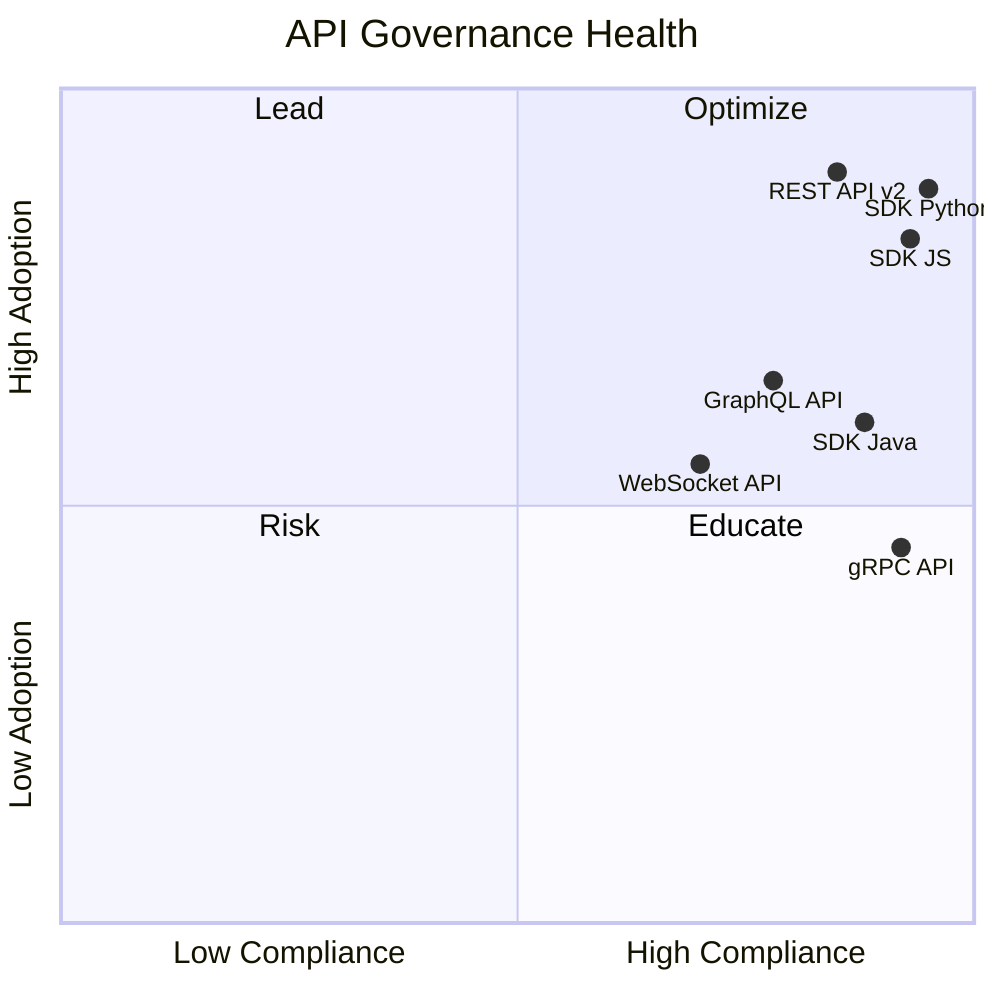

### Compliance Tracking

```yaml
compliance_tracking:
  api_versioning:
    - metric: deprecated_version_usage
      threshold: 0
      action: alert_and_report
    - metric: undocumented_endpoints
      threshold: 0
      action: block_deploy
    - metric: breaking_change_without_major
      threshold: 0
      action: block_deploy

  security:
    - metric: unauthenticated_endpoints
      threshold: 0
      action: block_deploy
    - metric: unencrypted_sensitive_fields
      threshold: 0
      action: block_deploy
    - metric: missing_rate_limits
      threshold: 0
      action: warn_and_report

  governance:
    - metric: basis_constraint_coverage
      threshold: 100%
      action: block_deploy
    - metric: proof_recording_failures
      threshold: 0
      action: alert_critical
```

### Review Schedule

| Review Type | Frequency | Participants | Outputs |
|-------------|-----------|--------------|---------|
| API Health Review | Weekly | API Team | Health dashboard update |
| SDK Release Review | Bi-weekly | SDK Team + API Team | Release notes |
| Security Review | Monthly | Security + API Team | Vulnerability report |
| Governance Review | Monthly | Governance Board | Policy updates |
| Version Planning | Quarterly | Product + Engineering | Roadmap update |
| Breaking Change Review | As needed | All stakeholders | Migration plan |

---

## Appendix A: OpenAPI Specification Template

```yaml
openapi: 3.1.0
info:
  title: Vorion API
  version: "1.0"
  description: |
    Vorion governed AI execution platform API.
    All endpoints enforce BASIS constraints.
  contact:
    name: Vorion API Team
    email: api@vorion.io
  license:
    name: Proprietary

servers:
  - url: https://api.vorion.io/v1
    description: Production
  - url: https://sandbox.vorion.io/v1
    description: Sandbox

security:
  - BearerAuth: []
  - ApiKeyAuth: []

paths:
  /intents:
    post:
      summary: Submit an intent for execution
      operationId: submitIntent
      tags: [Intents]
      x-vorion-constraints:
        - constraint_id: c_intent_validation
        - constraint_id: c_trust_check
      requestBody:
        required: true
        content:
          application/json:
            schema:
              $ref: '#/components/schemas/IntentRequest'
      responses:
        '202':
          description: Intent accepted
          content:
            application/json:
              schema:
                $ref: '#/components/schemas/IntentResponse'
        '403':
          description: Constraint violation
          content:
            application/json:
              schema:
                $ref: '#/components/schemas/ErrorResponse'

components:
  securitySchemes:
    BearerAuth:
      type: http
      scheme: bearer
      bearerFormat: JWT
    ApiKeyAuth:
      type: apiKey
      in: header
      name: X-API-Key

  schemas:
    IntentRequest:
      type: object
      required: [goal, context]
      properties:
        goal:
          type: string
          maxLength: 1000
        context:
          type: object
        constraints:
          type: array
          items:
            type: string

    IntentResponse:
      type: object
      properties:
        intent_id:
          type: string
          format: uuid
        status:
          type: string
          enum: [ACCEPTED, PROCESSING, COMPLETED, FAILED]
        proof_id:
          type: string
          format: uuid

    ErrorResponse:
      type: object
      properties:
        error:
          type: object
          properties:
            code:
              type: string
            message:
              type: string
            details:
              type: object
```

---

## Appendix B: SDK Quick Start Examples

### Python

```python
from vorion import VorionClient, Intent

# Initialize client
client = VorionClient(
    api_key="your-api-key",
    environment="production"
)

# Submit an intent
intent = Intent(
    goal="Process customer refund",
    context={
        "customer_id": "cust_123",
        "order_id": "ord_456",
        "amount": 99.99
    }
)

result = client.intents.submit(intent)
print(f"Intent ID: {result.intent_id}")
print(f"Proof ID: {result.proof_id}")

# Check constraint before submission
validation = client.constraints.validate(intent)
if not validation.is_valid:
    print(f"Would violate: {validation.violations}")
```

### JavaScript/TypeScript

```typescript
import { VorionClient, Intent } from '@vorion/sdk';

// Initialize client
const client = new VorionClient({
  apiKey: 'your-api-key',
  environment: 'production'
});

// Submit an intent
const intent: Intent = {
  goal: 'Process customer refund',
  context: {
    customerId: 'cust_123',
    orderId: 'ord_456',
    amount: 99.99
  }
};

const result = await client.intents.submit(intent);
console.log(`Intent ID: ${result.intentId}`);
console.log(`Proof ID: ${result.proofId}`);
```

---

*Document Version: 1.0.0*
*Last Updated: 2026-01-08*
*Classification: Vorion Confidential*
