# Open Standard & IP Policy — EXPANDED

**Vorion Confidential — 2026-01-08**

> Clear Boundaries Between Open and Proprietary

---

## Table of Contents

1. [Executive Summary](#1-executive-summary)
2. [Asset Classification Framework](#2-asset-classification-framework)
3. [Open Standard Assets](#3-open-standard-assets)
4. [Proprietary Assets](#4-proprietary-assets)
5. [Licensing Model](#5-licensing-model)
6. [Intellectual Property Protection](#6-intellectual-property-protection)
7. [Contribution & Governance](#7-contribution--governance)
8. [Third-Party Dependencies](#8-third-party-dependencies)
9. [Ecosystem & Partner Model](#9-ecosystem--partner-model)
10. [Compliance & Enforcement](#10-compliance--enforcement)
11. [Future Roadmap](#11-future-roadmap)
12. [Policy Governance](#12-policy-governance)

---

## 1. Executive Summary

Vorion maintains a deliberate boundary between open and proprietary assets to balance ecosystem growth with sustainable business operations. Open standards enable broad adoption and trust, while proprietary implementations protect core innovations and ensure quality guarantees.

### Strategic Principles

| Principle | Rationale |
|-----------|-----------|
| **Open Where Possible** | Standards, schemas, and integration points are open to maximize adoption |
| **Proprietary Where Necessary** | Core runtime and evidence systems remain proprietary for security and quality |
| **Clear Boundaries** | No ambiguity about what is open vs. proprietary |
| **Ecosystem First** | Partner success drives Vorion success |
| **IP Protection** | Innovation investment must be protectable |

---

## 2. Asset Classification Framework

### Classification Taxonomy

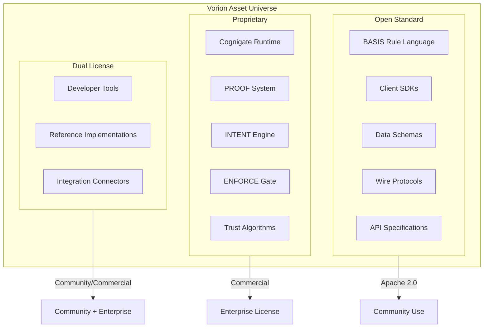

### Asset Decision Matrix

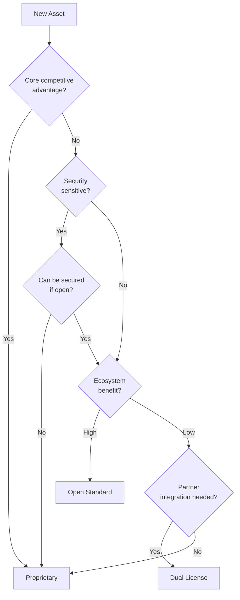

### Classification Criteria

| Criterion | Open Standard | Proprietary | Dual License |
|-----------|---------------|-------------|--------------|
| **Competitive Moat** | No | Yes | Partial |
| **Security Sensitivity** | Low | High | Medium |
| **Ecosystem Dependency** | High | Low | Medium |
| **Partner Integration** | Required | Optional | Beneficial |
| **Quality Guarantee** | Community | Vorion | Vorion |
| **Support Model** | Community | Enterprise | Tiered |

---

## 3. Open Standard Assets

### BASIS Rule Language

```mermaid
flowchart LR
    subgraph BASIS["BASIS Open Standard"]
        Spec[Language Specification]
        Grammar[EBNF Grammar]
        Validator[Reference Validator]
        Examples[Example Rules]
    end

    subgraph Artifacts["Published Artifacts"]
        SpecDoc[Specification Document]
        GrammarFile[Grammar File]
        JSONSchema[JSON Schema]
        TestSuite[Conformance Tests]
    end

    subgraph Usage["Ecosystem Usage"]
        ThirdParty[Third-Party Engines]
        Tooling[IDE Tooling]
        Linters[Linters/Validators]
        Transpilers[Transpilers]
    end

    BASIS --> Artifacts
    Artifacts --> Usage
```

### BASIS Specification Summary

```yaml
basis_standard:
  name: "BASIS Rule Language"
  version: "1.0.0"
  license: "Apache-2.0"

  specification:
    format: "EBNF + Prose"
    repository: "github.com/vorion/basis-spec"
    documentation: "docs.vorion.io/basis"

  components:
    - name: "Core Grammar"
      status: "Stable"
      version: "1.0"

    - name: "Type System"
      status: "Stable"
      version: "1.0"

    - name: "Built-in Functions"
      status: "Stable"
      version: "1.0"

    - name: "Extension Points"
      status: "Draft"
      version: "0.9"

  conformance:
    levels:
      - level: "Core"
        requirements: ["Grammar", "Type System"]
      - level: "Standard"
        requirements: ["Core", "Built-in Functions"]
      - level: "Full"
        requirements: ["Standard", "Extensions"]

    certification:
      process: "Self-certification with test suite"
      badge: "BASIS Conformant"
      registry: "conformance.vorion.io"
```

### SDK Open Source Structure

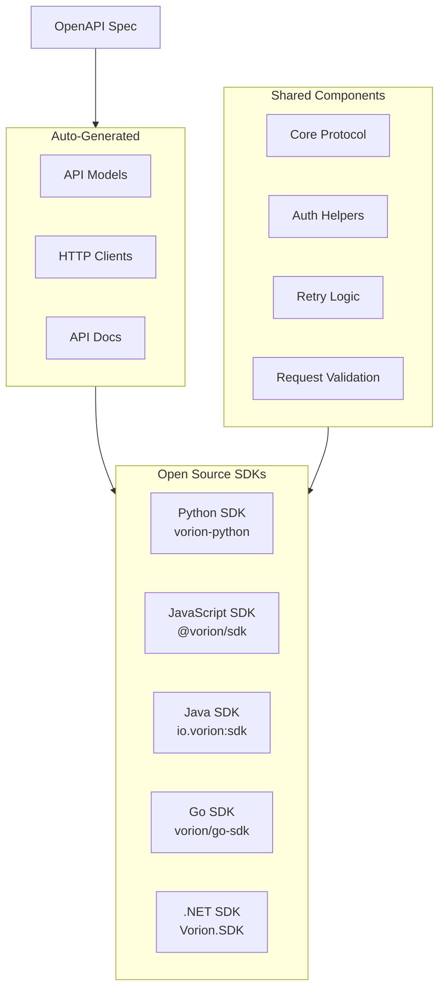

### SDK License Terms

```yaml
sdk_license:
  license: "Apache-2.0"

  permissions:
    - Commercial use
    - Modification
    - Distribution
    - Patent use
    - Private use

  conditions:
    - License and copyright notice
    - State changes

  limitations:
    - Liability
    - Warranty

  additional_terms:
    trademark: |
      The Vorion name and logo are trademarks.
      SDK usage does not grant trademark rights.

    attribution: |
      Derivative works must include attribution
      to original Vorion SDK.

    compatibility: |
      Modifications that break API compatibility
      must be clearly documented.
```

### Open Data Schemas

| Schema | Format | Repository | Status |
|--------|--------|------------|--------|
| Intent Request | JSON Schema | vorion/schemas | Stable |
| Intent Response | JSON Schema | vorion/schemas | Stable |
| Proof Artifact | JSON Schema | vorion/schemas | Stable |
| Trust Event | JSON Schema | vorion/schemas | Stable |
| BASIS Rule | JSON Schema | vorion/basis-spec | Stable |
| Error Response | JSON Schema | vorion/schemas | Stable |
| Webhook Payload | JSON Schema | vorion/schemas | Draft |

---

## 4. Proprietary Assets

### Proprietary Component Architecture

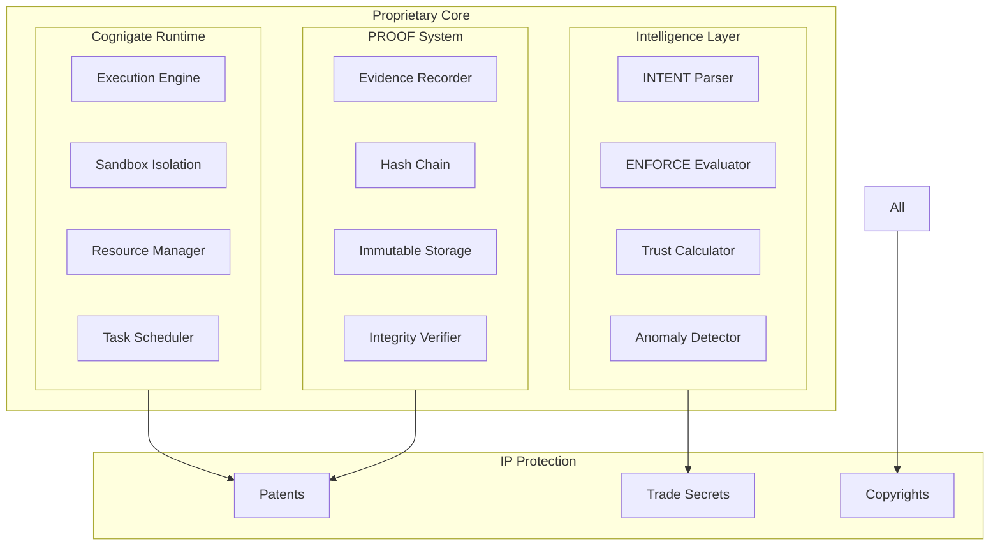

### Cognigate Runtime Details

```yaml
cognigate:
  name: "Cognigate Execution Runtime"
  classification: "Proprietary"
  protection: ["Patent", "Trade Secret", "Copyright"]

  components:
    execution_engine:
      description: "Deterministic execution orchestrator"
      ip_type: "Patent Pending"
      patent_id: "US-XXXX-XXXX"

    sandbox_isolation:
      description: "Multi-tenant isolation technology"
      ip_type: "Trade Secret"

    resource_manager:
      description: "Dynamic resource allocation"
      ip_type: "Copyright"

    constraint_enforcer:
      description: "Real-time constraint evaluation"
      ip_type: "Patent Pending"
      patent_id: "US-YYYY-YYYY"

  licensing:
    model: "Commercial subscription"
    tiers: [Starter, Professional, Enterprise]
    includes: [Updates, Support, SLA]
```

### PROOF System Details

```yaml
proof_system:
  name: "PROOF Evidence System"
  classification: "Proprietary"
  protection: ["Patent", "Trade Secret", "Copyright"]

  components:
    evidence_recorder:
      description: "High-fidelity execution capture"
      ip_type: "Patent"
      patent_id: "US-AAAA-AAAA"

    hash_chain:
      description: "Tamper-evident chain construction"
      ip_type: "Patent Pending"

    immutable_storage:
      description: "WORM storage integration"
      ip_type: "Copyright"

    deterministic_replay:
      description: "Execution reconstruction engine"
      ip_type: "Trade Secret"

  api_surface:
    public: ["Read artifacts", "Verify integrity", "Export evidence"]
    internal: ["Record", "Chain", "Compact", "Replicate"]
```

### Proprietary Algorithm Protection

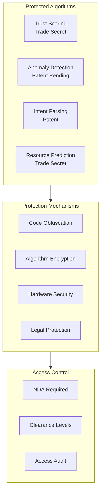

---

## 5. Licensing Model

### License Tier Structure

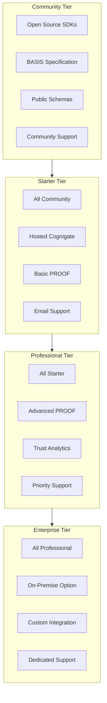

### License Comparison Matrix

| Feature | Community | Starter | Professional | Enterprise |
|---------|-----------|---------|--------------|------------|
| **SDKs** | ✅ Open Source | ✅ | ✅ | ✅ |
| **BASIS Spec** | ✅ Open Source | ✅ | ✅ | ✅ |
| **API Access** | ❌ | ✅ Limited | ✅ Full | ✅ Unlimited |
| **Cognigate Runtime** | ❌ | ✅ Shared | ✅ Dedicated | ✅ On-Premise Option |
| **PROOF System** | ❌ | ✅ 30 days | ✅ 1 year | ✅ Unlimited |
| **Trust Analytics** | ❌ | ❌ | ✅ | ✅ Advanced |
| **SLA** | None | 99.5% | 99.9% | 99.99% |
| **Support** | Community | Email | Priority | Dedicated |
| **Price** | Free | $X/month | $Y/month | Custom |

### Commercial License Agreement Structure

```yaml
commercial_license:
  agreement_type: "Subscription License"

  grant:
    scope: "Non-exclusive, non-transferable"
    territory: "Worldwide"
    duration: "Subscription term"

  rights:
    - Use licensed software for internal business
    - Access to updates during term
    - Access to support per tier

  restrictions:
    - No reverse engineering
    - No redistribution of proprietary components
    - No derivative works of proprietary code
    - No circumvention of license controls
    - No use exceeding licensed capacity

  ip_ownership:
    vorion_retains:
      - All proprietary software
      - All patents and trade secrets
      - All trademarks
    customer_owns:
      - Customer data
      - Customer configurations
      - Custom integrations (except Vorion IP)

  audit_rights:
    frequency: "Annual or upon reasonable suspicion"
    scope: "License compliance verification"
    notice: "30 days written notice"
```

---

## 6. Intellectual Property Protection

### IP Portfolio Structure

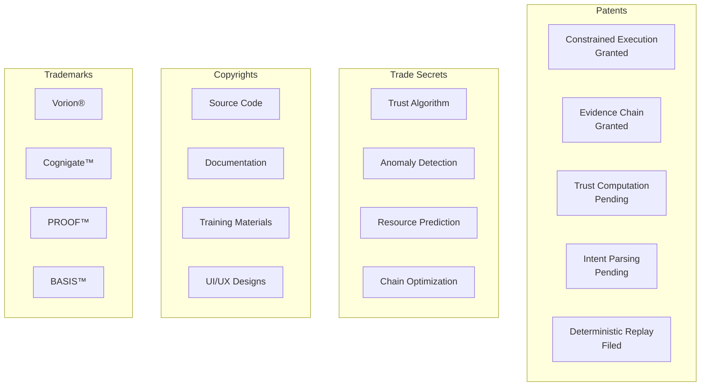

### Patent Portfolio

| Patent | Status | Filing Date | Jurisdiction | Coverage |
|--------|--------|-------------|--------------|----------|
| Constrained AI Execution | Granted | 2024-03-15 | US, EU, JP | Runtime enforcement |
| Immutable Evidence Chain | Granted | 2024-05-22 | US, EU | Evidence system |
| Dynamic Trust Computation | Pending | 2025-01-10 | US, EU, JP, CN | Trust scoring |
| Natural Language Intent | Pending | 2025-03-18 | US | Intent parsing |
| Deterministic Replay | Filed | 2025-08-05 | US | Forensic replay |

### Trade Secret Protection Program

```yaml
trade_secret_protection:
  classification:
    levels:
      - name: "Highly Confidential"
        access: "Executive + Named individuals"
        examples: ["Trust algorithm", "Anomaly detection"]

      - name: "Confidential"
        access: "Engineering leadership"
        examples: ["Optimization techniques", "Performance tuning"]

      - name: "Internal"
        access: "Employees under NDA"
        examples: ["Architecture details", "Implementation patterns"]

  physical_security:
    - Secure development environments
    - Air-gapped build systems
    - Hardware security modules

  digital_security:
    - Encrypted source repositories
    - Multi-factor authentication
    - Access logging and monitoring
    - DLP (Data Loss Prevention)

  legal_protection:
    - Employee confidentiality agreements
    - Contractor NDAs
    - Partner confidentiality terms
    - Exit interview procedures

  incident_response:
    - Immediate access revocation
    - Forensic investigation
    - Legal action if warranted
    - Notification to affected parties
```

### Trademark Usage Guidelines

```yaml
trademark_guidelines:
  vorion:
    mark: "Vorion®"
    type: "Registered trademark"
    usage:
      correct:
        - "Vorion® platform"
        - "Powered by Vorion®"
      incorrect:
        - "vorion" (lowercase)
        - "Vorion's" (possessive)
        - "Vorioning" (verb form)

  cognigate:
    mark: "Cognigate™"
    type: "Trademark"
    usage:
      correct:
        - "Cognigate™ runtime"
        - "Running on Cognigate™"
      context: "Always refer to the execution runtime"

  basis:
    mark: "BASIS™"
    type: "Trademark"
    special: "Open standard, but trademark protected"
    usage:
      correct:
        - "BASIS™ rule language"
        - "BASIS™ compliant"
      allowed_derivative:
        - "BASIS rules" (descriptive use)
```

---

## 7. Contribution & Governance

### Open Source Contribution Model

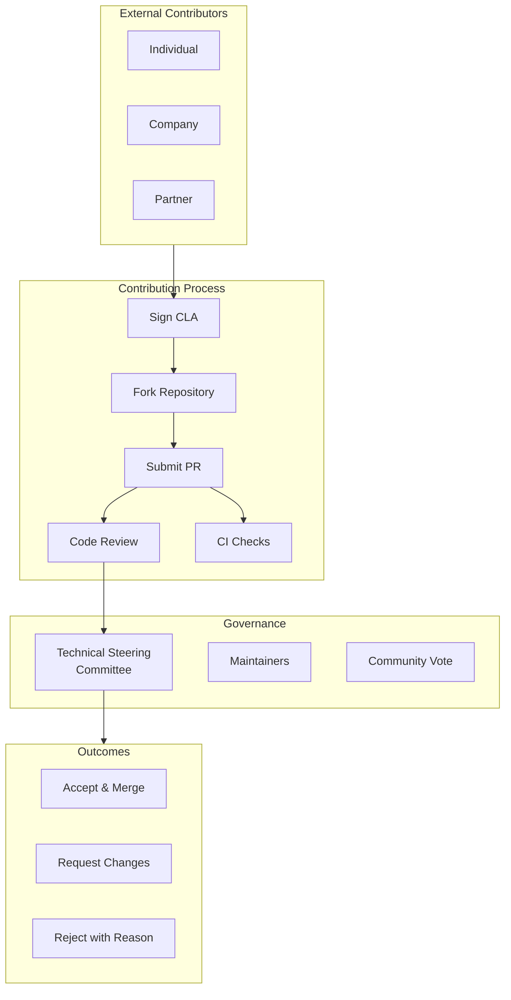

### Contributor License Agreement (CLA)

```yaml
cla_terms:
  type: "Apache-style CLA"

  grants:
    copyright_license:
      scope: "Worldwide, royalty-free, non-exclusive"
      rights: ["reproduce", "prepare derivative works", "publicly display", "sublicense"]

    patent_license:
      scope: "For contribution only"
      rights: ["make", "use", "sell", "import"]
      termination: "If patent litigation initiated"

  representations:
    - Original work or right to submit
    - Not aware of IP claims by others
    - Employer authorization if applicable

  no_obligation:
    - Vorion not obligated to use contribution
    - Vorion may reject for any reason
```

### Technical Steering Committee

| Role | Responsibility | Composition |
|------|----------------|-------------|
| **Chair** | Meeting facilitation, tie-breaker | Vorion representative |
| **Vorion Members** | Technical direction, final authority | 3 seats |
| **Community Members** | Community representation | 2 elected seats |
| **Partner Members** | Ecosystem perspective | 1 appointed seat |

### Governance Process

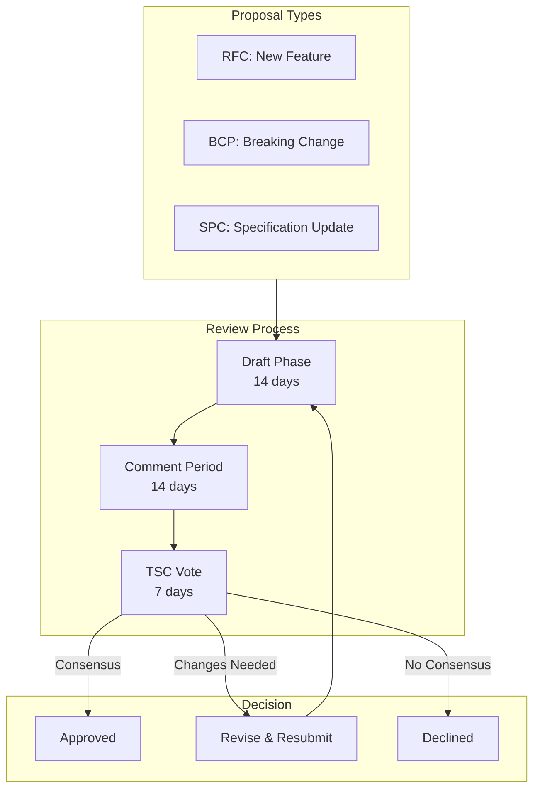

---

## 8. Third-Party Dependencies

### Dependency Classification

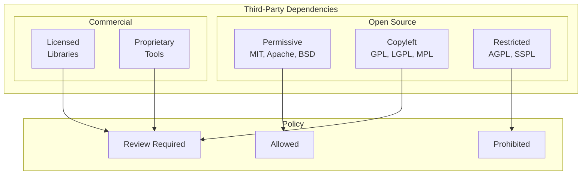

### Approved License List

| License | Status | Conditions |
|---------|--------|------------|
| Apache 2.0 | ✅ Allowed | None |
| MIT | ✅ Allowed | None |
| BSD-2/BSD-3 | ✅ Allowed | None |
| ISC | ✅ Allowed | None |
| MPL 2.0 | ⚠️ Review | File-level copyleft |
| LGPL 2.1/3.0 | ⚠️ Review | Dynamic linking OK |
| GPL 2.0/3.0 | ❌ Prohibited | Strong copyleft |
| AGPL 3.0 | ❌ Prohibited | Network copyleft |
| SSPL | ❌ Prohibited | Service copyleft |
| Commercial | ⚠️ Review | Per agreement |

### Dependency Review Process

```yaml
dependency_review:
  new_dependency:
    requester: "Engineering team"
    reviewer: "Security + Legal"
    criteria:
      - license_compatibility
      - security_posture
      - maintenance_status
      - performance_impact
    approval: "Written approval required"

  update_dependency:
    auto_approve:
      - Patch versions with no license change
      - Security patches
    manual_review:
      - Major version changes
      - License changes
      - New transitive dependencies

  audit:
    frequency: "Quarterly"
    scope: "All production dependencies"
    output: "SBOM (Software Bill of Materials)"
```

### Software Bill of Materials (SBOM)

```yaml
sbom:
  format: "CycloneDX"
  version: "1.4"

  generation:
    trigger: "Every release"
    tool: "Automated pipeline"
    storage: "Secure artifact repository"

  contents:
    - component_name
    - version
    - license
    - supplier
    - hash
    - dependencies

  distribution:
    customers: "On request"
    regulators: "As required"
    public: "Summary only"
```

---

## 9. Ecosystem & Partner Model

### Partner Tiers

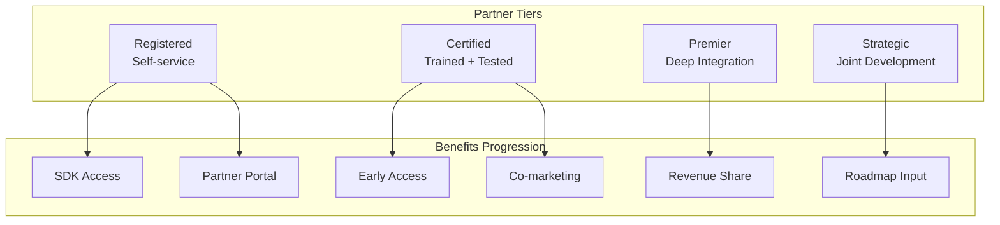

### Partner Agreement Structure

```yaml
partner_agreement:
  tiers:
    registered:
      requirements:
        - Accept partner terms
        - Complete registration
      ip_grants:
        - SDK usage (Apache 2.0)
        - API access (per license tier)
        - Logo usage (with guidelines)
      restrictions:
        - No proprietary access
        - No white-labeling

    certified:
      requirements:
        - Registered tier
        - Complete certification training
        - Pass technical assessment
      ip_grants:
        - All registered grants
        - "Vorion Certified" badge
        - Reference implementation access
      restrictions:
        - Annual recertification

    premier:
      requirements:
        - Certified tier
        - Minimum revenue commitment
        - Joint business plan
      ip_grants:
        - All certified grants
        - Early API access
        - Limited source code access (NDA)
      restrictions:
        - Non-compete for core functionality

    strategic:
      requirements:
        - Premier tier
        - Executive sponsorship
        - Strategic alignment
      ip_grants:
        - All premier grants
        - Roadmap collaboration
        - Joint IP development terms
      restrictions:
        - Custom per agreement
```

### Ecosystem Architecture

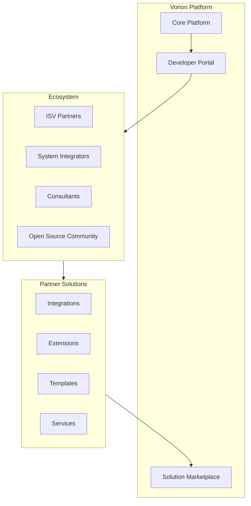

---

## 10. Compliance & Enforcement

### IP Compliance Monitoring

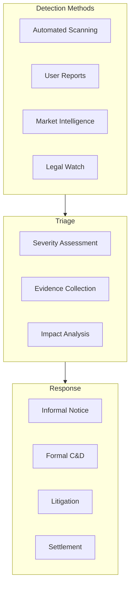

### Enforcement Escalation Matrix

| Violation Type | Severity | Initial Response | Escalation |
|----------------|----------|------------------|------------|
| Trademark misuse | Low | Informal notice | C&D letter |
| SDK license violation | Medium | Formal notice | License termination |
| Patent infringement | High | C&D letter | Litigation |
| Trade secret theft | Critical | Legal action | Criminal referral |
| Unauthorized resale | High | License termination | Damages claim |

### License Compliance Verification

```yaml
compliance_verification:
  automated_checks:
    - SDK license headers present
    - Attribution requirements met
    - Usage within licensed scope
    - No unauthorized redistribution

  audit_triggers:
    - Usage anomalies detected
    - Customer report
    - Market intelligence
    - Random selection (enterprise)

  audit_process:
    notice: "30 days written notice"
    scope: "License compliance only"
    duration: "5 business days max"
    cost: "Vorion bears cost unless violation found"

  violation_remedies:
    minor:
      - 30-day cure period
      - Documentation update
    major:
      - Immediate cure required
      - Back-payment of fees
    severe:
      - License termination
      - Damages claim
```

---

## 11. Future Roadmap

### Open Standard Evolution

```mermaid
gantt
    title Open Standard Roadmap
    dateFormat YYYY-Q
    section BASIS
    BASIS 1.0 GA           :done, 2025-Q1, 2025-Q2
    BASIS 1.1 Extensions   :active, 2025-Q3, 2025-Q4
    BASIS 2.0 Planning     :2026-Q1, 2026-Q2
    section SDKs
    SDK 2.0 All Languages  :done, 2025-Q2, 2025-Q3
    SDK 2.1 Improvements   :active, 2025-Q4, 2026-Q1
    New Language Support   :2026-Q2, 2026-Q3
    section Schemas
    Schema Registry GA     :done, 2025-Q2, 2025-Q2
    Schema Evolution       :active, 2025-Q3, 2026-Q1
    Schema Versioning 2.0  :2026-Q2, 2026-Q3
```

### Planned Open Source Releases

| Component | Target | License | Rationale |
|-----------|--------|---------|-----------|
| BASIS IDE Plugin | 2025-Q4 | Apache 2.0 | Developer adoption |
| Rule Testing Framework | 2026-Q1 | Apache 2.0 | Quality tooling |
| Proof Verification CLI | 2026-Q2 | Apache 2.0 | Audit support |
| Trust Event Schema | 2026-Q1 | Apache 2.0 | Interoperability |
| Reference Rule Library | 2026-Q3 | Apache 2.0 | Best practices |

### IP Portfolio Expansion

```yaml
ip_roadmap:
  patents:
    filed_2025:
      - "Federated Trust Computation"
      - "Cross-Organization Evidence Chains"
      - "Adaptive Constraint Learning"
    planned_2026:
      - "Multi-Modal Intent Understanding"
      - "Distributed Governance Consensus"

  trade_secrets:
    development:
      - "Next-gen anomaly detection"
      - "Performance optimization techniques"
      - "Advanced trust signals"

  trademarks:
    applications:
      - "Vorion Verified" certification mark
      - "PROOF Certified" certification mark
```

---

## 12. Policy Governance

### Policy Review Process

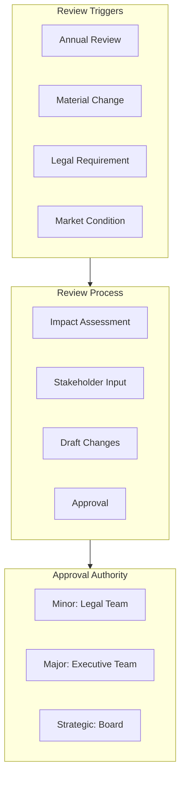

### Policy Change Classification

| Change Type | Examples | Approval | Notice Period |
|-------------|----------|----------|---------------|
| **Clarification** | Wording improvements, examples | Legal Team | None |
| **Minor** | Process adjustments, tier changes | VP Legal | 30 days |
| **Major** | License terms, asset reclassification | Executive Team | 90 days |
| **Strategic** | Open/proprietary boundary shift | Board | 180 days |

### Governance Bodies

```yaml
governance_bodies:
  ip_council:
    chair: "Chief Legal Officer"
    members:
      - VP Engineering
      - VP Product
      - VP Partnerships
      - Patent Counsel
    frequency: "Monthly"
    scope:
      - IP portfolio management
      - Patent decisions
      - Trade secret classification

  open_source_committee:
    chair: "VP Engineering"
    members:
      - Engineering leads
      - Legal representative
      - Community liaison
    frequency: "Bi-weekly"
    scope:
      - Open source releases
      - Community governance
      - Contribution review

  partner_governance:
    chair: "VP Partnerships"
    members:
      - Partner managers
      - Legal representative
      - Technical liaison
    frequency: "Weekly"
    scope:
      - Partner tier decisions
      - Agreement negotiations
      - Ecosystem strategy
```

### Policy Documentation

| Document | Owner | Review Cycle | Distribution |
|----------|-------|--------------|--------------|
| This Policy | Legal | Annual | Public (summary) |
| CLA Terms | Legal | Annual | Public |
| Partner Agreement | Legal + Partnerships | Semi-annual | Partners |
| Employee IP Agreement | Legal + HR | Annual | Employees |
| Trademark Guidelines | Legal + Marketing | Semi-annual | Public |
| License Compliance Guide | Legal | Quarterly | Internal + Customers |

---

## Appendix A: Asset Classification Quick Reference

```yaml
asset_classification_reference:
  open_standard:
    - BASIS rule language specification
    - BASIS grammar (EBNF)
    - BASIS JSON schema
    - Client SDKs (Python, JS, Java, Go, .NET, Rust, Ruby)
    - OpenAPI specifications
    - Wire protocol specifications
    - Error code definitions
    - Data schemas (Intent, Proof, Trust, Error)
    - Reference documentation
    - Code samples and examples

  proprietary:
    - Cognigate execution runtime
    - Cognigate sandbox isolation
    - PROOF evidence recorder
    - PROOF hash chain implementation
    - PROOF storage engine
    - INTENT natural language parser
    - ENFORCE constraint evaluator
    - Trust scoring algorithms
    - Anomaly detection algorithms
    - Performance optimization code
    - Internal APIs
    - Operational tooling

  dual_license:
    - Developer tools (community + commercial)
    - IDE plugins (community + commercial)
    - Integration connectors (case by case)
    - Testing frameworks (community + commercial)
    - Monitoring adapters (community + commercial)
```

---

## Appendix B: Contact Information

| Topic | Contact |
|-------|---------|
| Licensing Questions | licensing@vorion.io |
| Patent Inquiries | patents@vorion.io |
| Trademark Usage | brand@vorion.io |
| Open Source | opensource@vorion.io |
| Partner Program | partners@vorion.io |
| Security Reports | security@vorion.io |
| Legal General | legal@vorion.io |

---

*Document Version: 1.0.0*
*Last Updated: 2026-01-08*
*Classification: Vorion Confidential*
