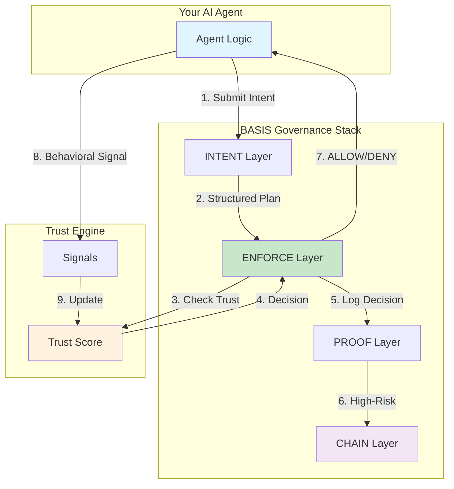
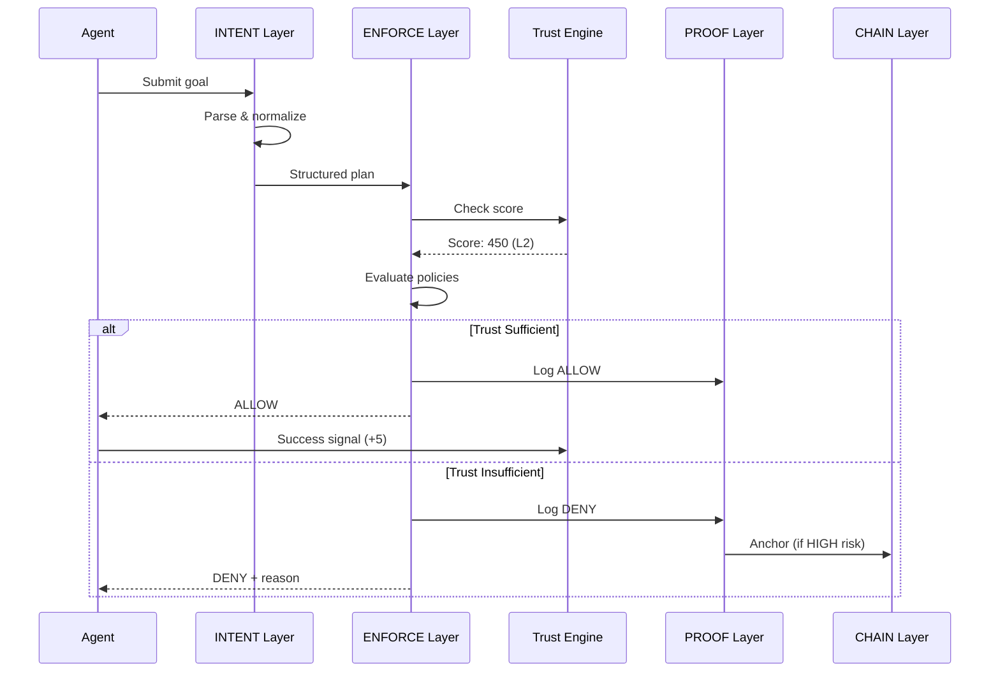
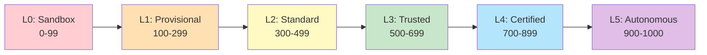

# Getting Started

## Overview

This guide walks you through implementing BASIS governance for your AI agent in under 10 minutes.

## Architecture Overview



## Quick Start (5 Minutes)

### Option 1: Use ATSF Core (TypeScript)

```bash
npm install @vorionsys/atsf-core
```

```typescript
import {
  createTrustEngine,
  createEnforcementService
} from '@vorionsys/atsf-core';

// 1. Initialize Trust Engine
const trustEngine = createTrustEngine({
  decayRate: 0.01,
  decayIntervalMs: 60000,
});

// 2. Register your agent
await trustEngine.initializeEntity('my-agent', 1); // Start at L1 (Provisional)

// 3. Create enforcement service
const enforce = createEnforcementService({ trustEngine });

// 4. Gate every action
const decision = await enforce.gate({
  agentId: 'my-agent',
  action: 'read_user_data',
  capabilities: ['data/read_user'],
  risk: 'limited',
});

if (decision.allowed) {
  // Proceed with action
  console.log('Action allowed');

  // Record success signal
  await trustEngine.recordSignal({
    id: crypto.randomUUID(),
    entityId: 'my-agent',
    type: 'behavioral.task_completed',
    value: 0.9,
    source: 'my-app',
    timestamp: new Date().toISOString(),
    metadata: { action: 'read_user_data' },
  });
} else {
  console.log('Action denied:', decision.reason);
}
```

### Option 2: Use Cognigate (Docker)

```bash
git clone https://github.com/voriongit/cognigate.git
cd cognigate
docker-compose up -d
```

```typescript
// Your agent calls Cognigate's API before any action
const gate = await fetch('http://localhost:8000/v1/enforce/gate', {
  method: 'POST',
  headers: { 'Content-Type': 'application/json' },
  body: JSON.stringify({
    agentId: 'ag_your_agent',
    intentId: intent.id,
    requestedCapabilities: ['data/read_user']
  })
});

const decision = await gate.json();

if (decision.decision === 'ALLOW') {
  // Proceed with action
} else {
  // Handle denial
}
```

## Trust Flow Diagram



## Build Your Own Implementation

### Layer Architecture

```mermaid
graph LR
    subgraph L1["Layer 1: INTENT"]
        I1[Parse Request]
        I2[Normalize Goals]
        I3[Extract Capabilities]
    end

    subgraph L2["Layer 2: ENFORCE"]
        E1[Policy Check]
        E2[Trust Gate]
        E3[Decision]
    end

    subgraph L3["Layer 3: PROOF"]
        P1[Hash Chain]
        P2[Signatures]
        P3[Receipts]
    end

    subgraph L4["Layer 4: CHAIN"]
        C1[Batch Proofs]
        C2[Merkle Tree]
        C3[Polygon Anchor]
    end

    I1 --> I2 --> I3 --> E1
    E1 --> E2 --> E3 --> P1
    P1 --> P2 --> P3 --> C1
    C1 --> C2 --> C3
```



### 1. INTENT Layer

Parse agent requests into structured intents:

```typescript
interface Intent {
  intentId: string;
  action: string;
  capabilities: string[];
  risk: 'MINIMAL' | 'LOW' | 'HIGH' | 'CRITICAL';
}

function parseIntent(request: string): Intent {
  // Use LLM or rule-based parsing
  return {
    intentId: crypto.randomUUID(),
    action: extractAction(request),
    capabilities: extractCapabilities(request),
    risk: classifyRisk(request),
  };
}
```

### 2. ENFORCE Layer

Check trust and policies:

```typescript
import { createTrustEngine, TRUST_THRESHOLDS } from '@vorionsys/atsf-core';

const CAPABILITY_THRESHOLDS: Record<string, number> = {
  'data/read_public': 1,    // L1: Provisional
  'data/read_user': 2,      // L2: Standard
  'data/write': 3,          // L3: Trusted
  'system/execute': 4,      // L4: Certified
  'system/admin': 5,        // L5: Autonomous
};

async function gate(intent: Intent): Promise<Decision> {
  const record = await trustEngine.getScore(intent.agentId);

  if (!record) {
    return { decision: 'DENY', reason: 'Unknown agent' };
  }

  for (const cap of intent.capabilities) {
    const requiredLevel = CAPABILITY_THRESHOLDS[cap] ?? 3;
    if (record.level < requiredLevel) {
      return {
        decision: 'DENY',
        reason: `Capability "${cap}" requires L${requiredLevel}, agent is L${record.level}`,
      };
    }
  }

  return { decision: 'ALLOW', trustLevel: record.level };
}
```

### 3. PROOF Layer

Log all decisions with cryptographic integrity:

```typescript
import { createHash, sign } from 'crypto';

interface ProofRecord {
  proofId: string;
  hash: string;
  previousHash: string;
  signature: string;
  data: Decision;
  timestamp: string;
}

let lastHash = '0'.repeat(64);

async function logProof(decision: Decision): Promise<ProofRecord> {
  const data = JSON.stringify(decision);
  const hash = createHash('sha256').update(data + lastHash).digest('hex');

  const record: ProofRecord = {
    proofId: `prf_${crypto.randomUUID()}`,
    hash,
    previousHash: lastHash,
    signature: sign('sha256', Buffer.from(hash), privateKey).toString('hex'),
    data: decision,
    timestamp: new Date().toISOString(),
  };

  lastHash = hash;
  await store(record);
  return record;
}
```

### 4. CHAIN Layer

Anchor high-risk decisions to Polygon:

```typescript
import { createChainAnchor } from './chain-anchor';

const chainAnchor = createChainAnchor({
  network: 'amoy', // Use 'mainnet' for production
  contractAddress: process.env.ANCHOR_CONTRACT!,
  privateKey: process.env.POLYGON_PRIVATE_KEY!,
});

async function anchor(proof: ProofRecord): Promise<void> {
  if (proof.data.risk === 'HIGH' || proof.data.risk === 'CRITICAL') {
    await chainAnchor.anchorBatch([{
      proofHash: `0x${proof.hash}`,
      agentId: proof.data.agentId,
    }]);
  }
}
```

## Trust Tier Reference



| Level | Name | Capabilities |
|-------|------|--------------|
| L0 | Sandbox | Read-only, no external access |
| L1 | Provisional | Basic operations, monitored |
| L2 | Standard | Standard tools, logging required |
| L3 | Trusted | Extended tools, reduced oversight |
| L4 | Certified | Privileged operations |
| L5 | Autonomous | Full capabilities |

## Validate Compliance

Run the test suite:

```bash
npx @basis-protocol/compliance-tests --target http://localhost:8000
```

Expected output:
```
BASIS Compliance Test Suite v1.0

✓ INTENT: Request parsing
✓ INTENT: Capability extraction
✓ ENFORCE: Trust gate
✓ ENFORCE: Policy evaluation
✓ PROOF: Hash chain integrity
✓ PROOF: Signature verification
✓ CHAIN: Anchor verification (if configured)

7/7 tests passed
```

## Next Steps

- [Compliance Tests](/implement/compliance-tests) - Full test coverage
- [Get Certified](/implement/certification) - Official certification process
- [Trust Scoring](/spec/trust-scoring) - Deep dive into trust mechanics
- [Regulatory Compliance](/spec/regulatory-compliance) - EU AI Act & NIST alignment
