# Color Theming & Branding Guide
## For: Designers, Marketing, Documentation Teams

### Vorion Brand Colors

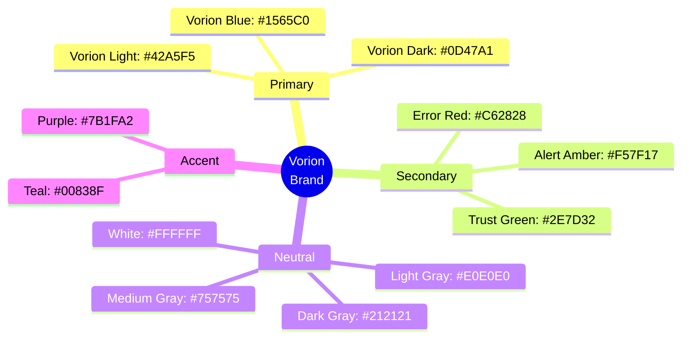

### Product Brand Colors

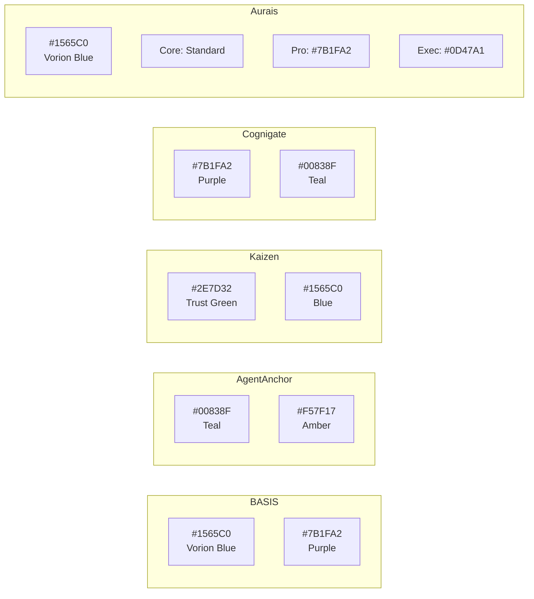

### Trust Tier Colors

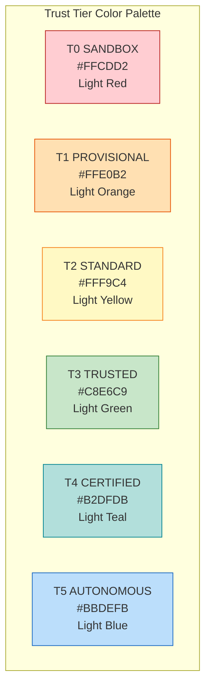

### Status Colors

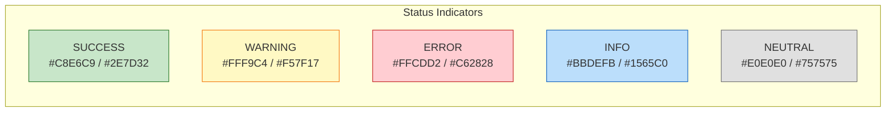

### Mermaid Theme Configuration


### CSS Variables for Diagrams

```css
/* Vorion Diagram Theme Variables */
:root {
  /* Primary Brand */
  --vorion-blue: #1565C0;
  --vorion-dark: #0D47A1;
  --vorion-light: #42A5F5;

  /* Trust Tiers */
  --tier-0-bg: #FFCDD2;
  --tier-0-border: #B71C1C;
  --tier-1-bg: #FFE0B2;
  --tier-1-border: #E65100;
  --tier-2-bg: #FFF9C4;
  --tier-2-border: #F57F17;
  --tier-3-bg: #C8E6C9;
  --tier-3-border: #2E7D32;
  --tier-4-bg: #B2DFDB;
  --tier-4-border: #00838F;
  --tier-5-bg: #BBDEFB;
  --tier-5-border: #1565C0;

  /* Status */
  --success-bg: #C8E6C9;
  --success-text: #2E7D32;
  --warning-bg: #FFF9C4;
  --warning-text: #F57F17;
  --error-bg: #FFCDD2;
  --error-text: #C62828;
  --info-bg: #BBDEFB;
  --info-text: #1565C0;

  /* Neutral */
  --gray-900: #212121;
  --gray-600: #757575;
  --gray-200: #E0E0E0;
  --white: #FFFFFF;
}
```

### Applying Styles in Mermaid

```markdown
## Inline Styling Example

\`\`\`mermaid
flowchart TB
    A[Standard Node]
    B[Success Node]
    C[Error Node]
    D[Warning Node]

    A --> B
    A --> C
    A --> D

    style B fill:#C8E6C9,stroke:#2E7D32
    style C fill:#FFCDD2,stroke:#C62828
    style D fill:#FFF9C4,stroke:#F57F17
\`\`\`
```

### Layer Color Coding

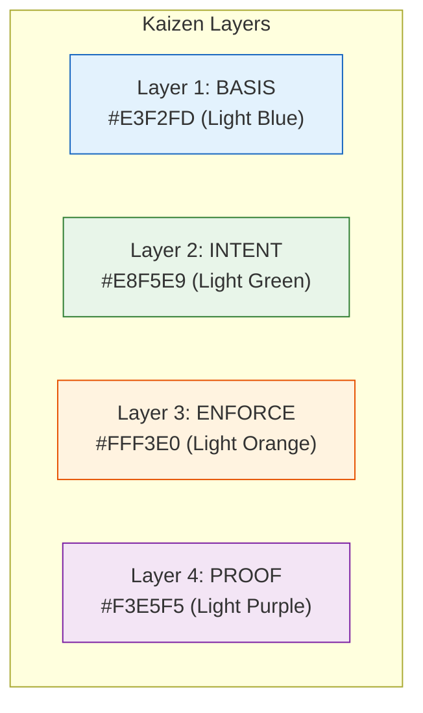

### Icon Conventions

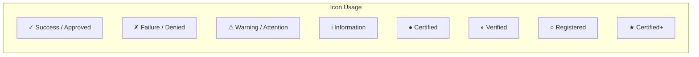

### Typography in Diagrams

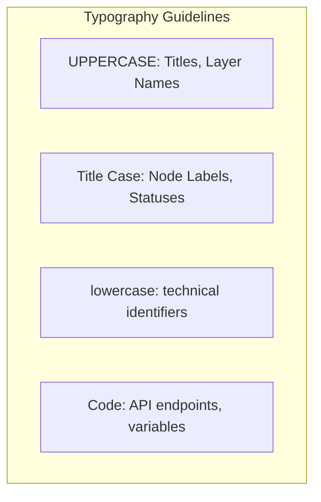

### Dark Mode Support

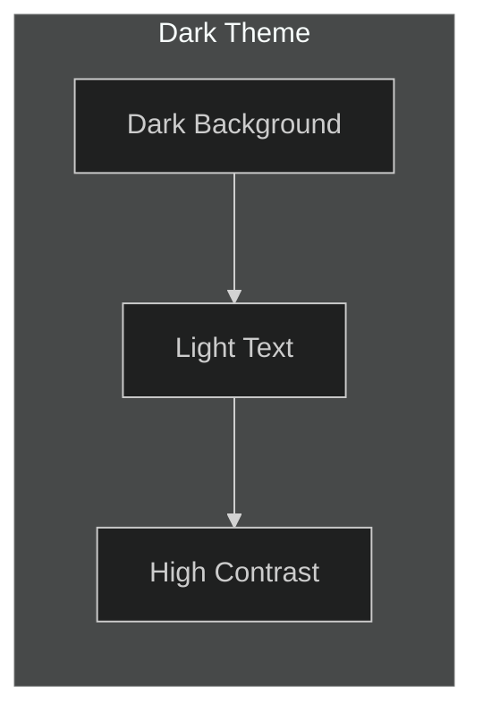

### Color Accessibility

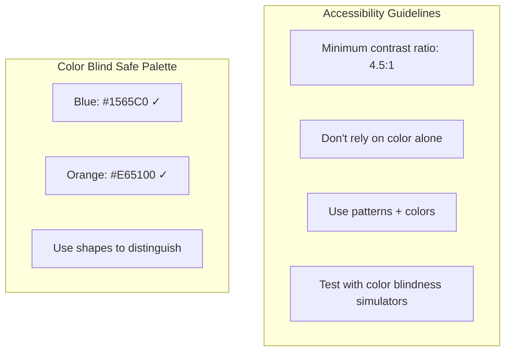

### Gradient Usage (Presentations Only)

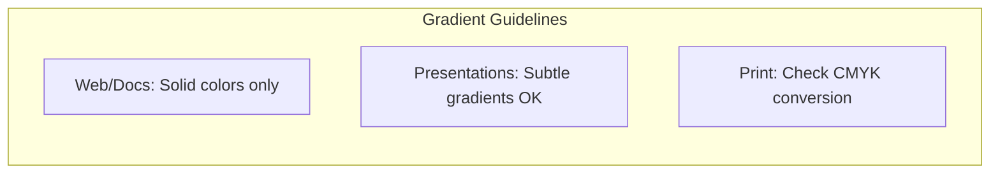

### Complete Color Reference Table

| Purpose | Light Mode | Dark Mode | Hex |
|---------|-----------|-----------|-----|
| **Primary** | Vorion Blue | Vorion Light | #1565C0 / #42A5F5 |
| **Background** | White | Dark Gray | #FFFFFF / #212121 |
| **Text** | Dark Gray | Light Gray | #212121 / #E0E0E0 |
| **Border** | Medium Gray | Medium Gray | #757575 |
| **Link** | Vorion Blue | Vorion Light | #1565C0 / #42A5F5 |
| **Success** | Green | Light Green | #2E7D32 / #C8E6C9 |
| **Warning** | Amber | Light Amber | #F57F17 / #FFF9C4 |
| **Error** | Red | Light Red | #C62828 / #FFCDD2 |

### Brand Asset Locations

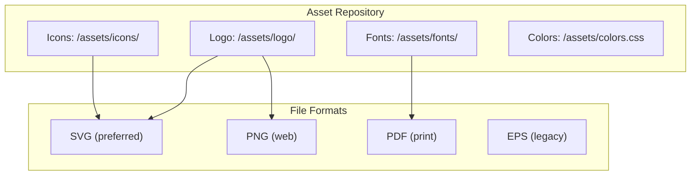
