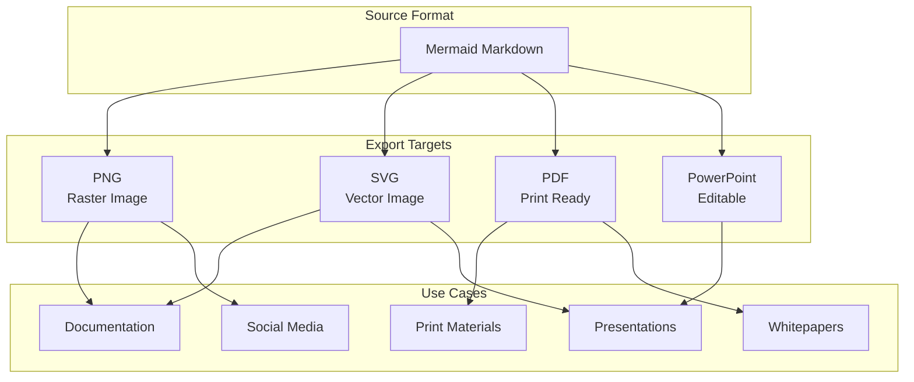
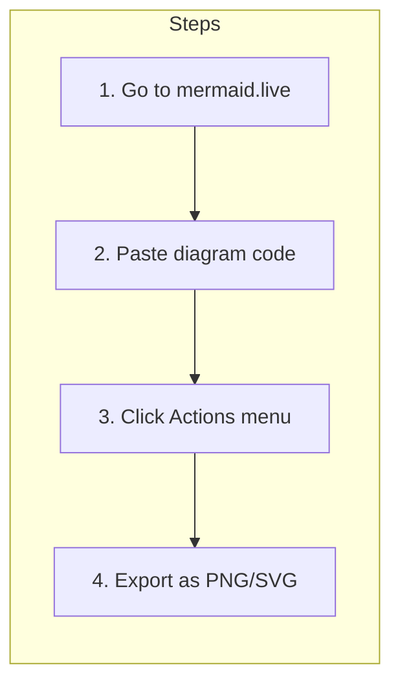
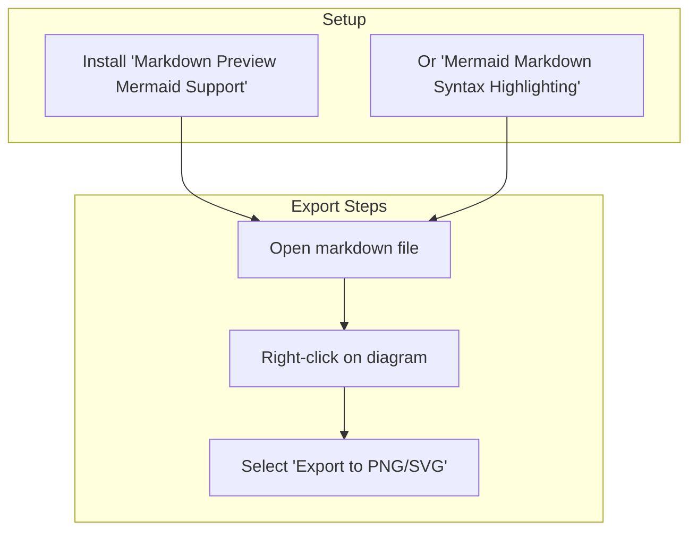
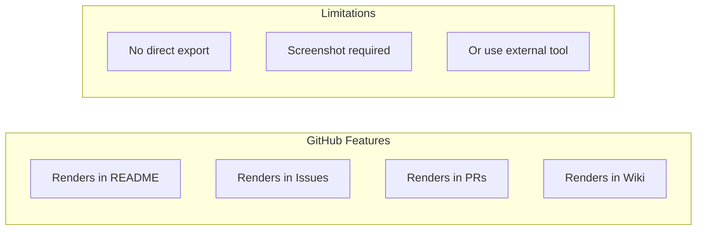
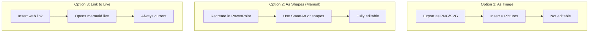
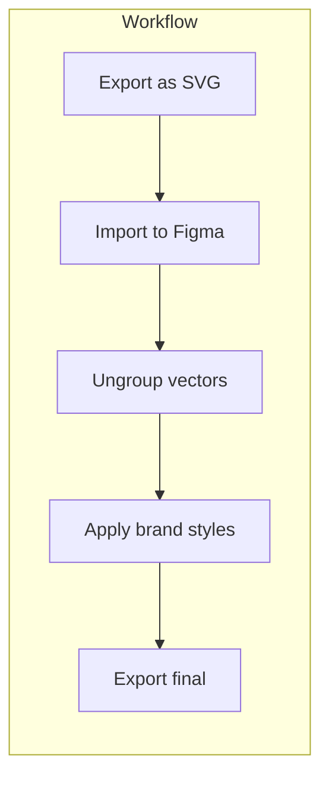
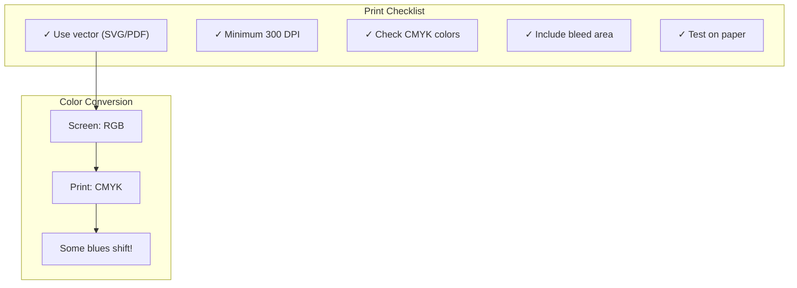
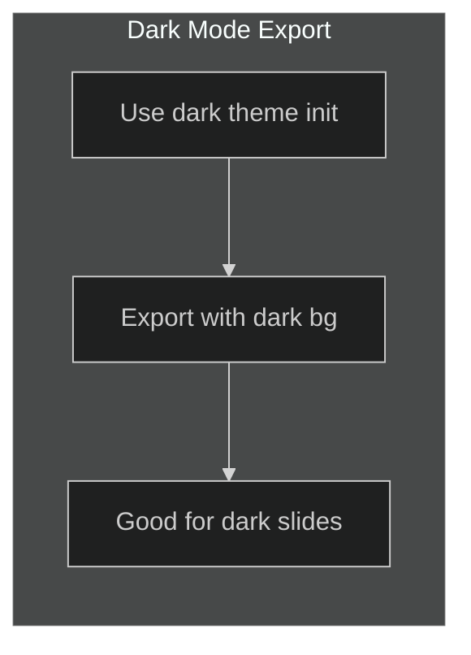
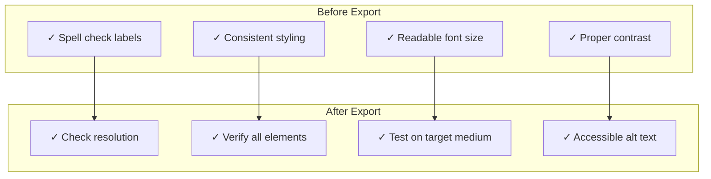

# Diagram Export Guide
## For: Marketing, Documentation, Presentation Teams

### Export Options Overview



### Method 1: Mermaid Live Editor



**URL:** https://mermaid.live

**Features:**
- Real-time preview
- Multiple export formats (PNG, SVG)
- Adjustable resolution
- Theme selection
- Direct link sharing

### Method 2: Mermaid CLI

```bash
# Install
npm install -g @mermaid-js/mermaid-cli

# Export single file
mmdc -i diagram.mmd -o diagram.png
mmdc -i diagram.mmd -o diagram.svg
mmdc -i diagram.mmd -o diagram.pdf

# Export with custom config
mmdc -i diagram.mmd -o diagram.png -c mermaid.config.json

# Batch export
for file in *.mmd; do
  mmdc -i "$file" -o "${file%.mmd}.png"
done
```

### Method 3: VS Code Extension



### Method 4: GitHub Native Rendering



### Resolution Guidelines

| Use Case | Recommended Resolution | Format |
|----------|----------------------|--------|
| **Documentation** | 2x (retina) | PNG or SVG |
| **Presentations (1080p)** | 1920x1080 min | PNG |
| **Presentations (4K)** | 3840x2160 min | PNG or SVG |
| **Print (letter)** | 300 DPI, 2550x3300 | PDF or PNG |
| **Print (A4)** | 300 DPI, 2480x3508 | PDF or PNG |
| **Social Media** | Platform specific | PNG |
| **Email** | 600px width max | PNG |

### Mermaid CLI Configuration

```json
{
  "theme": "base",
  "themeVariables": {
    "primaryColor": "#1565C0",
    "primaryTextColor": "#FFFFFF",
    "primaryBorderColor": "#0D47A1",
    "lineColor": "#757575",
    "secondaryColor": "#E3F2FD",
    "tertiaryColor": "#F5F5F5"
  },
  "flowchart": {
    "curve": "basis",
    "padding": 20
  },
  "sequence": {
    "mirrorActors": false,
    "messageMargin": 40
  },
  "fontSize": 16,
  "fontFamily": "Inter, system-ui, sans-serif"
}
```

### Batch Export Script

```bash
#!/bin/bash
# export-diagrams.sh

# Configuration
INPUT_DIR="./docs/diagrams"
OUTPUT_DIR="./exports"
CONFIG="./mermaid.config.json"

# Create output directories
mkdir -p "$OUTPUT_DIR/png"
mkdir -p "$OUTPUT_DIR/svg"
mkdir -p "$OUTPUT_DIR/pdf"

# Find all markdown files with mermaid diagrams
find "$INPUT_DIR" -name "*.md" | while read file; do
    # Extract mermaid blocks and export
    basename=$(basename "$file" .md)
    dirname=$(dirname "$file" | sed "s|$INPUT_DIR/||")

    mkdir -p "$OUTPUT_DIR/png/$dirname"
    mkdir -p "$OUTPUT_DIR/svg/$dirname"

    echo "Exporting: $file"

    # Use mermaid-cli for each format
    mmdc -i "$file" -o "$OUTPUT_DIR/png/$dirname/$basename.png" -c "$CONFIG" -s 2
    mmdc -i "$file" -o "$OUTPUT_DIR/svg/$dirname/$basename.svg" -c "$CONFIG"
done

echo "Export complete!"
```

### PowerPoint Integration



### Figma/Design Tool Integration



### Print Considerations



### Social Media Sizing

| Platform | Recommended Size | Aspect Ratio |
|----------|-----------------|--------------|
| Twitter/X | 1200x675 | 16:9 |
| LinkedIn | 1200x627 | 1.91:1 |
| Facebook | 1200x630 | 1.91:1 |
| Instagram | 1080x1080 | 1:1 |
| Instagram Story | 1080x1920 | 9:16 |

### Dark Mode Exports



### Automated CI/CD Export

```yaml
# .github/workflows/export-diagrams.yml
name: Export Diagrams

on:
  push:
    paths:
      - 'docs/diagrams/**/*.md'

jobs:
  export:
    runs-on: ubuntu-latest
    steps:
      - uses: actions/checkout@v4

      - name: Setup Node
        uses: actions/setup-node@v4
        with:
          node-version: '20'

      - name: Install mermaid-cli
        run: npm install -g @mermaid-js/mermaid-cli

      - name: Export diagrams
        run: |
          mkdir -p exports
          find docs/diagrams -name "*.md" -exec mmdc -i {} -o exports/{}.png \;

      - name: Upload artifacts
        uses: actions/upload-artifact@v4
        with:
          name: diagram-exports
          path: exports/
```

### Quality Checklist



### Troubleshooting

| Issue | Solution |
|-------|----------|
| **Blurry export** | Increase scale factor (-s 2 or -s 3) |
| **Text cut off** | Add padding in config |
| **Colors wrong** | Check theme configuration |
| **Missing fonts** | Install fonts or use system fonts |
| **Large file size** | Use SVG instead of PNG |
| **CLI errors** | Update puppeteer: `npm update puppeteer` |

### Quick Reference Commands

```bash
# High-res PNG (2x scale)
mmdc -i input.md -o output.png -s 2

# SVG with custom background
mmdc -i input.md -o output.svg -b transparent

# PDF for print
mmdc -i input.md -o output.pdf -s 3

# With custom theme
mmdc -i input.md -o output.png -t dark

# With config file
mmdc -i input.md -o output.png -c config.json
```
