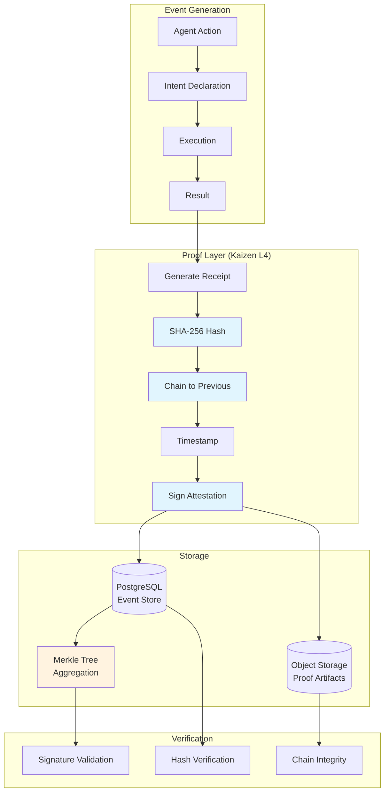
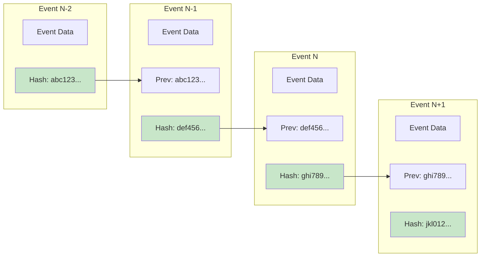
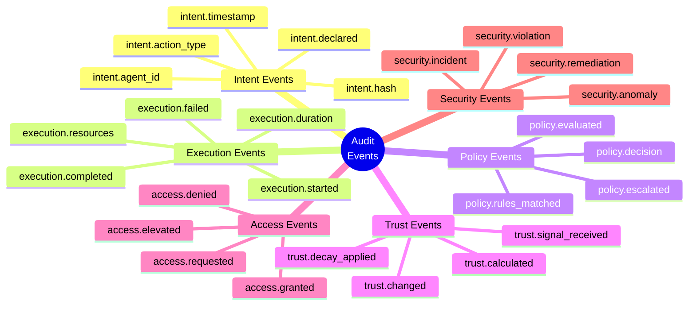
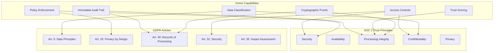
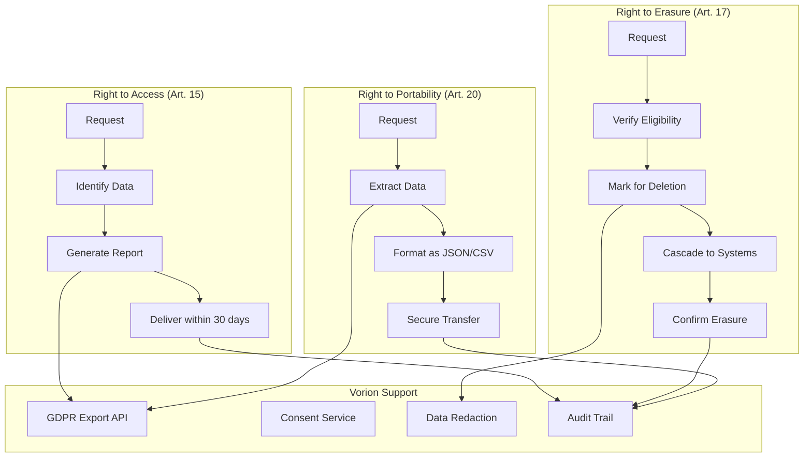
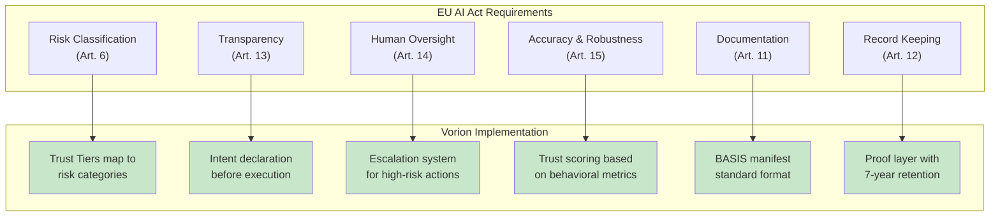
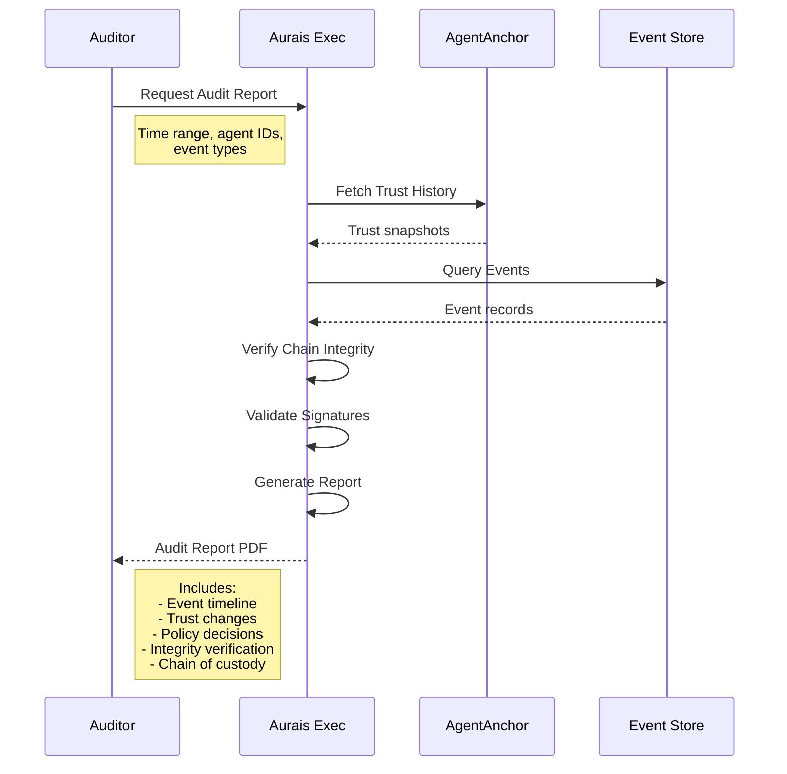
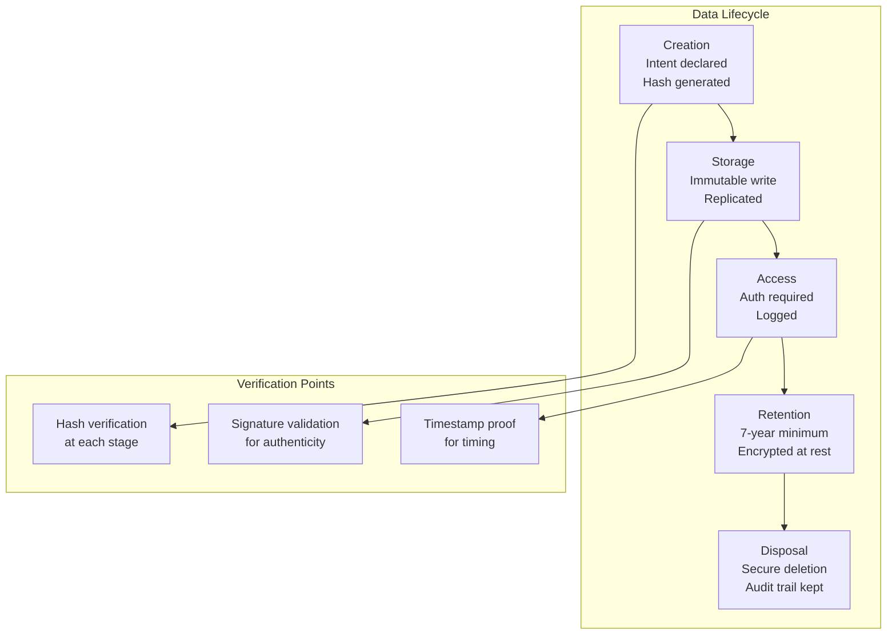
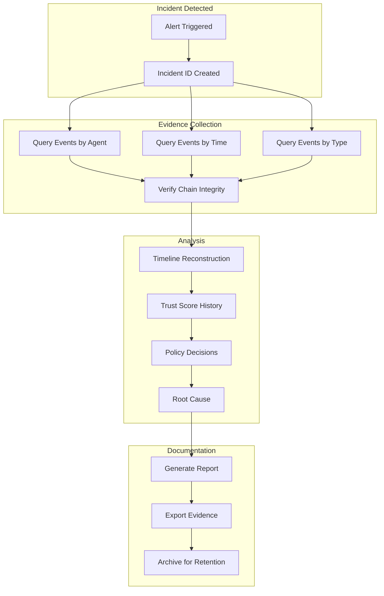
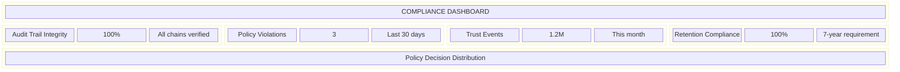

# Audit Trails & Compliance
## For: Compliance Officers, Auditors, Legal Teams

### Immutable Audit Trail Architecture

### Event Chain Structure

### What Gets Logged

### Compliance Framework Mapping

### Regulatory Coverage Matrix

| Requirement | SOC 2 | GDPR | ISO 27001 | HIPAA | EU AI Act | Vorion Feature |
|-------------|-------|------|-----------|-------|-----------|----------------|
| Access Control | CC6.1 | Art. 32 | A.9 | 164.312(a) | Art. 9 | Trust Gates |
| Audit Logging | CC7.2 | Art. 30 | A.12.4 | 164.312(b) | Art. 12 | Proof Layer |
| Data Integrity | CC7.1 | Art. 5 | A.12.2 | 164.312(c) | Art. 10 | Hash Chains |
| Incident Response | CC7.4 | Art. 33 | A.16 | 164.308(a) | Art. 62 | Alert System |
| Risk Assessment | CC3.2 | Art. 35 | A.8.2 | 164.308(a) | Art. 9 | Trust Scoring |
| Human Oversight | - | Art. 22 | - | - | Art. 14 | Escalation |
| Documentation | CC2.1 | Art. 30 | A.5.1 | 164.316 | Art. 11 | BASIS Spec |

### GDPR Data Subject Rights

### EU AI Act Compliance

### Audit Report Generation

### Chain of Custody

### Incident Investigation Flow

### Compliance Dashboard Metrics

