# Kaizen Layer Deep Dive
## For: Engineers, Security Architects, Platform Teams

### Kaizen: The Four-Layer Stack

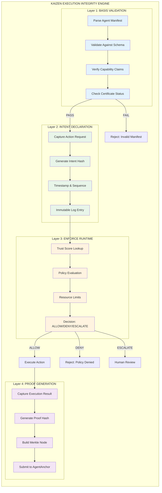

### Layer 1: BASIS Validation (Deep Dive)

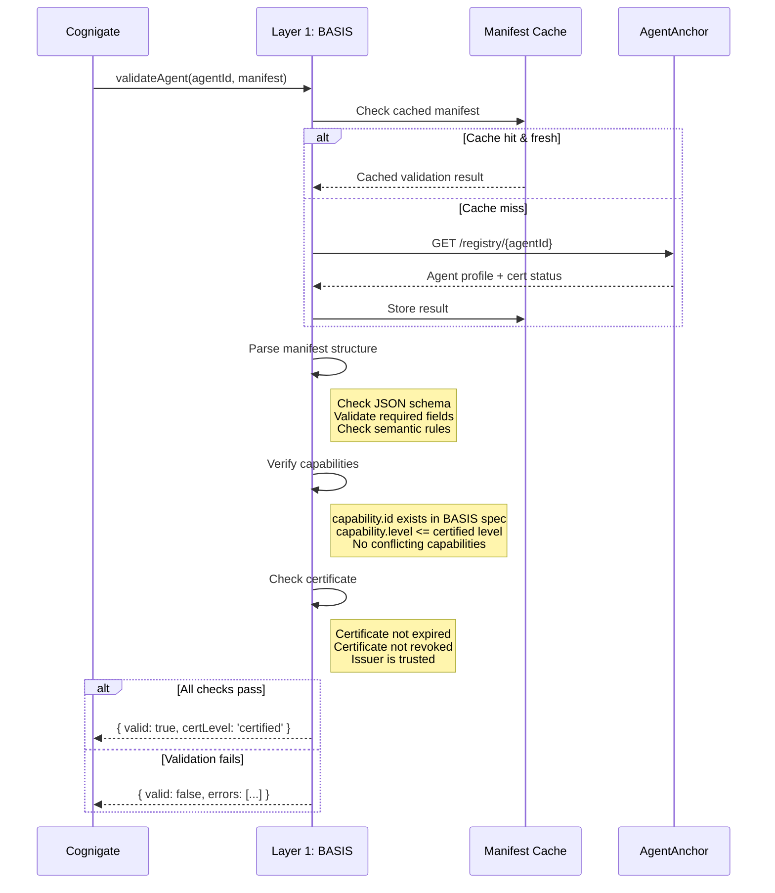

### BASIS Manifest Schema

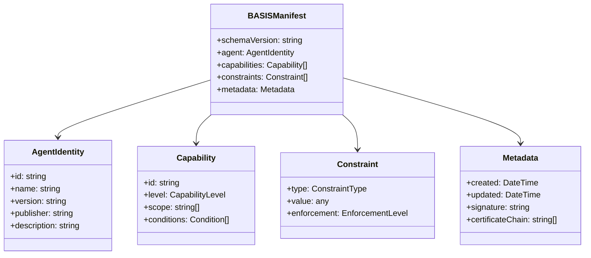

### Layer 2: Intent Declaration (Deep Dive)

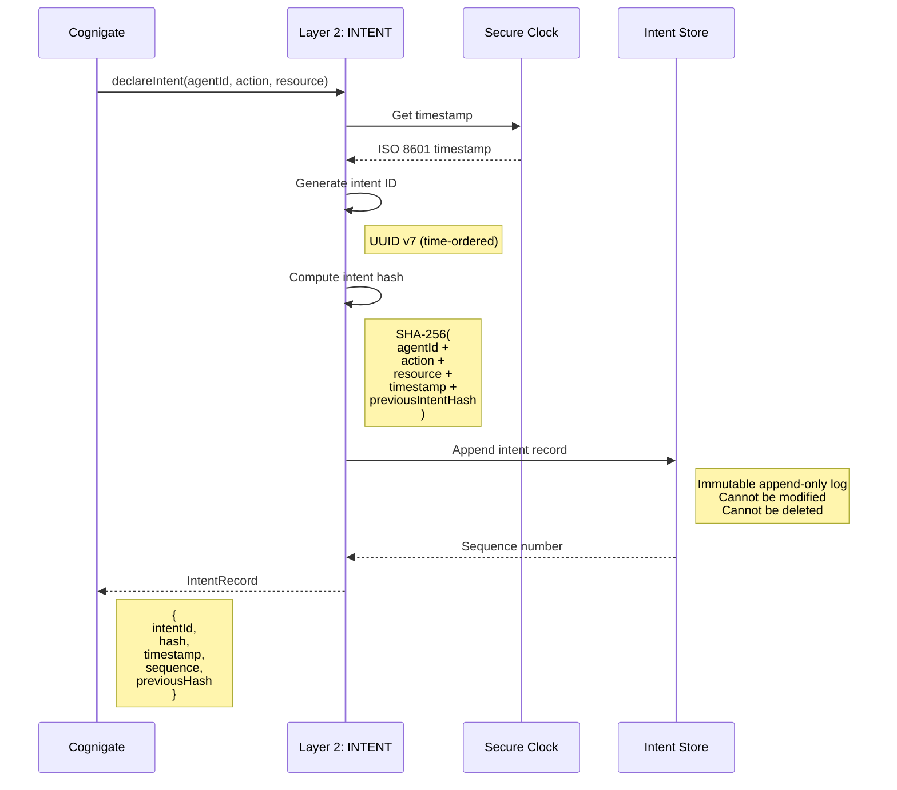

### Intent Chain Structure

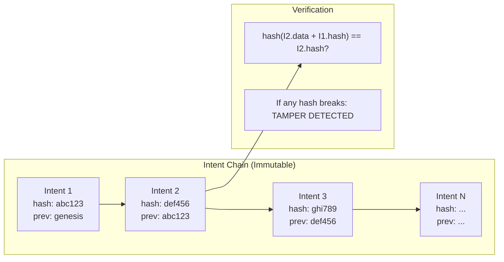

### Layer 3: Enforce Runtime (Deep Dive)

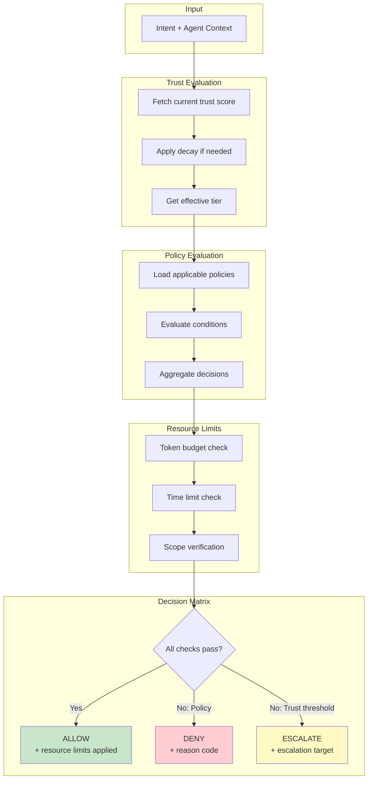

### Policy Evaluation Engine

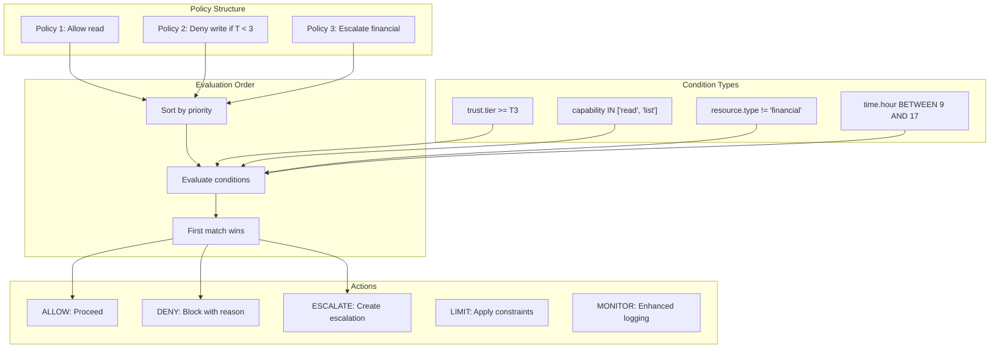

### Trust Score Calculation

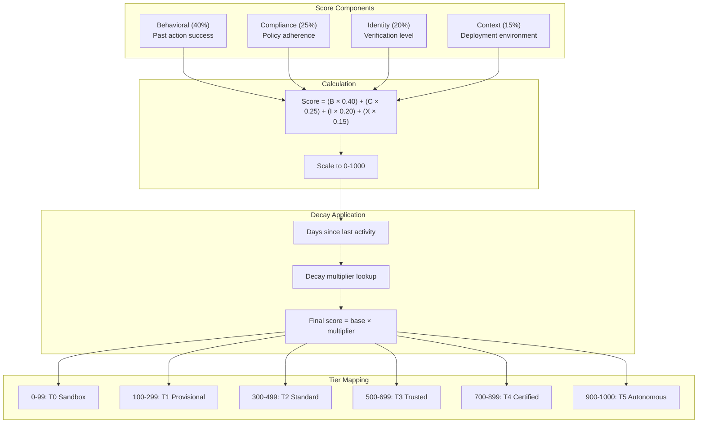

### Layer 4: Proof Generation (Deep Dive)

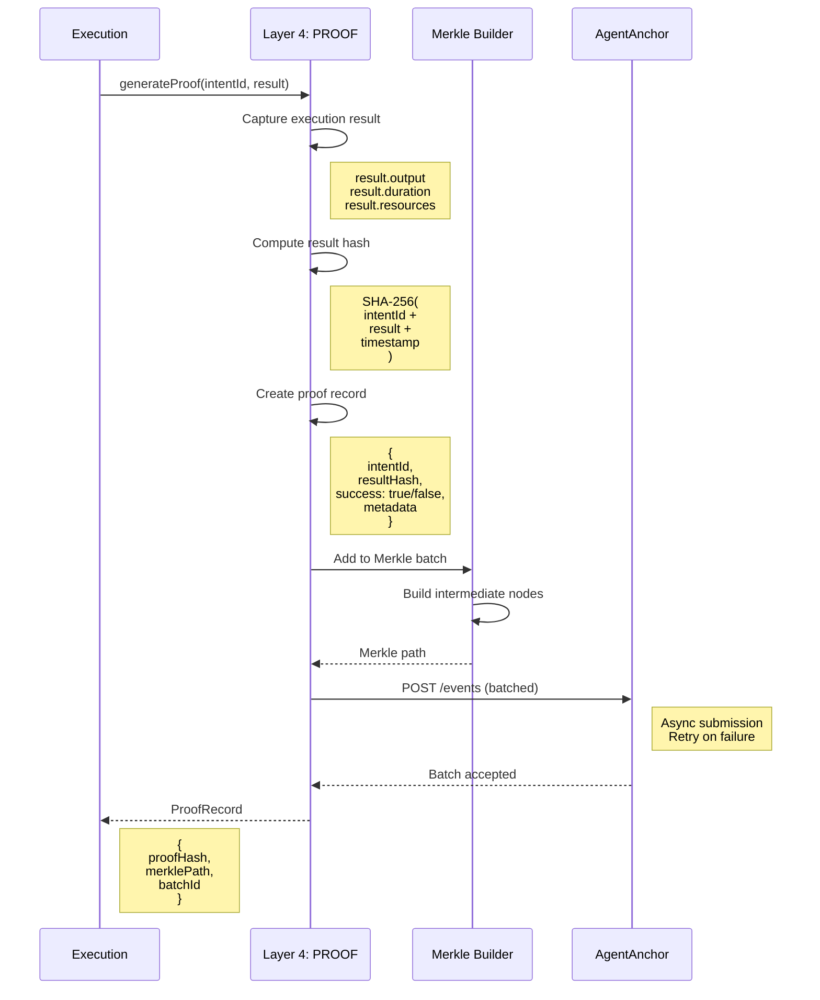

### Merkle Tree Structure

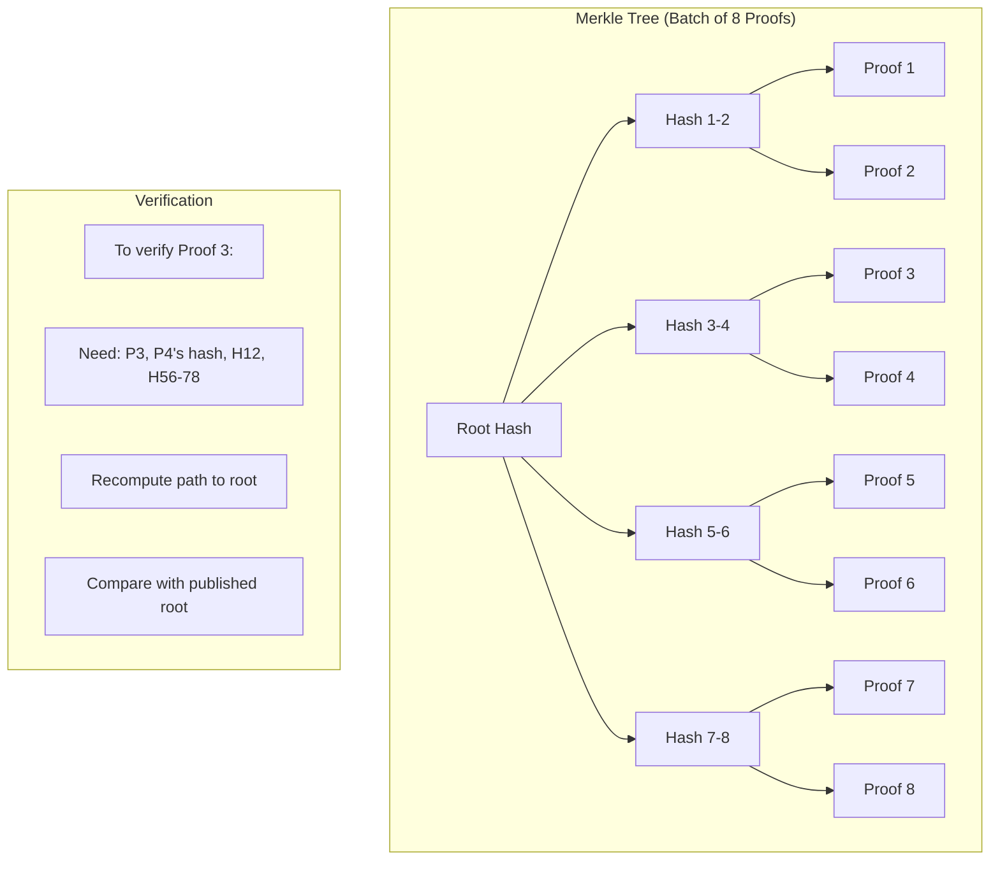

### Complete Request Flow

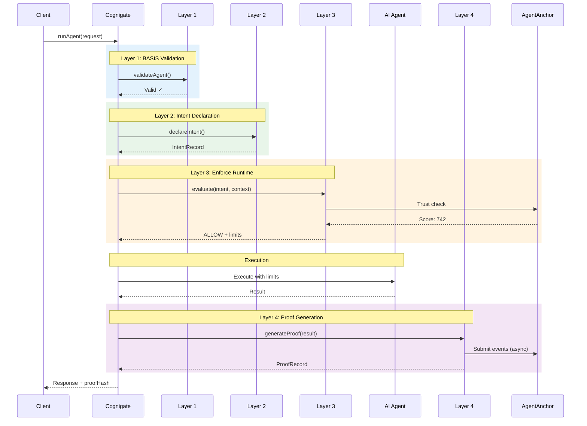

### Error Handling Across Layers

```mermaid
flowchart TB
    subgraph "Layer 1 Errors"
        L1E1[MANIFEST_INVALID]
        L1E2[SCHEMA_VERSION_UNSUPPORTED]
        L1E3[CAPABILITY_UNKNOWN]
        L1E4[CERTIFICATE_EXPIRED]
    end

    subgraph "Layer 2 Errors"
        L2E1[INTENT_DUPLICATE]
        L2E2[INTENT_CHAIN_BROKEN]
        L2E3[TIMESTAMP_INVALID]
    end

    subgraph "Layer 3 Errors"
        L3E1[TRUST_INSUFFICIENT]
        L3E2[POLICY_DENIED]
        L3E3[RESOURCE_EXCEEDED]
        L3E4[ESCALATION_REQUIRED]
    end

    subgraph "Layer 4 Errors"
        L4E1[PROOF_GENERATION_FAILED]
        L4E2[SUBMISSION_FAILED]
    end

    subgraph "Recovery Actions"
        R1[Reject request]
        R2[Log and continue]
        R3[Retry with backoff]
        R4[Escalate to human]
    end

    L1E1 --> R1
    L1E4 --> R1
    L2E1 --> R2
    L3E1 --> R4
    L3E2 --> R1
    L4E2 --> R3
```

### Performance Characteristics

| Layer | Typical Latency | Caching | Async |
|-------|----------------|---------|-------|
| L1: BASIS | 1-5ms | Heavy (5min TTL) | No |
| L2: INTENT | <1ms | No (must be fresh) | No |
| L3: ENFORCE | 2-10ms | Moderate (60s TTL) | No |
| L4: PROOF | 1-2ms (local) | No | Yes (batched) |

### Observability Points

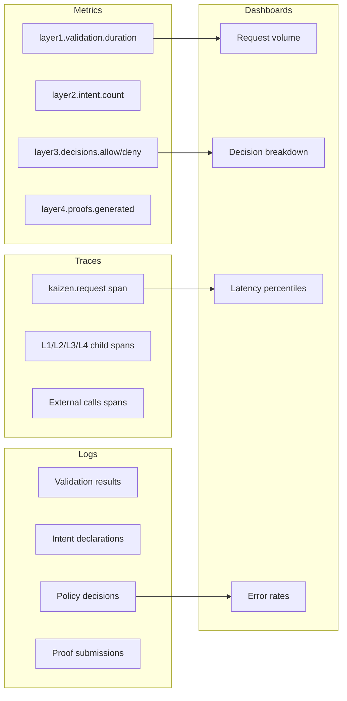
