# Trust Scoring Deep Dive
## For: Engineers, Product Managers, Data Scientists

### Trust Score Architecture

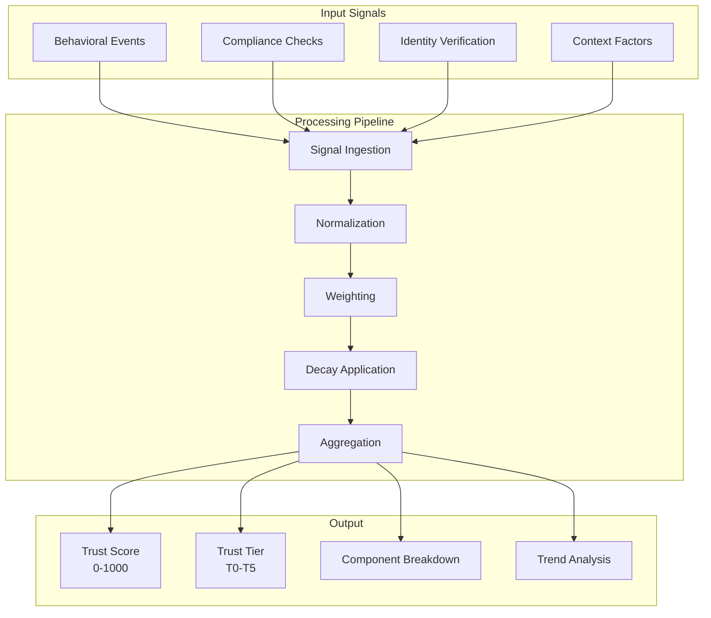

### Component Weights

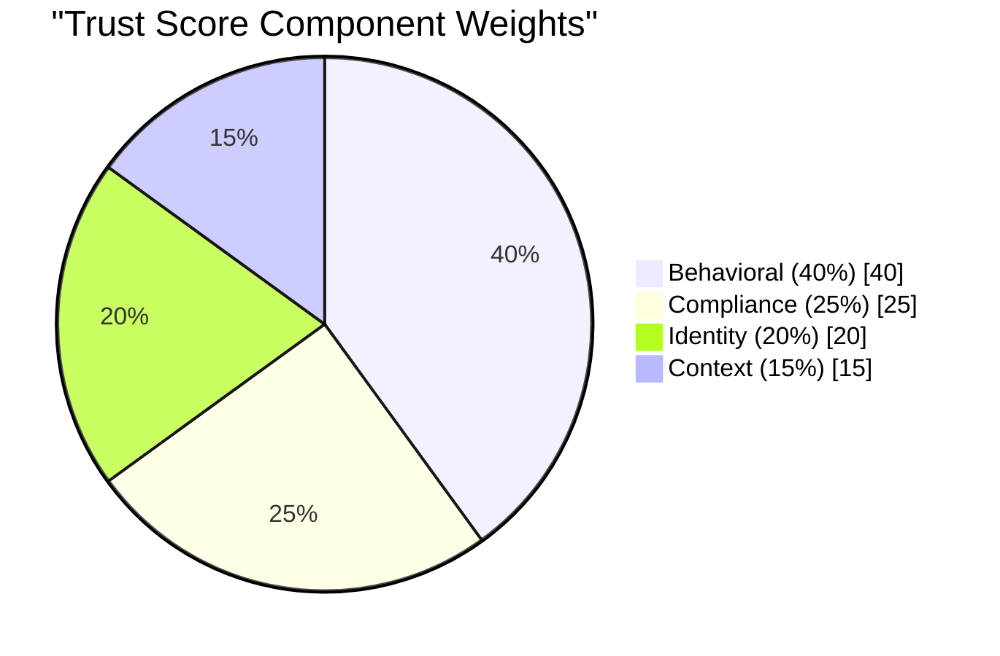

### Behavioral Score Calculation

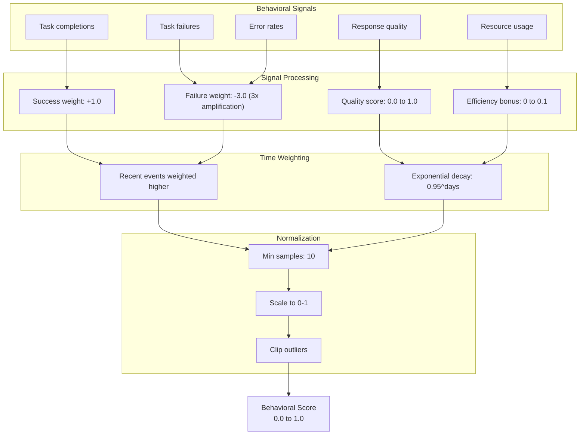

### Compliance Score Calculation

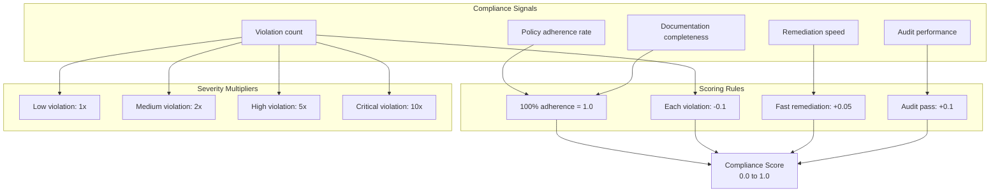

### Identity Score Calculation

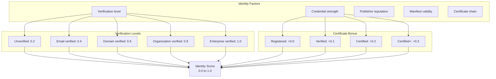

### Context Score Calculation

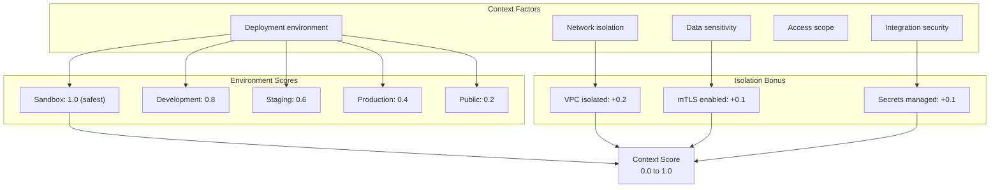

### Trust Decay Model

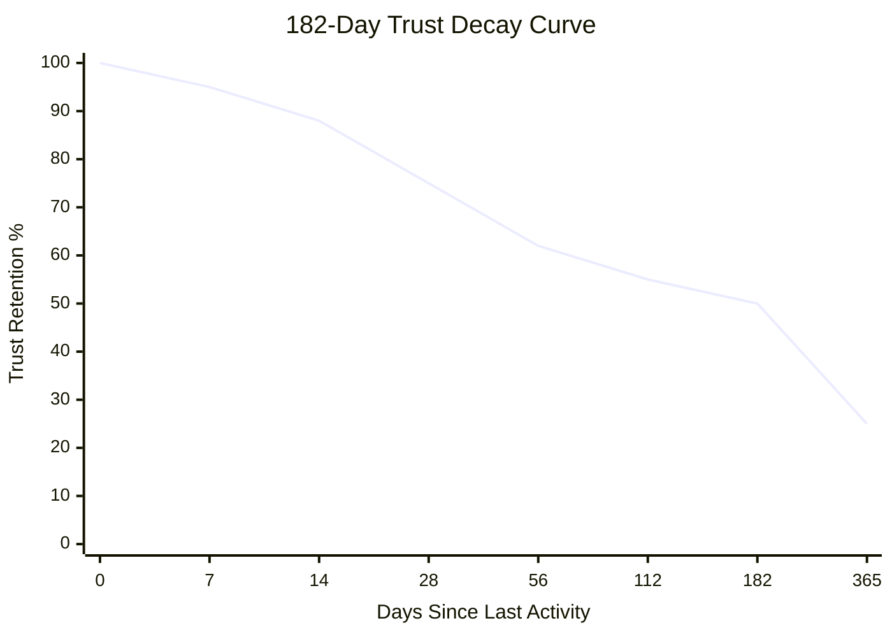

### Decay Milestone Table

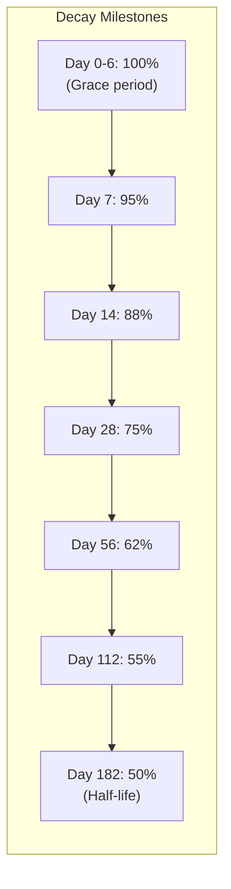

### Decay Interpolation

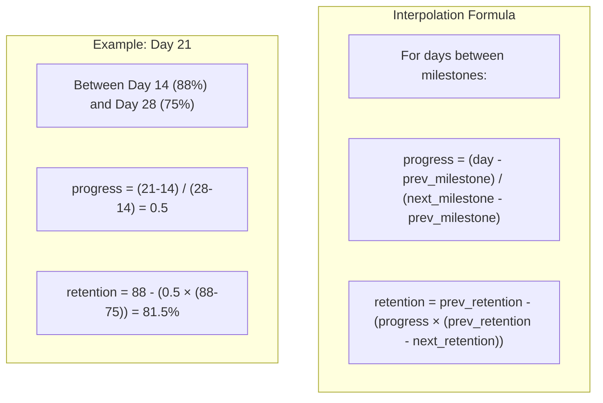

### Score Update Flow

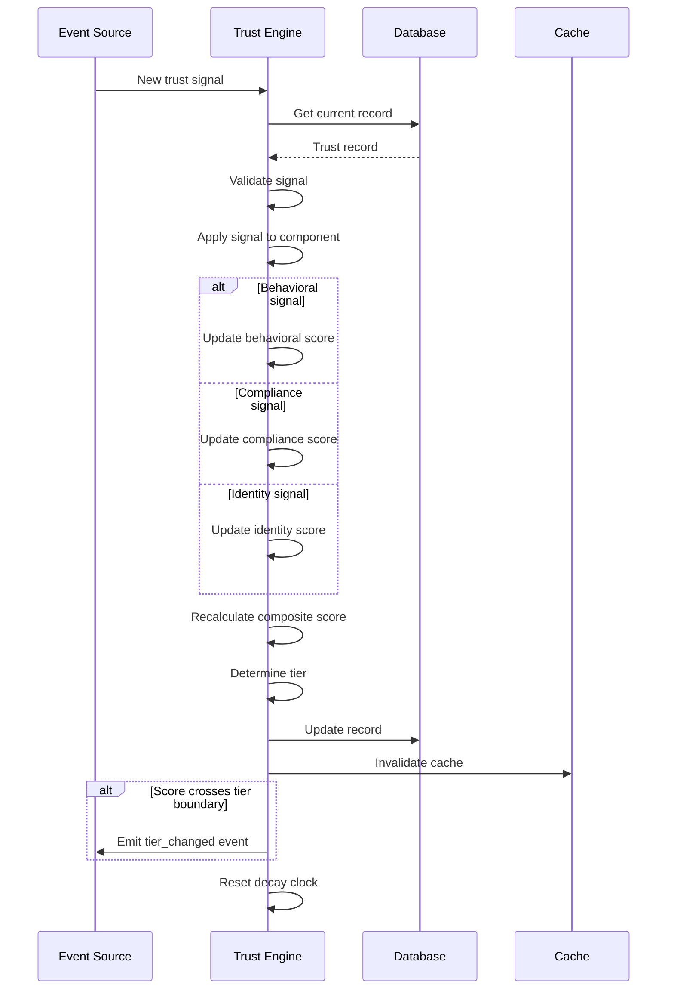

### Tier Thresholds

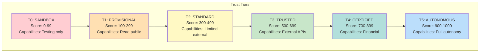

### Score History & Trends

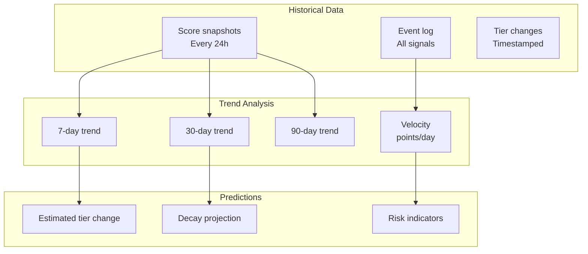

### Anti-Gaming Measures

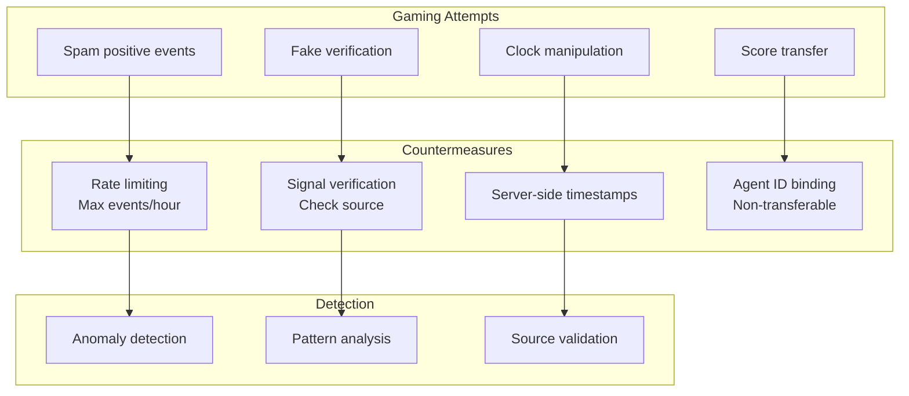

### Score API

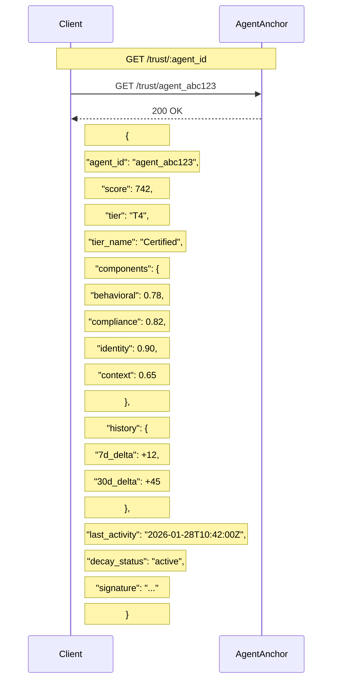
