# Developer Quickstart
## For: New Developers, Integration Engineers

### Getting Started in 5 Minutes

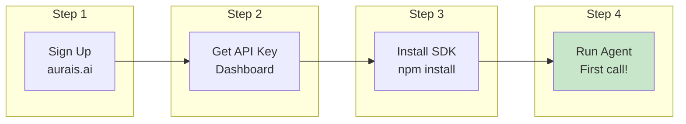

### Installation Options

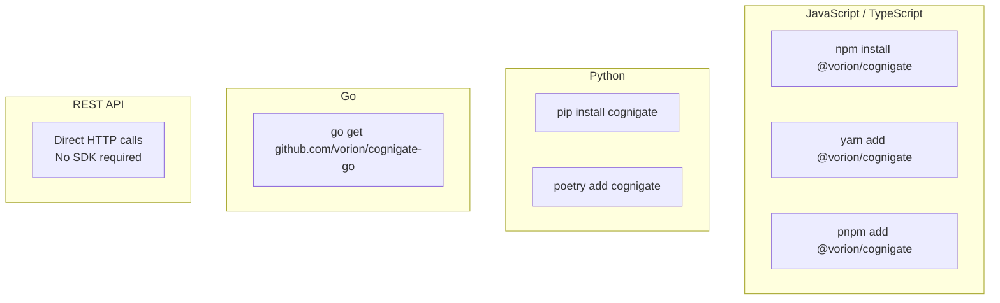

### First Agent Registration

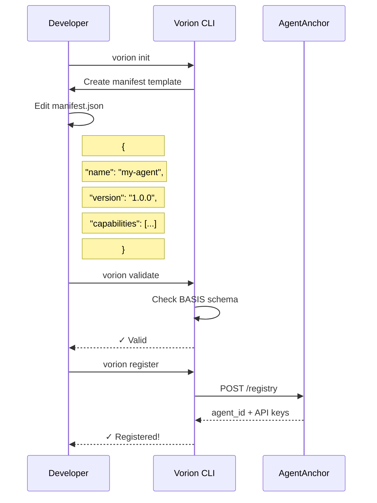

### Minimal Code Example

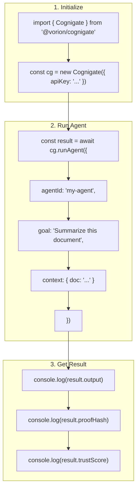

### Project Structure

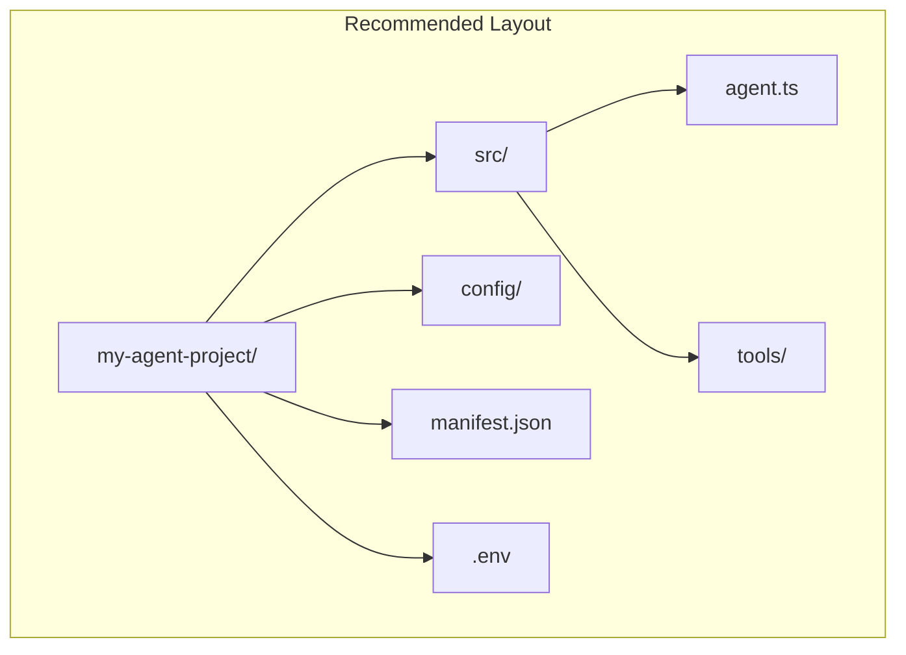

### Environment Variables

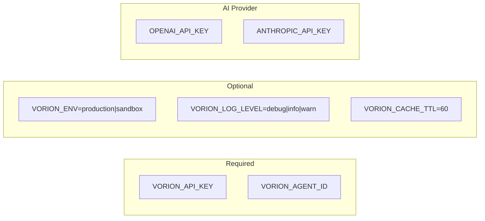

### Development Workflow

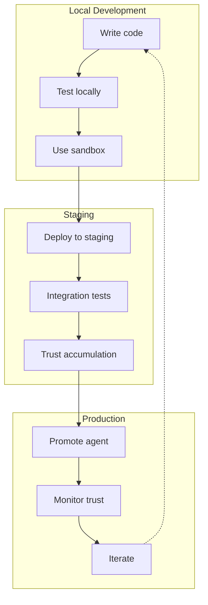

### Testing Your Agent

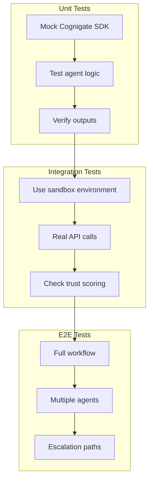

### Common Patterns

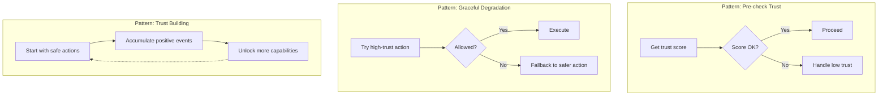

### Debugging

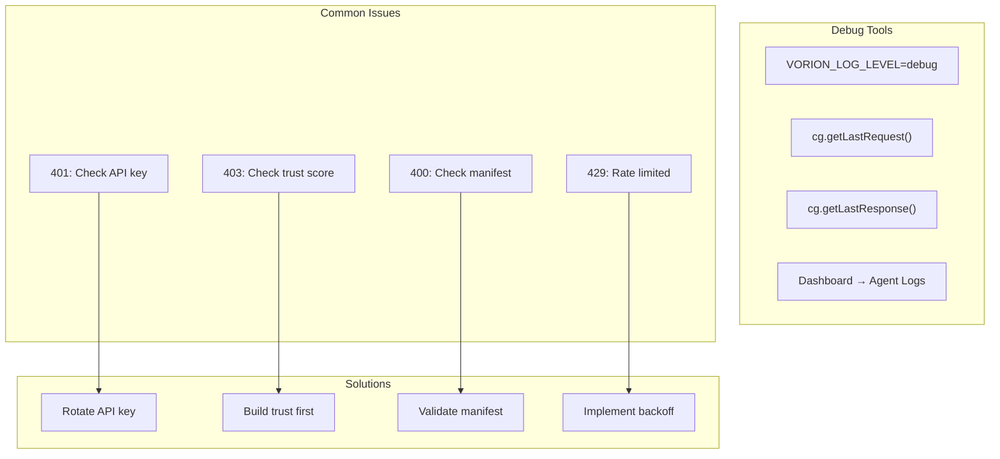

### SDK Reference Quick Look

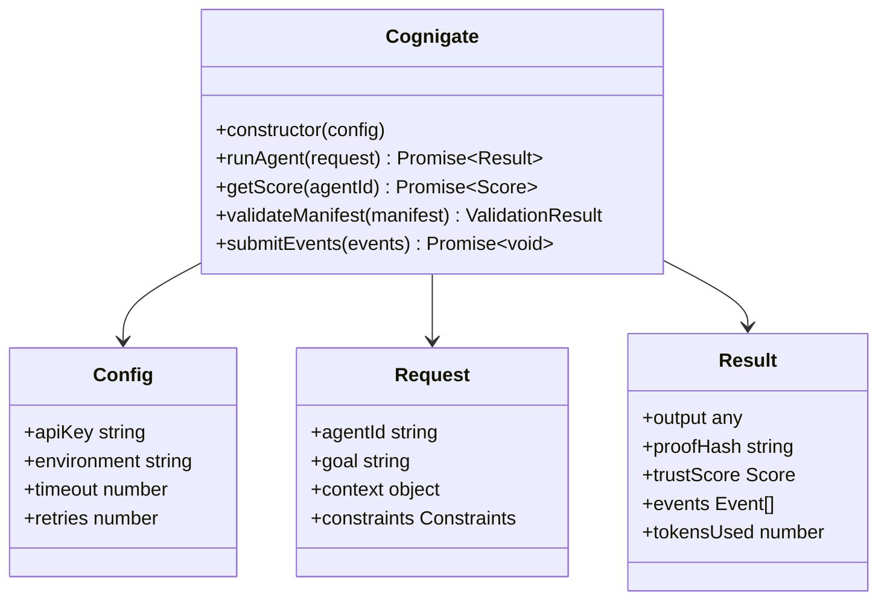

### Next Steps

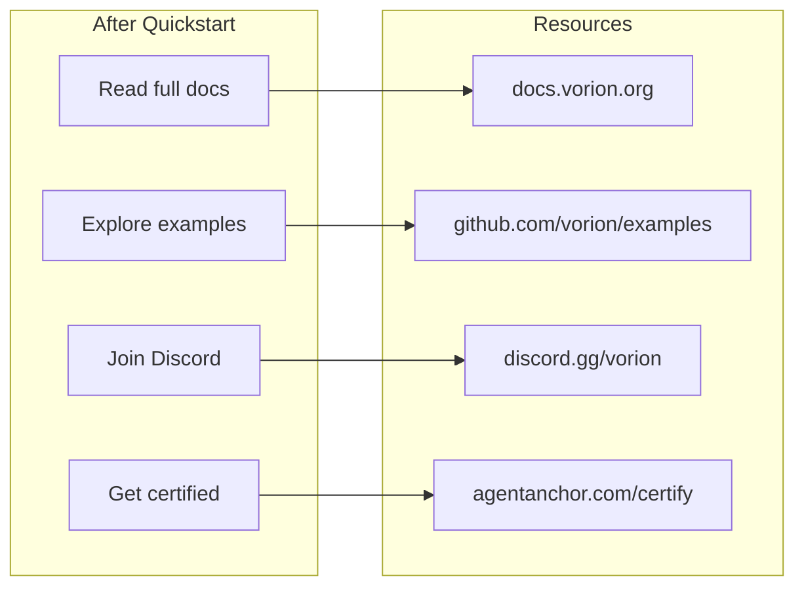
