# SDK Deep Dive
## For: Developers, Backend Engineers

### SDK Architecture

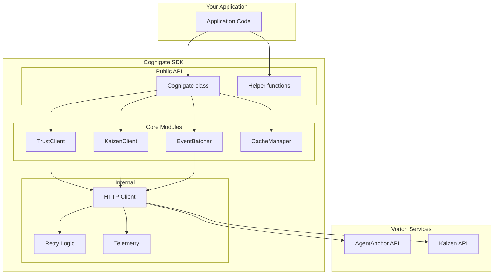

### Initialization Options

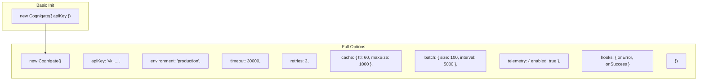

### Cache Management

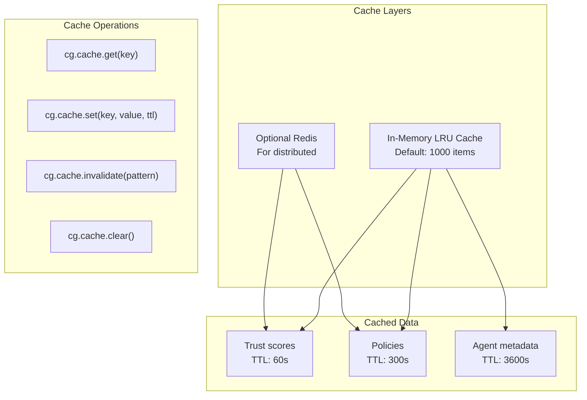

### Event Batching

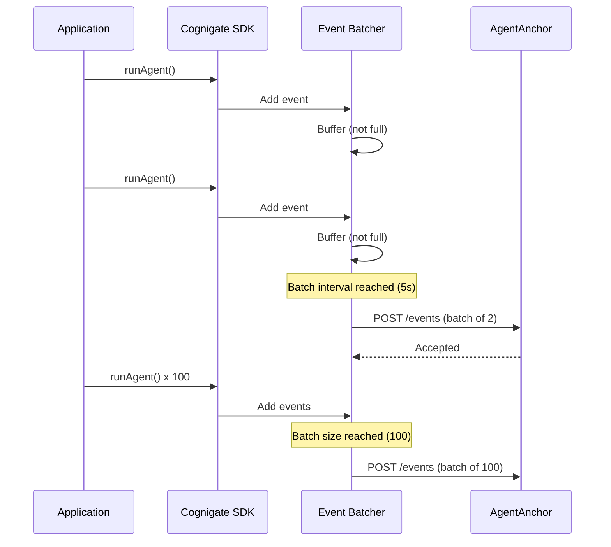

### Error Handling

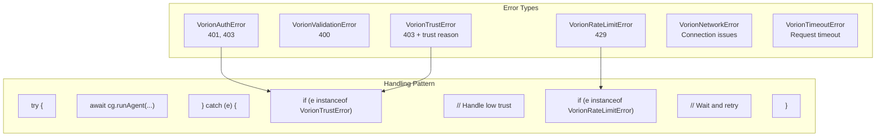

### Retry Strategy

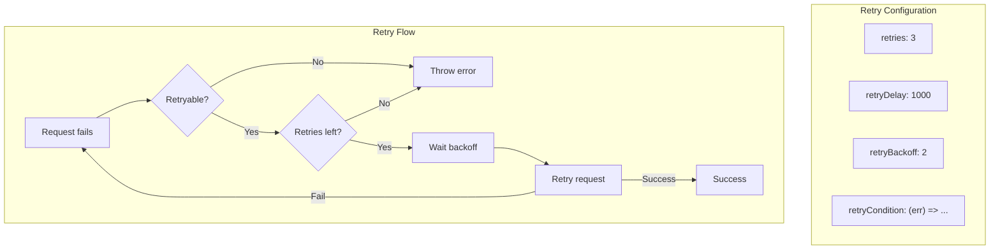

### Middleware / Hooks

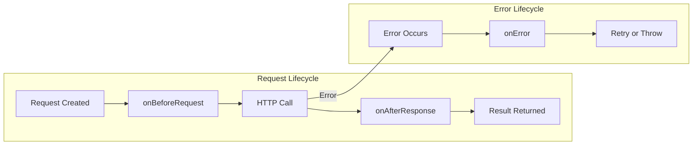

### Hook Examples

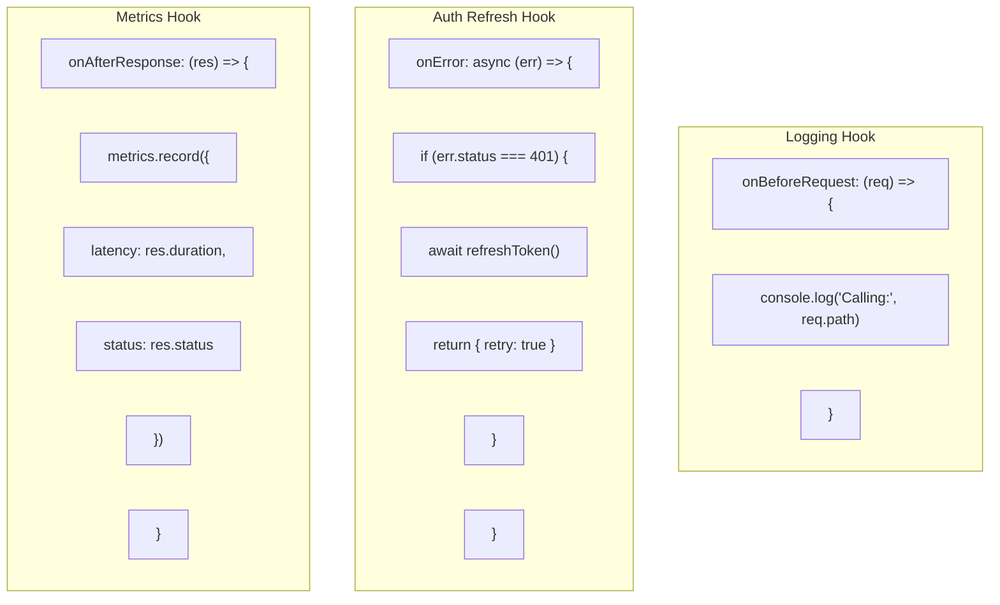

### TypeScript Types

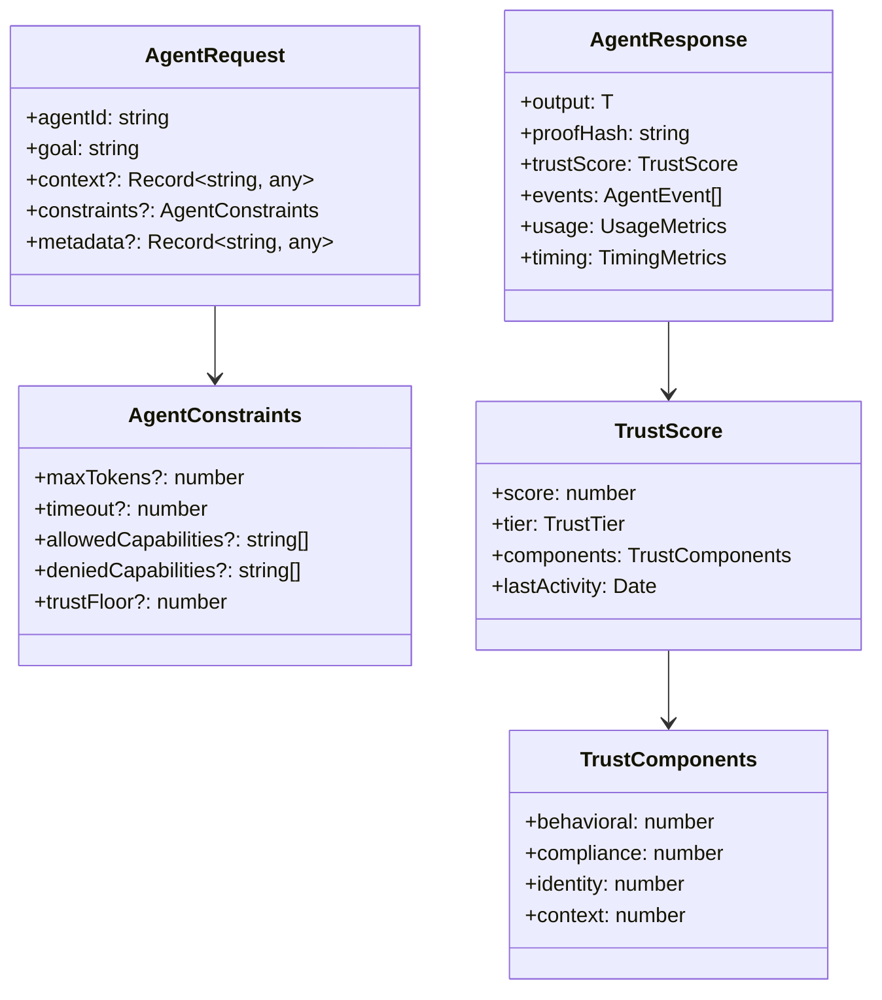

### Async Patterns

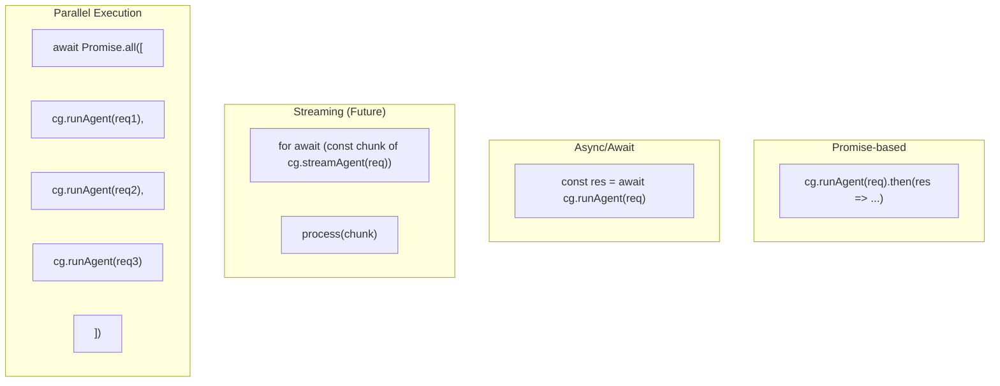

### Memory Management

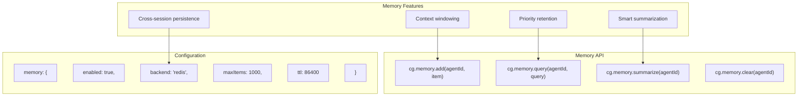

### Testing Utilities

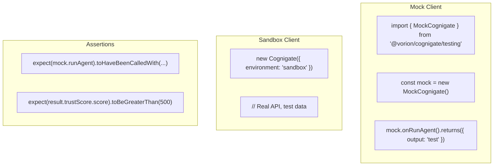

### Performance Tips

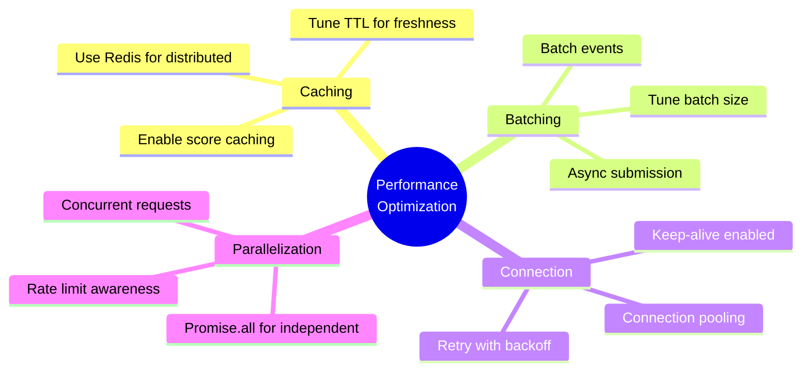
