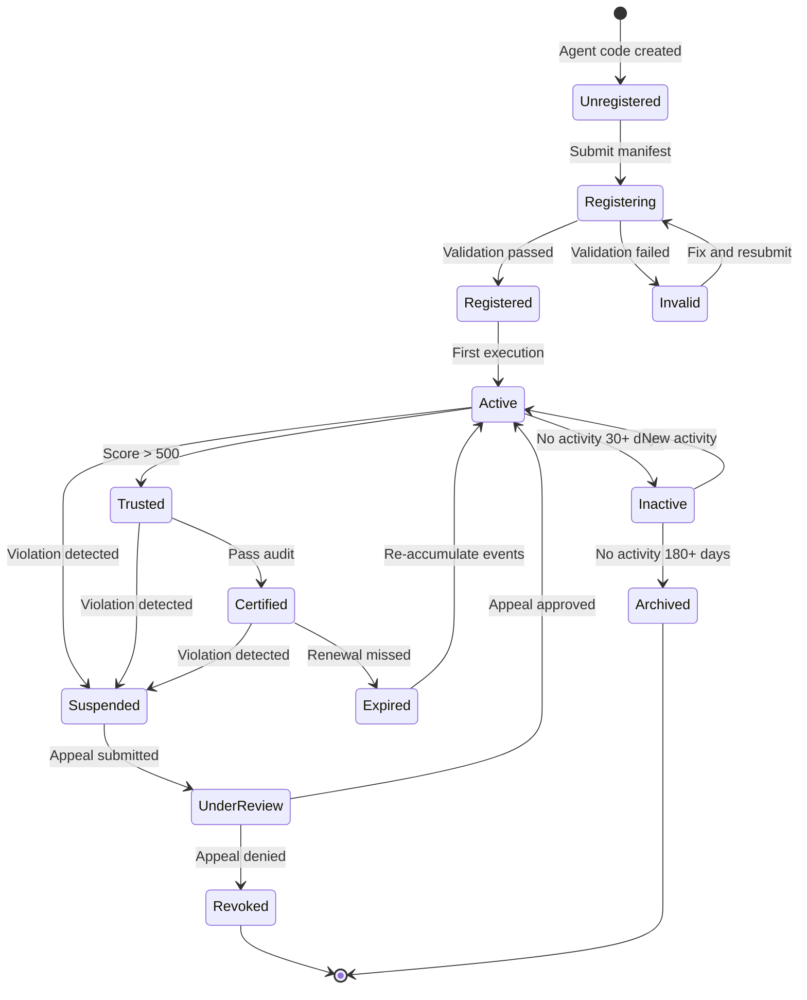
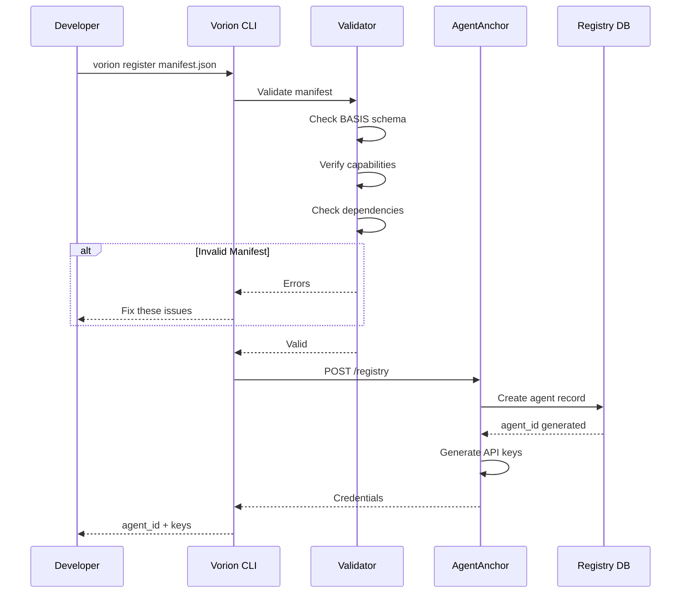
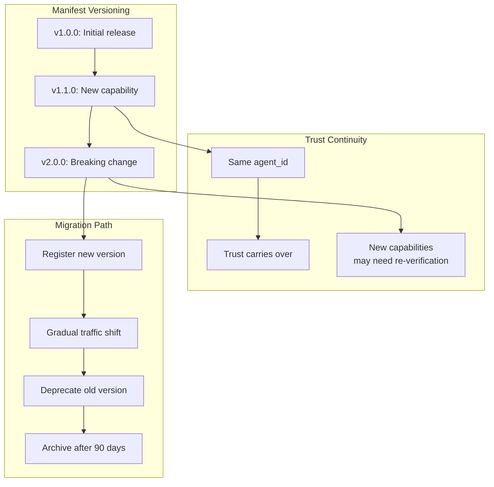
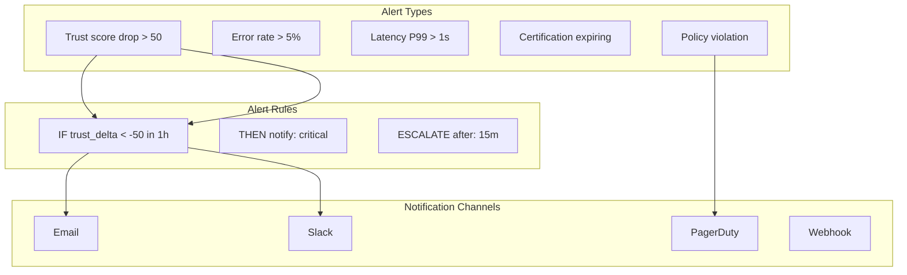
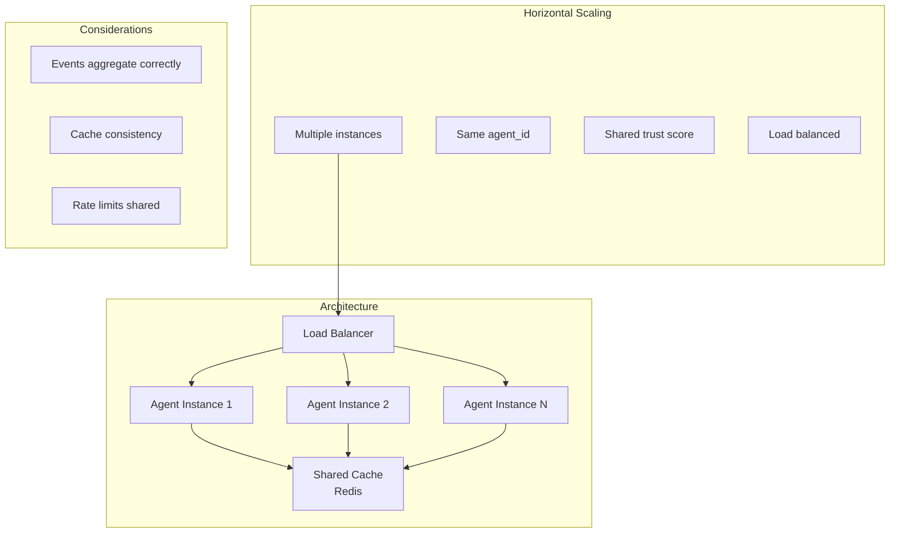
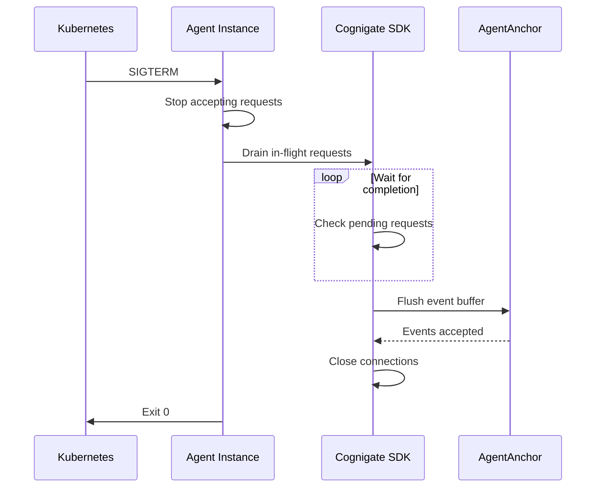
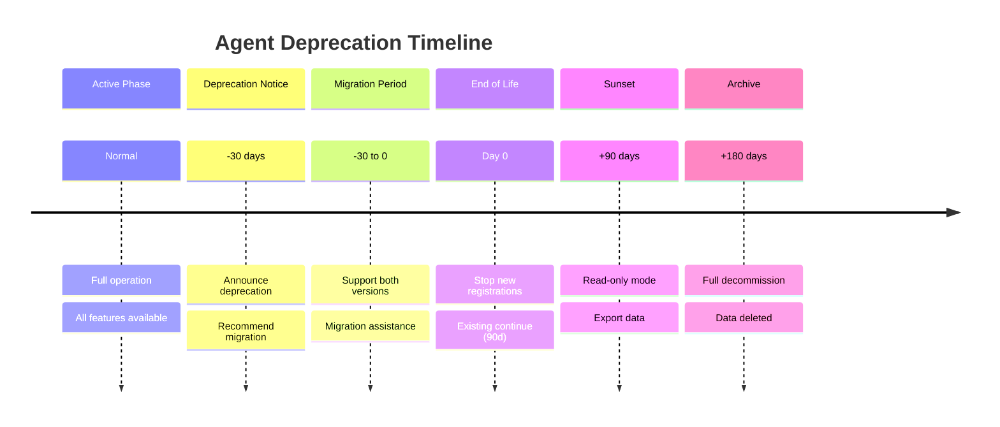
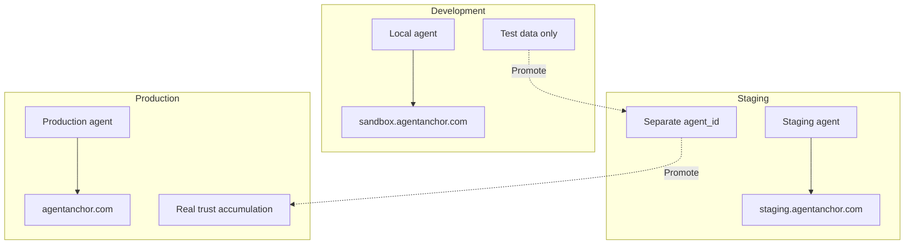

# Agent Lifecycle
## For: Developers, DevOps Engineers

### Agent States



### Registration Flow



### Deployment Strategies

```mermaid
flowchart TB
    subgraph "Blue-Green Deployment"
        BG1[Agent v1 (Blue)]
        BG2[Agent v2 (Green)]
        BG3{Traffic Switch}

        BG1 --> BG3
        BG2 --> BG3
        BG3 -->|Gradual| PROD[Production Traffic]
    end

    subgraph "Canary Deployment"
        C1[Agent v1<br/>95% traffic]
        C2[Agent v2<br/>5% traffic]
        C3[Monitor metrics]
        C4[Increase v2 traffic]

        C1 --> C3
        C2 --> C3
        C3 --> C4
    end

    subgraph "A/B Testing"
        AB1[Agent variant A]
        AB2[Agent variant B]
        AB3[Experiment config]
        AB4[Measure outcomes]

        AB1 --> AB3
        AB2 --> AB3
        AB3 --> AB4
    end
```

### Version Management



### Monitoring Dashboard Concept

```mermaid
flowchart TB
    subgraph "Agent Health"
        H1["Status: Active ✓"]
        H2["Trust Score: 742"]
        H3["Uptime: 99.9%"]
    end

    subgraph "Metrics"
        M1["Requests/min: 150"]
        M2["Avg latency: 230ms"]
        M3["Error rate: 0.1%"]
    end

    subgraph "Trust Trend"
        T1["7d: +12 points"]
        T2["30d: +45 points"]
        T3["90d: +120 points"]
    end

    subgraph "Recent Events"
        E1["10:42 - Execution success"]
        E2["10:41 - Execution success"]
        E3["10:40 - Trust updated"]
    end
```



### Alert Configuration



### Scaling Agents



### Graceful Shutdown



### Rollback Procedure

```mermaid
flowchart TB
    subgraph "Detect Issue"
        D1[Monitoring alert]
        D2[Trust score drop]
        D3[Error spike]
    end

    subgraph "Rollback Steps"
        R1[Stop new deployments]
        R2[Route traffic to v(n-1)]
        R3[Investigate issue]
        R4[Fix and redeploy]
    end

    subgraph "Trust Recovery"
        T1["Trust may be impacted"]
        T2["Positive events rebuild"]
        T3["Consider: separate agent_id for risky deploys"]
    end

    D1 --> R1
    D2 --> R1
    D3 --> R1
    R1 --> R2 --> R3 --> R4
    R2 --> T1 --> T2
```

### Agent Deprecation



### Multi-Environment Setup


