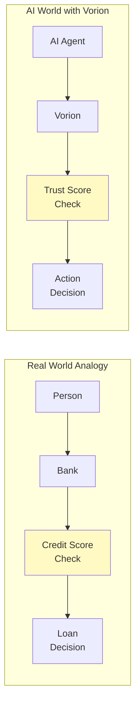
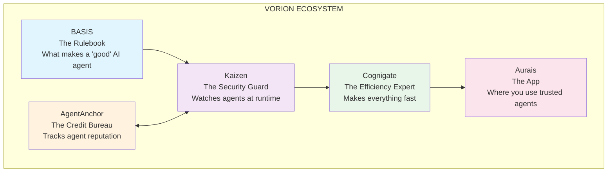
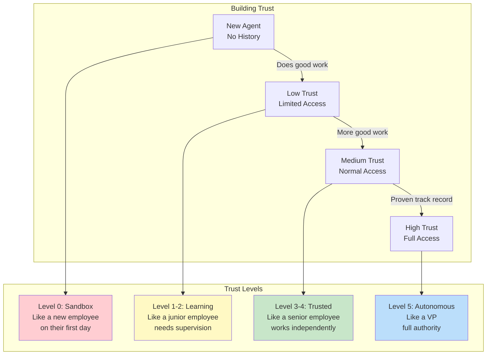
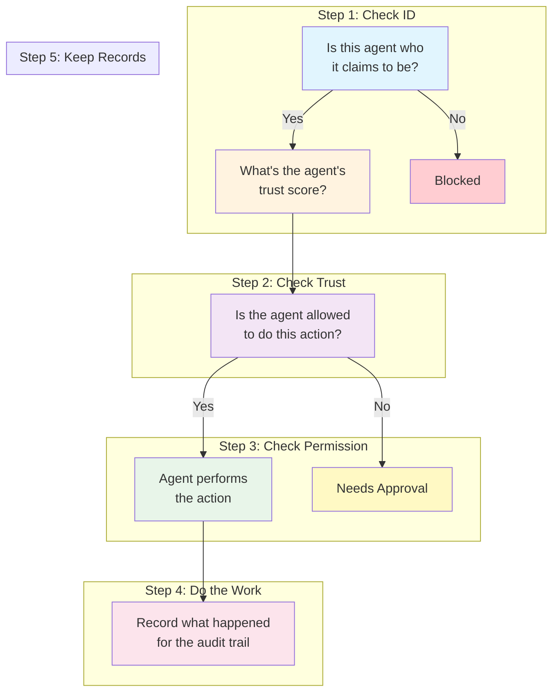
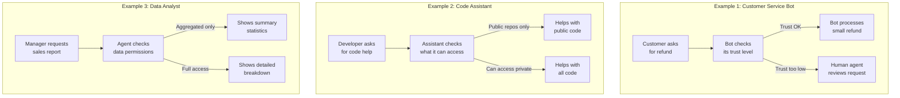
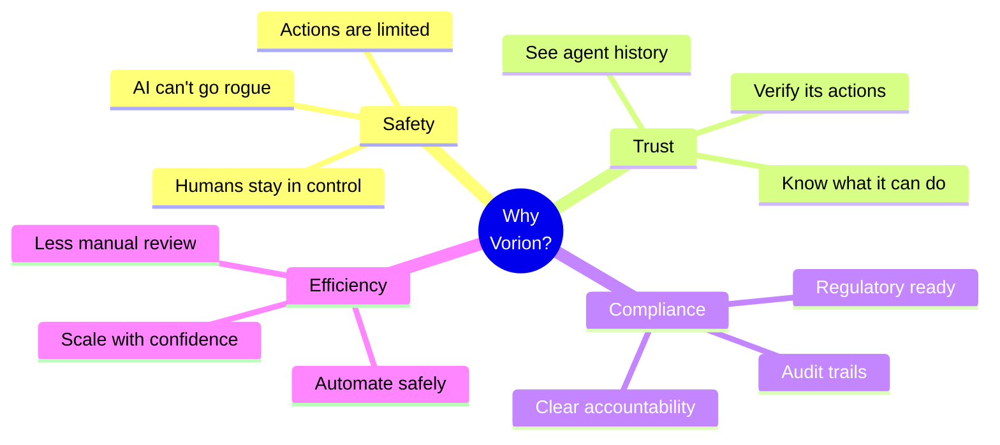
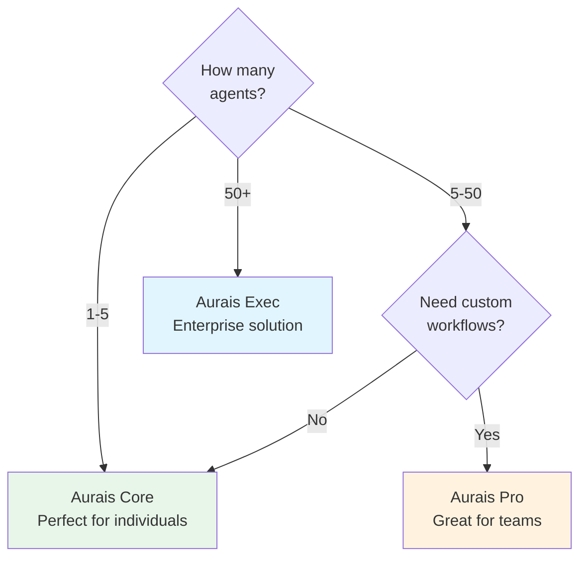
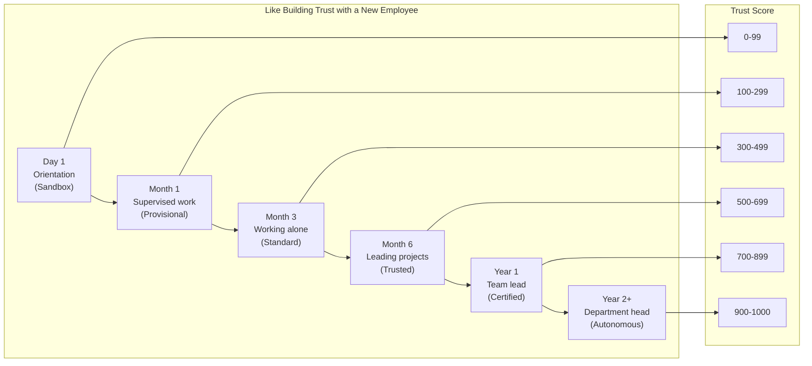

# What is Vorion?
## For: General Audience, New Users, Non-Technical Stakeholders

### Simple Explanation

Think of Vorion like a **credit score system for AI agents**.

Just like banks check your credit score before giving you a loan, Vorion checks an AI agent's "trust score" before letting it do important things.

### The Five Parts of Vorion

### How Trust Works

### What Happens When You Use an AI Agent

### Real-World Examples

### Why This Matters

### Aurais Product Tiers: Which One is Right for You?

### The Trust Journey Analogy

### Quick Glossary

| Term | Simple Meaning |
|------|----------------|
| **BASIS** | The rulebook that defines what a "good" AI agent looks like |
| **AgentAnchor** | The system that tracks and certifies AI agents |
| **Kaizen** | The security layer that watches agents while they work |
| **Cognigate** | The runtime that makes everything fast and efficient |
| **Aurais** | The app you use to work with trusted AI agents |
| **Trust Score** | A number (0-1000) showing how reliable an agent is |
| **Certification** | Official verification that an agent meets quality standards |
| **Proof** | Cryptographic record proving what an agent did |
