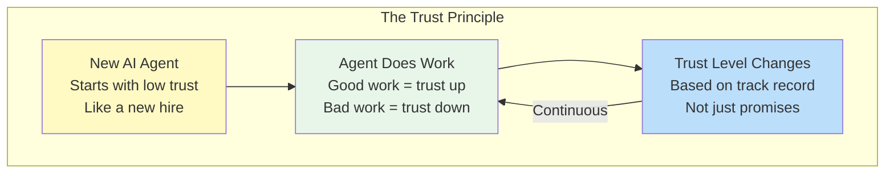
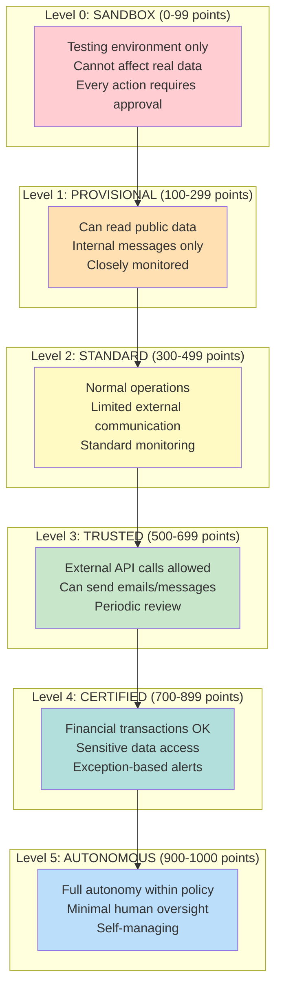
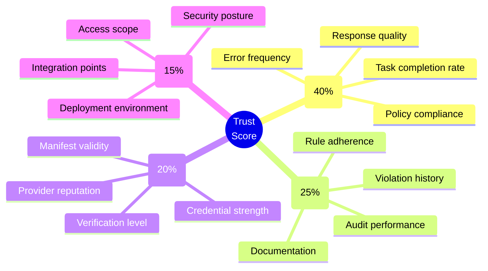
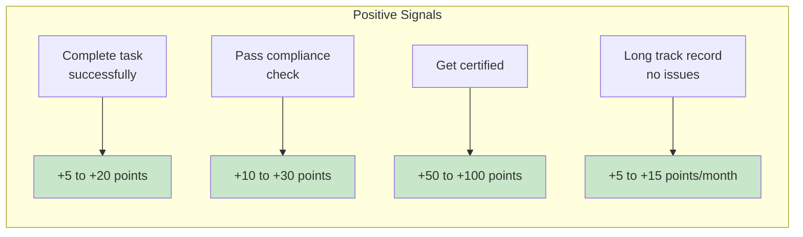
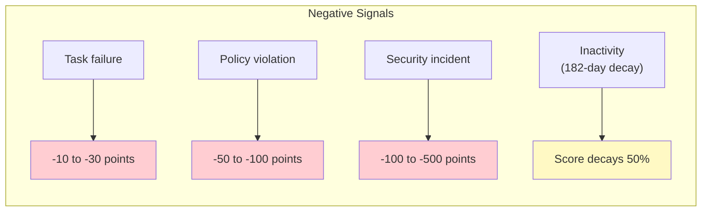
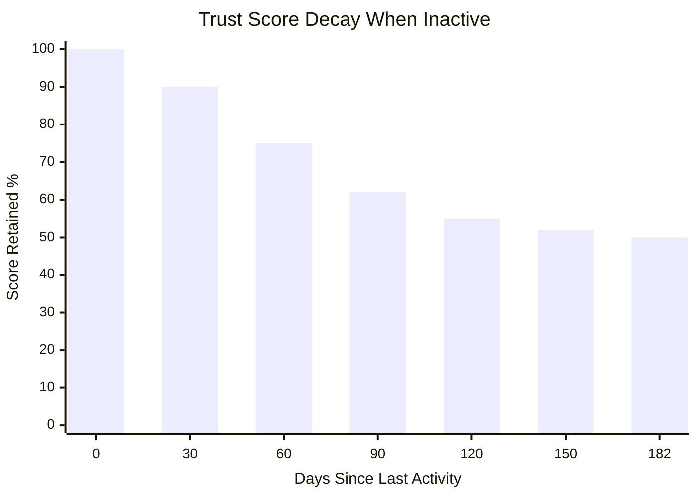
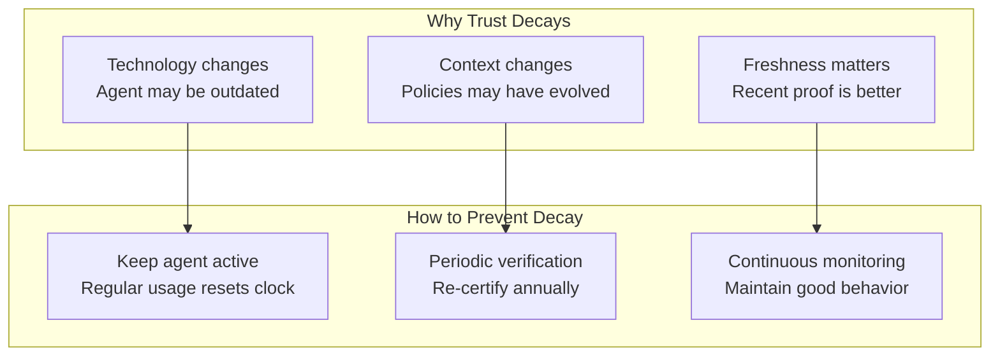
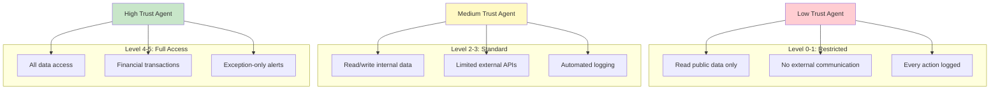
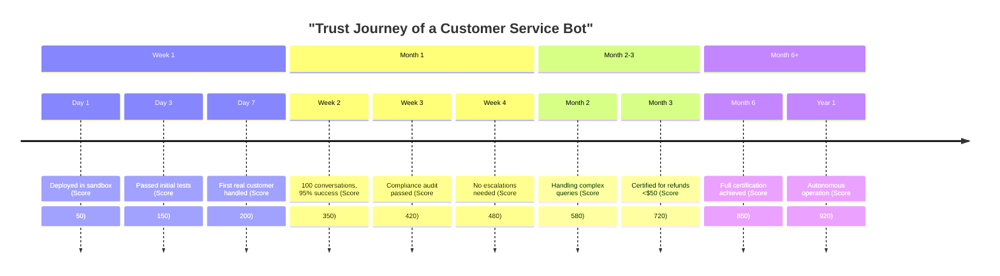
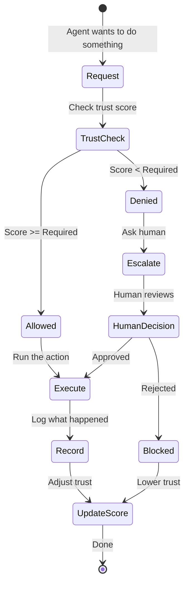

# How Trust Works in Vorion
## For: General Audience, New Users, Training Materials

### Trust is Earned, Not Given

### The Six Trust Levels

### What Affects Trust Score?

### How Trust Goes Up

### How Trust Goes Down

### Trust Decay: Use It or Lose It

### Trust Gates: What Each Level Can Do

### Example: Customer Service Bot Trust Journey

### What Happens at Each Decision Point

### Key Takeaways

| Concept | What It Means |
|---------|---------------|
| **Trust is earned** | Agents prove themselves through good behavior |
| **Trust is dynamic** | Scores change based on performance |
| **Trust decays** | Inactive agents lose trust over time |
| **Trust gates access** | Higher trust = more capabilities |
| **Trust is verifiable** | Every action is recorded and provable |
