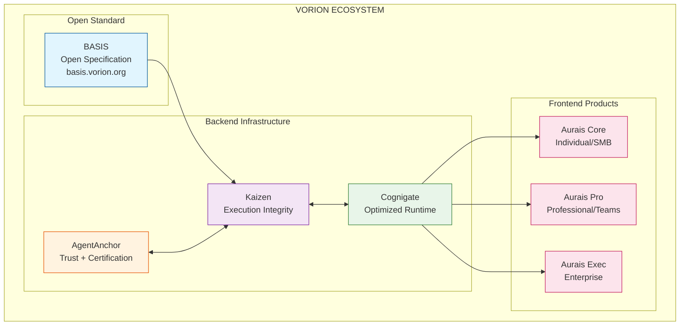
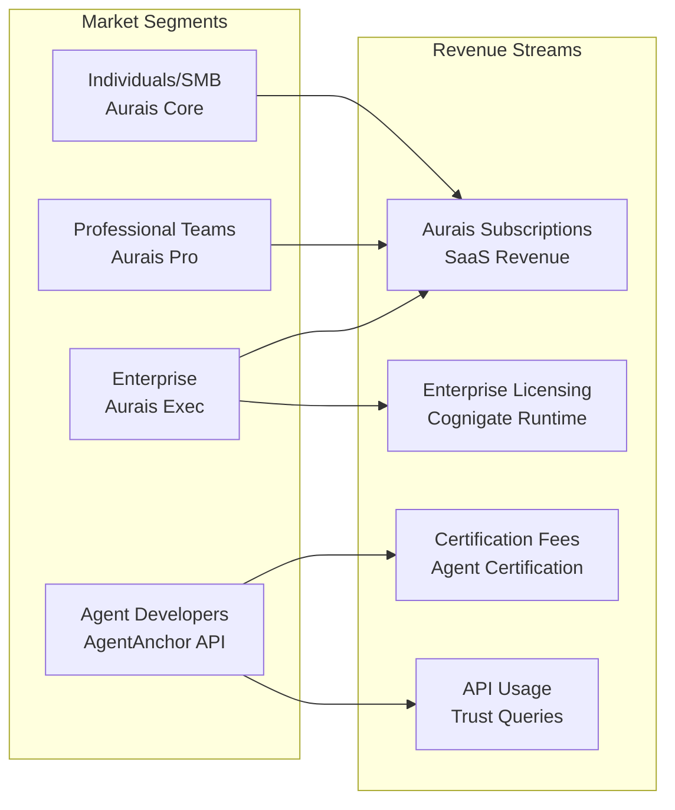
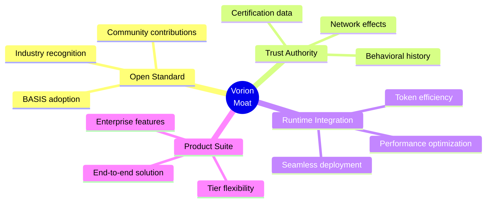
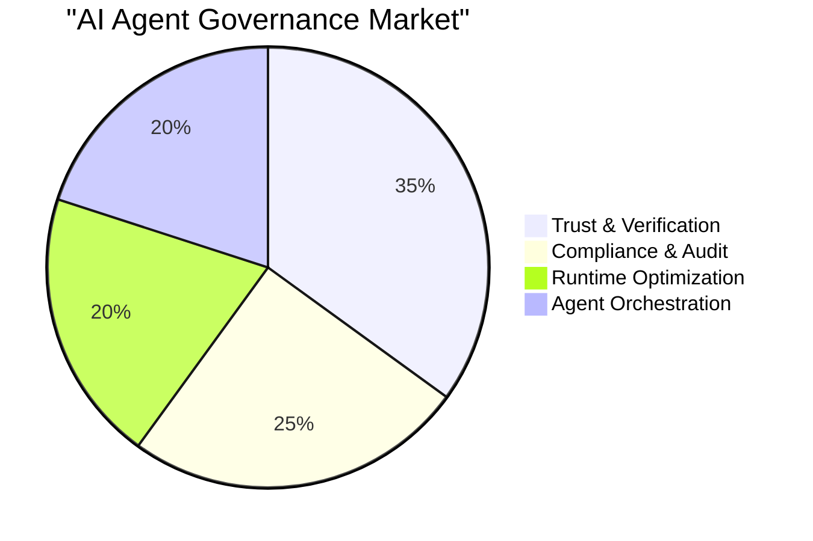

# Vorion Ecosystem Overview
## For: Board, C-Suite, Investors

### The Problem We Solve

AI agents are increasingly autonomous, but organizations lack confidence in deploying them because:
- No standardized way to verify agent capabilities
- No trust scoring system for agent behavior
- No audit trail for agent decisions
- No compliance framework for AI governance

### The Vorion Solution

### Business Model

### Competitive Moat

### Key Metrics to Track

| Metric | Description | Target |
|--------|-------------|--------|
| Registered Agents | Agents in AgentAnchor registry | Growth indicator |
| Certified Agents | Agents completing certification | Quality indicator |
| Trust Queries/Day | API usage volume | Platform stickiness |
| Aurais MRR | Monthly recurring revenue | Revenue health |
| Enterprise Contracts | Aurais Exec deployments | Enterprise penetration |

### Market Opportunity

### Investment Thesis

1. **First Mover**: Defining the open standard (BASIS) positions Vorion as the default
2. **Network Effects**: More certified agents = more valuable registry = more agents certify
3. **Vertical Integration**: Open standard → Backend → Frontend creates lock-in
4. **Enterprise Ready**: Compliance, audit trails, and certification meet enterprise requirements
