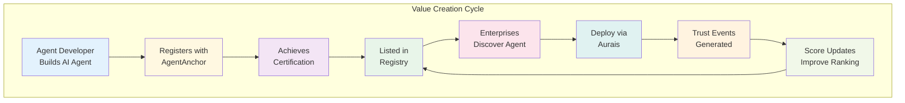
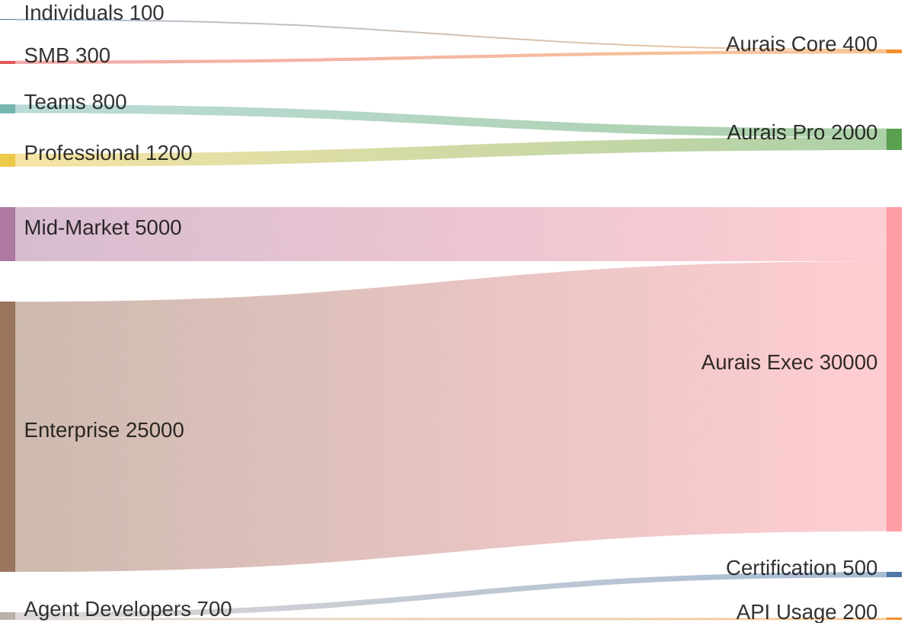
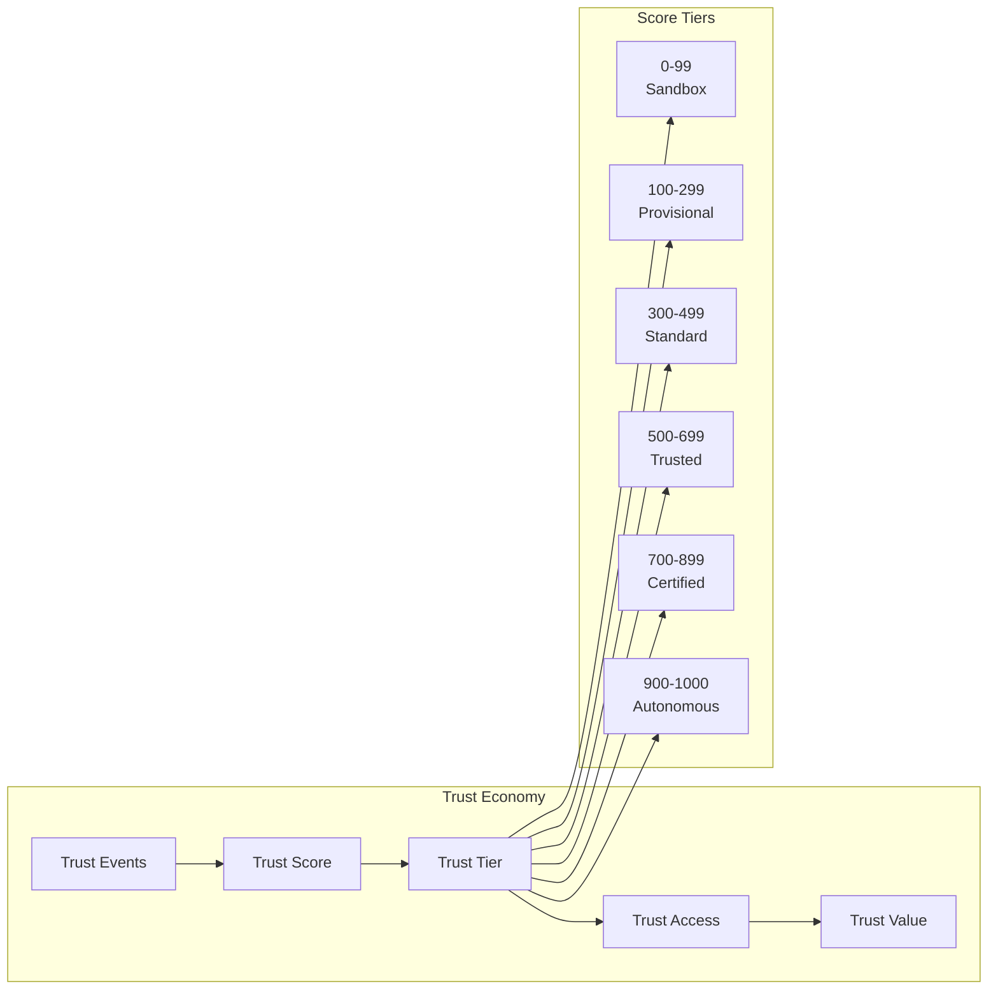
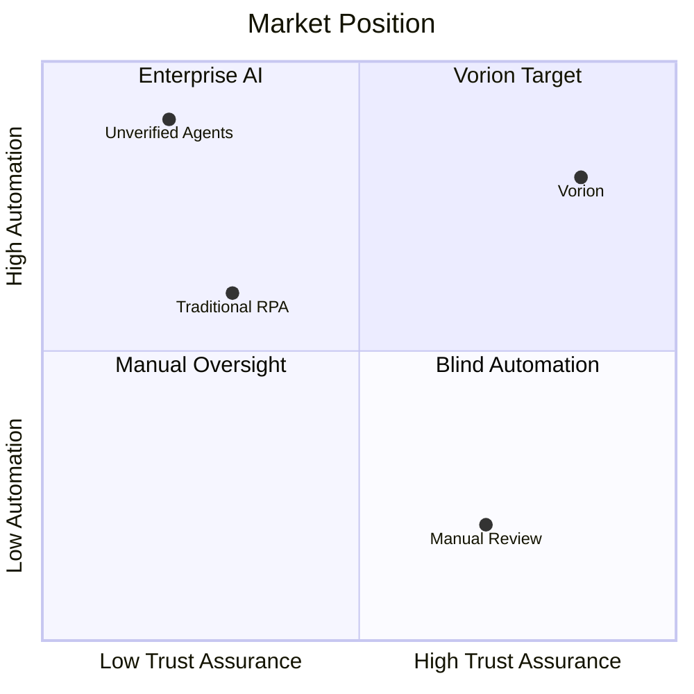
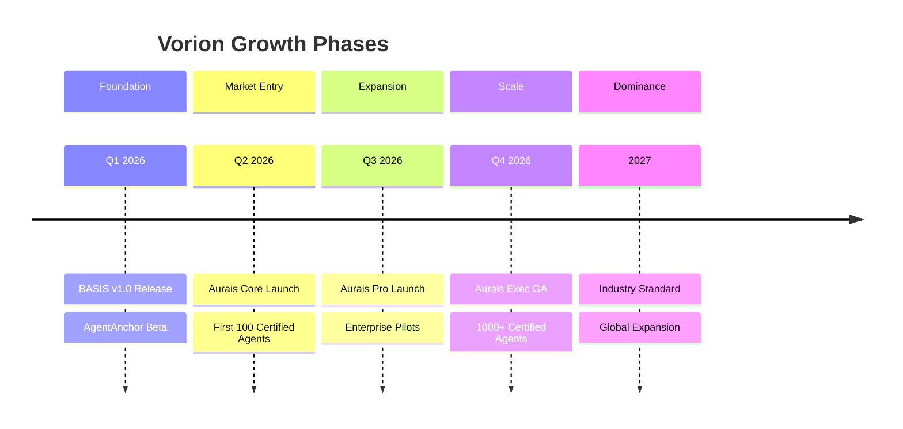

# Value Creation Flow
## For: Board, C-Suite, Investors

### How Vorion Creates Value

```mermaid
flowchart TB
    subgraph "Value Creation Cycle"
        A[Agent Developer<br/>Builds AI Agent] --> B[Registers with<br/>AgentAnchor]
        B --> C[Achieves<br/>Certification]
        C --> D[Listed in<br/>Registry]
        D --> E[Enterprises<br/>Discover Agent]
        E --> F[Deploy via<br/>Aurais]
        F --> G[Trust Events<br/>Generated]
        G --> H[Score Updates<br/>Improve Ranking]
        H --> D
    end

    style A fill:#e3f2fd
    style B fill:#fff8e1
    style C fill:#f3e5f5
    style D fill:#e8f5e9
    style E fill:#fce4ec
    style F fill:#e0f2f1
    style G fill:#fff3e0
    style H fill:#f1f8e9
```

### Revenue Per Customer Segment

```mermaid
sankey-beta
    Individuals,Aurais Core,100
    SMB,Aurais Core,300
    Teams,Aurais Pro,800
    Professional,Aurais Pro,1200
    Mid-Market,Aurais Exec,5000
    Enterprise,Aurais Exec,25000
    Agent Developers,Certification,500
    Agent Developers,API Usage,200
```

### Trust as Currency

```mermaid
graph LR
    subgraph "Trust Economy"
        TE[Trust Events] --> TS[Trust Score]
        TS --> TC[Trust Tier]
        TC --> TA[Trust Access]
        TA --> TV[Trust Value]
    end

    subgraph "Score Tiers"
        T0["0-99<br/>Sandbox"]
        T1["100-299<br/>Provisional"]
        T2["300-499<br/>Standard"]
        T3["500-699<br/>Trusted"]
        T4["700-899<br/>Certified"]
        T5["900-1000<br/>Autonomous"]
    end

    TC --> T0
    TC --> T1
    TC --> T2
    TC --> T3
    TC --> T4
    TC --> T5
```

### Strategic Positioning

```mermaid
quadrantChart
    title Market Position
    x-axis Low Trust Assurance --> High Trust Assurance
    y-axis Low Automation --> High Automation
    quadrant-1 Vorion Target
    quadrant-2 Enterprise AI
    quadrant-3 Manual Oversight
    quadrant-4 Blind Automation
    Vorion: [0.85, 0.8]
    Traditional RPA: [0.3, 0.6]
    Manual Review: [0.7, 0.2]
    Unverified Agents: [0.2, 0.9]
```

### Growth Strategy

```mermaid
timeline
    title Vorion Growth Phases

    section Foundation
        Q1 2026 : BASIS v1.0 Release
                : AgentAnchor Beta

    section Market Entry
        Q2 2026 : Aurais Core Launch
                : First 100 Certified Agents

    section Expansion
        Q3 2026 : Aurais Pro Launch
                : Enterprise Pilots

    section Scale
        Q4 2026 : Aurais Exec GA
                : 1000+ Certified Agents

    section Dominance
        2027 : Industry Standard
             : Global Expansion
```
