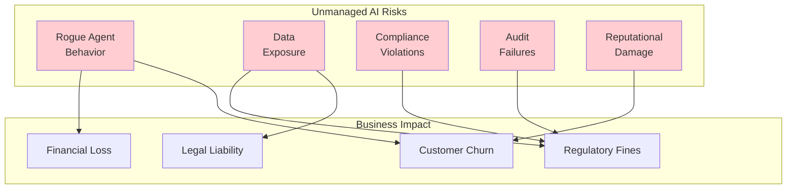
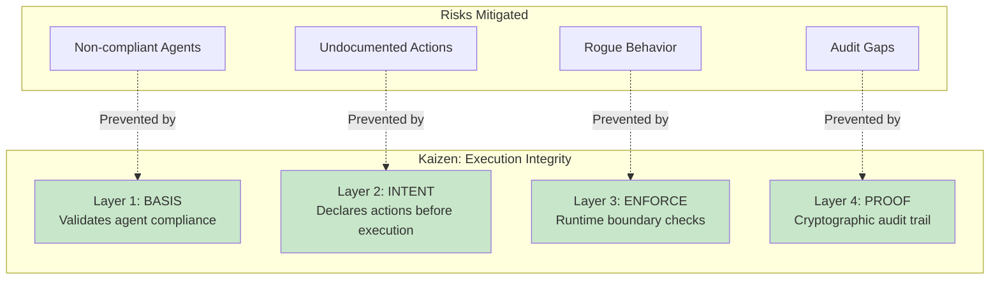
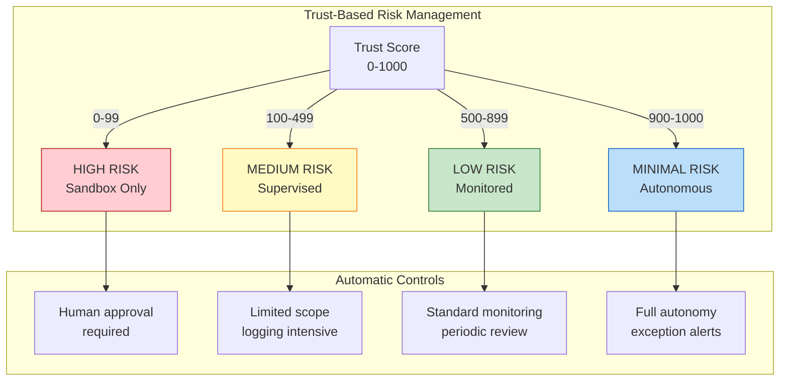
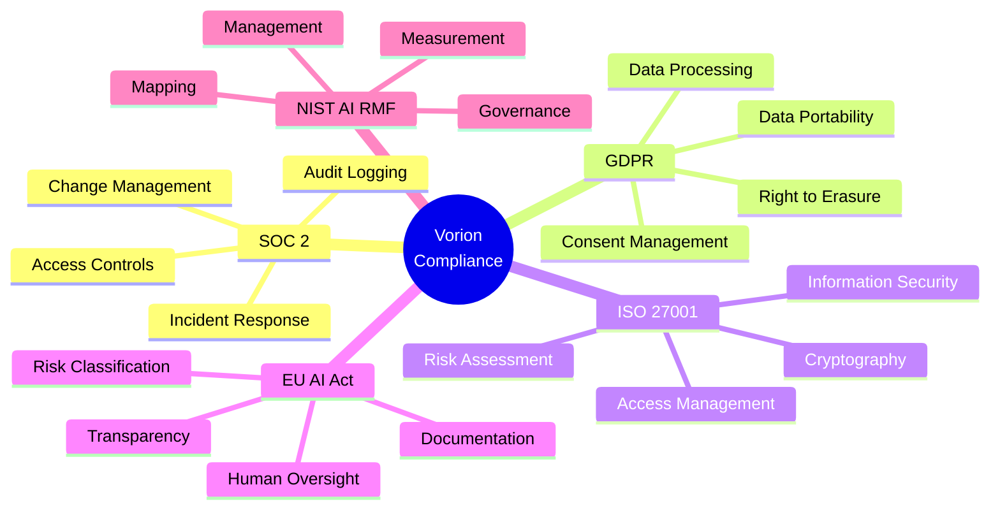
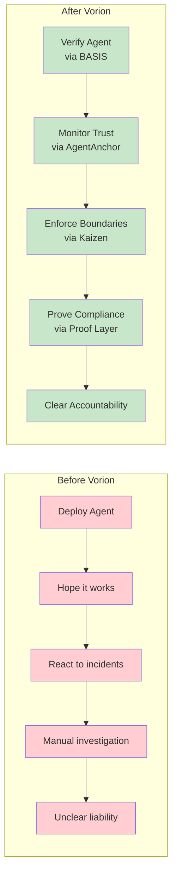
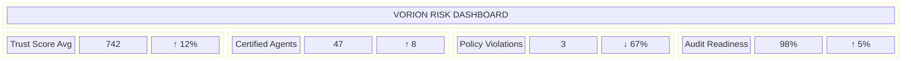

# Risk Mitigation Through Vorion
## For: Board, C-Suite, Risk Officers

### The Risk Landscape Without Vorion

### How Vorion Mitigates Each Risk

### Trust Score as Risk Indicator

### Compliance Coverage

### Before vs After Vorion

### ROI of Risk Mitigation

| Risk Event | Potential Cost | Vorion Prevention | ROI |
|------------|---------------|-------------------|-----|
| Data breach via AI agent | $4.5M avg | Trust gating + PROOF layer | 100x+ |
| Regulatory fine (GDPR) | $20M+ max | Compliance documentation | 50x+ |
| Rogue agent incident | $500K - $5M | ENFORCE layer boundaries | 20x+ |
| Audit failure | $100K - $1M | Immutable audit trail | 10x+ |

### Executive Dashboard Concept

