# Market Opportunity
## For: Investors, VCs, Board Members

### The AI Agent Governance Gap

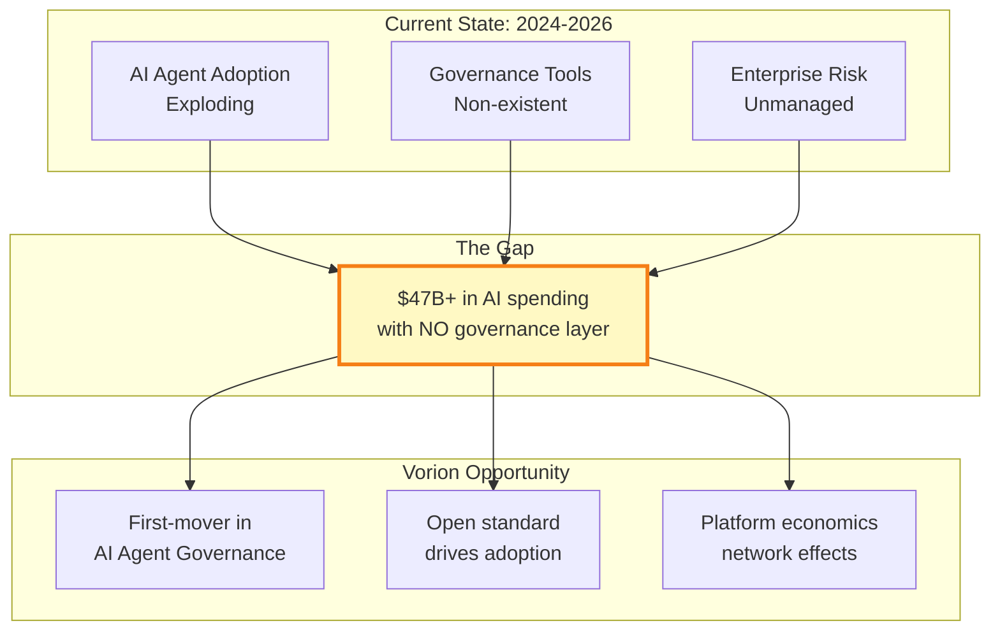

### Total Addressable Market (TAM)

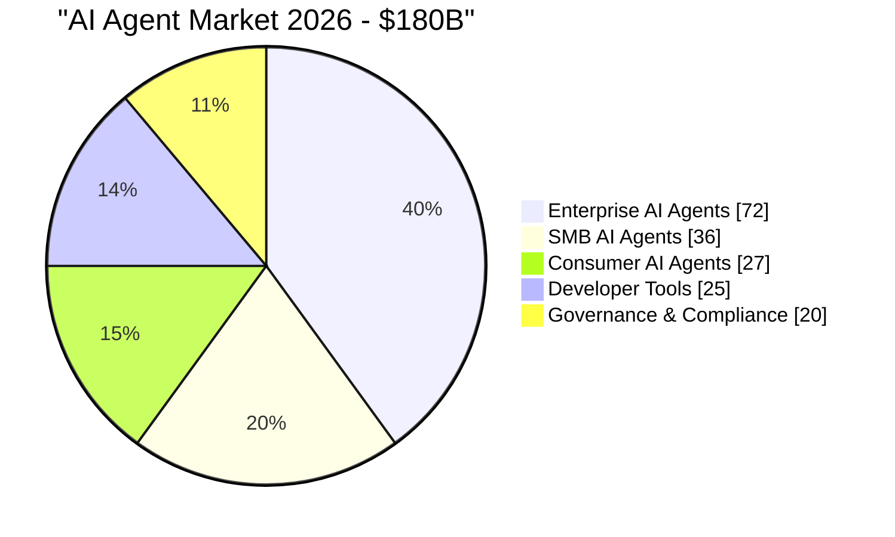

### Market Segmentation

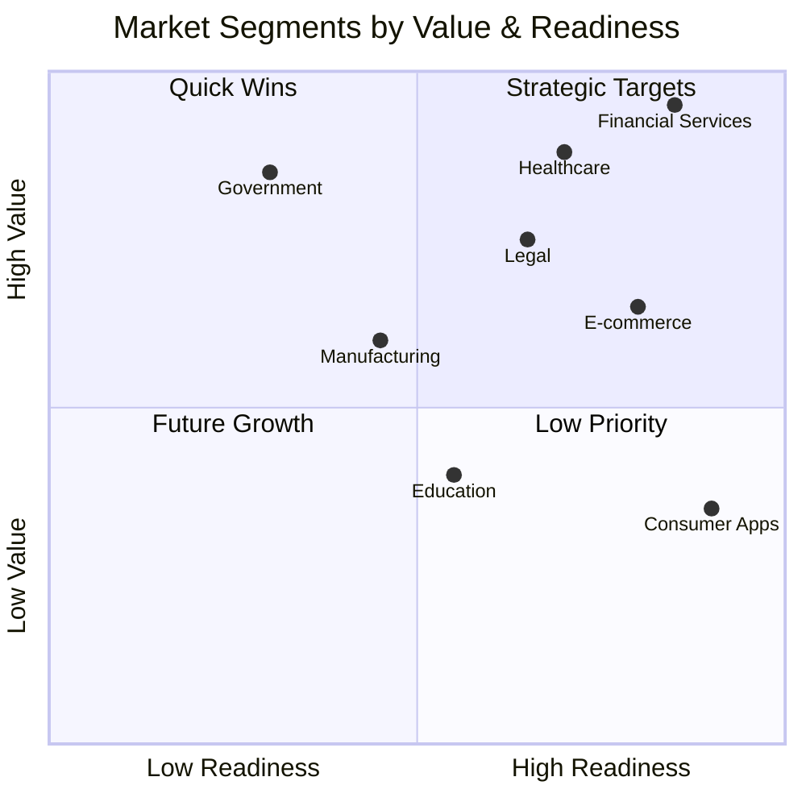

### Competitive Landscape

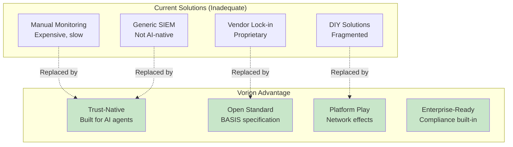

### Revenue Model

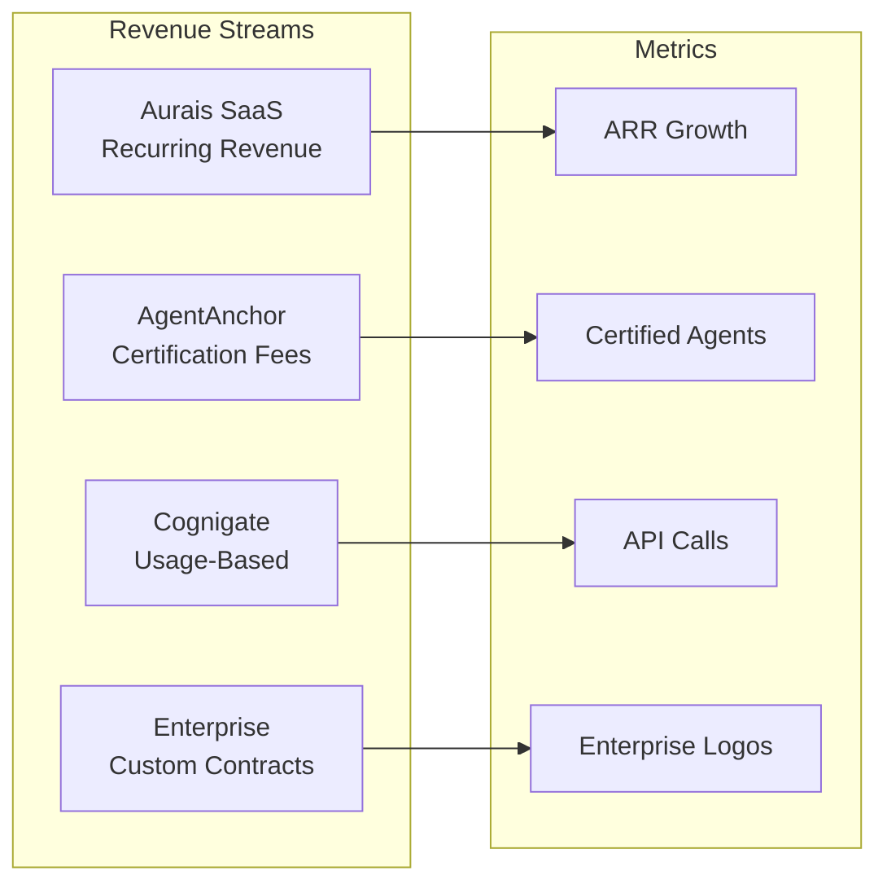

### Unit Economics

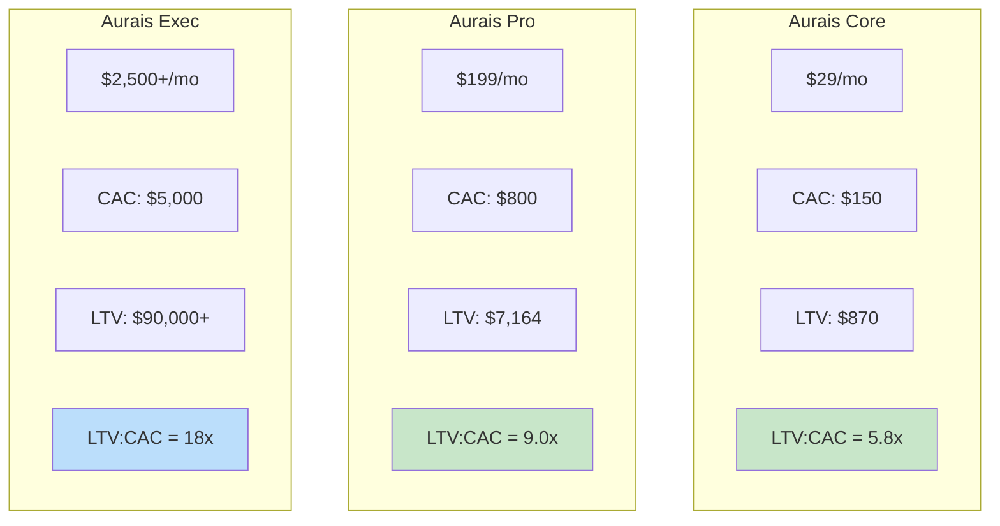

### Growth Flywheel

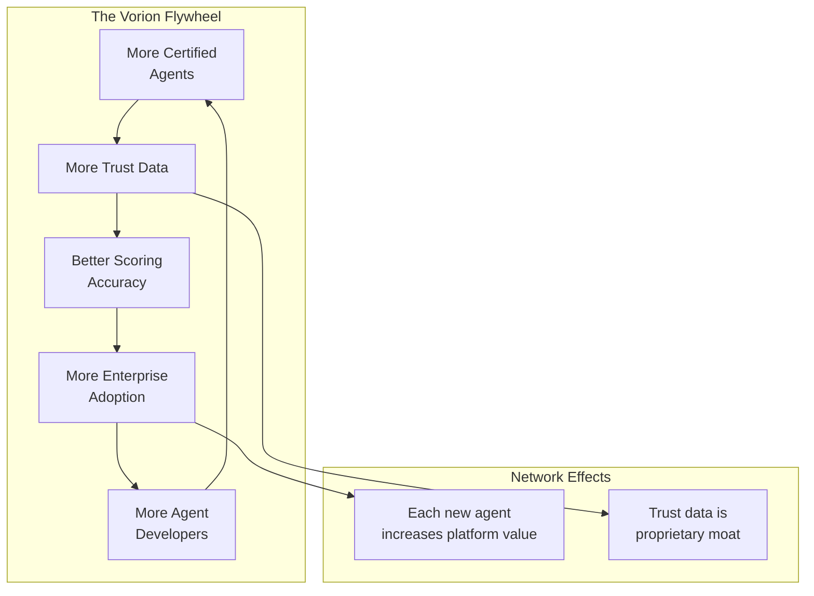

### Funding Use of Proceeds

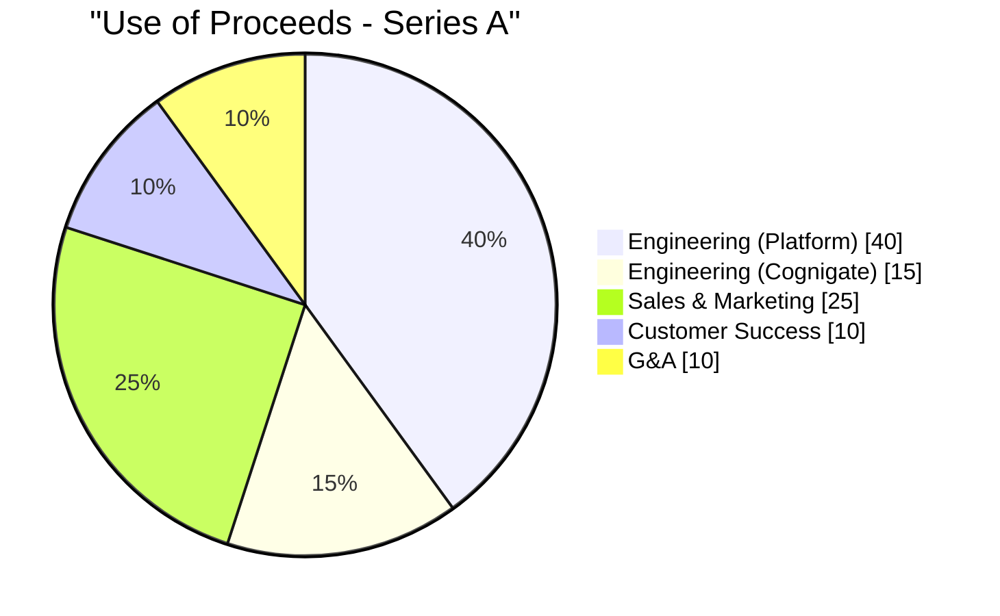

### 5-Year Growth Projection

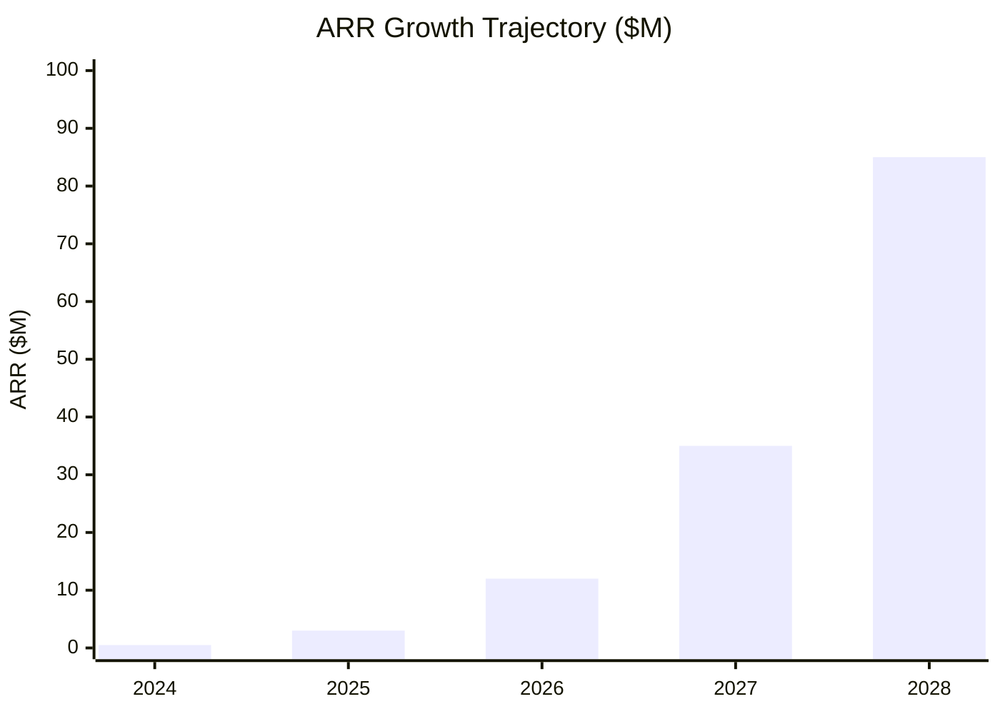

### Key Milestones

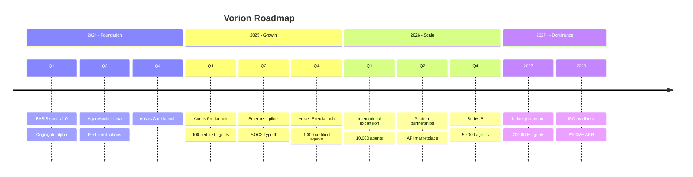

### Investment Thesis

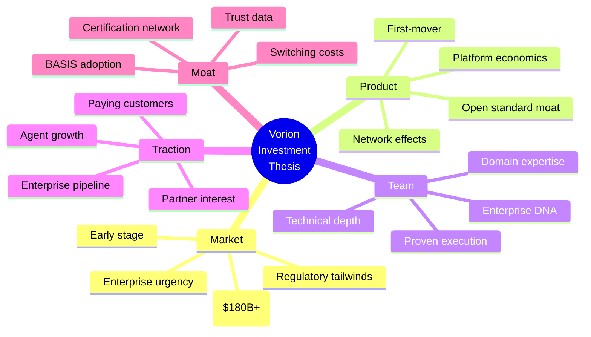

### Comparable Exits

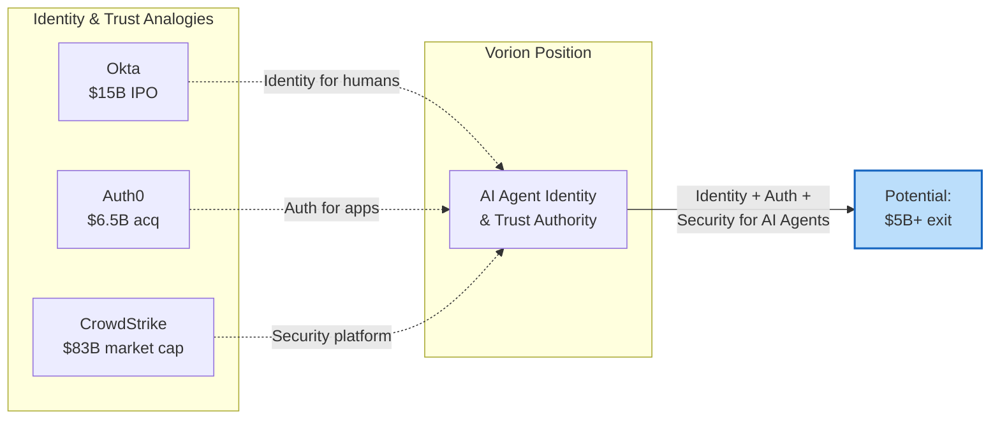

### Risk Mitigation

| Risk | Mitigation |
|------|------------|
| **Competition** | Open standard creates ecosystem, not winner-take-all |
| **Adoption** | Free tier + open source drives developer adoption |
| **Regulation** | Positioned as compliance enabler, not obstacle |
| **Technology** | AI-agnostic, works with any LLM/agent framework |
| **Execution** | Phased rollout, enterprise feedback loops |
