# Business Model Deep Dive
## For: Investors, Financial Analysts, Board

### Revenue Architecture

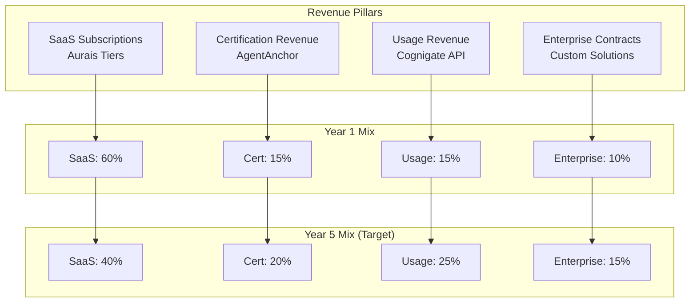

### SaaS Pricing Tiers

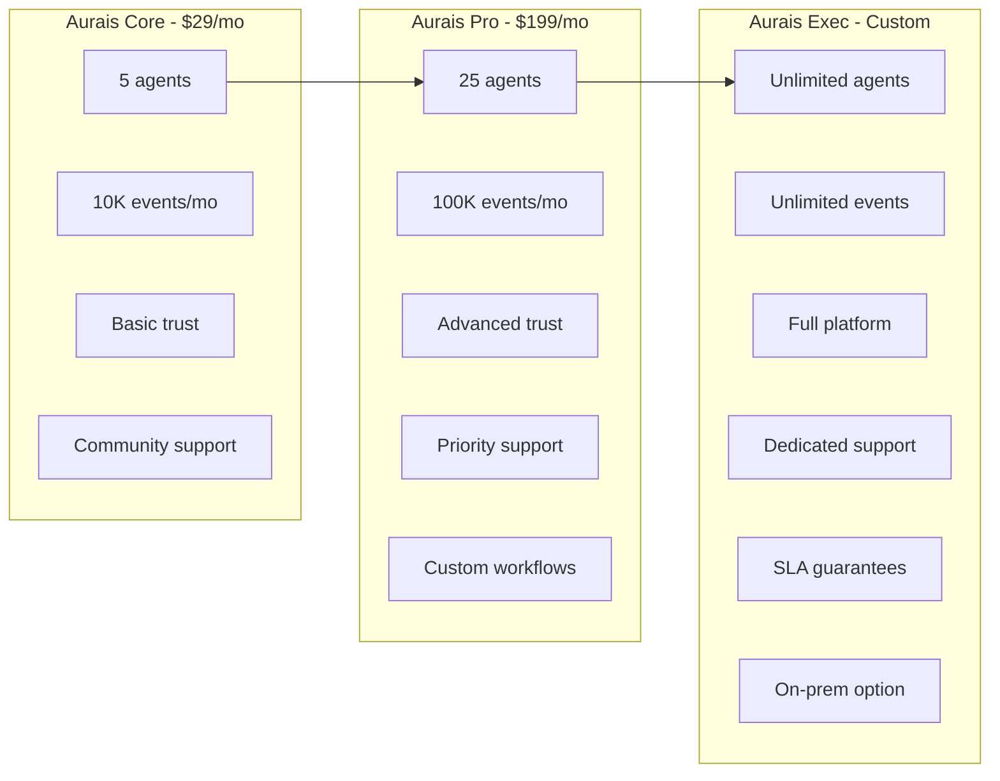

### Certification Revenue Model

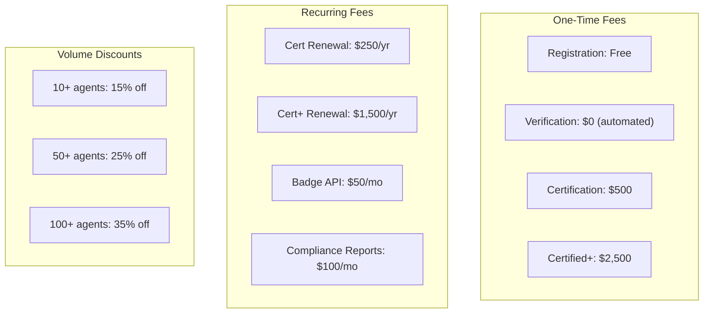

### Usage-Based Pricing (Cognigate)

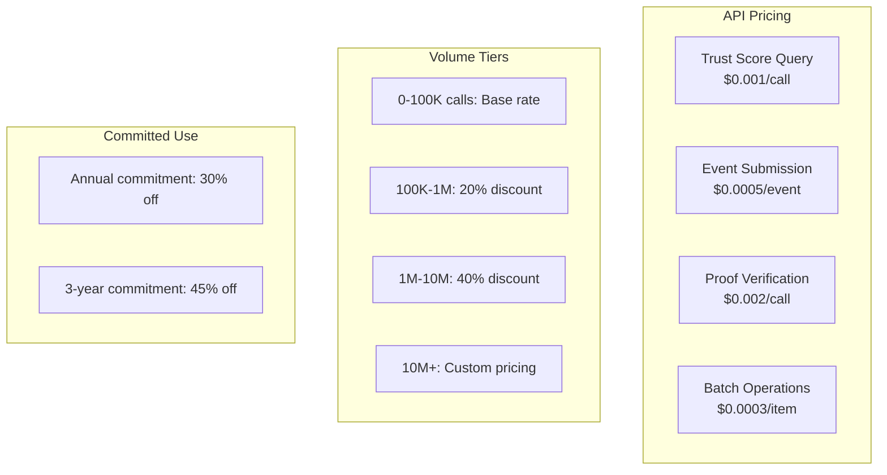

### Customer Acquisition Funnel

```mermaid
flowchart TB
    subgraph "Awareness"
        AW1[Content Marketing]
        AW2[Developer Advocacy]
        AW3[Conference Presence]
        AW4[Open Source BASIS]
    end

    subgraph "Interest"
        IN1[Free Tier Signup]
        IN2[Documentation]
        IN3[Playground/Demo]
    end

    subgraph "Evaluation"
        EV1[POC/Trial]
        EV2[Technical Review]
        EV3[Security Assessment]
    end

    subgraph "Purchase"
        PU1[Self-Serve (Core)]
        PU2[Sales-Assisted (Pro)]
        PU3[Enterprise Deal (Exec)]
    end

    subgraph "Expansion"
        EX1[More Agents]
        EX2[Higher Tier]
        EX3[More Features]
    end

    AW1 --> IN1
    AW2 --> IN1
    AW3 --> IN2
    AW4 --> IN1

    IN1 --> EV1
    IN2 --> EV2
    IN3 --> EV1

    EV1 --> PU1
    EV2 --> PU2
    EV3 --> PU3

    PU1 --> EX1
    PU2 --> EX2
    PU3 --> EX3
```

### Cohort Analysis Model

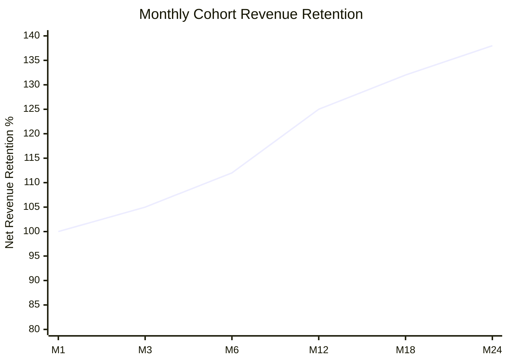

### Customer Segmentation

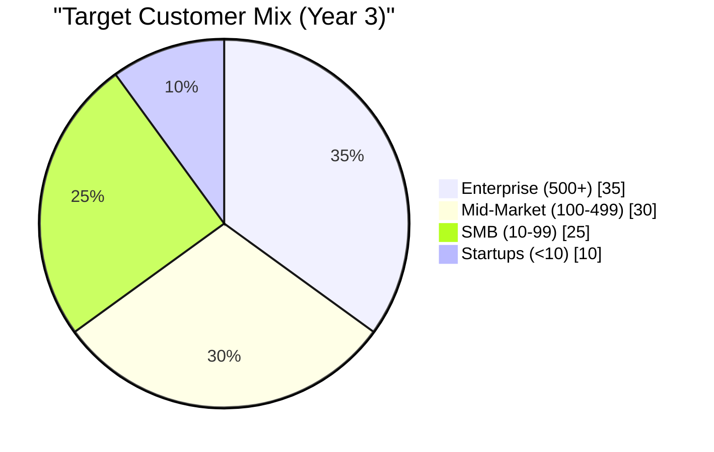

### Sales Motion by Segment

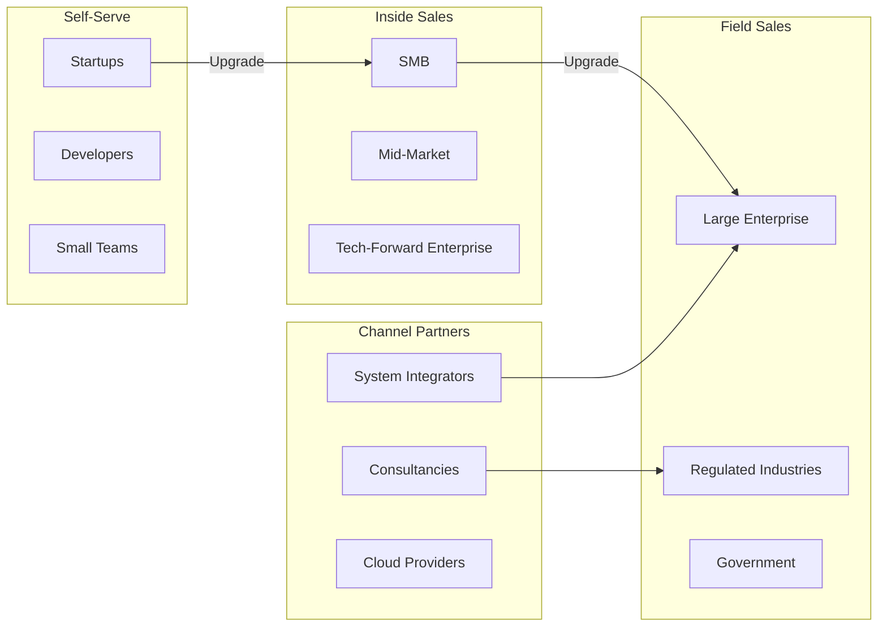

### Gross Margin Analysis

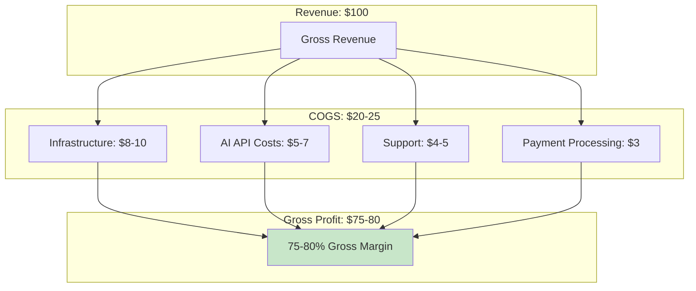

### Path to Profitability

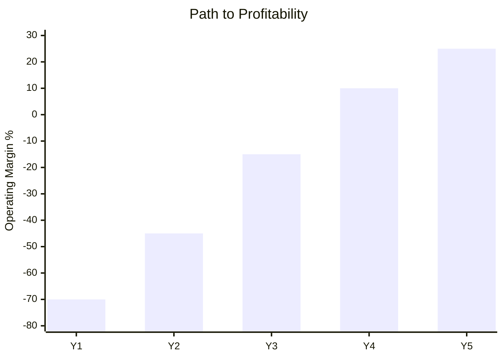

### Key SaaS Metrics Targets

| Metric | Year 1 | Year 3 | Year 5 |
|--------|--------|--------|--------|
| ARR | $3M | $35M | $100M |
| Customers | 500 | 3,000 | 8,000 |
| NRR | 110% | 125% | 135% |
| Gross Margin | 70% | 78% | 82% |
| CAC Payback | 18 mo | 12 mo | 9 mo |
| LTV:CAC | 4x | 8x | 12x |
| Magic Number | 0.6 | 0.9 | 1.2 |

### Expansion Revenue Drivers

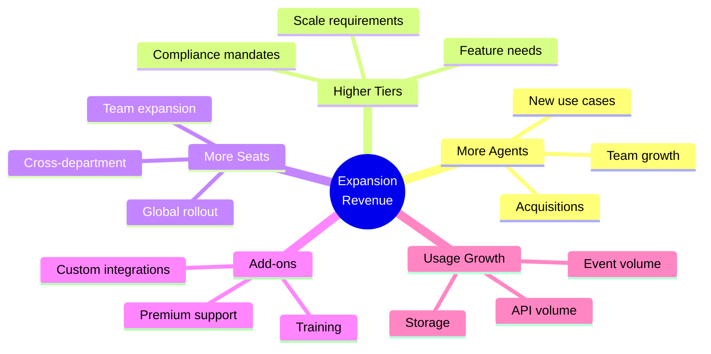

### Strategic Partnerships

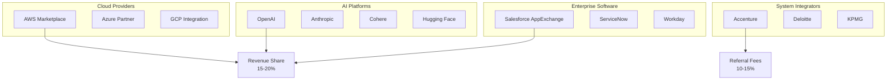
