# Partner Integration Guide
## For: System Integrators, ISVs, Technology Partners

### Partner Types

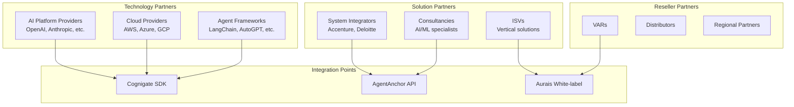

### Integration Architecture Options

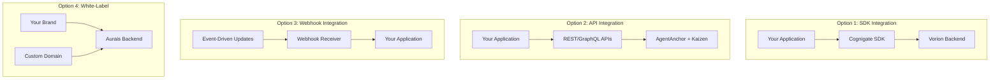

### SDK Integration Flow

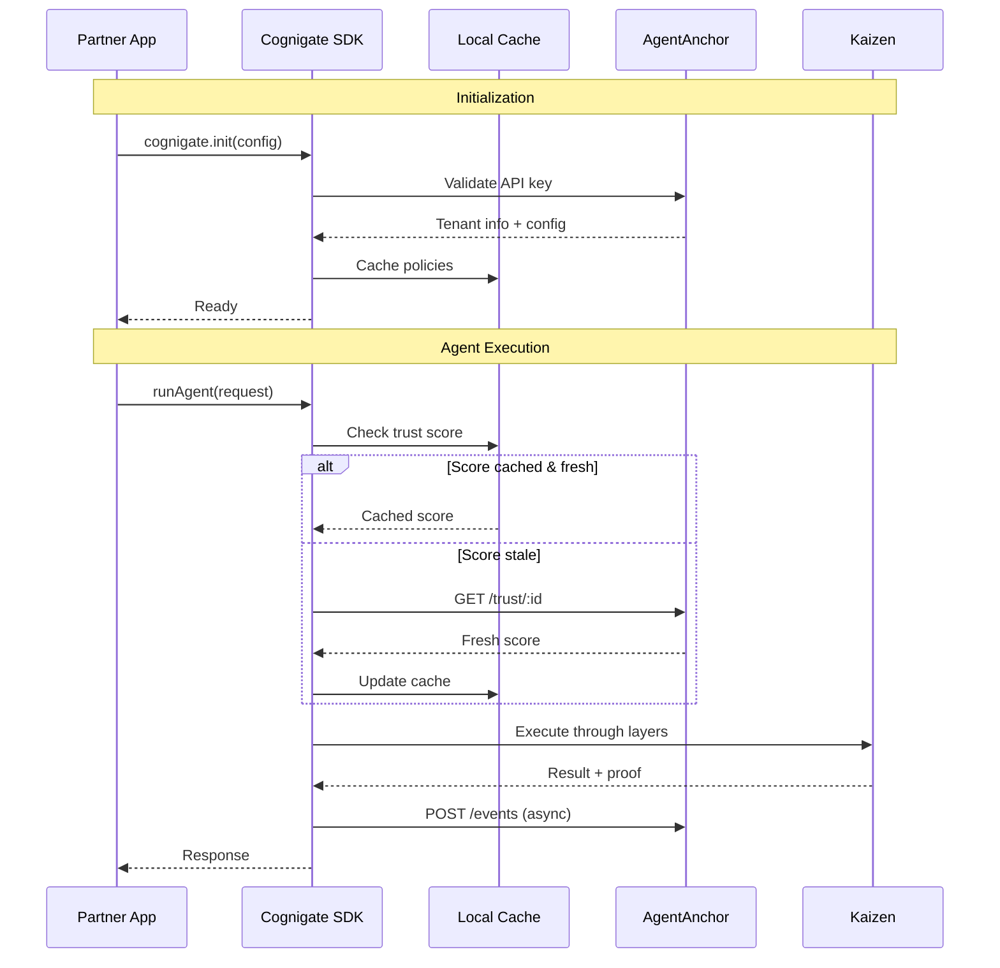

### API Integration Patterns

```mermaid
flowchart TB
    subgraph "Pattern 1: Pre-flight Check"
        PF1[Before agent action]
        PF2[Query trust score]
        PF3[Decision: proceed?]
        PF4[Execute or deny]

        PF1 --> PF2 --> PF3 --> PF4
    end

    subgraph "Pattern 2: Post-execution Logging"
        PE1[Agent executes]
        PE2[Capture result]
        PE3[Submit events]
        PE4[Update score]

        PE1 --> PE2 --> PE3 --> PE4
    end

    subgraph "Pattern 3: Continuous Monitoring"
        CM1[Subscribe to webhooks]
        CM2[Receive trust changes]
        CM3[Adjust agent behavior]
        CM4[Real-time governance]

        CM1 --> CM2 --> CM3 --> CM4
    end
```

### Webhook Event Integration

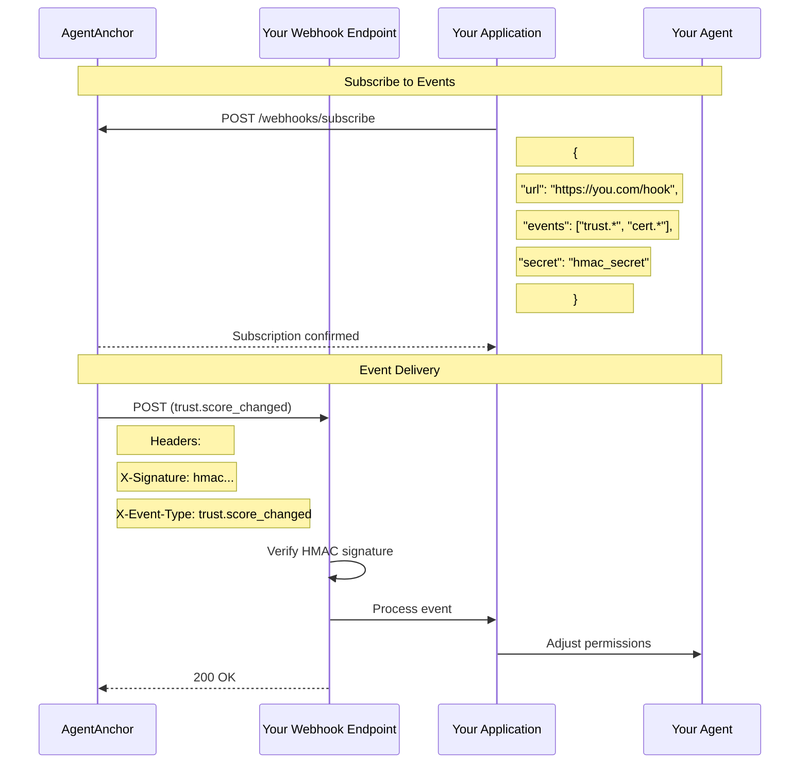

### White-Label Configuration

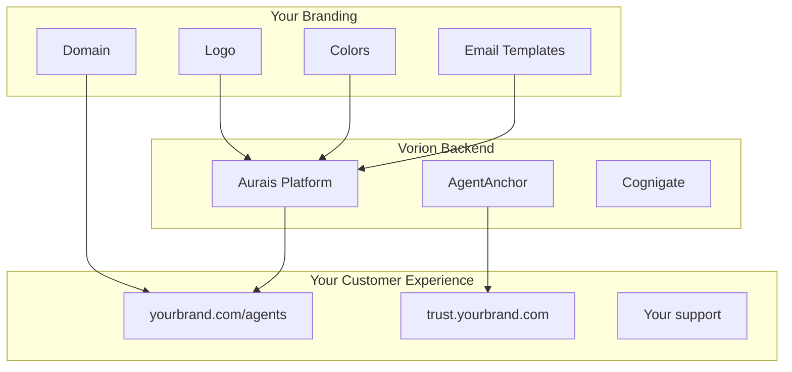

### Partner Revenue Share

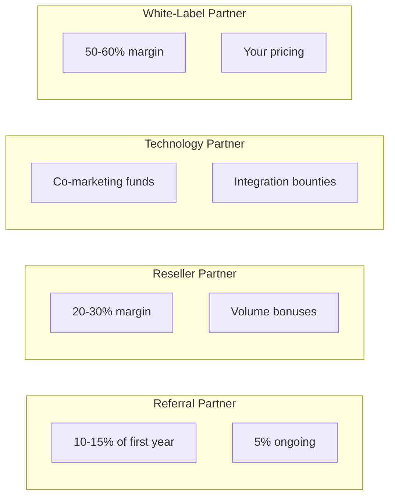

### Integration Certification

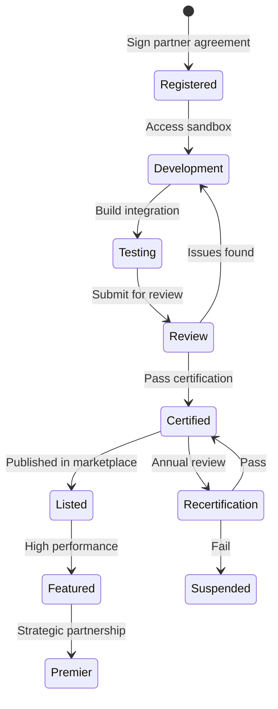

### Sandbox Environment

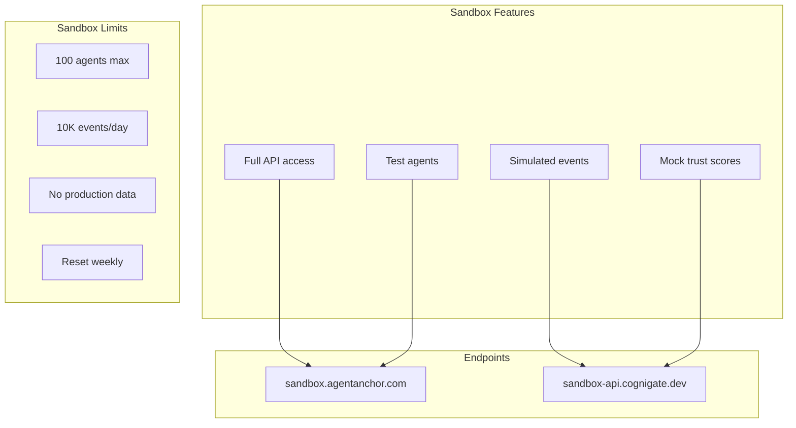

### Security Requirements

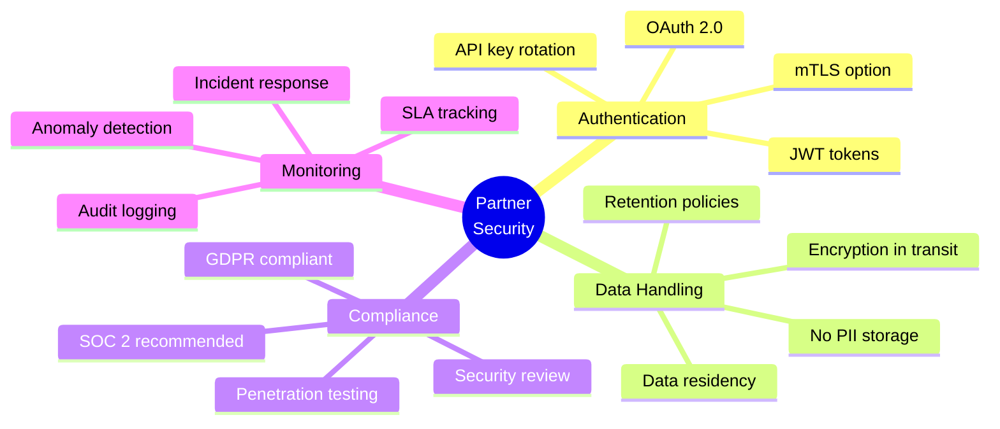

### Support Tiers for Partners

```mermaid
flowchart TB
    subgraph "Registered Partner"
        RP1[Documentation access]
        RP2[Community forum]
        RP3[Email support (72h)]
    end

    subgraph "Certified Partner"
        CP1[All Registered +]
        CP2[Slack channel]
        CP3[Email support (24h)]
        CP4[Quarterly sync]
    end

    subgraph "Premier Partner"
        PP1[All Certified +]
        PP2[Dedicated SE]
        PP3[Priority support (4h)]
        PP4[Monthly sync]
        PP5[Roadmap input]
    end

    RP1 --> CP1 --> PP1
```

### Co-Marketing Opportunities

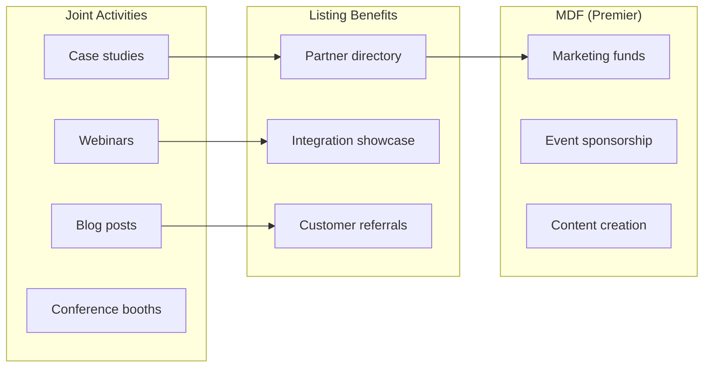

### Getting Started Checklist

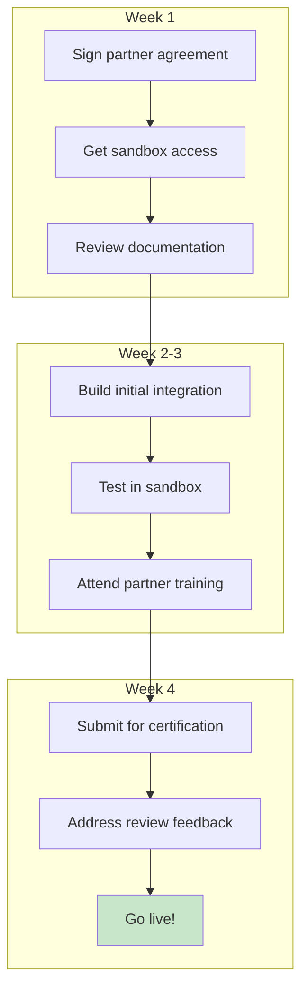
