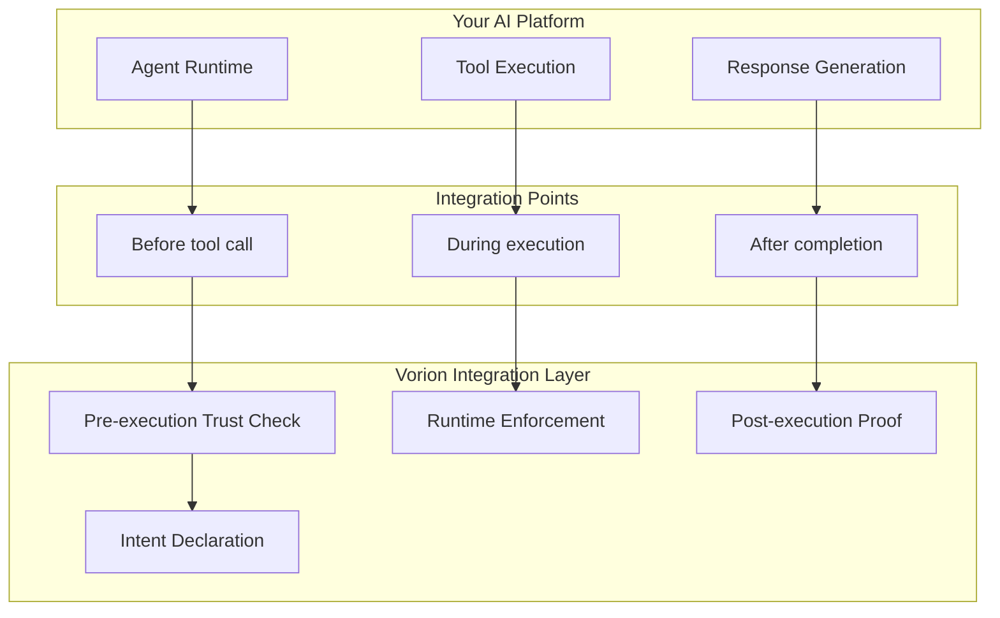
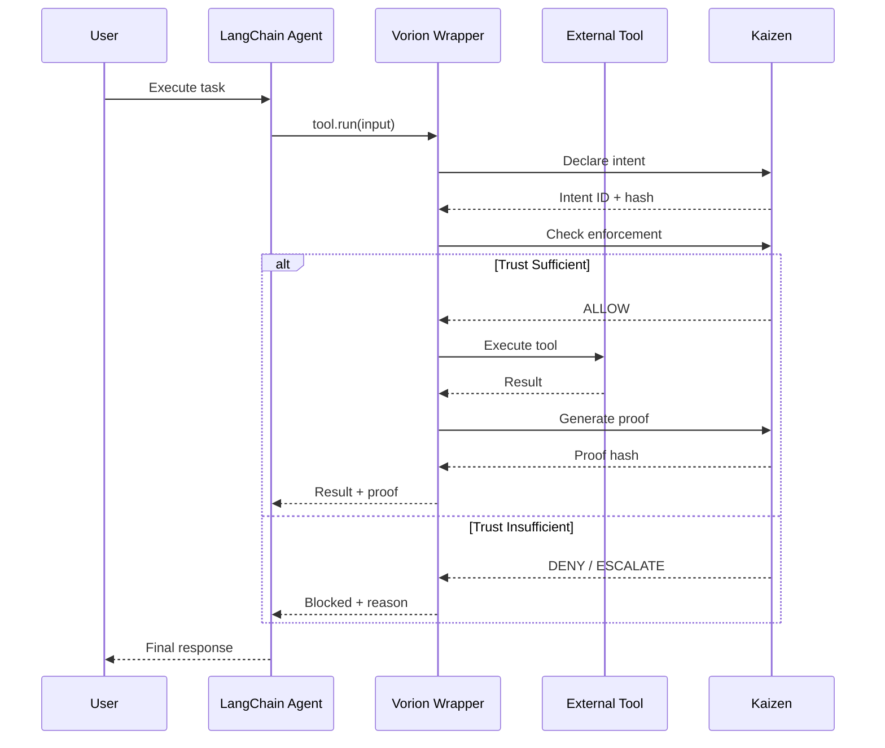
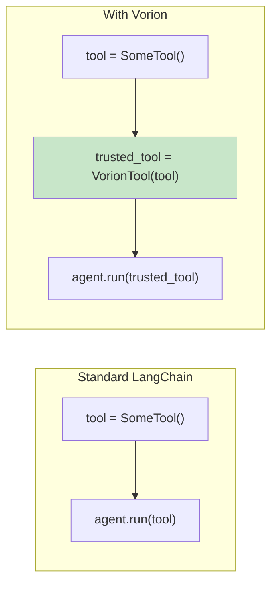
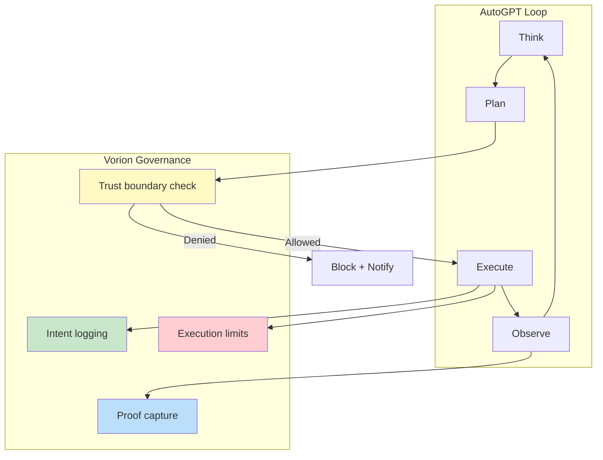
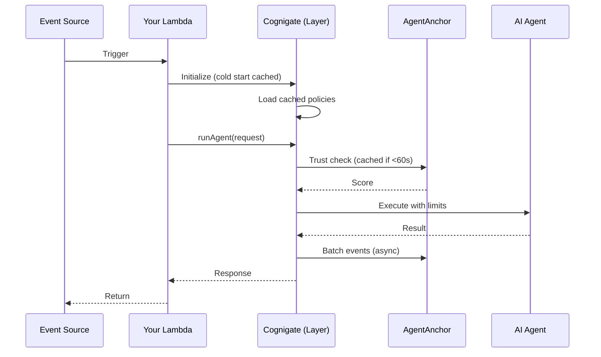
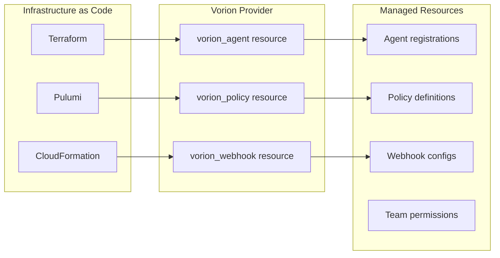
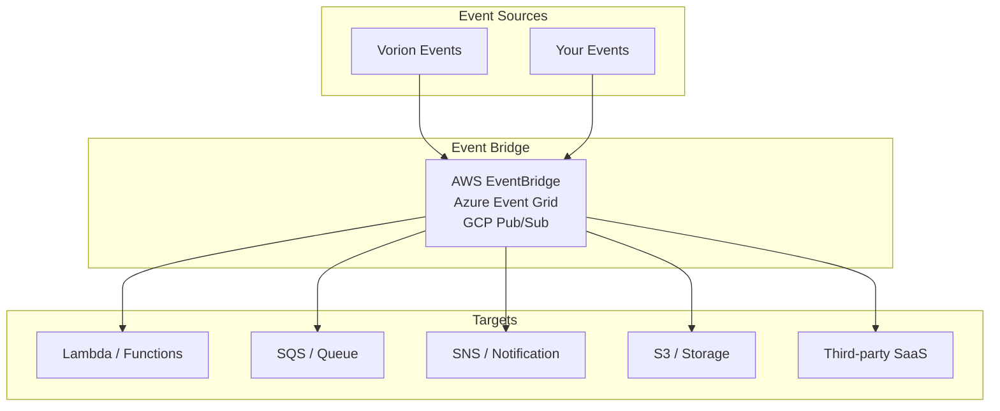
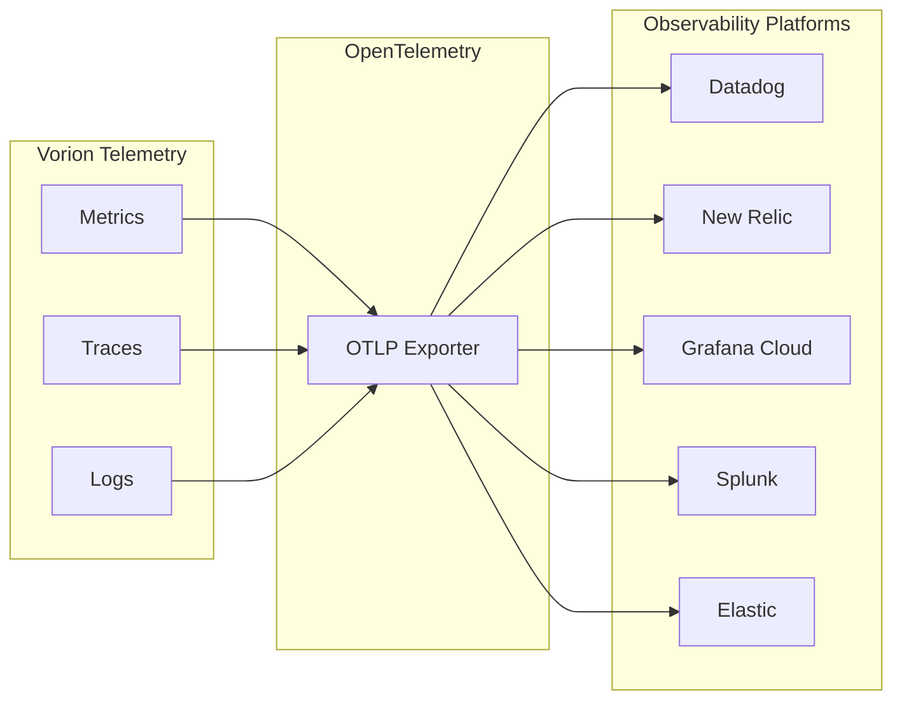
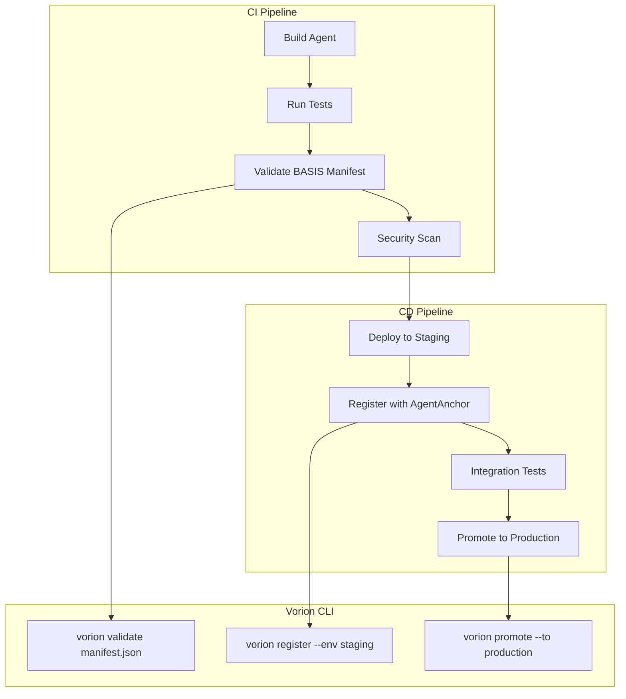
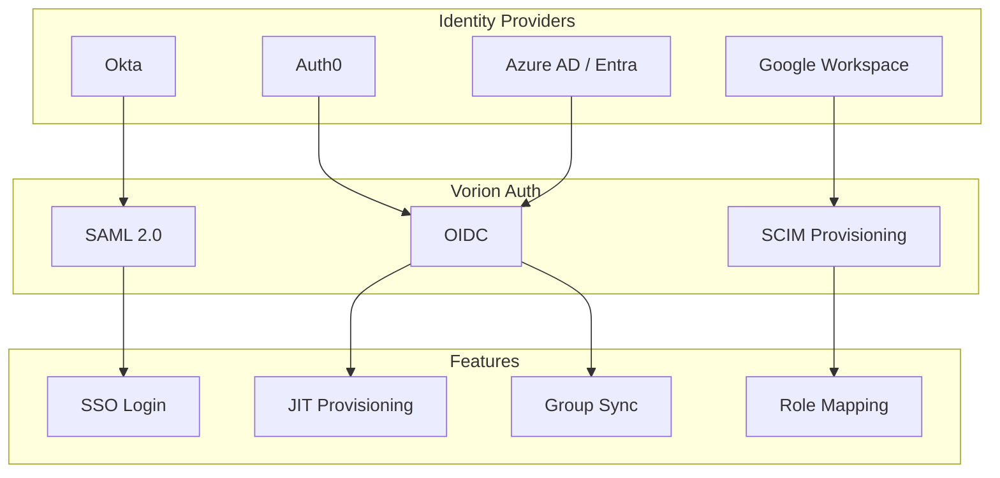

# Technology Partner Integrations
## For: AI Platforms, Cloud Providers, Agent Frameworks

### AI Platform Integration (OpenAI, Anthropic, etc.)



### LangChain Integration



### LangChain Code Pattern



### AutoGPT / Autonomous Agent Integration



### Cloud Provider Integration (AWS/Azure/GCP)

```mermaid
flowchart TB
    subgraph "Cloud Marketplace"
        MP1[AWS Marketplace]
        MP2[Azure Marketplace]
        MP3[GCP Marketplace]
    end

    subgraph "Deployment Options"
        D1[SaaS (Multi-tenant)]
        D2[Private SaaS (Dedicated)]
        D3[Self-Hosted (Your VPC)]
    end

    subgraph "Integration Services"
        IS1[IAM / Entra ID / Cloud IAM]
        IS2[Secrets Manager / Key Vault]
        IS3[CloudWatch / Monitor / Cloud Logging]
        IS4[Lambda / Functions / Cloud Functions]
    end

    MP1 --> D1
    MP1 --> D2
    MP2 --> D2
    MP2 --> D3
    MP3 --> D1
    MP3 --> D3

    D1 --> IS1
    D2 --> IS2
    D3 --> IS3
    D3 --> IS4
```

### AWS Lambda Integration



### Kubernetes / Container Integration

```mermaid
flowchart TB
    subgraph "Kubernetes Cluster"
        subgraph "Vorion Namespace"
            V1[Cognigate Sidecar]
            V2[Agent Container]
        end

        subgraph "Shared Services"
            S1[Istio / Service Mesh]
            S2[Secrets (Sealed)]
            S3[ConfigMap (Policies)]
        end
    end

    subgraph "External"
        E1[AgentAnchor API]
        E2[Your Services]
    end

    V2 --> V1
    V1 --> S1
    S1 --> E1
    V2 --> S1
    S1 --> E2

    S2 --> V1
    S3 --> V1
```

### Terraform / IaC Integration



### Event Bridge / Pub-Sub Integration



### Database Integration (Agent Memory)

```mermaid
flowchart TB
    subgraph "Memory Backends"
        MB1[PostgreSQL + pgvector]
        MB2[Pinecone]
        MB3[Weaviate]
        MB4[Redis]
    end

    subgraph "Cognigate Active Memory"
        AM1[Short-term (Redis)]
        AM2[Long-term (Vector DB)]
        AM3[Context Assembly]
    end

    subgraph "Trust-Gated Access"
        TG1{Trust Level Check}
        TG2[Full Access]
        TG3[Read Only]
        TG4[No Access]
    end

    MB1 --> AM2
    MB2 --> AM2
    MB3 --> AM2
    MB4 --> AM1

    AM1 --> AM3
    AM2 --> AM3

    AM3 --> TG1
    TG1 -->|T4-T5| TG2
    TG1 -->|T2-T3| TG3
    TG1 -->|T0-T1| TG4
```

### Observability Integration



### CI/CD Integration



### SSO / Identity Integration


