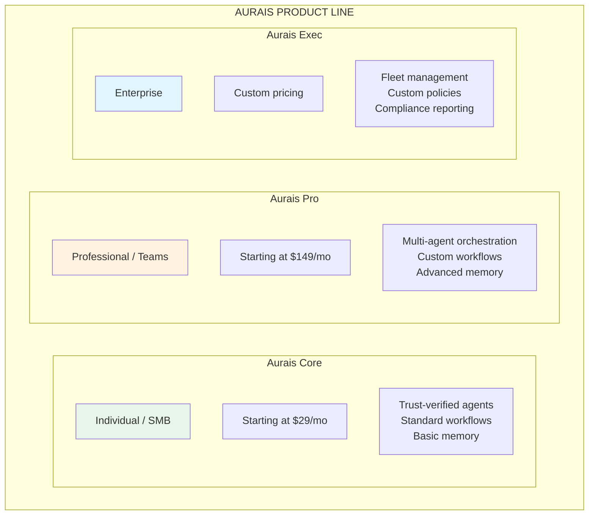
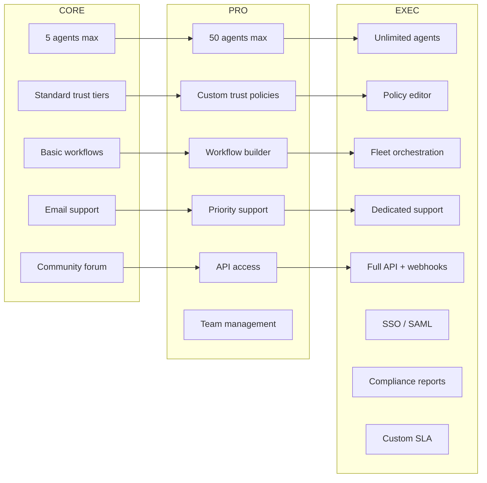
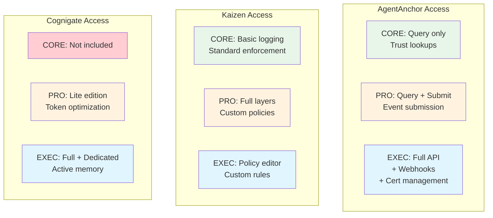
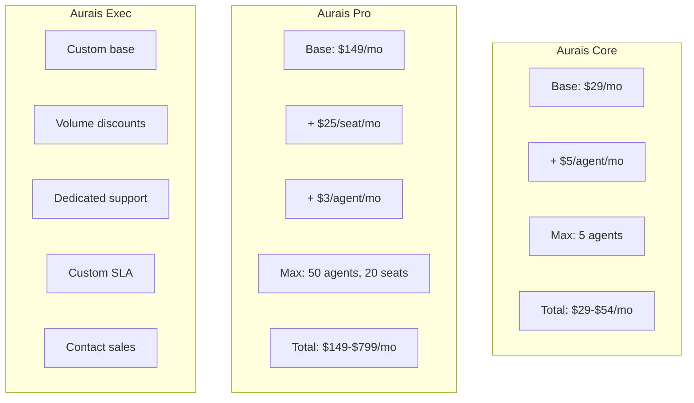
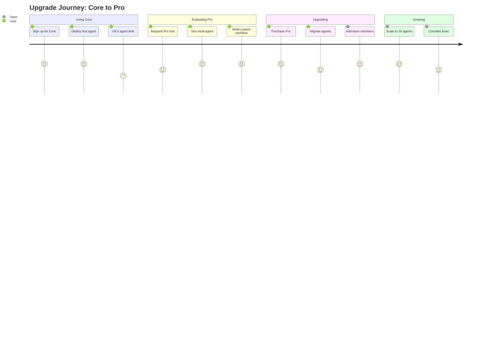
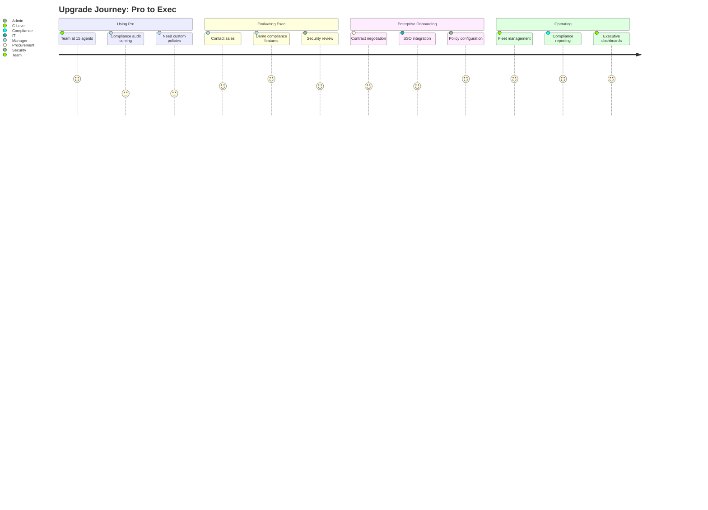
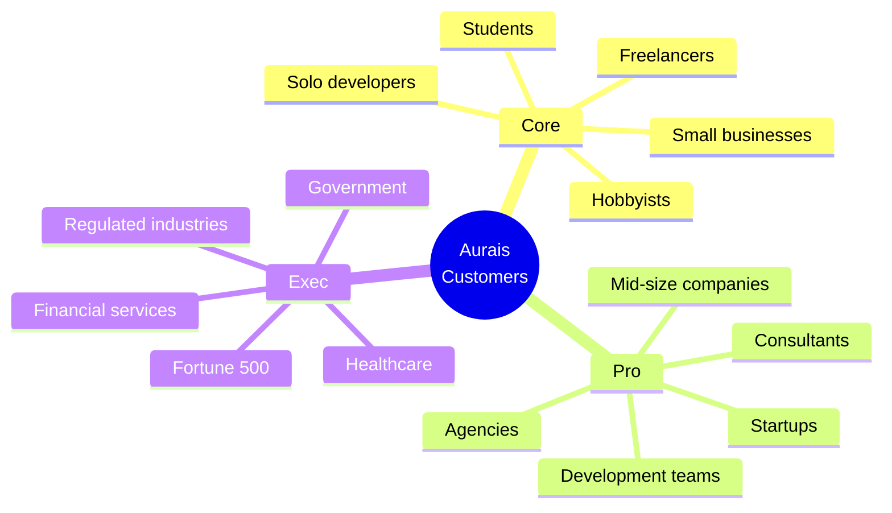
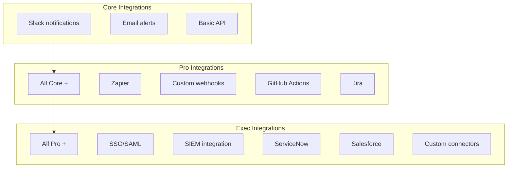
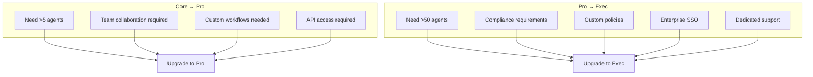
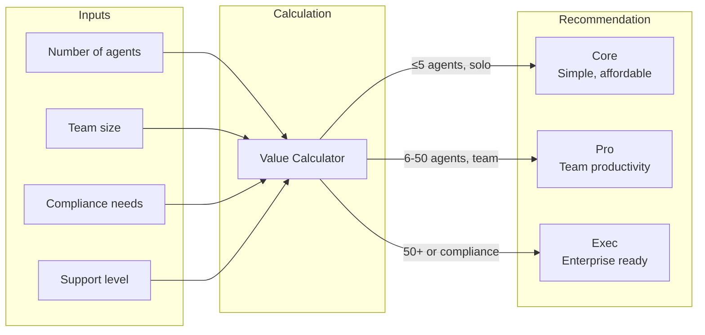

# Aurais Product Tiers
## For: Sales, Marketing, Product Teams, Customers

### Product Line Overview

### Feature Comparison

### Backend Access by Tier

### Pricing Structure

### User Journey: Core to Pro

### User Journey: Pro to Exec

### Feature Matrix

| Feature | Core | Pro | Exec |
|---------|:----:|:---:|:----:|
| **Agents** | 5 | 50 | Unlimited |
| **Users** | 1 | 20 | Unlimited |
| **Trust Queries** | 1K/mo | 50K/mo | Unlimited |
| **Event Submission** | - | 10K/mo | Unlimited |
| **Workflows** | Standard | Custom | Custom + Templates |
| **Memory** | Basic | Advanced | Enterprise |
| **API Access** | - | REST | REST + GraphQL |
| **Webhooks** | - | - | Full |
| **SSO/SAML** | - | - | Yes |
| **Policy Editor** | - | - | Yes |
| **Compliance Reports** | - | - | Yes |
| **SLA** | Best effort | 99.5% | Custom (99.9%+) |
| **Support** | Community | Priority | Dedicated |
| **Onboarding** | Self-serve | Guided | White-glove |

### Target Customer Profiles

### Integration Capabilities by Tier

### Upgrade Triggers

### Value Calculator

