# AgentAnchor Certification Flow
## For: Agent Developers, Sales, Compliance Teams

### Certification Tiers Overview

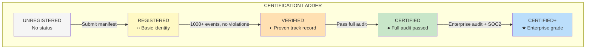

### Complete Certification Journey

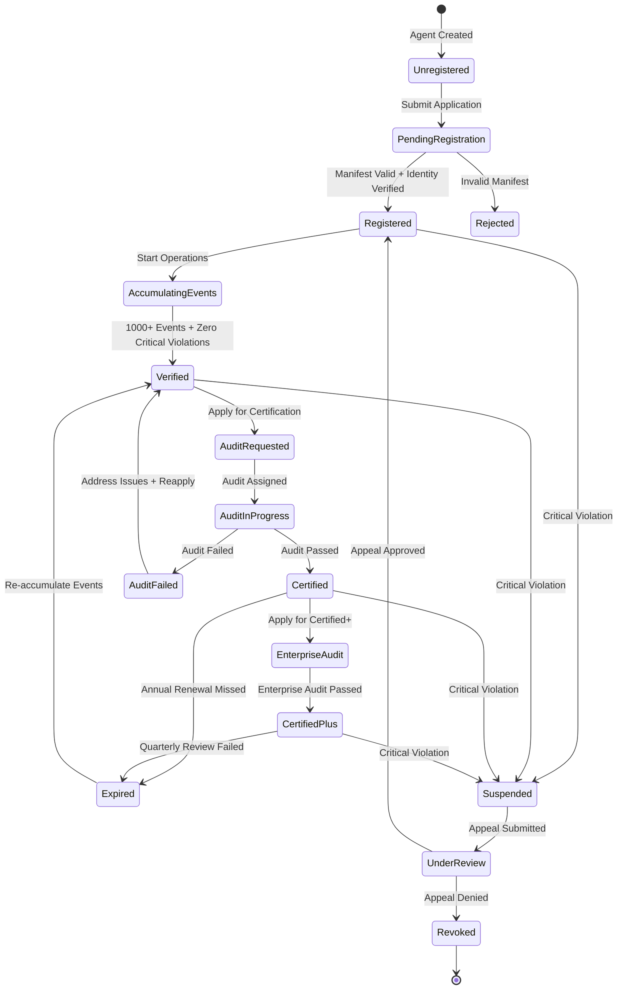

### Registration Process

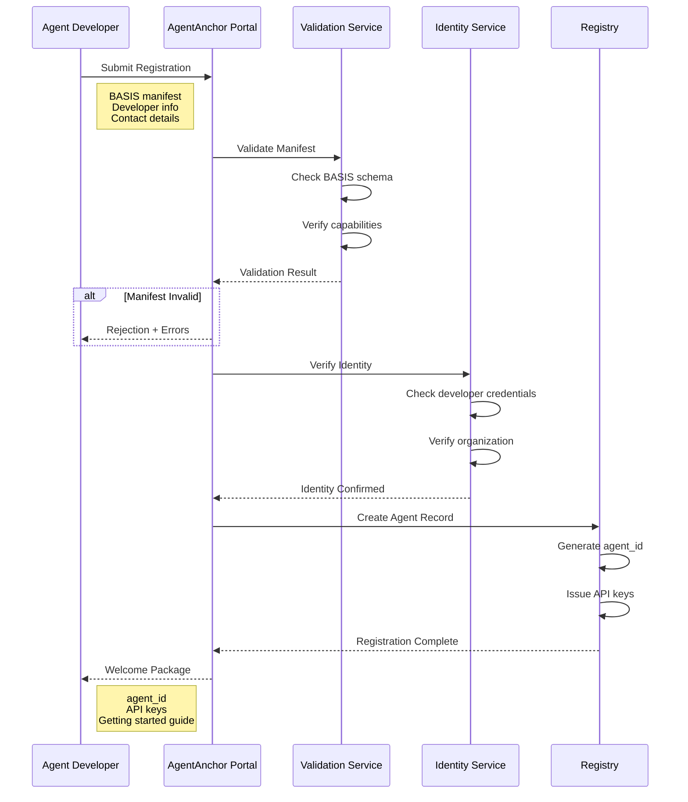

### Verification Requirements

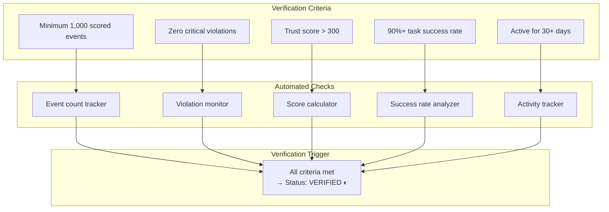

### Certification Audit Process

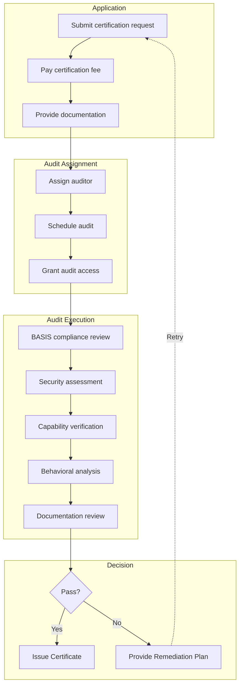

### Audit Checklist

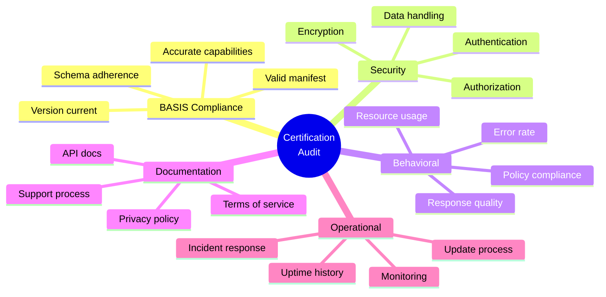

### Badge System

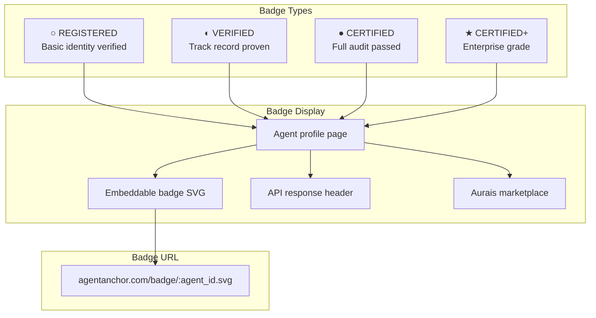

### Renewal & Maintenance

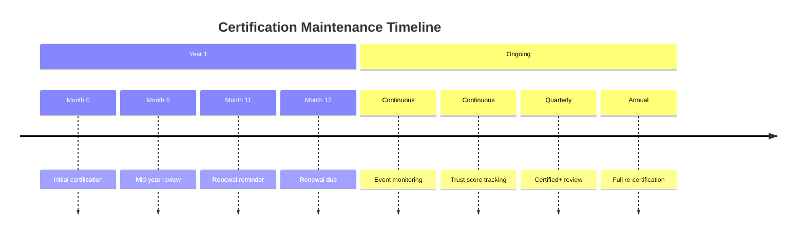

### Violation Handling

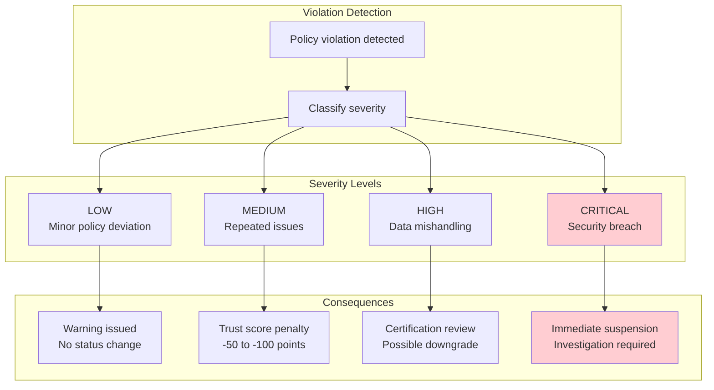

### Certification Benefits

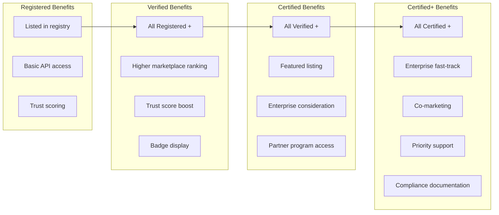

### API for Certification Status

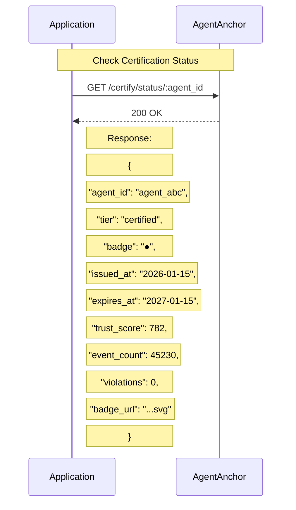
