# Value Proposition
## For: Sales Teams, Marketing, Partners

### The Problem: AI Without Trust

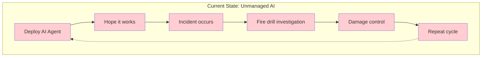

### The Solution: Vorion Trust Stack

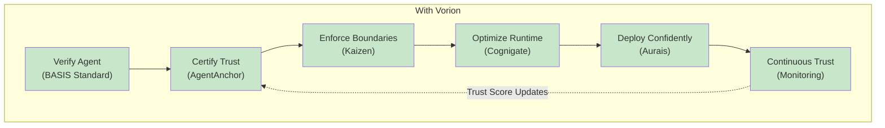

### Before vs After Comparison

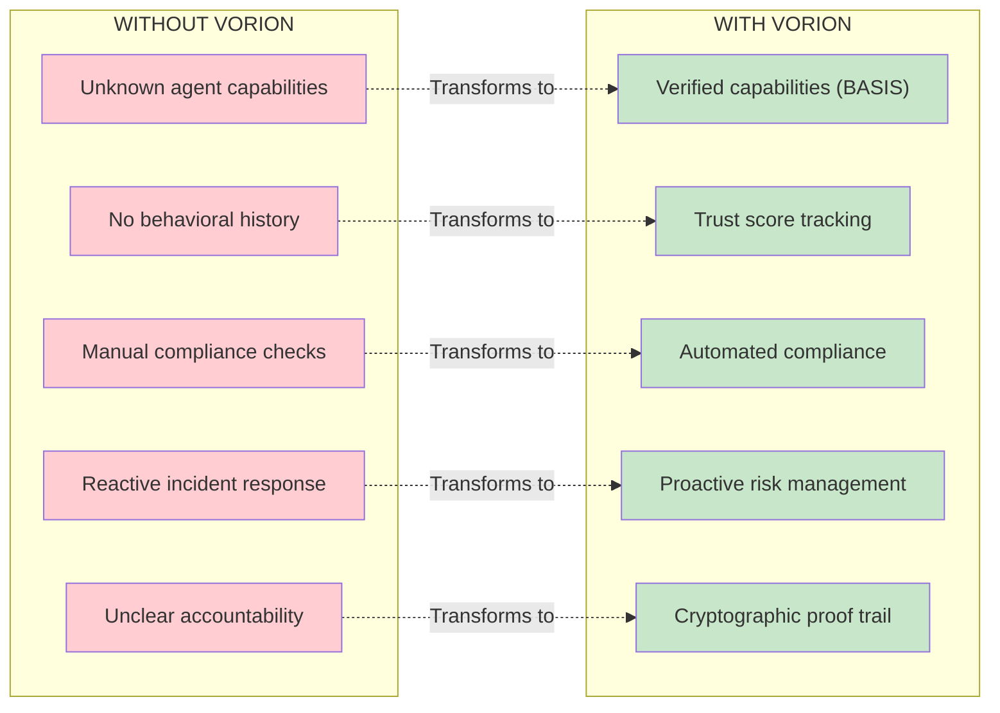

### Trust Tiers: Easy to Understand

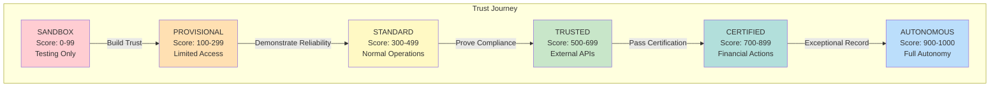

### ROI Calculator Inputs

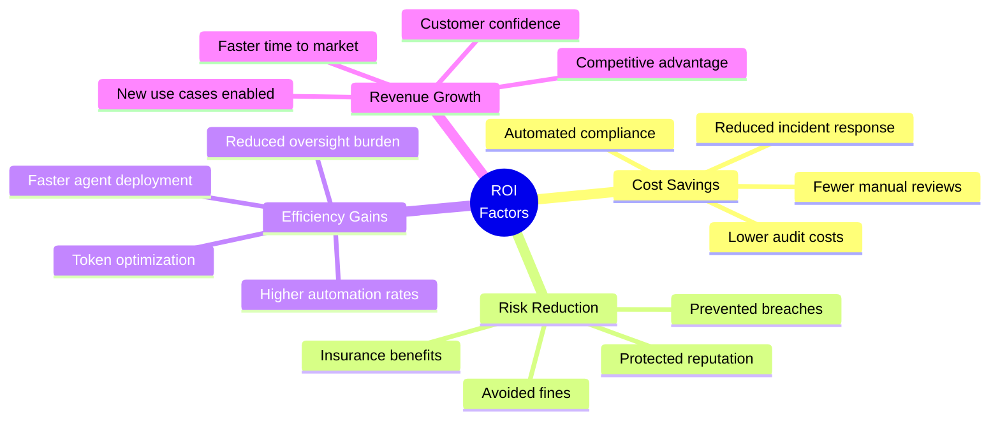

### Competitive Positioning

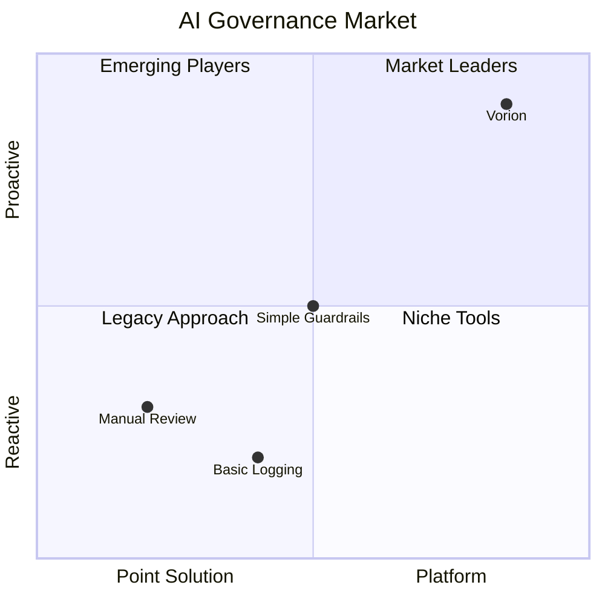

### Customer Journey

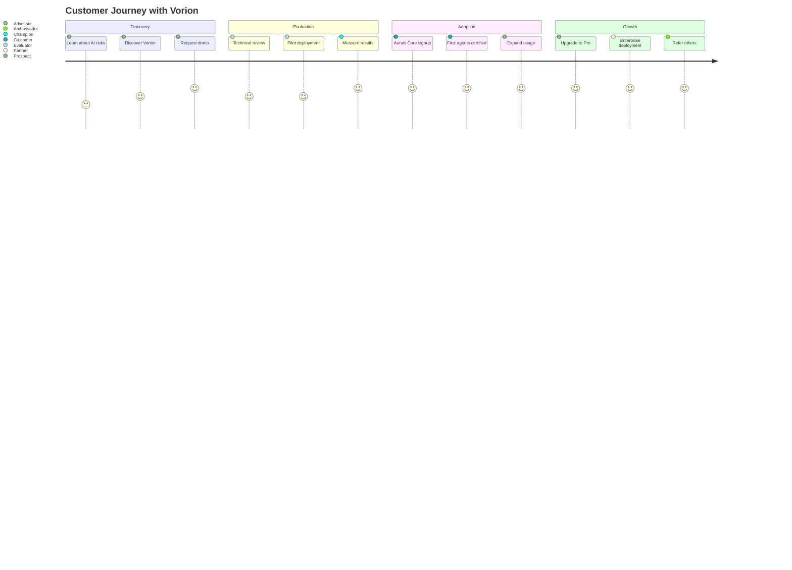

### Sales Talking Points

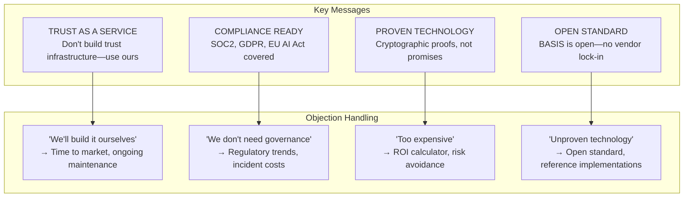

### Use Case: Financial Services

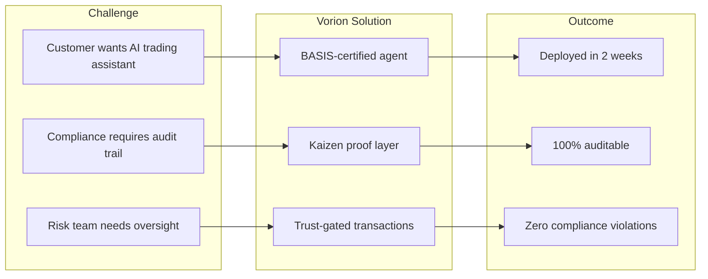

### Use Case: Healthcare

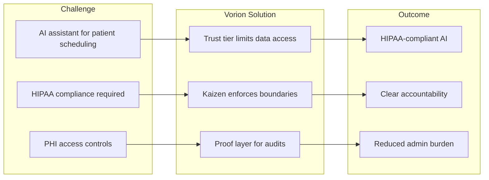

### Use Case: E-commerce

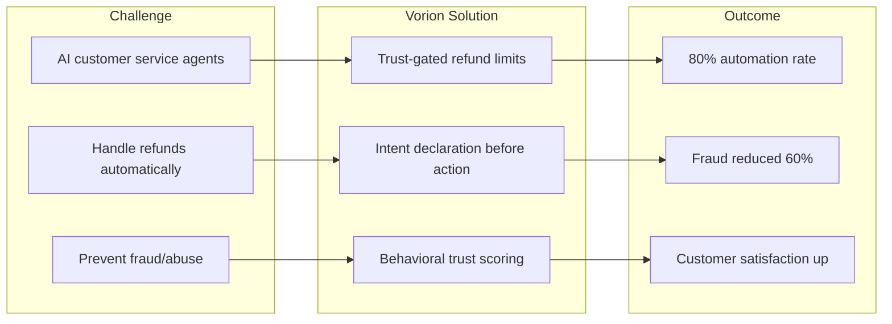
