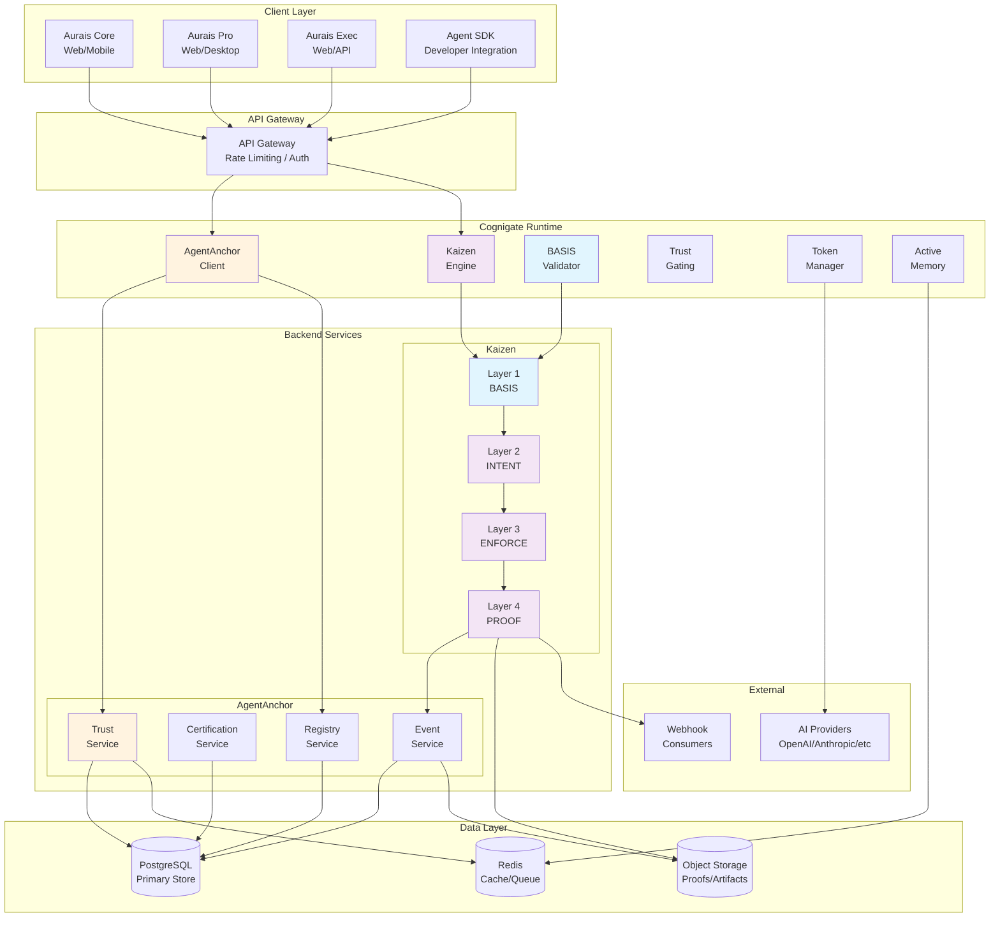
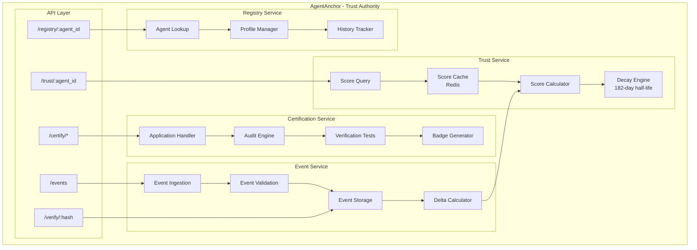
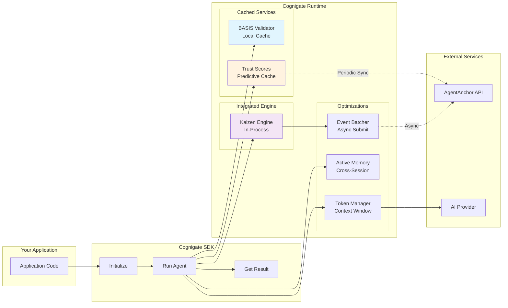
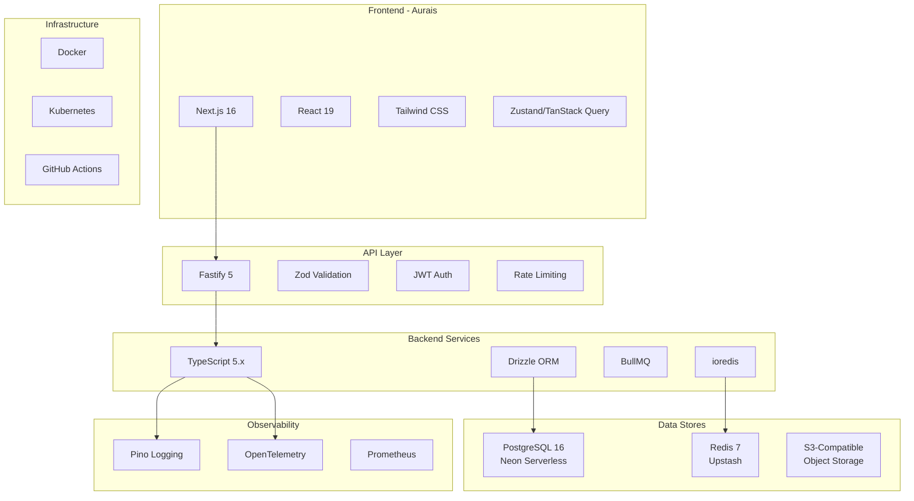
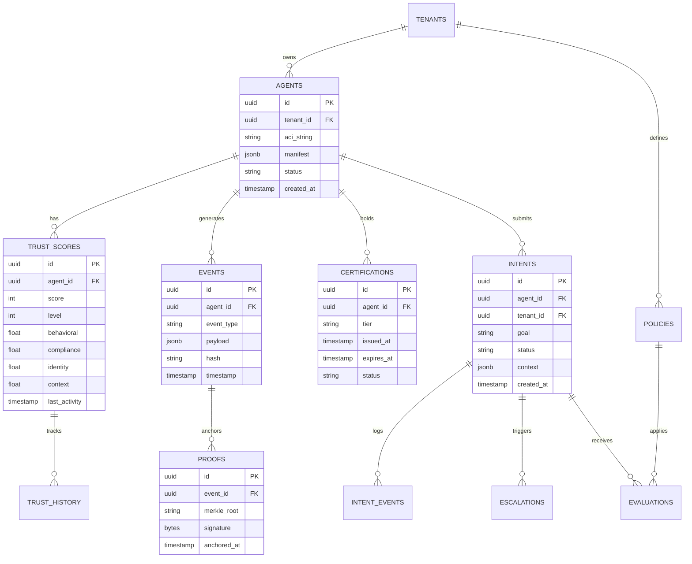

# System Architecture
## For: Engineers, Architects, Technical Leads

### Complete System Architecture

### Kaizen Layer Architecture

```mermaid
flowchart TB
    subgraph "KAIZEN - Execution Integrity Engine"
        subgraph "Layer 1: BASIS Validation"
            L1_IN[Agent Request] --> L1_PARSE[Parse Manifest]
            L1_PARSE --> L1_SCHEMA[Validate Schema]
            L1_SCHEMA --> L1_CAP[Check Capabilities]
            L1_CAP --> L1_PROF[Match Profile]
            L1_PROF --> L1_OUT{Valid?}
            L1_OUT -->|No| L1_REJ[Reject]
            L1_OUT -->|Yes| L2_IN
        end

        subgraph "Layer 2: INTENT Declaration"
            L2_IN[Validated Request] --> L2_DECL[Declare Intent]
            L2_DECL --> L2_LOG[Log Immutably]
            L2_LOG --> L2_HASH[Generate Hash]
            L2_HASH --> L2_TS[Timestamp]
            L2_TS --> L3_IN
        end

        subgraph "Layer 3: ENFORCE Runtime"
            L3_IN[Declared Intent] --> L3_TRUST[Check Trust Score]
            L3_TRUST --> L3_POLICY[Evaluate Policy]
            L3_POLICY --> L3_BOUND[Check Boundaries]
            L3_BOUND --> L3_DEC{Decision}
            L3_DEC -->|DENY| L3_BLOCK[Block Execution]
            L3_DEC -->|ESCALATE| L3_ESC[Human Review]
            L3_DEC -->|ALLOW| L3_EXEC[Execute]
            L3_EXEC --> L3_MON[Monitor Runtime]
            L3_MON --> L3_INT{Violation?}
            L3_INT -->|Yes| L3_STOP[Interrupt]
            L3_INT -->|No| L4_IN
        end

        subgraph "Layer 4: PROOF Generation"
            L4_IN[Execution Complete] --> L4_REC[Generate Receipt]
            L4_REC --> L4_CHAIN[Chain Events]
            L4_CHAIN --> L4_MERKLE[Compute Merkle Root]
            L4_MERKLE --> L4_SIGN[Sign Attestation]
            L4_SIGN --> L4_BATCH[Batch for Submission]
            L4_BATCH --> L4_AA[Submit to AgentAnchor]
        end
    end

    style L1_IN fill:#e1f5fe
    style L2_IN fill:#f3e5f5
    style L3_IN fill:#fff3e0
    style L4_IN fill:#e8f5e9
```

### AgentAnchor Service Architecture

### Cognigate Integration Layer

### Technology Stack

### Database Schema Overview

