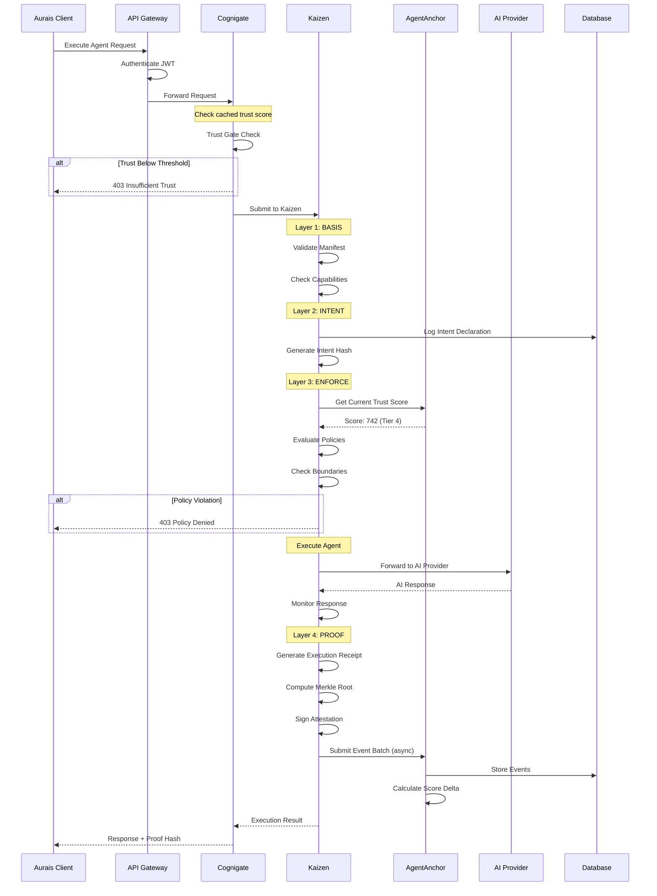
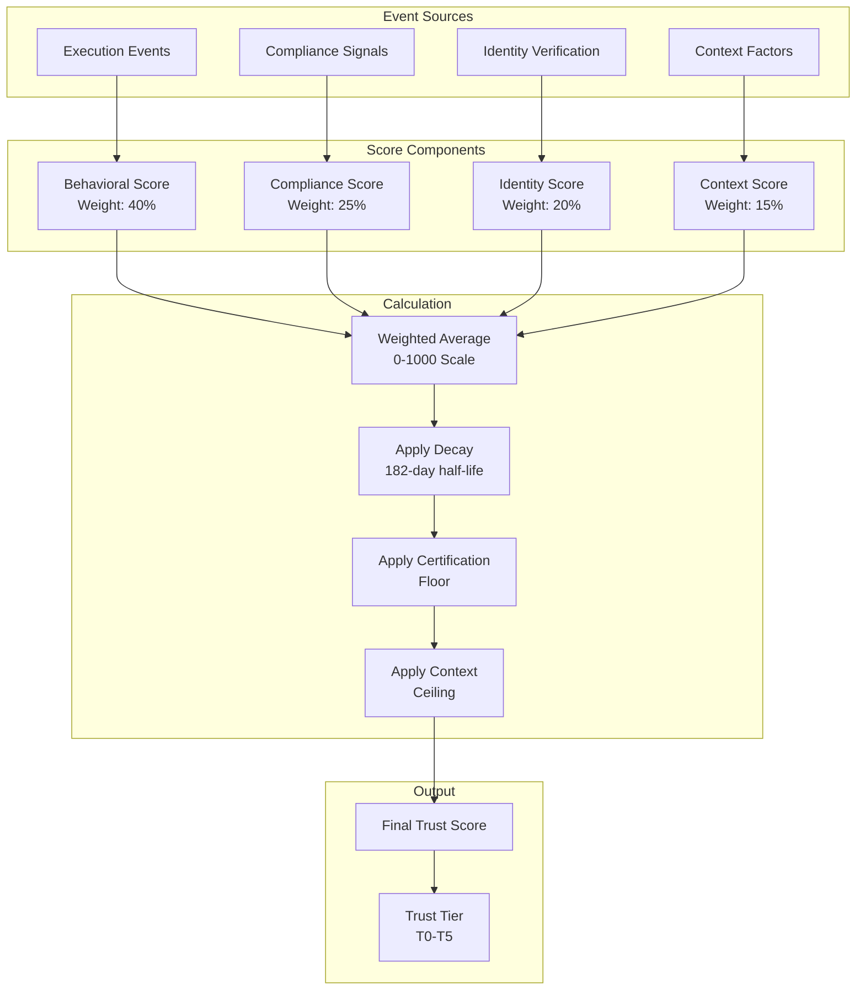
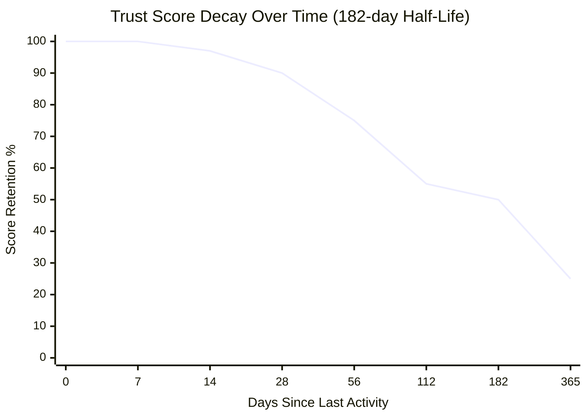
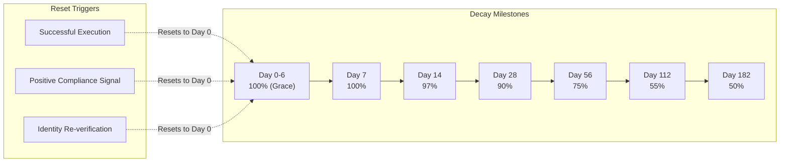
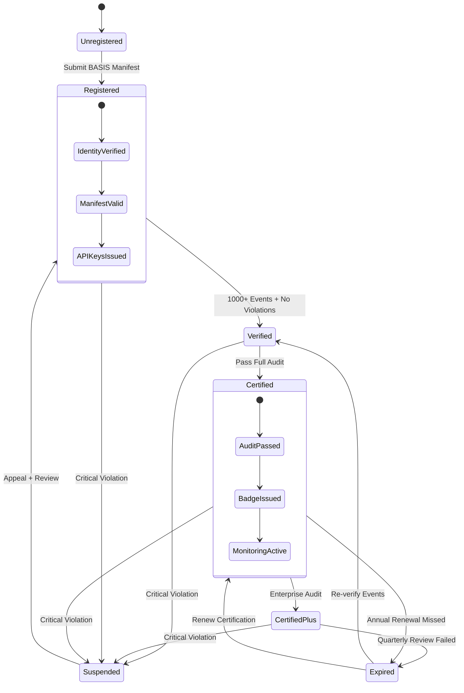
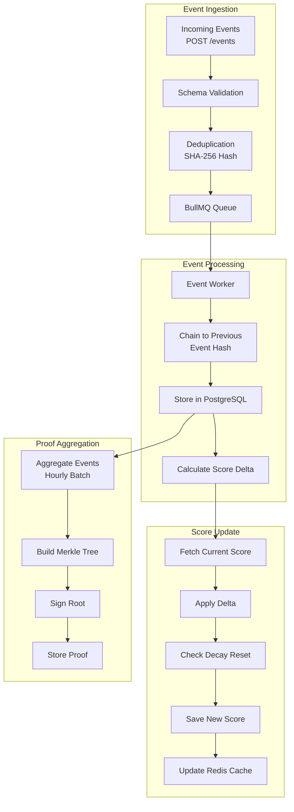
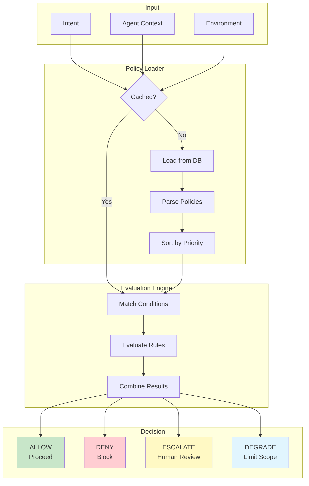
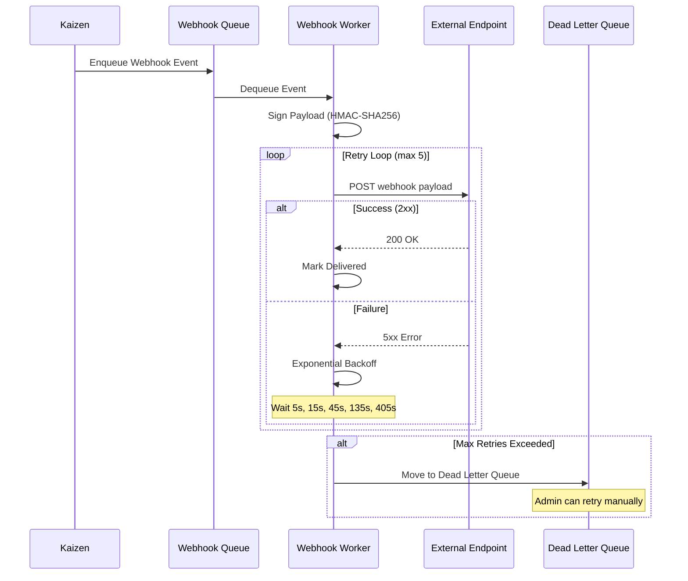
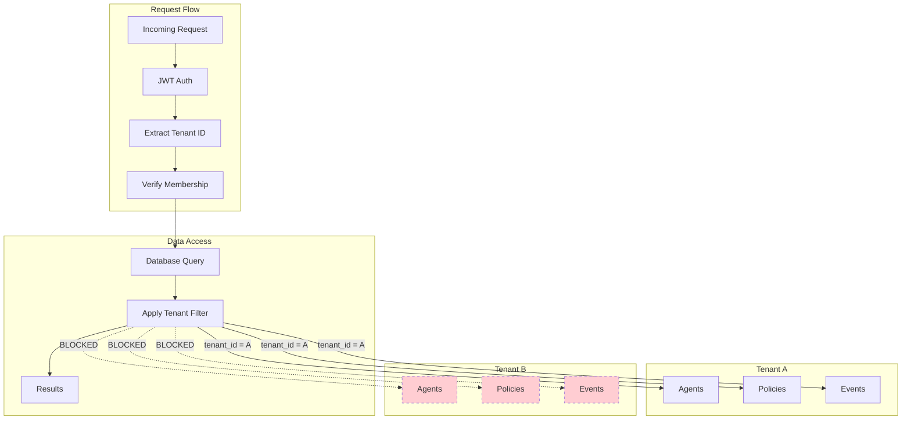

# Data Flow Diagrams
## For: Engineers, Architects, Technical Leads

### Agent Request Flow (Happy Path)

### Trust Score Calculation Flow

### Trust Score Decay Model

### Certification Process Flow

### Event Processing Pipeline

### Policy Evaluation Flow

### Webhook Delivery Flow

### Multi-Tenant Data Isolation

