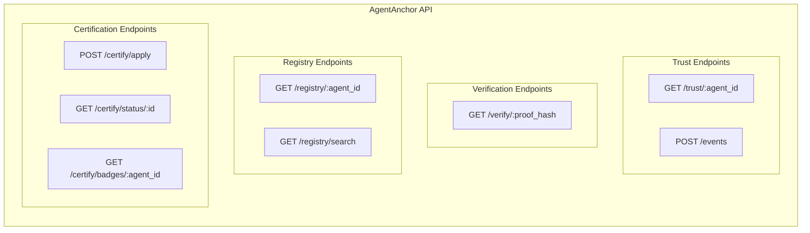
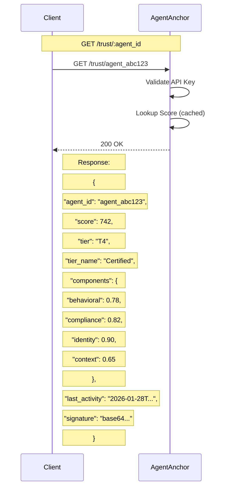
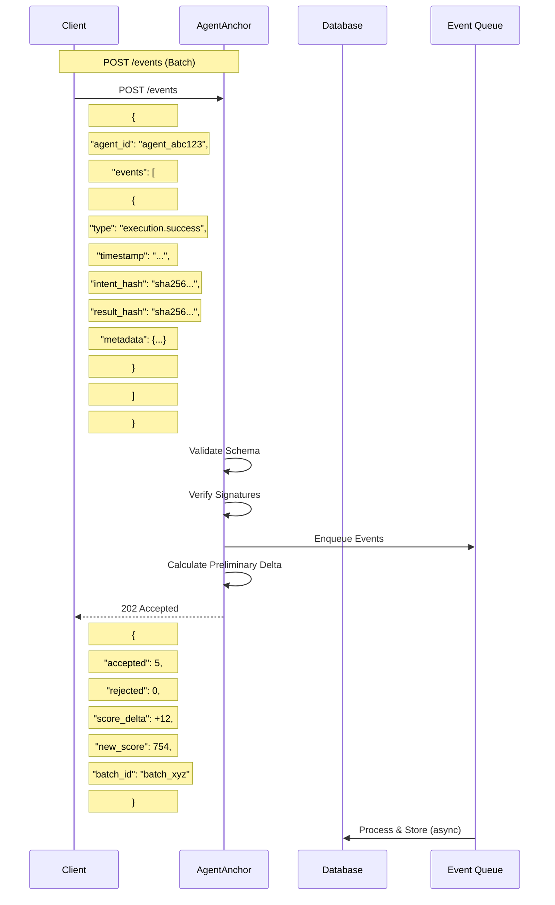
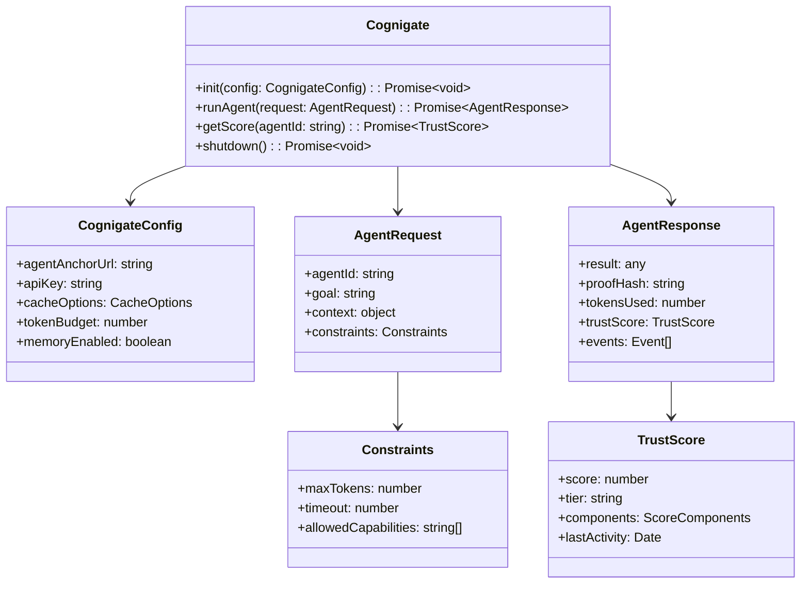
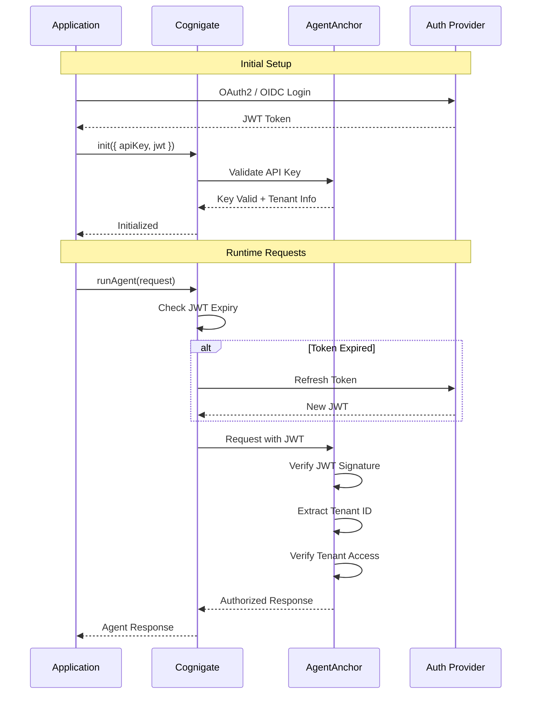
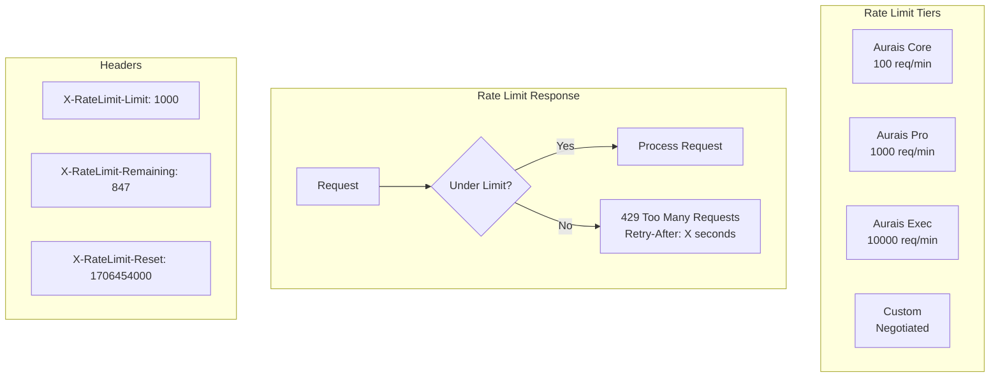
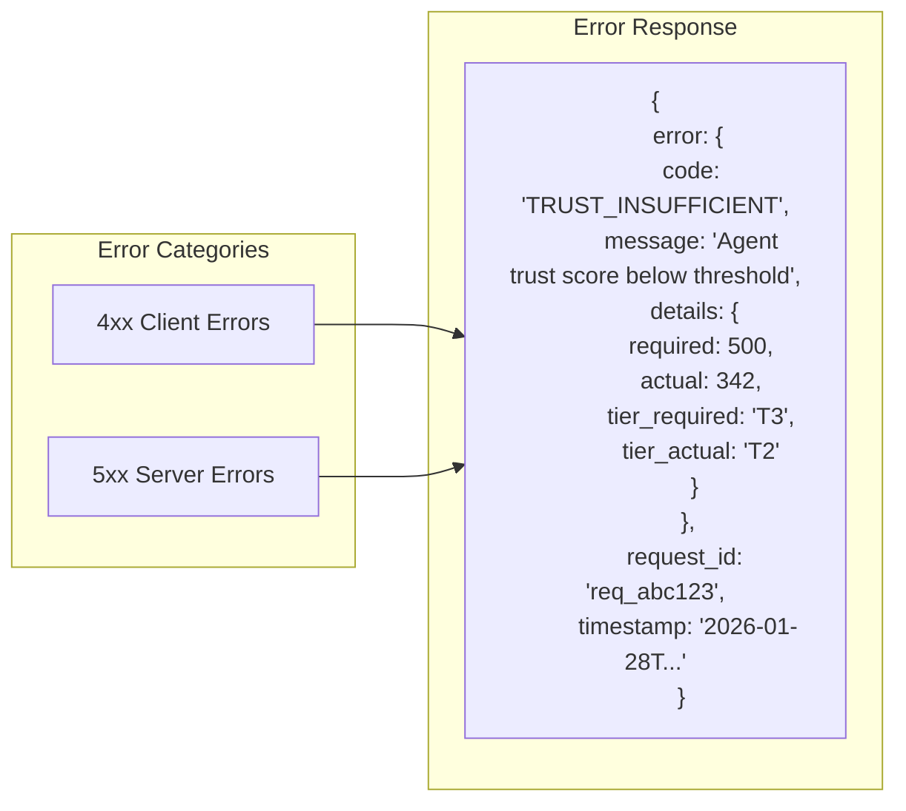

# API Contracts & Integration
## For: Engineers, API Consumers, Integration Partners

### AgentAnchor API Overview

### Trust Score API

### Event Submission API

### Kaizen Layer API (Internal)

```mermaid
flowchart TB
    subgraph "Layer 1: BASIS Validation"
        L1_IN["validate(manifest)"]
        L1_OUT["{ valid: boolean, errors: [] }"]
    end

    subgraph "Layer 2: INTENT Declaration"
        L2_IN["declare(agent_id, action, resource)"]
        L2_OUT["{ intent_id, hash, timestamp }"]
    end

    subgraph "Layer 3: ENFORCE Runtime"
        L3_IN["evaluate(intent, trust_score)"]
        L3_OUT["{ decision, reasons, limits }"]
    end

    subgraph "Layer 4: PROOF Generation"
        L4_IN["attest(execution_result)"]
        L4_OUT["{ proof_hash, merkle_root, signature }"]
    end

    L1_IN --> L1_OUT
    L2_IN --> L2_OUT
    L3_IN --> L3_OUT
    L4_IN --> L4_OUT
```

### Cognigate SDK Interface

### Authentication Flow

### Rate Limiting

### Error Response Format

### Common Error Codes

| Code | HTTP | Description |
|------|------|-------------|
| `AUTH_INVALID` | 401 | Invalid or expired API key/JWT |
| `AUTH_FORBIDDEN` | 403 | Valid auth but insufficient permissions |
| `TRUST_INSUFFICIENT` | 403 | Trust score below required threshold |
| `POLICY_DENIED` | 403 | Policy evaluation returned DENY |
| `MANIFEST_INVALID` | 400 | BASIS manifest validation failed |
| `INTENT_DUPLICATE` | 409 | Duplicate intent detected |
| `RATE_LIMITED` | 429 | Rate limit exceeded |
| `AGENT_NOT_FOUND` | 404 | Agent ID not in registry |
| `CERT_EXPIRED` | 403 | Agent certification has expired |
| `PROOF_INVALID` | 400 | Proof hash verification failed |
| `INTERNAL_ERROR` | 500 | Unexpected server error |
| `SERVICE_UNAVAILABLE` | 503 | Dependency unavailable |
