# Orchestration Patterns
## For: Engineers, Architects, Platform Teams

### Multi-Agent Orchestration

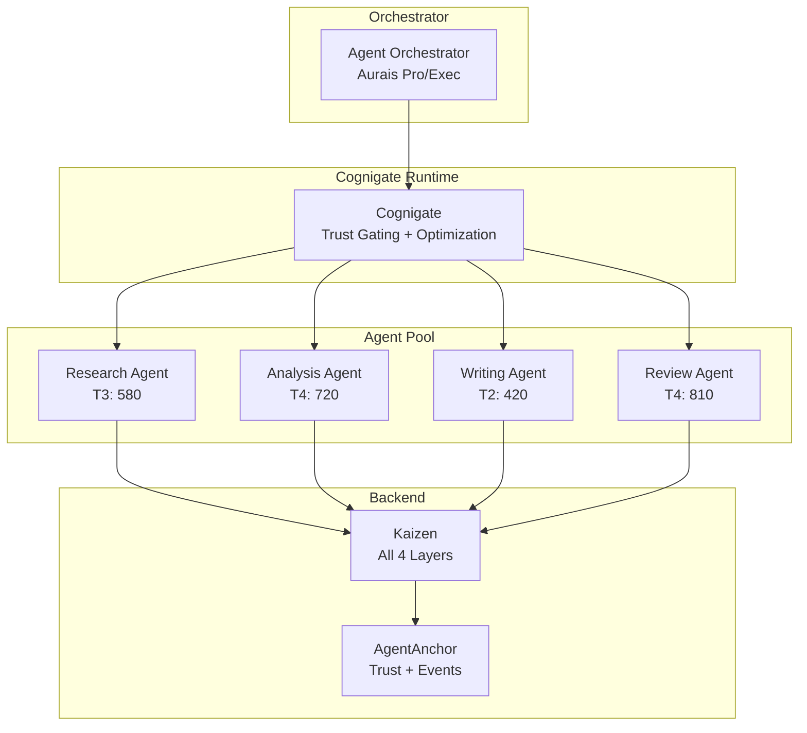

### Workflow: Sequential Agent Pipeline

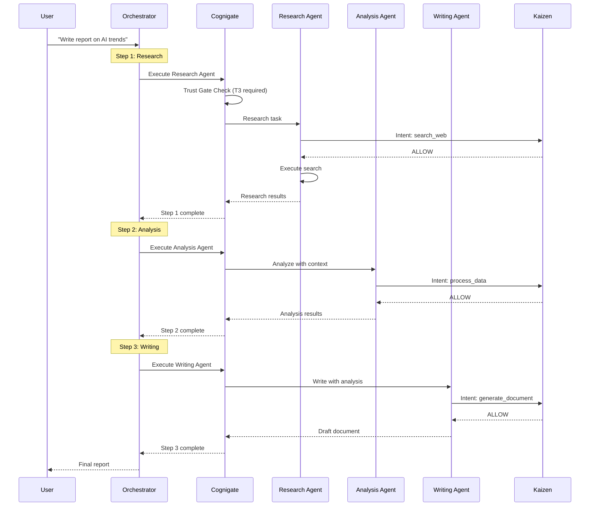

### Workflow: Parallel Agent Execution

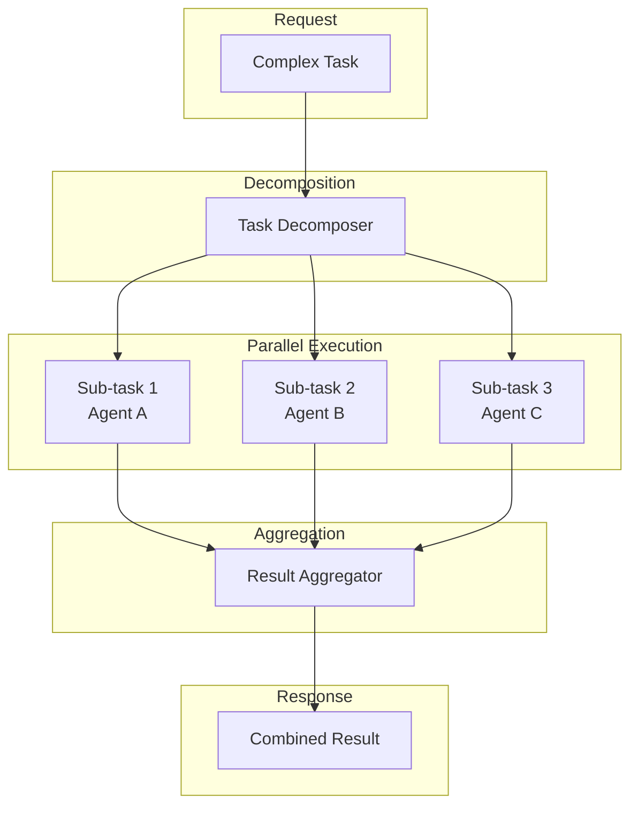

### Trust-Based Routing

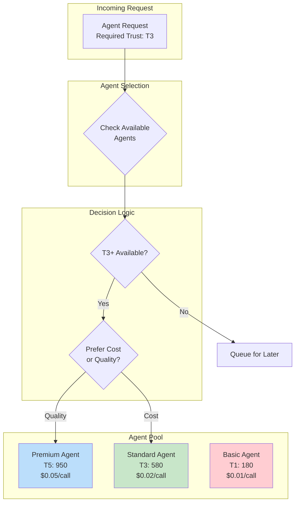

### Escalation Patterns

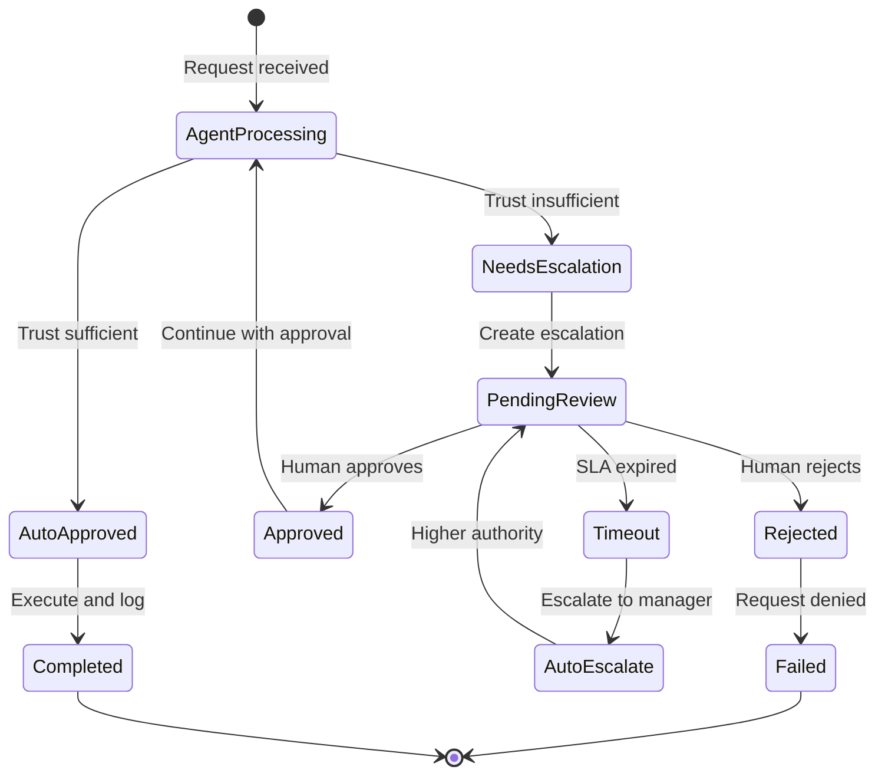

### Circuit Breaker Pattern

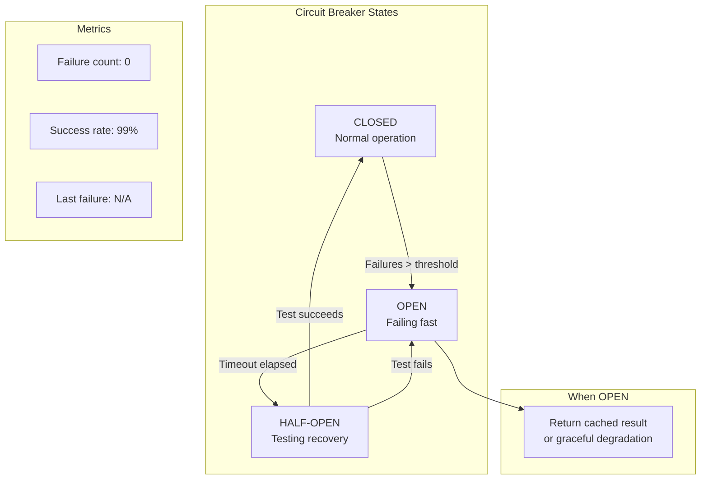

### Rate Limiting & Backpressure

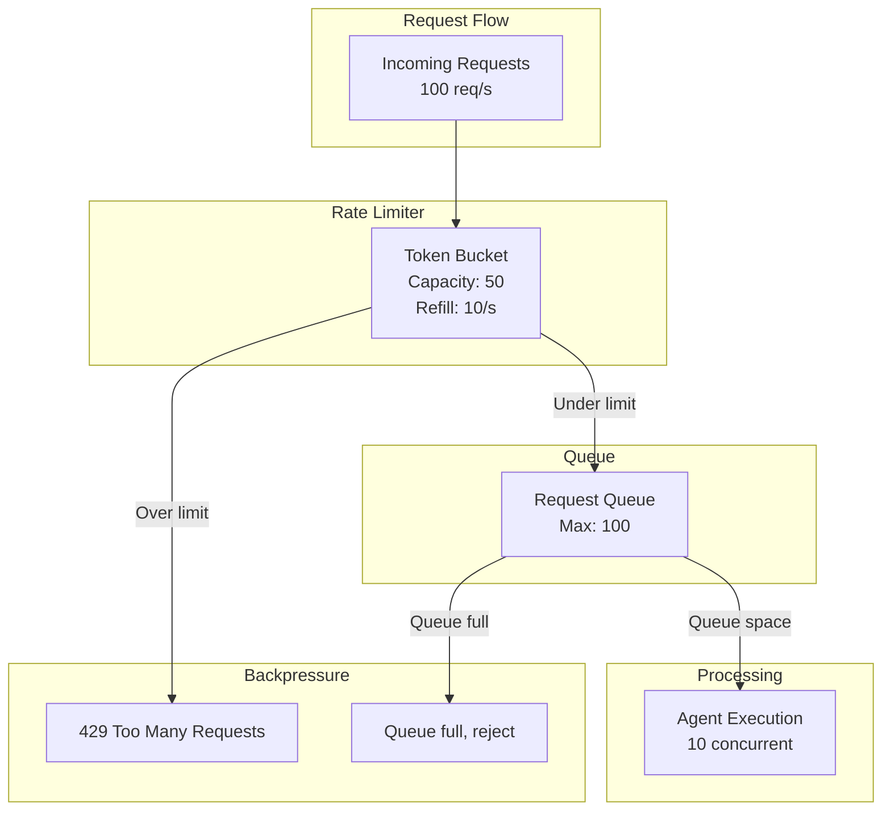

### Event-Driven Architecture

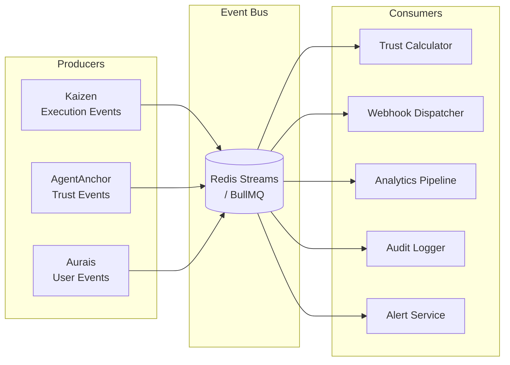

### Saga Pattern for Long-Running Operations

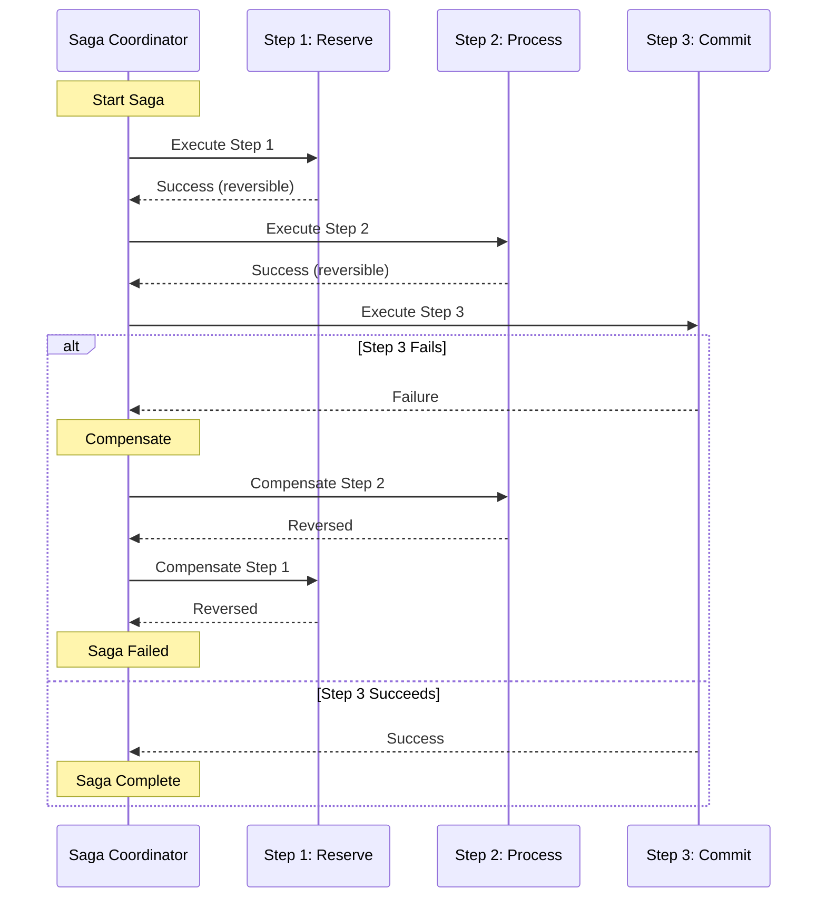

### Active Memory Architecture

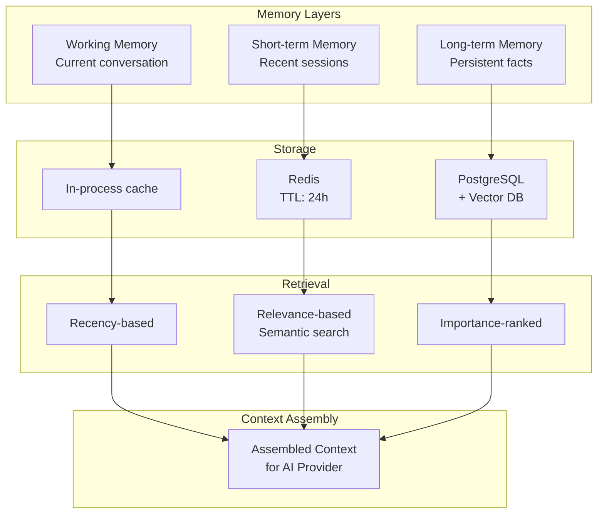

### Token Budget Management

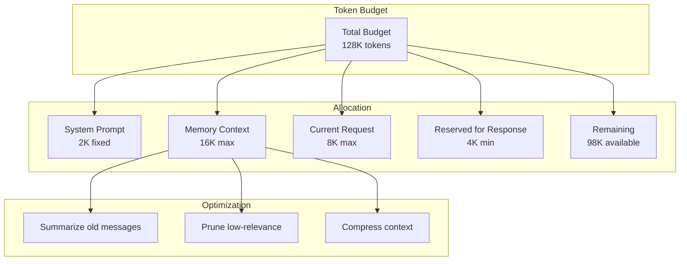

### Deployment Topology

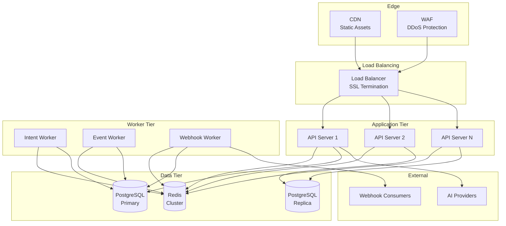

### Health Check Architecture

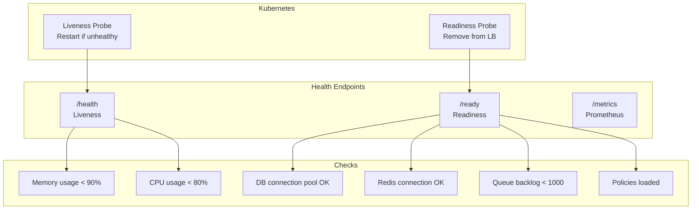
