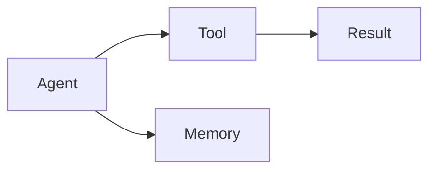

# Contributing to Omniscience

## Help Build the Definitive Agentic AI Knowledge Base

Omniscience is a community-driven effort to document the rapidly evolving field of autonomous AI agents. Your contributions help researchers, developers, and organizations build safer, more effective AI systems.

## Ways to Contribute

### Content Contributions

| Type | Description | Effort |
|------|-------------|--------|
| **Fix typos/errors** | Correct mistakes in existing content | Low |
| **Add examples** | Provide code samples or use cases | Low-Medium |
| **Expand articles** | Add depth to existing topics | Medium |
| **Write new articles** | Create content for missing topics | High |
| **Add research citations** | Link to academic papers | Low |

### Technical Contributions

- Improve search functionality
- Add interactive diagrams
- Enhance mobile experience
- Fix build issues

## Getting Started

### Prerequisites

- Node.js 18+
- Git
- GitHub account

### Local Development

```bash
# Clone the repository
git clone https://github.com/voriongit/omniscience.git
cd omniscience

# Install dependencies
npm install

# Start development server
npm start
```

The site will be available at `http://localhost:3000`.

### Making Changes

1. **Create a branch**
   ```bash
   git checkout -b feature/your-feature-name
   ```

2. **Make your changes**
   - Edit files in the `docs/` directory
   - Follow the content guidelines below

3. **Test locally**
   ```bash
   npm start
   # Verify your changes look correct
   ```

4. **Commit your changes**
   ```bash
   git add .
   git commit -m "Add: description of your changes"
   ```

5. **Push and create PR**
   ```bash
   git push origin feature/your-feature-name
   # Create PR on GitHub
   ```

## Content Guidelines

### Article Structure

Every article should follow this structure:

```markdown
---
sidebar_position: [number]
title: [Title]
description: [One-line description for SEO]
tags: [tag1, tag2, tag3]
---

# [Title]

## [Compelling Subtitle]

[Introduction paragraph explaining what this article covers and why it matters]

## [Main Content Sections]

[Content with code examples, diagrams, and explanations]

## Research Foundations

[Citations to relevant academic papers]

---

## See Also

- [Related Topic 1](./link.md) - Brief description
- [Related Topic 2](./link.md) - Brief description
```

### Writing Style

**Do:**
- Write in clear, accessible language
- Explain jargon when first introduced
- Include practical code examples
- Cite sources for claims
- Use diagrams for complex concepts

**Don't:**
- Assume advanced knowledge without explanation
- Use marketing language or hype
- Make unsubstantiated claims
- Include personal opinions as facts
- Plagiarize content

### Code Examples

All code examples should:

1. Be complete and runnable
2. Include type hints (Python) or types (TypeScript)
3. Follow language conventions
4. Include comments for complex logic

```python
# Good example
from dataclasses import dataclass
from typing import List, Optional

@dataclass
class Agent:
    """An autonomous AI agent."""

    name: str
    capabilities: List[str]
    trust_score: float

    def can_perform(self, action: str) -> bool:
        """Check if agent can perform an action."""
        return action in self.capabilities
```

### Diagrams

Use ASCII diagrams for compatibility:

```
┌─────────────┐     ┌─────────────┐
│   Agent A   │────▶│   Agent B   │
└─────────────┘     └─────────────┘
```

For complex diagrams, use Mermaid (supported in Docusaurus):



### Citations

Always cite academic sources:

```markdown
## Research Foundations

- **Paper Title** (Author et al., Year) - Brief description
- **Another Paper** (Author, Year) - Brief description
```

## Content Needs

### Priority Topics

We especially need contributions on:

1. **Emerging architectures** - New agent patterns
2. **Safety research** - Alignment, oversight techniques
3. **Industry applications** - Real-world case studies
4. **Benchmarks** - Evaluation methodologies
5. **Protocols** - Emerging standards

### Missing Content

Check the [GitHub Issues](https://github.com/voriongit/omniscience/issues) labeled `content-needed` for specific gaps.

## Review Process

### What We Look For

1. **Accuracy** - Is the information correct?
2. **Completeness** - Does it cover the topic adequately?
3. **Clarity** - Is it easy to understand?
4. **Citations** - Are claims properly sourced?
5. **Format** - Does it follow our guidelines?

### Review Timeline

- **Typo fixes**: 1-2 days
- **Small additions**: 3-5 days
- **New articles**: 1-2 weeks

## Community

### Getting Help

- **Discord**: [Join our Discord](https://discord.gg/basis-protocol)
- **GitHub Discussions**: For longer-form questions
- **Issues**: For specific problems

### Recognition

Contributors are recognized in:
- The article they contributed to
- Our [Contributors page](https://github.com/voriongit/omniscience/graphs/contributors)
- Monthly community highlights

## License

All contributions are licensed under [CC BY 4.0](https://creativecommons.org/licenses/by/4.0/). By contributing, you agree to this license.

---

Thank you for helping make Omniscience the definitive resource for agentic AI!
