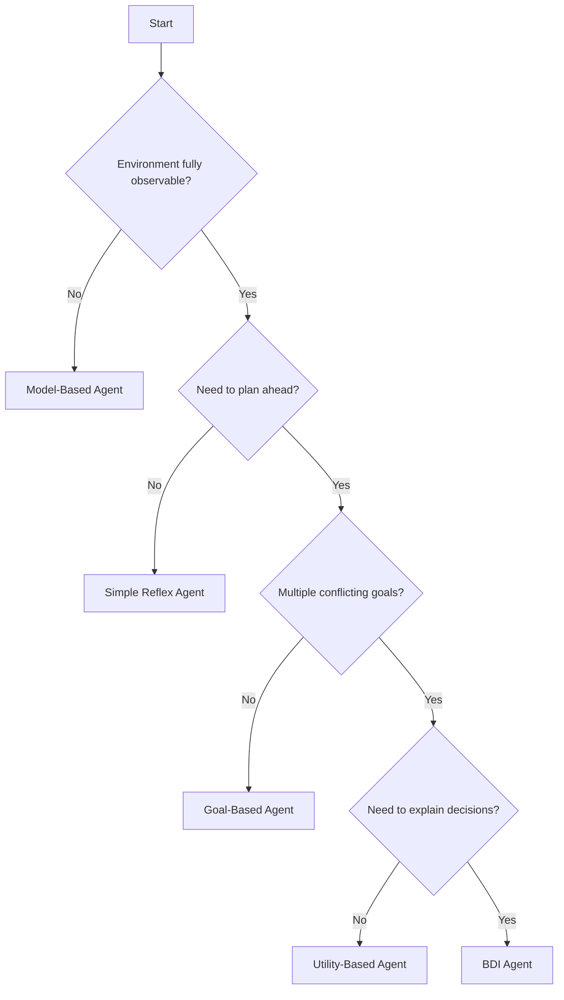

# Agent Taxonomy

## The Classification of Autonomous Entities

Understanding agent types is fundamental to designing effective agentic systems. This taxonomy spans from simple reactive scripts to sophisticated cognitive architectures.

---

## The Agent Spectrum

```
REACTIVE                                              COGNITIVE
◀─────────────────────────────────────────────────────────────▶

Simple      Model-Based    Goal-Based    Utility-Based    BDI
Reflex      Reflex         Agents        Agents           Agents
│           │              │             │                │
│           │              │             │                │
Condition   + World        + Planning    + Trade-off      + Beliefs
→ Action    Model          & Search      Optimization     + Desires
                                                          + Intentions
```

---

## Agent Types Overview

| Type | Key Feature | Use Case | Complexity |
|------|-------------|----------|------------|
| [Simple Reflex](/taxonomy/simple-reflex) | Condition-action rules | Automation scripts | Low |
| [Model-Based](/taxonomy/model-based) | Internal world state | Partial observability | Medium |
| [Goal-Based](/taxonomy/goal-based) | Search & planning | Multi-step tasks | Medium-High |
| [Utility-Based](/taxonomy/utility-based) | Optimization function | Trade-off decisions | High |
| [BDI Agents](/taxonomy/bdi-agents) | Cognitive architecture | Complex reasoning | Very High |
| [Learning Agents](/taxonomy/learning-agents) | Self-improvement | Adaptive systems | Very High |

---

## Choosing an Agent Type



---

## Key Concepts

### Percept Sequence
The complete history of everything an agent has perceived. More sophisticated agents use longer percept sequences for decision making.

### Agent Function
The abstract mathematical description mapping percept sequences to actions: `f: P* → A`

### Agent Program
The concrete implementation running on physical hardware that realizes the agent function.

### Rationality
A rational agent selects actions that maximize expected performance, given:
- The performance measure
- Prior knowledge of the environment
- Possible actions
- Current percept sequence

---

## Research Foundation

The taxonomy presented here derives from Russell & Norvig's foundational work in "Artificial Intelligence: A Modern Approach" (AIMA), extended with modern LLM-based implementations.

**Key Papers:**
- Russell, S., & Norvig, P. (2020). *Artificial Intelligence: A Modern Approach* (4th ed.)
- Wooldridge, M. (2009). *An Introduction to MultiAgent Systems*
- Rao, A. S., & Georgeff, M. P. (1995). *BDI Agents: From Theory to Practice*

---

## Next Steps

Explore each agent type in detail:

1. [Simple Reflex Agents](/taxonomy/simple-reflex) — The foundation
2. [Model-Based Agents](/taxonomy/model-based) — Adding state
3. [Goal-Based Agents](/taxonomy/goal-based) — Planning ahead
4. [Utility-Based Agents](/taxonomy/utility-based) — Optimizing outcomes
5. [BDI Agents](/taxonomy/bdi-agents) — Cognitive architecture
6. [Learning Agents](/taxonomy/learning-agents) — Self-improvement
